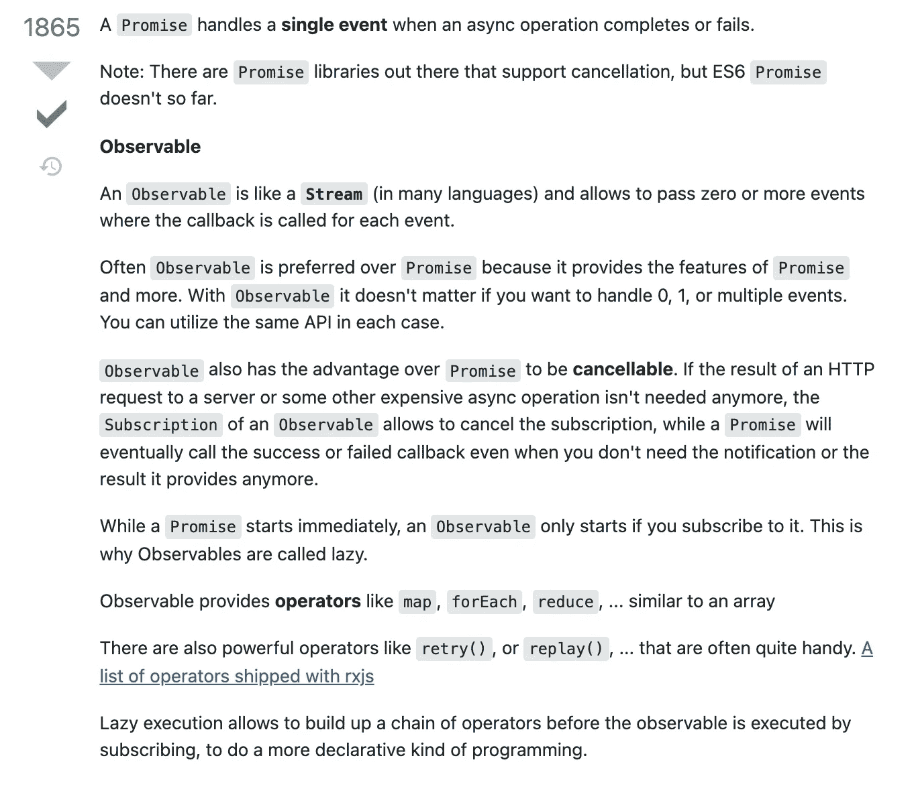
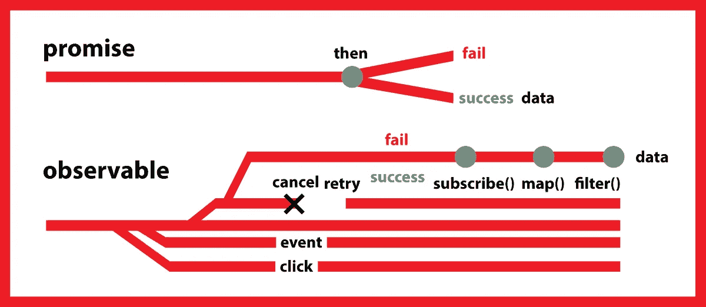
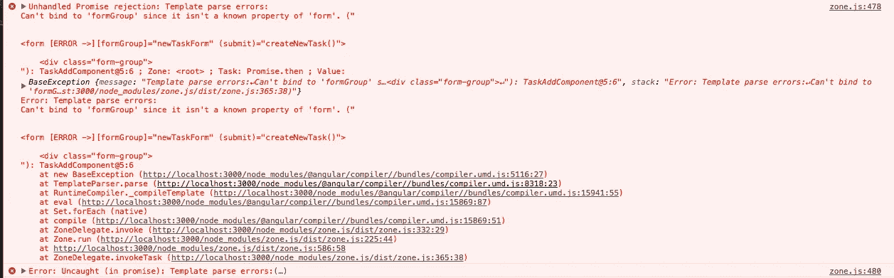

# 5 堆栈上角溢出的顶级问答

> 原文：<https://javascript.plainenglish.io/5-top-rated-q-a-for-angular-on-stack-overflow-bed610bf1c50?source=collection_archive---------7----------------------->

## “这个项目从堆栈溢出开始”是开发人员如何开始她的故事。


Photo by [Robert Anasch](https://unsplash.com/@diesektion?utm_source=medium&utm_medium=referral) on [Unsplash](https://unsplash.com?utm_source=medium&utm_medium=referral)

大多数公众都知道堆栈溢出是程序员使用的平台。但是今天它不仅仅包括软件世界。我的意思是，我们可以说它存在于我们生活的每一部分。

在软件世界里，它每天被很多人点击很多次。使用区域；有时创建一个项目，有时解决语法错误，有时获取一段代码并退出，等等。

今天我就和大家分享一下 Angular 开的投票最多的问题。

开始吧！

# 问题 1

[**无法绑定到‘ng model’，因为它不是‘input’**](https://stackoverflow.com/questions/38892771/cant-bind-to-ngmodel-since-it-isnt-a-known-property-of-input)的已知属性

投票数是 1774，120 万次

```
zone.js:461 Unhandled Promise rejection: Template parse errors:
Can't bind to 'ngModel' since it isn't a known property of 'input'. ("
   <div>
      <label>Created:</label>
      <input  type="text" [ERROR ->][(ngModel)]="test" placeholder="foo" />
   </div>
</div>"): InterventionDetails@4:28 ; Zone: <root> ; Task: Promise.then ; Value:
```

其实问题很简单。但是很多人都会遇到很多次。这种类型的错误通常是模块错误。如果错误中提到了`[(ngModel)]`，这意味着您需要将 *FormsModule* 导入到您的 module.ts 文件中。

打开包含组件的相关模块文件，并

```
import { FormsModule } from '@angular/forms';
```

然后在导入中写 **FormsModule** 。

# 问题 2

[**承诺和可观察到的区别？**](https://stackoverflow.com/questions/37364973/what-is-the-difference-between-promises-and-observables)

有 1678，647，000 次投票



图像中的答案是得票最多的答案。

但我发现了另一个更能说明问题的答案。这件事处理得很简单。

> **承诺**和 **Observables** 将帮助我们使用 JavaScript 中的**异步功能**。在许多情况下，它们非常相似，然而，两者之间仍然有一些差异，承诺是以像 HTTP 调用这样的`asynchronous`方式解析的值。另一方面，可观测量处理一系列的**异步事件**。它们之间的主要区别如下:

## **承诺:**

*   有一个管道
*   通常，仅用于异步数据返回
*   不容易取消

## **可观察:**

*   可以取消
*   本质上是可重试的，例如重试和在下列情况下重试
*   多个管道中的流数据
*   具有类似数组的操作，如映射、过滤等
*   可以从事件等其他来源创建
*   它们是功能，可以在以后订阅

此外，我还为您制作了下图，直观地展示了两者的区别:



[What is the difference between Promises and Observables?](https://stackoverflow.com/questions/37364973/what-is-the-difference-between-promises-and-observables)

# 问题 3

[**构造函数与 ngOnInit 的区别**](https://stackoverflow.com/questions/35763730/difference-between-constructor-and-ngoninit)

投票 1315652 次

> Angular 默认提供一个生命周期钩子`ngOnInit`。
> 
> 如果我们已经有了一个`constructor`，为什么还要使用`ngOnInit`？

**ngOnInit** 在**构造函数**被调用后立即被调用。构造函数是由 typescript 定义的默认方法。ngOnInit 是生命周期方法。

换句话说，就像在所有面向对象的语言中一样，当从类中创建新对象时，首先运行构造函数。在组件被创建并且关于组件的一切都被绑定之后，ngOnInit 运行。

# 问题 4

[**无法绑定到“表单组”，因为它不是“表单”的已知属性**](https://stackoverflow.com/questions/39152071/cant-bind-to-formgroup-since-it-isnt-a-known-property-of-form)

这是 1084，965，000 次投票



实际上，问题的答案和第一个问题一样。模块有问题。所以它需要向 module.ts 文件导入一些东西。

```
import { FormsModule, ReactiveFormsModule } from '@angular/forms';
```

# 问题 5

[**有棱角的 HTML 绑定**](https://stackoverflow.com/questions/31548311/angular-html-binding)

有 1004662 次投票

> 我正在编写一个有角度的应用程序，我有一个 HTML 响应，我想显示。
> 
> 我该怎么做？如果我简单地使用绑定语法`{{myVal}}`，它会对所有 HTML 字符进行编码(当然)。
> 
> 我需要以某种方式将`div`的`innerHTML`绑定到变量值。

```
<div [innerHTML]="theHtmlString"></div>
```

更好的方法是使用不同于 Javascript 的`[innerHTML].` Angular。如果你使用`innerHTML,`，你可以使用绑定操作。

阅读问题和检查答案会给你很多信息。因此，要经常阅读和复习。

感谢您的更多访问[堆栈溢出](https://stackoverflow.com/questions/tagged/angular?sort=MostVotes&edited=true)。

[](https://bestte.medium.com/membership) [## 通过我的推荐链接加入 Medium—Beste

### 作为一个媒体会员，你的会员费的一部分会给你阅读的作家，你可以完全接触到每一个故事…

bestte.medium.com](https://bestte.medium.com/membership) [](/how-to-work-with-the-angular-nebular-ui-library-and-use-a-simple-splash-screen-3dd0d1790478) [## 如何使用 Angular Nebular UI 库并使用简单的闪屏

### 闪屏在某些情况下是必要的，所以我想用一种非常简单的方式来展示它，我将谈谈…

javascript.plainenglish.io](/how-to-work-with-the-angular-nebular-ui-library-and-use-a-simple-splash-screen-3dd0d1790478) [](/how-to-use-angular-component-styles-with-special-selectors-dc877514372c) [## 如何将角度组件样式与特殊选择器一起使用

### 在具有独立样式文件的组件的基础上，将样式添加到您的 Angular 应用程序有助于您创建一个更…

javascript.plainenglish.io](/how-to-use-angular-component-styles-with-special-selectors-dc877514372c) [](/how-to-use-angulars-attribute-directives-in-your-class-hierarchy-d3a1d0adac32) [## 如何在类层次结构中使用 Angular 的属性指令

### 使用 Angular CLI 构建属性指令

javascript.plainenglish.io](/how-to-use-angulars-attribute-directives-in-your-class-hierarchy-d3a1d0adac32) [](/how-to-use-sass-and-enjoy-css-with-dynamic-structure-900ea2adddf7) [## 如何使用 Sass，享受动态结构的 CSS

### 由于 CSS 是一个静态结构，我们必须不断重复代码。我们给 CSS 代码带来了动态结构…

javascript.plainenglish.io](/how-to-use-sass-and-enjoy-css-with-dynamic-structure-900ea2adddf7) [](/how-to-use-the-composition-api-to-get-data-from-service-with-vue-js-4da1eca19ad6) [## 如何使用组合 API 通过 Vue.js 从服务中获取数据

### 通过使用组合 API 而不是选项 API，可以使服务结构更加可用。

javascript.plainenglish.io](/how-to-use-the-composition-api-to-get-data-from-service-with-vue-js-4da1eca19ad6) 

*更多内容看* [***说白了. io***](http://plainenglish.io/) ***。*** *报名参加我们的* [***免费每周简讯点击这里***](http://newsletter.plainenglish.io/) ***。***