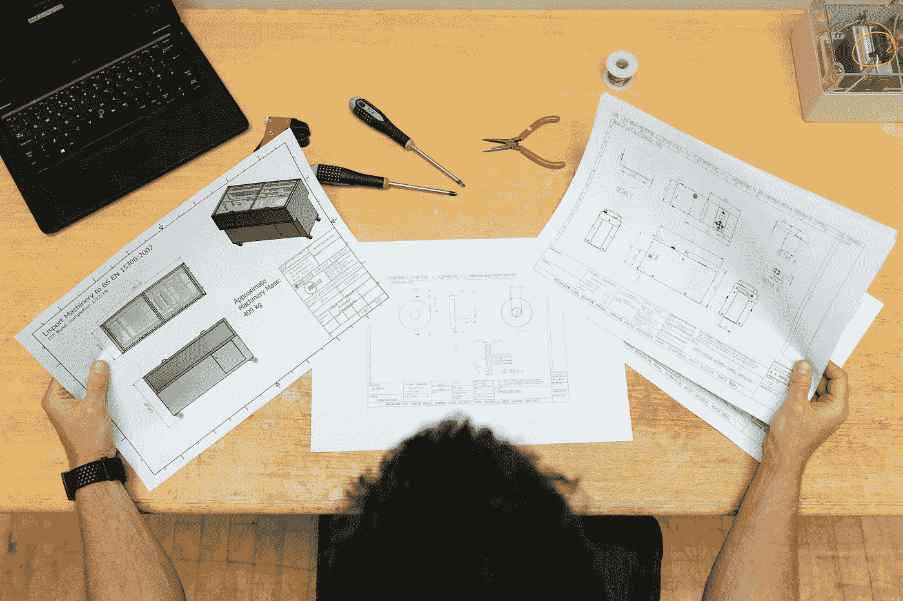

# 没人告诉我的软件设计

> 原文：<https://javascript.plainenglish.io/5-truths-about-software-design-a251bfcd97ad?source=collection_archive---------16----------------------->

## 我从我的错误中学到了什么

Photo by [ThisisEngineering RAEng](https://unsplash.com/@thisisengineering?utm_source=unsplash&utm_medium=referral&utm_content=creditCopyText) on [Unsplash](https://unsplash.com/s/photos/software-design?utm_source=unsplash&utm_medium=referral&utm_content=creditCopyText)

那是几年前，我被要求独立设计一个中型系统。我真的很兴奋，因为是时候向世界展示我是一个多么棒的软件设计师了。

在此之前，我只看到别人设计的系统，并想知道为什么他们会错过这么多东西？

但是当我开始自己设计系统时，我意识到即使是简单的东西也很难建造。那么多依赖，那么多限制，那么多压力！

我对自己的设计感到内疚，尽管它工作得很好。因为我知道我系统的漏洞。我知道我得跳过多少好东西才能定型。

但是最近我读了史蒂夫·麦康奈尔写的一本书，他在书中表达了关于设计的真理

所以今天我分享 5 个关于设计的真理，我们所有人在再次设计任何东西之前都需要牢记在心。

# 1.软件设计没有什么是干净的

软件设计是一个非常马虎和肮脏的过程。成品很好，也很精致，但过程远不如最终结果整洁。

产品是干净的，但过程是肮脏的。

设计是草率的，因为你必须走很多死胡同。你不得不犯错。你搞错了。事实上，这就是设计的重点。

# 2.这都是关于权衡和优先权

没有什么叫做**的完美设计**。设计是为了一个特定的目标。

一个理想的系统应该不占用空间，没有延迟，不需要任何维护成本，同时支持数百万客户。

但在现实中，我们不得不做出取舍。有时候作为设计师，因为时间限制，不得不选择稍微差一点的架构。

开发时间和特性支持通常会导致您重新考虑您的设计。

# 3.设计和想象经常发生冲突

设计是创造可能性，有时又限制可能性。

如果我们有无限多的时间，我们将建立一个支持所有可能的功能的系统。但遗憾的是，我们受到时间和资源的限制。

作为设计师，你应该选择你不想要的而不是你想要的。

所以，接受你不能做所有事情的事实，明智地选择你的牺牲。

# 4.多个设计可以同时正确

如果你让三个不同的人设计相同的功能，他们每个人都会想出完全不同的设计。但是他们都可以同时正确。

软件设计没有灵丹妙药。

有时候，作为人类，我们对自己的设计变得傲慢，拒绝一切与我们的行事理念不符的东西。

因此，在协作环境中工作时，你必须对他人的想法持开放态度。

# 5.这是一个滚动的球

总结所有这些的一个简洁的方法是设计正在出现。这是一个持续的过程。它就像一个滚动的球，一路上聚集着好的坏的东西。

直到我们开始在现实生活中实现这个设计，我们才能把很多事情做好。有时我们不得不改变设计的某些部分。有时我们不得不重写它。

不完美的设计没有错。

你只需要接受这样一个事实:你设计的东西可能完全是垃圾，接受一个更好的东西并不丢人。这是软件设计的唯一真理。

## 结论

这是我对软件设计的一些想法。希望你会觉得有用。

编码快乐！:D

**通过** [**LinkedIn**](https://www.linkedin.com/in/56faisal/) **或我的** [**个人网站**](https://www.mohammadfaisal.dev/) **与我取得联系。**