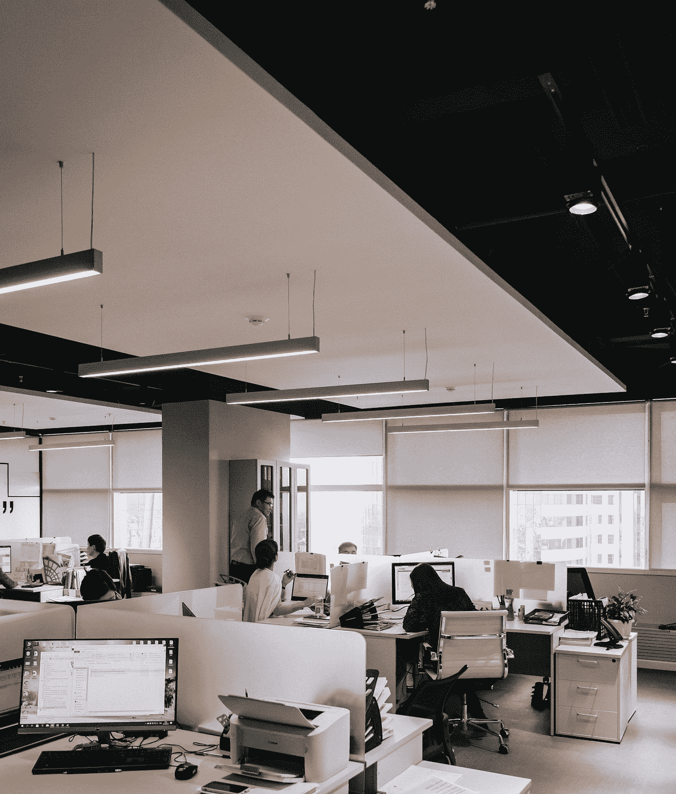
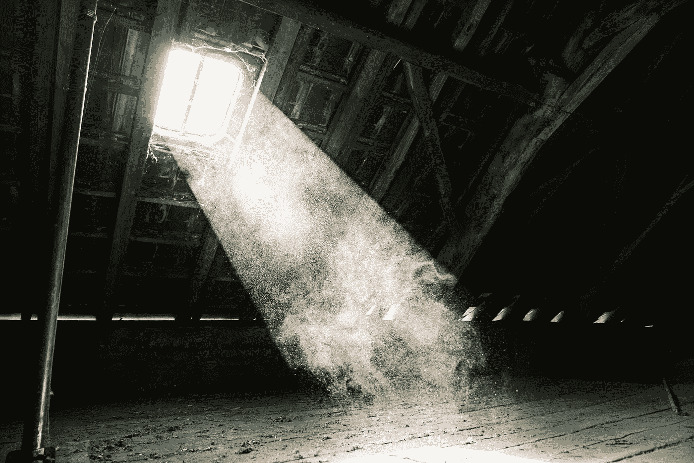

# 作为程序员，你可能会经历 5 种类型的小房间

> 原文：<https://javascript.plainenglish.io/5-types-of-cubicles-you-may-experience-as-a-programmer-888edd3d0377?source=collection_archive---------14----------------------->

## 最后一个会感觉是升职

Photo by [Damir Kopezhanov](https://unsplash.com/@kpzhnv?utm_source=medium&utm_medium=referral) on [Unsplash](https://unsplash.com?utm_source=medium&utm_medium=referral)

除非你在为一些时髦的、流行的创业公司工作，否则程序员典型的办公环境是在一个由小隔间组成的农场里。编码员像动物一样有组织地聚集在一起。小隔间的标准尺寸从 6 英尺 6 英寸到 8 英尺 8 英寸不等——是的，我刚刚查了一下——刚好有足够的空间放一台电脑，你的午餐袋，也许还有一个枕头。无论是谁想出了这个主意，都很可能被誉为空间效率天才。然而，概念和房间的变化并不总是令人满意的。

在我的职业生涯中，我坐过 18 个不同的座位——3 个在办公室，15 个在小隔间。因为这篇文章是关于小隔间的，所以我不会讨论办公室的话题，因为它们自成一派。它们是程序员的奢侈品，通常用于管理。至于描述所有 15 个小隔间，我怀疑这是不是很有趣，所以我把它缩小到最令人难忘的 5 个——除了最后一个，大部分是因为不好的原因。

# 1)石棉隔间

Photo by [Mika Baumeister](https://unsplash.com/@mbaumi?utm_source=medium&utm_medium=referral) on [Unsplash](https://unsplash.com?utm_source=medium&utm_medium=referral)

这是迄今为止我经历过的最糟糕的座位。位于一个没有窗户的地下室，这是我唯一一次目睹一个非模块化的隔间。也就是说，你不能轻易拆开它。它是用干墙或灰泥建造的，颜色是难看的灰白色，几乎是黄色。我和我的同事从未确认过是否有石棉，但这座建筑看起来像是 70 年代建造的。如果有微量的致命灰尘，这并不奇怪。如果你发现自己在这样的隔间里，我担心你和你的肺。

**判决:逃跑。尽你所能。**

# 2)月亮隔间的阴暗面

Photo by [Andrea Sonda](https://unsplash.com/@andreasonda?utm_source=medium&utm_medium=referral) on [Unsplash](https://unsplash.com?utm_source=medium&utm_medium=referral)

下一个在另一个地下室里，但是需要穿过一条又长又黑的走廊才能到达。这个小隔间有 6 英尺高的墙，看起来还不错，但是位于房间的中央。如果我想看一眼天气，我不得不站起来，用我的眼睛透过半个小窗户看我能看到什么。可悲的是，我在这个位置坐了 3 年多。如果你不介意对外界漠不关心，那么这款适合你。我相信大多数人会有不同的看法。

**判决**:泰，如果你讨厌太阳。

# 3)尴尬时刻隔间

Photo by [Usman Yousaf](https://unsplash.com/@usmanyousaf?utm_source=medium&utm_medium=referral) on [Unsplash](https://unsplash.com?utm_source=medium&utm_medium=referral)

就隐私而言，这可能是最不舒服的配置。在此期间，我在一家软件公司工作，该公司提供笔记本电脑和没有任何墙壁隔断的小隔间。此外，我们是面对面的，这有利于合作，除非你的同事有不同的客户和与你无关的任务。这导致了一些尴尬的时刻，我们的眼睛偶尔会交叉，随后导致有时感觉被迫的对话。如果你发现自己在这些没有墙壁的小隔间里，希望你和你前面的人有共同的任务和兴趣。

结论:如果你不介意你的同事，就留下来。

# 4)不良姿势隔间

Photo by [jose aljovin](https://unsplash.com/@josealjovin?utm_source=medium&utm_medium=referral) on [Unsplash](https://unsplash.com?utm_source=medium&utm_medium=referral)

从隐私的角度来看，这个房间只比没有墙壁的小隔间好一点点。隔间的墙大约有 4 英尺高，桌子上有三台 24 英寸的显示器，当它们升得足够高时，可以提供一个额外的屏障来隐藏。如果你把座位降得足够低，几乎就像有一整面墙一样——这是痴心妄想。虽然有利于合作，但这种隔间类型似乎会助长不良姿势。程序员似乎通过更多地弯腰来补偿隐私的减少。有趣的是，上次我坐在这些半高隔间中的一个时，由于新冠肺炎的出现，它们被改成了 6 英尺的墙壁。考虑到这一点和其他潜在的病毒，我猜测这种半高配置将越来越不受欢迎。如果你现在正处于其中，我希望你已经接种了疫苗。

**判决:留下来，如果你有一个背部矫直机和良好的免疫。**

# 5)行政隔间

Photo by [Ruthson Zimmerman](https://unsplash.com/@ruthson_zimmerman?utm_source=medium&utm_medium=referral) on [Unsplash](https://unsplash.com?utm_source=medium&utm_medium=referral)

在小隔间的世界里，最令人垂涎的是靠窗的座位。让你与大自然保持联系。大多数程序员竞争这种类型，通常，高级程序员往往有优先权。如果你是一个初级程序员，并且你设法得到了一个，那么就享受它吧。这种配置会给你两个隔间墙和一个窗户墙。你还能要求什么？

> 角落靠窗的座位。

1 面隔间墙和 2 面荣耀窗墙。如果你奇迹般地得到了这种类型，那么你要么在职业生涯中做对了什么，要么你非常幸运。就隔间而言，这相当于拥有一个角落办公室，通常是为高层管理人员保留的。由于我是一名技术负责人，而且我的团队碰巧位于一排窗户附近，我很幸运能够参与其中。如果你现在有幸置身其中，请坐下来欣赏风景。

**判决:** **HODL 用隐语来说就是“为了亲爱的生命坚持住”。在格子间的世界里，没有比这更好的了。**

# 结论

小隔间是一种生活方式，作为一名程序员，你可能会经历很多。如果你所在的公司只有带 windows 的办公室，那么你的情况比大多数公司都要好。你在一个精英空间，我们很少有人知道。对于我们其余的人来说，我们将不得不用我们的模块化立方体来凑合，希望得到一个有视野的。

*更多内容看*[***plain English . io***](http://plainenglish.io/)