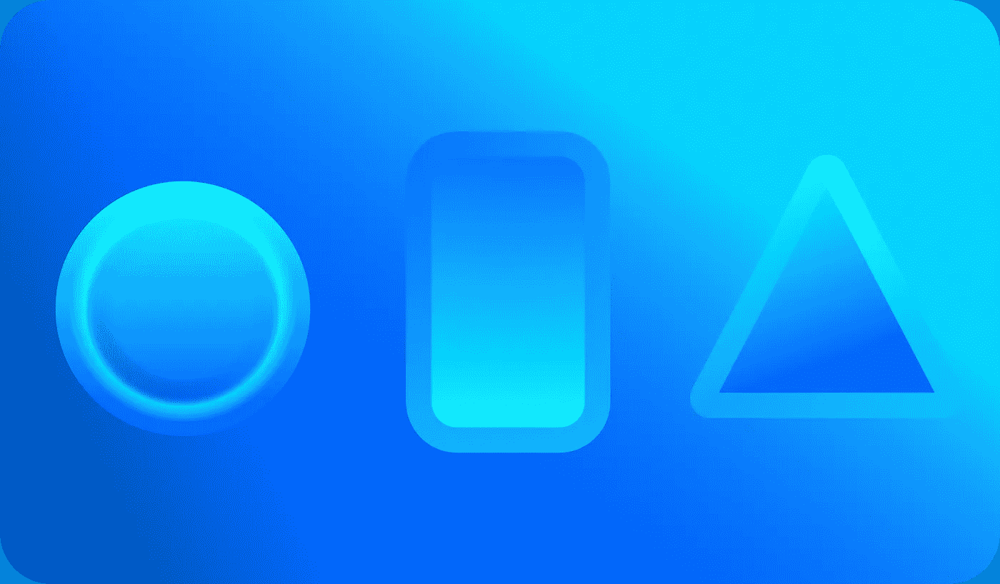
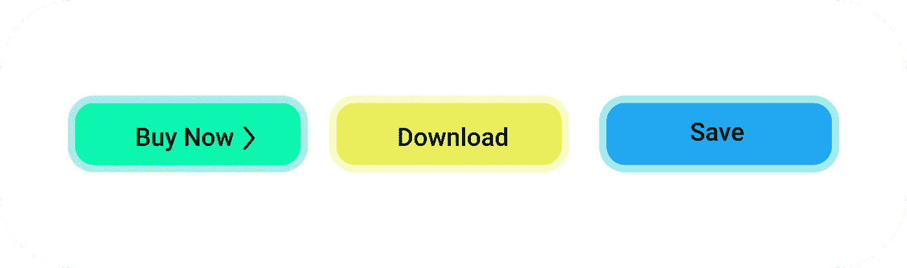
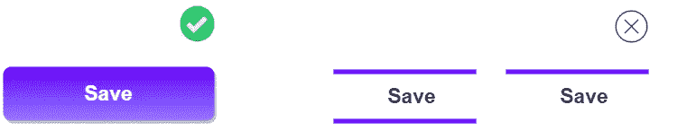
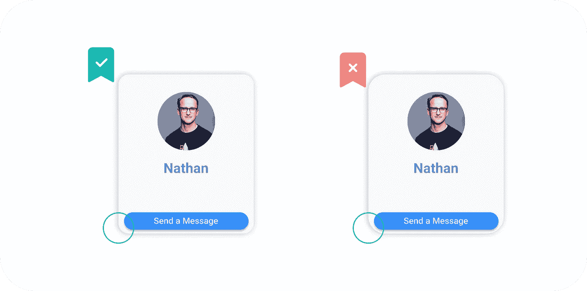
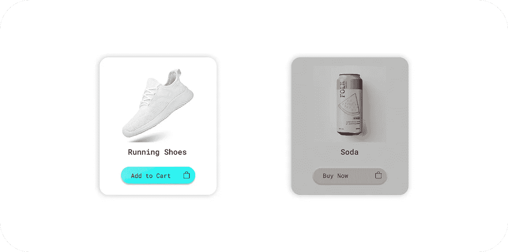

# 作为软件开发人员，你正在犯的 5 个 UI 错误

> 原文：<https://javascript.plainenglish.io/5-ui-mistakes-you-are-making-as-a-software-developer-6e311d769a77?source=collection_archive---------8----------------------->

开发人员在前端应用程序中经常犯的 UI 错误

每个应用程序都需要好的按钮，这样用户可以很容易地理解它们的相关动作。但是开发人员通常会犯在应用程序中使用奇怪按钮的错误。

按钮可以用于很多动作，比如 ***购买产品、下载、发送动作等*** 。你不必每次都构建一些很酷的动画按钮，只要确保你的按钮动作是真实的，就像我们在现实世界中的 ***(电视遥控器、唱机、游戏控制器上的按钮)一样。***

## 1.使用奇数按钮

在构建应用程序时，你应该遵循的最重要的规则是你的按钮必须突出，否则你的用户很可能会与界面的其他部分混淆。

*   当您从按钮中移除元素时，它的功能开始消失，变得对原始文本更加友好。

## 2.为按钮使用不熟悉的形状

开发者经常倾向于使用形状奇怪的按钮。这样的 UI 很容易导致糟糕的用户体验。你的按钮看起来 ***越像一个矩形区域越好。***

**Rectangular Shapes are More Natural for Buttons**

*   *但是，*有些时候我们不想对每个按钮都进行样式化，这时我们可以使用 ***文本链接*** 。注意，现在不推荐使用文本链接，但是如果你正在处理应用程序的一小部分，你可以使用蓝色和紫色的文本链接。

**Most users understand them easily**

*   其他形状，如(**圆形、三角形等**)很难被用户识别为按钮，因此建议谨慎使用，仅在必须改变应用程序风格时使用。

**These elements can take much longer to understand they are actionable**

## 3.使用太小的按钮

手机和网络按钮应该有一个适合每个用户的最小尺寸，如果你的按钮太小，点击会很困难。这可能会让用户感到沮丧，所以要确保移动设备上的所有交互元素都是以 44 乘 44 点开始。

*   在基于光标的设备的情况下，32 乘 32 应该可以完成这项工作，并且记住在桌面上，如果你的按钮比通常的要大的话，会容易得多。

## 4.不一致的边框半径

圆角在现代应用中随处可见，如果您使用圆角元素，建议在其他屏幕元素之间使用正确的 ***圆角比例*** 。

*   不要在整个 UI 中使用不同的**边框半径**。否则，你不得不处理各种元素之间的严重不平衡。

## 5.在卡片中使用投影

卡片是展示*产品、信息、*和*行动最流行的方式之一。*在你的应用程序中构建卡片时，有几个要点你必须注意， ***比如避免添加任何多余的内容，你的卡片应该简明扼要。***

大多数时候开发者使用阴影来给卡片一个更真实的外观，但是仍然有一些开发者在处理卡片时会犯的错误。

*   真实阴影的最佳选择是在 Y 轴上使用**正阴影偏移**，同时使用为零的**水平偏移**。
*   另一种可以最小化投影效果的方法是聚焦于**模糊**所有边的阴影。

 [## 初学 HTML 时你会犯的 7 个错误

### 你应该知道的 HTML 错误

javascript.plainenglish.io](/7-mistakes-you-are-making-as-a-beginner-in-html-e65ca41ad598)  [## 3 个隐藏的 CSS 功能

### 对前端开发者有用的 CSS 特性

javascript.plainenglish.io](/3-hidden-features-of-css-566e8c27597f)  [## 让你成为前端忍者的 6 个 UI 概念

### 构建具有出色 UI 的应用程序的基本概念

javascript.plainenglish.io](/6-ui-concepts-that-makes-you-a-frontend-ninja-c6c0a29fa954) 

*更多内容请看*[***plain English . io***](http://plainenglish.io/)