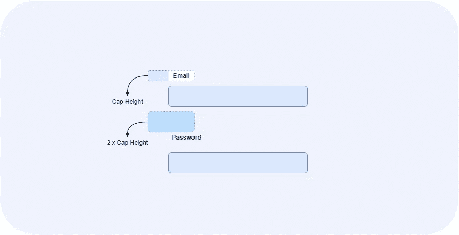
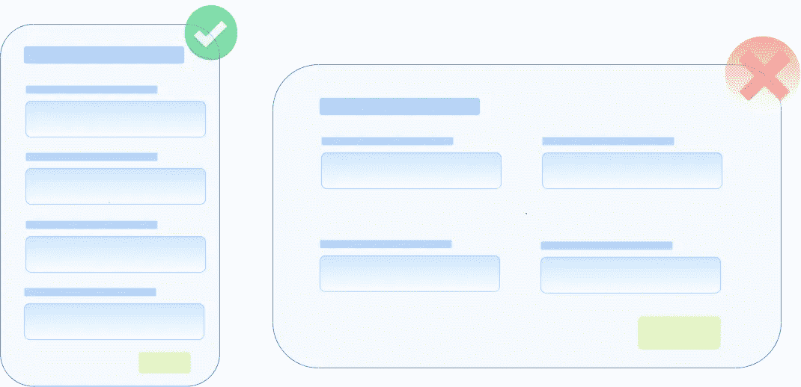
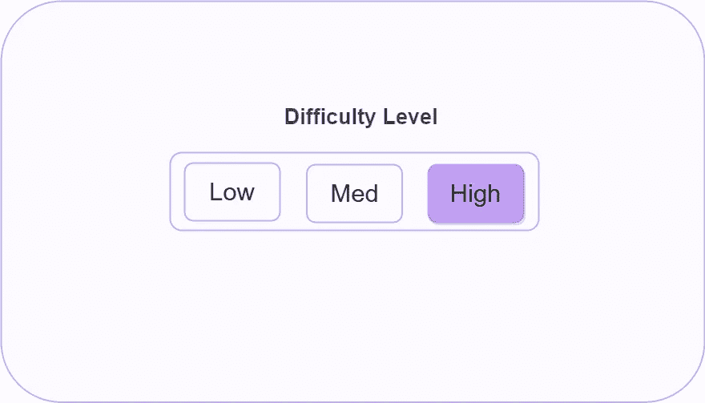

# 在网络应用程序中设计表单的 5 个用户界面/UX 技巧

> 原文：<https://javascript.plainenglish.io/5-ui-ux-tips-to-design-forms-in-web-applications-68896512a46c?source=collection_archive---------4----------------------->

## 构建易于使用的表单

表单是用户与应用程序交互的常见方式之一，几乎无处不在。在进行*购买、创建个人资料或注册时事通讯*时，构建表单的正确方式可以很容易地促进用户交互，因为应用程序变得更加友好。我将给出一些简单的小技巧，作为前端开发人员，甚至作为 UI/UX 设计师，这些小技巧可以帮助您构建更好的表单。

## 1.测试您的表单

有时，我们的应用程序是某些用户的特定目标，为了确保最大程度的用户在使用您的应用程序时感到舒适，您必须在真正的用户上测试您的表单。然而，会有不同的情况，因为目标市场不同，你的表格需要在真实用户中进行广泛测试。

## 2.使用字段状态

基于用户的行为，表单域可以有不同的状态，尝试在所有这些状态下设计每个表单元素。从基本的*文本输入*字段开始，然后针对不同的字段状态，尝试使用边框颜色**、文本权重**和**阴影**对其进行定制。

*   您也可以在内部使用图标，如验证字段的**复选标记**或显示当前操作的其他相关图标。
*   在表单域中设计*否定*和无效状态时，确保提供一个简短的描述让用户知道哪里出了问题，您可以使用不同不透明度的颜色(红色)让它对用户更有描述性。
*   此外，避免添加显示在整个表单下的所有验证，并保持描述简短切题。

## 3.间隔标签

标签是一个带有文本字段的小说明性文本，在大多数情况下，它只是对该表单字段中所需内容的描述，如果您的表单有许多字段，请确保它们之间的间距足够均匀，以避免表单中令人困惑的外观。

*   使用**帽高**(大写字母的高度)或 **1.6 倍**的帽高值可以很容易地得到合适的间距。
*   多个文本字段及其标签之间的边距至少应该是标签高度的两倍**，这样才能清楚字段的开始和结束位置。**

## 4.使用单栏表格

在应用程序中使用单列表单而不是多列表单有多种原因。当涉及到移动设备等较小的屏幕时，单列形式更友好，因为当涉及到移动设备时，它们更易读，因为你可以用眼睛沿着一条小路线前进，而不是在不同的区块之间跳跃。

*   保持表格比较窄，最好的范围是 **320** 和 **500p** 宽。更宽的字段会自动花费更多的时间来处理，所以保持简单。
*   如果你有超过 6 个或更多的字段，那么建议将它们分成单独的页面，清楚地说明你目前所处的阶段。
*   此外，不要在你的表单周围添加空白，最好给表单最大的关注度和最好的焦点。

## 5.使用单选按钮

在某些情况下，如果您有很少的选项在将来不会改变，那么建议使用*单选按钮*而不是**下拉菜单**来选择这些选项。使用单选按钮也为您的应用程序增加了一个更一致的外观，因为用户在使用应用程序时不需要找到这些选项。

 [## 作为前端开发人员，你应该知道的 8 个 UX 原则

### 用这 8 个技巧构建吸引人的前端应用程序

javascript.plainenglish.io](/8-ux-principles-you-should-know-as-a-frontend-developer-9416a24294d2)  [## 作为开发人员，您应该知道的 11 个 VS 代码特性和技巧

### 对 VS 代码更加自信

javascript.plainenglish.io](/11-vs-code-features-tricks-you-should-know-as-a-developer-47e5ec0c362b)  [## REST API 设计的 8 个最佳实践

### 构建更好的 REST APIs

javascript.plainenglish.io](/8-best-practices-for-rest-api-design-3fd1b837b283)  [## 掌握 JavaScript 编码面试的 50 个问题

### JavaScript 编码面试问题:第 1 部分

javascript.plainenglish.io](/50-questions-to-master-the-javascript-coding-interview-639d2ac12630) 

*更多内容尽在*[***plain English . io***](http://plainenglish.io/)