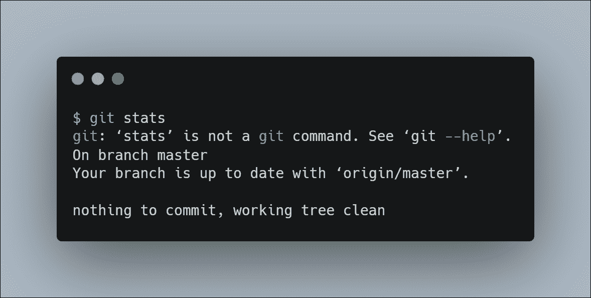
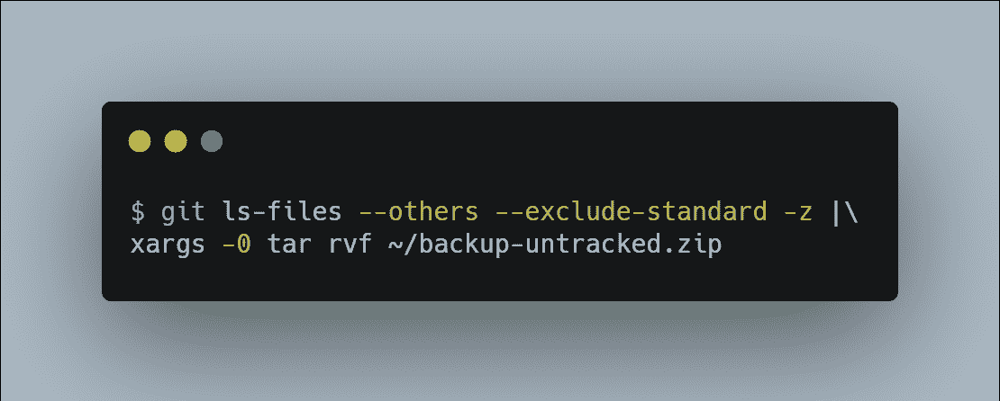

# 你需要知道的 Git 的 5 个未知特性

> 原文：<https://javascript.plainenglish.io/5-unkown-features-of-git-you-need-to-know-99a40bb3622d?source=collection_archive---------4----------------------->

你绝不能错过的 Git 特性

Git 是最常见的版本控制系统之一。它是免费且容易学习的，它被用于私有系统和公共托管的网站，用于从小到大的各种开发工作。它远胜于像 **Subversion** 、 **CVS** 、 **Perforce** 和 **ClearCase** 这样的配置管理工具，具有便宜的*本地分支、方便的中转区和多工作流等特性。*

## 1.Git 中的自动更正

我们所有人有时都会犯打字错误，为了解决这个问题，Git 有一个自动更正功能。如果您的系统启用了 Git 的自动更正功能，那么您可以让 Git 自动修复错误的命令。

*   ***例如*** ，你想用 ***检查状态 git stats***但是你不小心键入了***git stats****。*正常情况下，Git 告诉你**‘stats’**不是有效命令。

*   为了避免这些情况，您必须在您的 Git 配置中启用 Git 自动更正:

> ***注意:*** *如果您希望该特性只应用于您当前的存储库，那么省略—* **全局** *选项。*

*   此命令将启用自动更正功能。如果我们尝试与上面相同的命令，您可以观察到这个配置做了什么。
*   现在，Git 没有建议另一个子命令，而是运行顶部的建议，在本例中是 ***git 状态*** 。

## **2。备份未被跟踪的文件**

大多数情况下，删除所有**未跟踪的**文件是安全的。但有时，可能会出现这样的情况:您希望删除所有未跟踪的文件，但又希望为它们创建一个备份，以防以后需要它们。

*   Git 和一些 Bash 命令管道使得为所有未跟踪的文件创建 zip 存档变得容易。

*   上述命令会创建一个归档文件(不包括。 **gitignore** )名称为 **backup-untracked.zip**

## 3.查看另一个分支的文件

您可以用一个简单的 Git 命令从另一个分支查看文件的内容，而不需要实际切换您的分支。

*   ***例如*** ，一个名为 **README.md** 的文件存在于您的主分支中，而您正在处理一个名为 **dev** 的分支。使用 Git 命令，您可以从终端执行此操作。
*   一旦执行了这个命令，您就可以在终端中查看文件的内容。

## 4.在 Git 中搜索

Git 允许您轻松地搜索任何提交的树、工作目录，甚至是字符串或正则表达式的索引。您可以用一个简单的命令在 Git 中进行搜索。

*   ***例如，*** 你要搜索的字符串**“font-size:52 px；”**在您的存储库中。您可以通过下面的命令来完成。

## 5.计算你的提交

您可能需要计算您的提交次数。例如，有时开发人员通过计算提交的数量来判断何时增加构建号，或者只是为了了解项目的进展情况。提交还可以用于查找每个开发人员在构建软件中所做的贡献。

*   使用一些 Git 命令，计算提交次数非常简单明了

*   在上面的代码中，分支名称应该是当前存储库中的有效分支名称。

 [## 提高 CSS 性能的 5 种优化技术

### 构建突出的前端应用程序

javascript.plainenglish.io](/5-optimization-techniques-that-will-boost-your-css-performance-c16ad808d32e)  [## 让你成为前端忍者的 6 个 UI 概念

### 构建具有出色 UI 的应用程序的基本概念

javascript.plainenglish.io](/6-ui-concepts-that-makes-you-a-frontend-ninja-c6c0a29fa954)  [## 作为前端开发人员，你应该知道的 8 个 UX 原则

### 用这 8 个技巧构建吸引人的前端应用程序

javascript.plainenglish.io](/8-ux-principles-you-should-know-as-a-frontend-developer-9416a24294d2)  [## 2021 年终极网络开发者路线图

### 从基础到部署可伸缩的 Web 应用程序

javascript.plainenglish.io](/ultimate-web-developer-roadmap-for-2021-6758edd0bd3f) 

*更多内容请看*[*plain English . io*](http://plainenglish.io/)