# 5 使用效果无限循环模式

> 原文：<https://javascript.plainenglish.io/5-useeffect-infinite-loop-patterns-2dc9d45a253f?source=collection_archive---------0----------------------->

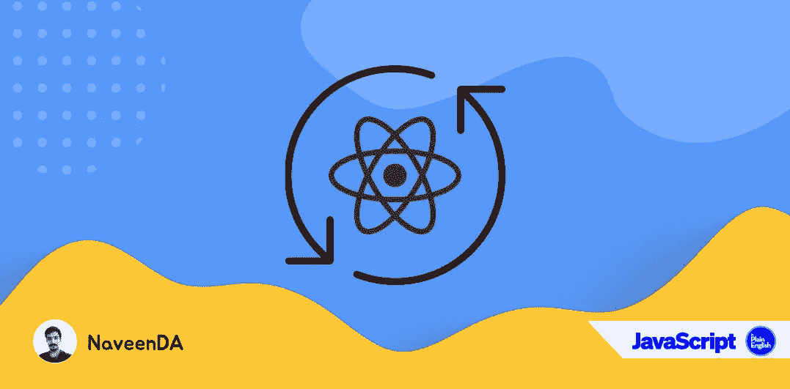

一般来说，无限循环被认为是不好的做法。但是在[一些边缘情况下](https://stackoverflow.com/questions/224204/why-use-infinite-loops)，你没有任何选择，只能选择一个无限循环。了解 React 的无限循环模式很有好处。

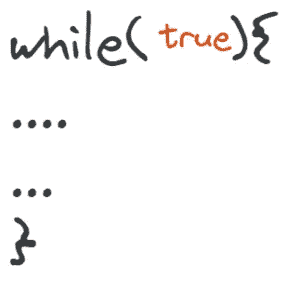

当无限循环不停地运行时，最终浏览器会终止代码运行的标签。所以不要在没有任何断点的情况下使用`Infinite Loop`。

# 使用效果

useEffect 钩子允许我们在一个组件中执行副作用。当钩子被引入 react 16 时，`useEffect`钩子比任何其它钩子获得更大的牵引力。因为它提供了`componentDidMount`、`componentDidUpdate`和`componentWillUnmount`生命周期方法的组合功能。

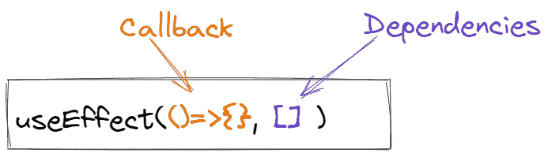

useEffect 钩子触发回调函数，仅当依赖关系被改变时。并且它使用`shallow`比较来比较钩子的值。

你可以把它当作一块能量石，这是一块非常强大的石头，如果你处理不当，它会毁了你。

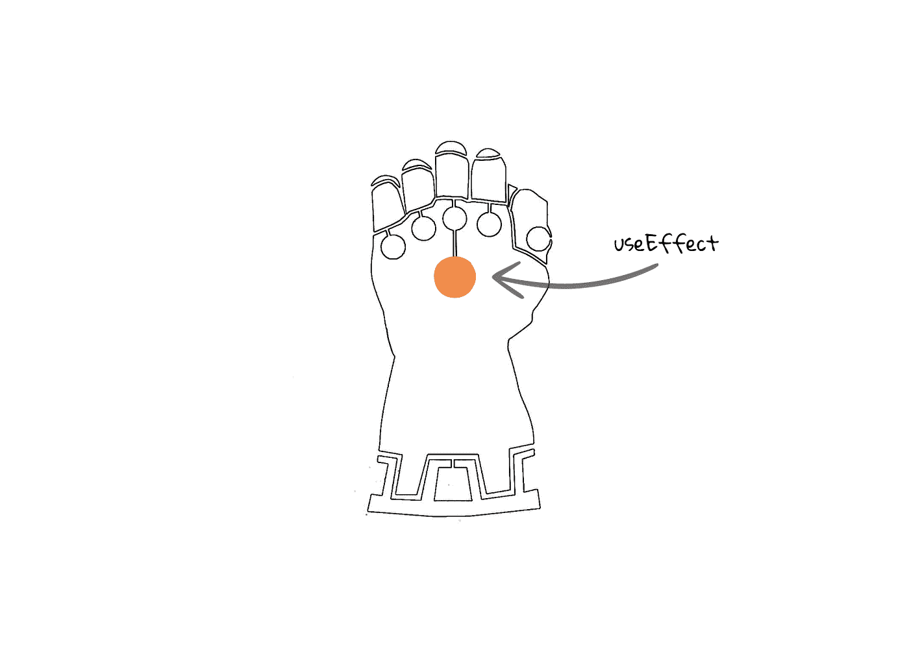

## 没有依赖性

没有依赖关系的 useEffect 通常被认为是一种不好的做法，所以要尽量避免。

考虑下面的代码，它将永远调用 API。

## 发生什么事了？

如果 useEffect 仅在依赖关系改变时触发回调，为什么我们在这里以无限循环结束。

你需要考虑 React 的另一个重要的**咒语，那就是“当状态或道具改变时，组件将重新渲染”。**

在这段代码中，我们使用`setData`设置状态值，如果网络调用成功，它将触发组件重新呈现。由于 useEffect 没有可比较的值，所以它将调用回调。

并且 Fetch 将再次触发`setData`和`setData`将触发组件重新渲染等等。

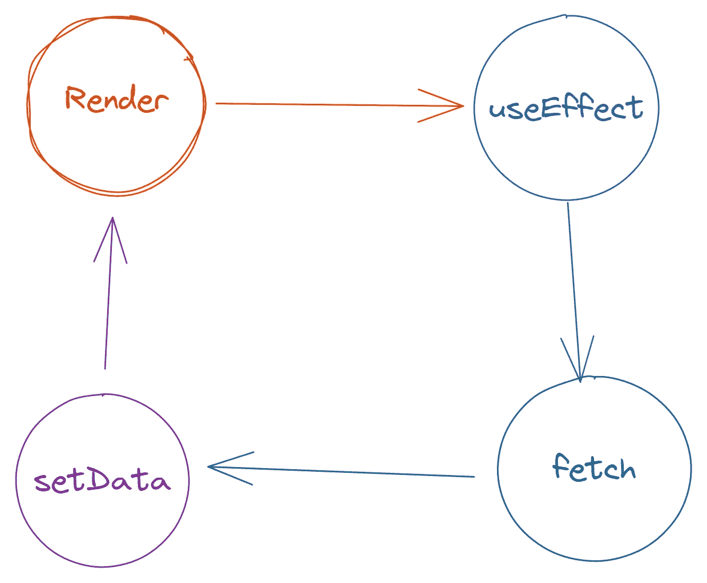

## 如何解决这个问题？

我们需要将依赖项指定为空数组。

根据官方文件，[省略依赖关系](https://reactjs.org/docs/hooks-faq.html#is-it-safe-to-omit-functions-from-the-list-of-dependencies)是**不安全的**

# 作为依赖项运行

useEffect 使用浅层对象比较来确定数据是否被更改。由于奇怪的 JavaScript 条件系统😈。

让我们考虑下面的代码

函数`getData`作为依赖项传递。

当你运行这段代码时，它会抛出`Maximum update depth exceeded`，这意味着这段代码有一个无限循环。

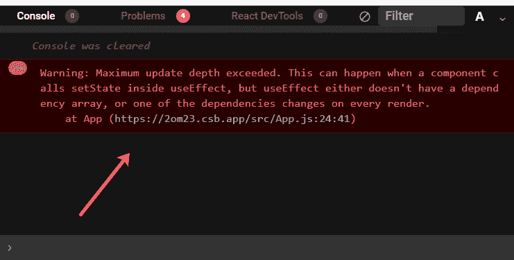

## 发生什么事了？

因为 useEffect 使用浅层比较来比较值。函数的浅层比较将总是给出假值。

## 怎么修？

为了解决这个问题，我们需要使用另一个名为`useCallback`的无限石。

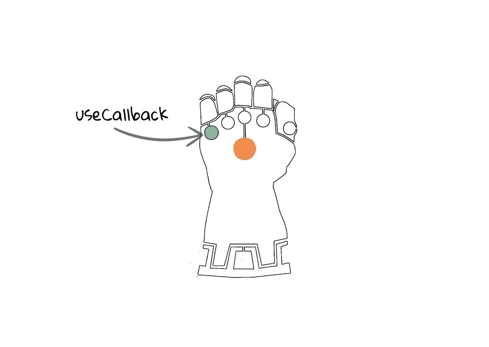

`useCallback`返回一个[内存化的](https://en.wikipedia.org/wiki/Memoization)版本的回调，它只在依赖关系改变时才会改变。

# 作为依赖项的数组

正如你可能知道的，两个的浅层比较总是假的，所以作为数组传递依赖关系也会导致`Infinite Loop`

让我们考虑下面的代码

这里，数组`dep`作为 useEffect 的依赖项传递。

当您运行此代码时，浏览器控制台将引发此错误。

## 发生什么事了？

两个数组的浅比较总是假的，所以`useEffect`总会触发回调。

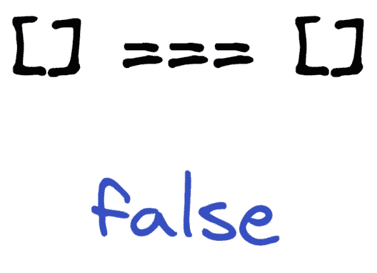

## 怎么修？

因为`useCallback`返回是一个函数，我们不能使用它。

所以，你猜怎么着？

我们需要使用另一个名为`useRef`的钩子

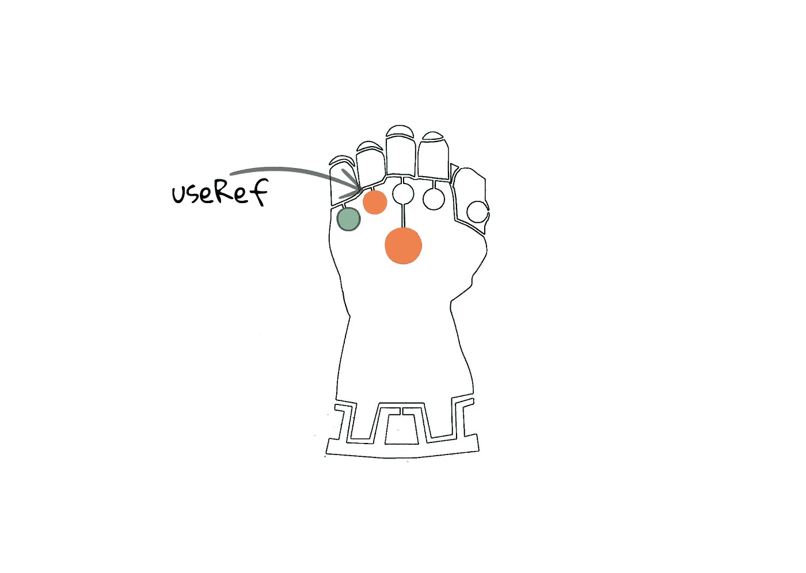

`useRef`返回一个可变对象，其中`.current`具有初始值。

# 作为依赖项的对象

你可能会猜测两个对象的浅层比较总是假的，所以`useEffect`将总是触发回调。

让我们考虑这个代码

`data`作为 useEffect 的依赖项传递

当您运行这段代码时，您的浏览器控制台将会抛出一个无限循环错误。

## 这里发生了什么事？

对象的浅层比较总是为假，所以它将触发 useEffect 的回调。

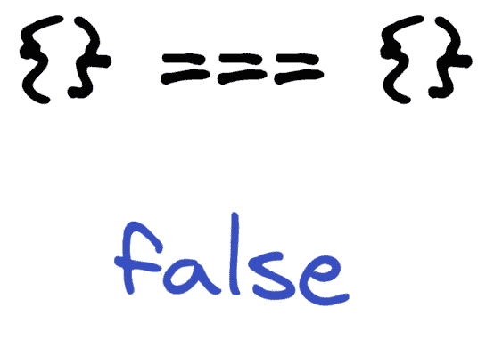

## 怎么修？

如果我们记住了依赖关系，我们就打破了无限循环。那么**怎么做呢？**

是的，我们将使用另一个名为`useMemo`的无限宝石

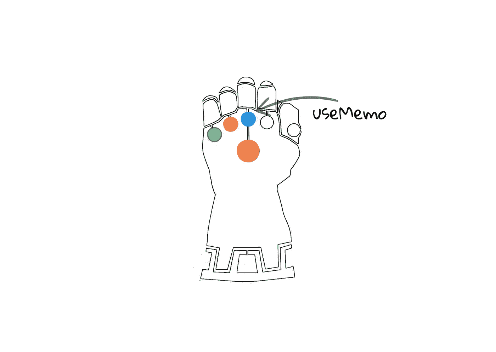

`useMemo`仅当依赖关系发生变化时，才会重新计算记忆值。

# 错误的依赖性

错误的依赖与`React`无关，甚至与`javascript`无关。当使用了错误的依赖项时，我们必须承担责任。

让我们考虑一下代码

我希望没有必要解释这个问题模式及其修复。如果你想要解释和修正，请在评论中告诉我。

> **注意:**有很多方法可以避免 React 组件内部的无限循环，我只提到了几种方法。

总是使用[eslint-plugin-react-hooks](https://www.npmjs.com/package/eslint-plugin-react-hooks#installation)或 create-react-app，它将帮助你在这些问题进入生产服务器之前发现它们。

一家公司由于无限循环，一周内损失了 72k。

 [## 我们花了 72K 美元测试 Firebase + Cloud Run，几乎破产[第 1 部分]

### 这是一个故事，讲述了我们在推出第一款产品之前是如何接近倒闭的，我们是如何生存下来的，以及…

blog.tomilkieway.com](https://blog.tomilkieway.com/72k-1/) 

所以要一直特别照顾我们的力量石(`useEffect`)。

[https://www.nerdyviews.com/2019/06/infinity-gauntlet-keychain.html](https://www.nerdyviews.com/2019/06/infinity-gauntlet-keychain.html)

另外，请看看我最近写的关于 React 的文章。

1.  [调用 API 时用 Query 代替 Fetch】](/usequery-instead-of-fetch-while-calling-an-api-ef12964457c5)
2.  [为什么在调用 API 时应该使用 useSWR 而不是 Use state](/why-you-should-use-useswr-instead-of-usestate-when-calling-apis-8b6de5dc18fc)
3.  [在 React 应用中使用 Axios 的详细指南](/a-detailed-guide-to-using-axios-in-your-react-app-7396f79fb4c2)

*更多内容请看*[***plain English . io***](http://plainenglish.io/)