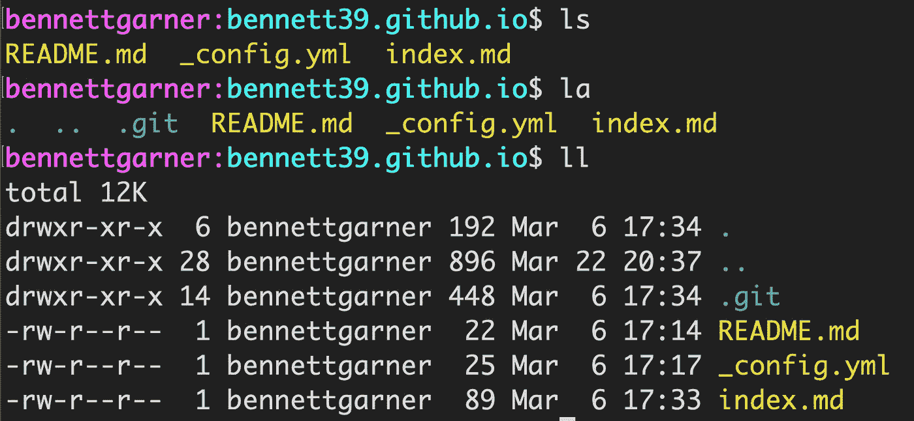

# 每个开发人员都应该使用的 5 个有用的 Bash 别名

> 原文：<https://javascript.plainenglish.io/5-useful-bash-aliases-to-make-you-more-productive-12c04b550479?source=collection_archive---------1----------------------->

## 利用别名提高工作效率


Photo by [Jan Canty](https://unsplash.com/@jancanty?utm_source=unsplash&utm_medium=referral&utm_content=creditCopyText) on [Unsplash](https://unsplash.com/s/photos/coy?utm_source=unsplash&utm_medium=referral&utm_content=creditCopyText)

我所知道的最好的开发人员都维护一个 Bash 别名列表，以使他们的生活更轻松。这是优秀开发人员的标志之一——你能在多大程度上自动化你重复做的任务？

Bash 别名也非常容易创建！在编码时减少你的时间、打字和精神能量是轻而易举的事。在这篇文章中，我将解释为什么每个开发人员都应该有一个别名列表，如何做，以及我发现的最有用的十个。

# 为什么我应该使用 Bash 别名？

Bash 别名是我作为开发人员提高工作效率的关键。Bash 别名如此有用有三个原因:

1.  他们更快。这可能是显而易见的，但输入更少可以节省时间。如果您给经常使用的命令起别名，那么这个时间会变得更长。因此，将每天多次使用的命令缩短 1-2 秒，一年下来可以节省数小时的时间。
2.  他们更容易打字。作为开发人员，您的双手和手腕是一项重要的资产。减少他们多年来必须做的工作量是一件大事。
3.  它们更容易记住。这是我最大的理由。我很难记住命令的语法，尤其是带有非直观参数的命令。对于别名，我只需设置一次命令，就可以永远使用别名。

这些可能看起来是小原因，但它们加在一起可以产生很大的影响。一旦有了几个常用命令的别名，时间、精力和能量的节省就开始复合了。

深信不疑？请继续阅读！

# 如何创建 Bash 别名？

创建别名的语法是`alias foo="< command >"`。您现在可以在命令行上尝试一下！

```
$ alias foo="echo 'I pity the foo'"
$ foo
I pity the foo
```

在这里，我为劳伦斯·特劳德的一句名言创建了一个别名。(如果你没看过洛基系列电影，那你在干嘛？！？)

不幸的是，如果我打开一个新的终端窗口或者重启我的 shell，`foo`命令就会消失！直接创建别名意味着它们只存在于当前活动的会话中。

要在每个会话上设置可预测的别名，您需要编辑`~/.bashrc`(如果您还没有创建该文件，请创建该文件)。

在`~/.bashrc`中添加一行使`foo`命令在我的所有会话中都可用:

现在用`exec bash`重新加载您的 shell，您现在应该可以在任何新的会话中使用 foo 命令了！

# 我的十大狂欢别名

以下是我认为每个人都应该包含在他们的`~/.bashrc`中的别名

## 1.递归查找文件

```
alias f='find . |grep '
```

如果我在一个复杂的目录中寻找文件`rocky.js`，我可以用`f rocky`递归地找到文件名。

## 2.找到一个旧命令

有时候你知道你需要的命令在你的历史中的某个地方，但是在哪里呢？

```
alias h='history|grep '
```

如果我不记得某个命令的语法或参数，我通常会使用`h <command_name>`搜索我上次运行它的历史记录

## 3.提交到 Git

我每天提交代码到 Git 很多次，所以减少打字真的节省了我的时间。

```
alias gc='git commit -m'
```

当我想提交代码时，它只是`gc "<commit message>"`

我还有`git push`和`git pull origin`的别名。

## 4.漂亮的列表

我一直使用`ls`来列出一个目录的内容。此时，我已经忘记了我的版本`ls`是一个别名，但是输出更容易阅读。

```
alias ls='ls -CHG --color'
```

这个命令启用颜色、列、符号链接和`ls`的其他漂亮特性。

当我需要更多细节时，我使用我的其他别名(额外别名！):

```
alias la='ls -ahG'
alias ll='ls -ahlG'
```

下面是示例目录中的输出:



## 5.制作目录

当我创建新目录时，我希望:

*   能够同时创建父目录(即给我的目标新目录一个完整的路径)
*   当我创建一个目录时得到通知，这样我就可以小心打字错误

这个别名为`mkdir`做了所有的事情:

```
alias mkdir="mkdir -pv"
```

# 那只是开始！

我们做到了！这是入门的 5 个基本 Bash 别名，但是它们可以成为更多别名的基础。

在编写代码时，请注意您最常用的命令。您是否输入了过多的内容？这可能是你下一个化名的好人选。

别名可以在命令行上改变游戏规则，所以如果这篇文章向您介绍了一些新的别名，我会很高兴！

# 喜欢你在这里读到的吗？

我免费与我的电子邮件列表分享我最好的内容。

加入我的电子邮件系列中的 500 名其他开发人员。