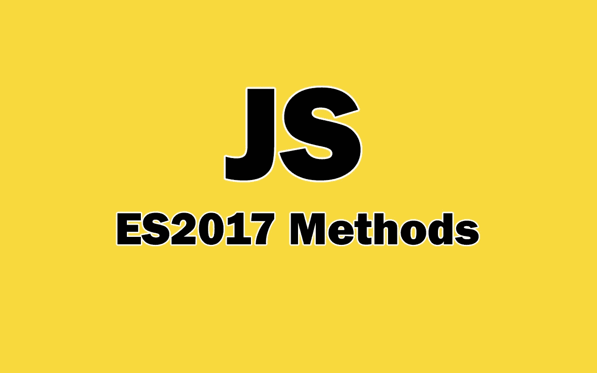

# 你应该知道的 5 个有用的 JavaScript ES2017 方法

> 原文：<https://javascript.plainenglish.io/5-useful-javascript-es2017-methods-that-you-should-know-9192d4da48db?source=collection_archive---------18----------------------->

## JavaScript ES2017 中引入的有用方法。



Image created with ❤️️ By author.

作为 JavaScript 编码人员，大多数时候我们使用语言中的内置方法来处理数组、对象、字符串等数据类型。JavaScript 有很多强大的方法，我们可以在开发中使用。这非常有用，因为这些方法帮助我们为项目编写更少的可读代码。

就在最近的 ECMAScript 版本中，JavaScript 中加入了更多的方法。ES2017 是我们拥有一些有用且强大方法的版本之一。这就是我决定在本文中讨论 ES2017 方法的原因。所以让我们开始吧。

# 1.padStart()方法

方法`padStart()`是 ES2017 中增加的小方法之一。它允许我们在字符串的开头添加字符或填充。

这个方法有两个参数:

*   *A number(必选):表示字符串添加字符或填充后的长度(要达到的字符串长度)。它应该大于要应用该方法的字符串的长度。*
*   *要添加的字符(可选):该字符将被重复添加，直到您达到所需的长度。*

让我们看一个简单的例子:

```
let str = "JavaScript";//Using only the required argument.
str.**padStart(13);** //output: "   JavaScript"//Using both arguments.
str.**padStart(15, "-")**; //output: -----JavaScript/*if you pass a length smaller than the length of "str", nothing will happen.*/
str.**padStart(6, "0")**; //output: "JavaScript"
```

如您所见，方法`padStart()`允许我们在字符串的开头添加填充和字符。你也可以用它来增加字符串的长度。

请注意，作为第一个参数传递给`padStart`的长度必须大于字符串的长度。

# 2.方法 padEnd()

ES2017 方法`padEnd()`像`padStart()`一样工作。`padEnd()`不是在字符串的开头添加填充，而是在字符串的结尾添加填充。

所以在 JavaScript 中使用方法`padEnd()`在字符串末尾添加填充和字符。它也采用与`padStart()`相同的两个参数。

下面是代码示例:

```
let str = "JavaScript";//Using only the required argument.
str.**padEnd(13);** //output: "JavaScript   "//Using both arguments.
str.**padEnd(15, "&")**; //output: JavaScript&&&&&/*if you pass a length smaller than the length of "str", nothing will happen.*/
str.**padEnd(6, "0")**; //output: "JavaScript"
```

如你所见，方法`padEnd()`与`padStart()`非常相似。唯一的区别是`padEnd()`在字符串末尾添加填充，而`padStart()`在开头添加填充。

# 3.对象值

ES2017 附带了另一个有用的对象方法，那就是方法`Object.values()`。

方法`Object.values()`将一个对象作为其参数，并返回一个包含该对象所有值的数组。

这里有一个例子:

```
const player = {
 userName: "Venom99",
 isOnline: true,
 HoursPlayed: 25,
 age: 19
}**Object.values(player)**; //output: ["Venom99", true, 25, 19]
```

如您所见，它返回一个包含所有值的数组。现在，您可以使用数组方法迭代这些值。

# 4.对象条目

另一个有用的方法是`Object.entries()`。与方法`Object.values()`类似，但它返回一个包含对象**键**和**值**的多维数组。

请看下面的例子:

```
const player = {
 userName: "Venom99",
 isOnline: true,
 HoursPlayed: 25,
 age: 19
}**Object.entries(player);** //output: [["userName", "Venom99"], ["isOnline", true], ["HoursPlayed", 25],["age", 19]]
```

如您所见，您可以从多维数组中的对象获得属性和值，您可以很容易地访问这些属性和值。

# 5.自有财产描述符

S2017 最后一个酷方法是`Object.getOwnPropertyDescriptors()`。此方法允许您获取对象属性的描述符信息。描述符只是一个元信息，它告诉我们如何使用属性。

方法将对象作为其参数。您可以查看以下示例:

```
const player = { 
 name: "John",
 age: 19
};**Object.getOwnPropertyDescriptors(**player**)**;
/*Output:
{**name**: {value: "John", writable: true, enumerable: true, configurable: true}, **age**: {value: 19, writable: true, enumerable: true, configurable: true} }
*/
```

如您所见，方法返回另一个对象，该对象包含对象中每个属性的描述符信息。

您可以在 [MDN 文档](https://developer.mozilla.org/en-US/docs/Web/JavaScript/Reference/Global_Objects/Object/getOwnPropertyDescriptor)中了解更多关于这种方法的信息。

# 最后的想法

这些都是在 ECMAScript 2017 中添加的有用方法。您肯定会遇到需要在代码中使用它们的情况。

谢谢你阅读这篇文章。我希望你发现它有用。

**进一步阅读**

[](/best-javascript-es2019-methods-that-you-should-know-380cf370c5) [## 您应该了解的最佳 JavaScript ES2019 方法

### 通过示例了解一些有用的 S2019 方法。

javascript.plainenglish.io](/best-javascript-es2019-methods-that-you-should-know-380cf370c5) [](/5-powerful-react-libraries-that-you-can-use-in-2021-496b975c7bef) [## 您可以在 2021 年使用的 5 个强大的反应库

### 对库做出反应，使开发应用程序变得更加容易

javascript.plainenglish.io](/5-powerful-react-libraries-that-you-can-use-in-2021-496b975c7bef) 

*多内容于* [***中***](http://plainenglish.io)