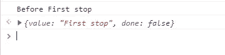
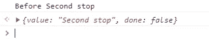
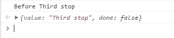

# 没有人谈论的 5 个有用的 JavaScript 特性

> 原文：<https://javascript.plainenglish.io/5-useful-javascript-features-that-nobody-is-talking-about-b630838dedba?source=collection_archive---------1----------------------->

## 你应该知道的冷门 JavaScript 特性。


Photo by [Dzmitry Dudov (Dead__Angel_)](https://unsplash.com/@dead__angel_?utm_source=medium&utm_medium=referral) on [Unsplash](https://unsplash.com?utm_source=medium&utm_medium=referral)

JavaScript 是一种非常强大的语言，尤其是在 web 开发中。你几乎可以用它做任何事情。除此之外，它还提供了许多库和框架，作为开发人员，您可以使用这些库和框架来做出令人惊叹的有用的东西。

得益于最新的 ECMAScript 版本(ES6+)，JavaScript 改进了很多。每年都有新的有用的特性被发布出来，使得开发者的开发过程更加容易。所以你需要利用这些特性。

在本文中，我们将向您展示一些您应该知道的冷门而有用的 JavaScript 特性。让我们开始吧。

# 1.样式控制台日志

我从来不知道我们可以使用 JavaScript 来设计控制台日志，但是现在我知道了。因此您可以获取控制台日志并对其应用 CSS。您只需要在控制台中想要打印的变量之前添加`%c`，然后向`console.log()`添加第二个属性，这是您想要添加到该变量的 CSS。

这里有一个例子:

```
let fullName = "John Doe";console.log(`**%c**${fullName}`, **"color: red; font-size: 20px;"**);
```

*输出:*


Capture from the console by author.

如果你想在一个`console.log`中给不同的变量添加独特的样式，你可以在每个变量前添加`%c`，给`console.log`添加其他的样式属性。

这里有一个例子:

```
let firstName = "John";let lastName = "Doe";console.log(`**%c**${firstName} **%c**${lastName}`, "**color: red; font-size: 20px;**", "**color: green; font-size: 20px;**");
```

*输出:*


Capture from the console by author.

就这样，现在您可以根据自己的需要设置控制台日志的样式，以获得更好的调试体验。

# 2.发电机功能

JavaScript 中的生成器函数与普通函数非常相似。唯一的区别是，生成器函数允许您在某一行代码处暂停函数的执行，并在以后需要时继续执行。

为了创建一个生成器函数，我们在关键字`function`后使用`*`(星号)。

```
// A generator function.
**function*** myFunction(){
 //Your code here.
}
```

这些生成器有一个名为`yield`的关键字，它允许我们停止函数的执行。还有，当你在函数中添加关键字`return`的时候，生成器就完成了。

因为生成器函数返回一个对象，所以对象中有一个名为`next()`的方法，允许您在使用`yield`停止执行后再次开始执行。

为了更好地理解，我们来看一个生成器函数的例子:

```
**function*** generatorFunc() { // Declaring the generator
 console.log('Before First stop');
  **yield** "First stop";  //Pausing the execution console.log('Before Second stop');
  **yield** "Second stop"; //Pausing the execution console.log('Before Third stop');
  **yield** "Third stop"; //Pausing the execution **return** "Generator is finished"; //finishing the generator
  **yield** "Fourth stop"; //Pausing the execution
}//Calling the generator function.
**generatorFunc();**
```

调用生成器函数将返回一个具有方法`next()`的对象，我们可以使用该方法开始执行函数中暂停的步骤。

这里有一个例子:

```
let generator = generatorFunc();
generator.**next()**;
```

*输出:*



Capture by author.

正如您所看到的，通过第一次调用方法`next()`，您将获得第一个`yield`和它之前的所有内容。你得到一个具有两个属性的对象:第一个是 value 属性，它是第一个`yield`之后的字符串，第二个是 d one 属性。

如果属性`done`被设置为`false`，这意味着生成器还没有完成。如果是`true`，表示发电机完成(done)。

让我们多次调用方法`next`:

```
generator.**next()**;
```

*输出:*



Capture by author.

```
generator.**next()**;
```

*输出:*



Capture by author.

```
generator.**next()**;
```

*输出:*


Capture by author.

现在，如果您再次调用方法`next`，您将获得一个 value 属性设置为`undefined`的对象，因为在我们在函数中使用关键字`return`之后，生成器就完成了。

所以生成器函数允许你停止一个函数的执行，并在你需要的时候使用方法`next()`继续执行。您可以从其他资源中了解关于生成器的更多信息。

# 3.可选链接

可选链接`?.`用于检查`?.`之前的值或属性是`null`还是`undefined`。如果是，则返回`undefined`。否则，它只返回值。

当您有一个包含其他嵌套对象的大对象，并且想要检查该对象上的某些属性是否可用而不出现错误时，可选链接非常有用。

这里有一个例子:

```
const user = {
  name: "John",
  age: 25,
}user.car.model; //Error.user**?.**car**?.**model; //undefined (no error).user**?.**age; //25
```

如您所见，如果您想避免错误，可选链接是很好的。

也可以配合函数使用。你只需要在括号前加上`?.`就可以了。

这里有一个例子:

```
const user = {
  name: "John",
  age: 25,
  fullName(){
   return "John Doe";
  }
}
user.**fullName?.()**; //John Doe
user.**lastName()**; //Error.
user.**lastName?.()**; //undefined(no error).
```

如果函数存在，可选链接返回正常输出。如果它不在那里，您将得到`undefined`而不是一个错误。

# 4.中的关键字

你可以使用关键字`in`来定义一个属性在一个对象中是否可用。

使用关键字后，根据属性是否存在，会得到`true`或`false`。

让我们举一个简单的例子:

```
const user = {
  name: "Mehdi",
  age: 19,
}if(**"age" in user**){
  console.log("Age is available in the user object.");
}
//Age is available in the user object.**"name" in user**; //true
**"text" in user**; //falseif("text" in user){
  console.log("text is available");
}
//undefined.
```

如你所见，关键字`in`返回一个布尔值。因此您可以很容易地检查属性是否是在对象内部定义的。

# 5.对象速记

对象速记是有用的 ES6 特性之一，我没有看到很多人谈论它。所以这个特性允许你以更简洁的方式编写对象。

让我们来看一个简单的对象:

```
const name = "Mehdi";
const age = 19;
const isOnline = true;const user = {
  name: name,
  age: age,
  isOnline: isOnline
}
console.log(user); //{name: "Mehdi", age: 19, isOnline: true}
```

我们可以使用对象速记以更简洁的方式编写上面的对象。下面是一个例子:

```
const name = "Mehdi";
const age = 19;
const isOnline = true;const user = {
  name,
  age,
  isOnline
}
console.log(user); //{name: "Mehdi", age: 19, isOnline: true}
```

正如您所看到的，当您拥有相同的键名和值名时，对象速记可以工作。如果你想写更干净的对象，这是一个很酷的特性。

# 结论

如您所见，所有这些特性在 JavaScript 中都非常有用。不幸的是，并不是所有的开发人员都在使用它们，甚至都不知道它们。这就是为什么我决定写这篇简单的文章。如果您愿意，可以从其他资源中了解更多关于这些特性的信息。

感谢您阅读这篇文章。希望你觉得有用。

**更多阅读**

[](/5-awesome-css-features-that-you-probably-dont-know-63f90e66562) [## 你可能不知道的 5 个很棒的 CSS 特性

### 每个 web 开发人员都应该知道的有用的 CSS 特性。

javascript.plainenglish.io](/5-awesome-css-features-that-you-probably-dont-know-63f90e66562) 

*还有，如果你对 JavaScript 和 web 开发相关的更有用的内容感兴趣，可以* [*订阅*](https://mehdiouss.ck.page/) *我的快讯。*