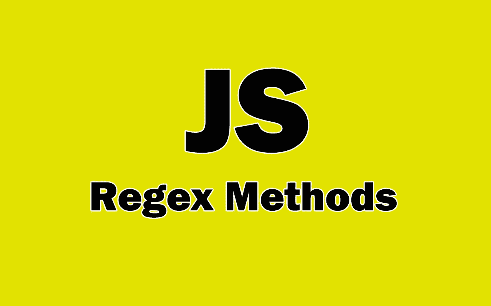

# 每个开发人员都必须知道的 5 个有用的 JavaScript Regex 方法

> 原文：<https://javascript.plainenglish.io/5-useful-javascript-regex-methods-every-developer-must-know-20ebb5993c8?source=collection_archive---------6----------------------->

## JavaScript 中必须知道的正则表达式方法列表。



Image created with ❤ ️️By the author.

JavaScript 现在非常强大。你可以用它做很多事情。手机应用，网站，网页应用，游戏，甚至一点点 AI。JavaScript 生态系统有很多库和框架，允许我们用这种语言做很多事情。

除此之外，每年我们都会看到一些新的有用的特性被添加到 JavaScript 中。感谢 ECMAScript 规范，现在我们有很多方法可以在 JavaScript 中使用不同的数据类型。这些方法允许开发人员轻松地工作和操作数据类型。

因此，在本文中，我们将介绍一些可以在 JavaScript 中使用 Regex 的必备方法。让我们开始吧。

# 1.方法匹配

方法`match()`用于字符串，检查字符串和正则表达式(regex)之间的匹配。它将正则表达式作为其参数。

*语法:*

```
str.match(regex);
```

方法`match()`返回以下 3 个可能值之一:

*   如果正则表达式包含一个标志`g`，它将返回一个包含所有匹配项的数组，但不包含细节。
*   如果正则表达式没有标志`g`，它返回一个包含第一个匹配细节的数组。
*   如果完全没有匹配，它返回`null`。

以下是一些例子:

```
const text = 'Hello World';
const regex = /[A-Z]/g; //Capital letters regex.console.log(text.**match(regex)**); //output: array ["H", "W"]
```

无标志`g`:

```
const text = 'Hello World';
const regex = **/[A-Z]/**; //Capital letters regex.console.log(text.**match(regex)**); // output: array ["H"]
```

当没有匹配时:

```
const text = 'hello world';
const regex = /[A-Z]/g; //Capital letters regex.console.log(text.**match(regex)**); // output: null
```

如果你不熟悉正则表达式。你可以看看我下面的文章:

[](/understanding-regular-expressions-in-javascript-36f86bfc756) [## 理解 JavaScript 中的正则表达式

### 通过实际例子学习 JavaScript 正则表达式

javascript.plainenglish.io](/understanding-regular-expressions-in-javascript-36f86bfc756) 

# 2.方法测试

方法`test()`允许我们测试指定的字符串和正则表达式之间是否匹配。它将一个字符串作为其参数，并根据是否匹配返回`true`或`false`。

假设我们想要查找单词`awesome`在下面的字符串`str`中是否可用。我们可以很容易地为单词创建一个正则表达式，并测试该正则表达式和字符串`str`之间是否匹配。

下面是一个例子:

```
const str = "JavaScript is awesome";
const regex = **/awesome/**;**regex.test(str)**; //returns true
```

这是另一个没有匹配的地方:

```
const str = "JavaScript is awesome";
const regex = **/html/**;**regex.test(str)**; //returns false
```

# 3.方法搜索

方法`search()`是一个字符串方法，我们可以在正则表达式中使用它。您可以将正则表达式作为参数传递给它，以便在字符串中搜索匹配项。

该方法返回第一个匹配的位置(索引),如果没有匹配，则返回-1。

这里有一个例子:

```
const str = "JavaScript is awesome";
const regex = **/awesome/**;str.**search(regex)**; //returns 14
```

如果没有匹配:

```
const str = "JavaScript is awesome";
const regex = **/hello/**;str.**search(regex)**; //returns -1
```

# 4.替换方法

方法`replace()`允许我们在字符串中搜索指定的值或正则表达式，并用另一个值替换它。该方法接受两个参数:

1.  要搜索的值。
2.  要替换的新值。

因此该方法返回一个包含新替换值的新字符串。但是请记住，它不会改变原来的字符串。

这里有一个例子:

```
const str = "JavaScript is awesome";
const regex = **/awesome/**;str.**replace(regex, "powerful")**; //returns "JavaScript is powerful"
```

# 5.方法 replaceAll

方法`replaceAll()`类似于方法`replace()`，但是它允许我们替换字符串中所有匹配的值或正则表达式。

它接受两个参数:

1.  要搜索的值。
2.  要替换的新值。

它返回一个包含所有新值的新字符串，但不改变原始字符串。

这里有一个例子:

```
const str = "JavaScript is awesome. JavaScript has many features";
const regex = **/JavaScript/g**;str.**replaceAll(regex, "Python")**;
//returns "Python is awesome. Python has many features"
```

# 结论

正如您在上面的列表中看到的，这些是您可以使用正则表达式的一些基本方法。它们非常有用，如果你正在使用 JavaScript，你一定要了解和学习更多。

所以感谢你阅读这篇文章。希望你觉得有用。

**更多阅读:**

[](/7-awesome-react-ui-libraries-for-all-frontend-developers-c7d45b7cecad) [## 面向所有前端开发人员的 7 个非常棒的 React UI 库

### 可以在 React 中使用的有用 UI 组件库的列表。

javascript.plainenglish.io](/7-awesome-react-ui-libraries-for-all-frontend-developers-c7d45b7cecad) [](/10-awesome-front-end-development-tools-to-boost-your-productivity-b1d2efc4c4ba) [## 10 个令人敬畏的前端开发工具来提高您的生产力

### 你可能需要用到的有用的前端开发工具。

javascript.plainenglish.io](/10-awesome-front-end-development-tools-to-boost-your-productivity-b1d2efc4c4ba) 

*更多内容请看*[***plain English . io***](http://plainenglish.io/)