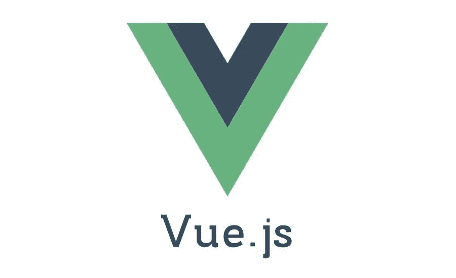

# 启动 Vue.js 开发之旅的 5 个有用资源。

> 原文：<https://javascript.plainenglish.io/5-useful-resources-to-kick-start-your-vue-js-development-journey-98336b8dcb8f?source=collection_archive---------15----------------------->

## 利用这些资源掌握 Vue.js。

image from Author

Vue.js 相当受欢迎，并且在谈到框架时被谈论了很长时间。

Vue.js 功能强大，几乎可以用它构建任何 web 应用。动手实践并学习 Vue.js 的核心概念对于深入理解框架如何工作至关重要。

Vue 3 中组合 API 的引入改进了 Vue.js 应用程序和代码的结构。

在本文中，我们将查看一些资源，帮助您从头开始使用 Vue.js 开发优秀的应用程序。

## **Vue.js 文档**

文档是阐明任何框架和技术基础的极好来源。Vue.js 的文档非常好地指导你开始用 Vue.js 编码。

从安装 CLI 到配置 Vue.js 应用程序，对 Vue.js 的总体要求及其核心原则有一个初步的了解是非常重要的。

另一方面，Vue.js 文档是开源的，这意味着它会随着新事物的加入而不断变化，任何人都可以很快从中学习。

更好地理解和阅读文档可以为您节省大量时间，否则您可能会浪费时间寻找解决方案。

Vue.js 文档是帮助您开始使用第一个 Vue.js 应用程序的所有资料，并且在揭示使用 Vue.js 时的最佳实践方面非常有用。

查看 Vue.js 官方文档[这里](https://vuejs.org)。

## **牛逼 Vue**

这包括一个 GitHub 库，里面有用 Vue.js 构建的所有令人惊奇的东西。

该存储库中包含的资源包括

*   用 Vue.js 构建的项目
*   Vue.js 上的组件和库
*   结构
*   UI 实用程序
*   课程
*   开发工具
*   运行时间

这个列表包括一些构建在 Vue.js 之上的东西。

要获得完整的资源列表，请访问此[链接](https://github.com/vuejs/awesome-vue.)。

## **Vueschool**

Vueschool 是一个令人惊叹的在线课程平台，只针对 Vue.js 及其生态系统的主题。

平台上的课程教师是最好的，因为他们由 Vue.js 核心团队中致力于维护框架的人组成。

通过 vueschool，您可以从核心团队成员和行业专家那里学习 Vue.js 和现代前沿技术，以及他们的高级教程和视频课程。

Vueschool 的目标是成为所有技能水平的 Vue.js 知识的头号来源。他们通过超赞的视频课程以低得离谱的价格提供我们行业领导者的知识。

要访问 Vueschool，请查看此[链接](https://vueschool.io)。

## **Nuxt.js 文档**

根据 Nuxt.js 文档，这个直观的 Vue 框架帮助您满怀信心地构建下一个 Vue.js 应用程序。这是一个开源框架，使 web 开发变得简单而强大。

Nuxt.js 完全建立在 Vue.js 之上，尊重 Vue.js 的核心原则，它有一些开箱即用的惊人特性。

Nuxt.js 附带的一些特性包括:

*   静态呈现和服务器端呈现之间的选择
*   动态页面
*   更好的资产管理
*   SEO 改进

查看 Nuxt.js 文档页面[这里](https://nuxtjs.org)。

## **精通 Vue**

根据 Vue mastery 的说法，它是 Vue 开发者的终极学习资源。

就像 vueschool 一样，是一个主要关注 Vue.js 的课程平台，他们的指导老师大多是帮助维护 Vue.js 的核心团队成员。

点击查看平台[。](https://www.vuemastery.com)

## **出发前**

简单回顾一下，我们已经看到了启动 Vue.js 开发之旅的一些最有用的资源。

感谢您阅读本文到目前为止；希望对你有帮助。请在评论区告诉我，不要犹豫分享。

## **更多阅读:**

 [## 每个前端开发人员需要知道的 3 个设计概念

### 面向每个前端开发人员的设计理念。

javascript.plainenglish.io](/3-design-concepts-every-front-end-developer-needs-to-know-fccb072e675c)  [## 如何保持编码梦想的活力

### 作为开发人员保持专注。

javascript.plainenglish.io](/how-to-keep-the-coding-dream-alive-eefc6d84e987) 

*更多内容请看*[*plain English . io*](http://plainenglish.io/)