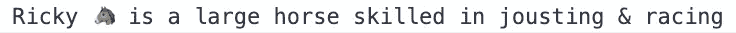
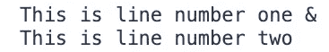
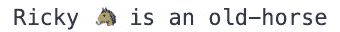

# Javascript 中使用模板文字的 5 种不同方式

> 原文：<https://javascript.plainenglish.io/5-useful-things-you-can-do-with-template-literals-in-javascript-cae8e6df836f?source=collection_archive---------10----------------------->

## 改进 JavaScript 中处理字符串的方式


Photo by [Nathan da Silva](https://unsplash.com/@silvawebdesigns?utm_source=medium&utm_medium=referral) on [Unsplash](https://unsplash.com?utm_source=medium&utm_medium=referral)

模板文字使得在 JavaScript 中构建和处理字符串变得更加容易，因为它允许我们做很多事情，例如:

*   字符串插值
*   嵌入式表达式
*   多行字符串
*   嵌套模板
*   标记文字

现在，让我们详细讨论每一个问题。

## 1.字符串插值

模板文字是使用```而不是`“`或`‘`构造的字符串。
要在字符串中使用占位符，您可以使用`${}`添加它们。

这使得它更容易阅读，并且在构建字符串时，您不必担心空格，这与字符串连接不同。


Output for String Interpolation

## 2.嵌入式表达式

要在模板文字中使用嵌入式表达式，您需要使用`${}`来添加它们。这样做，它使替换更容易使用，更少混淆。

**例一**


Output for Embedded Expression (example one)

**例二**



Output for Embedded Expression (example two)

## 3.多行字符串

为了使用模板文字创建多行字符串，您需要将```中的内容本身创建为多行。



Output for Multiline strings

## 4.嵌套模板

为了基于条件检查构造一个字符串，您需要在`${}`中包含条件块来形成它。

如果条件中有一个公共子字符串，也可以将其取出，如示例所示。



Output for Nesting templates

## 5.标记模板

标记模板是模板文字的更高级形式。

您可以将一个参数作为模板文字传递给一个函数进行解析，就像这样。

*   传递给函数的模板的静态部分被分配给第一个参数。它被认为是一个字符串数组，由变量或表达式(如果有的话)分割。
*   传递的模板中的变量/表达式被分配给该函数的其余参数，其顺序与它们出现的顺序相同。

模板以不同的方式传递给函数。不使用`()`，您可以将模板放在```本身中，紧挨着函数名。

你可以通过下面的例子更好地理解这一点。


Output for the Tagged templates

传递的模板中的所有静态内容都作为由`horse.age` 变量分割的字符串数组分配给`str`参数。`horse.age`和`horse.skills.join(“ & “)`按顺序分配给`age`和`skill`自变量。

## 结论

这些是在 JavaScript 中使用模板文字可以做的不同事情的列表

我希望你喜欢这篇文章，感谢阅读！