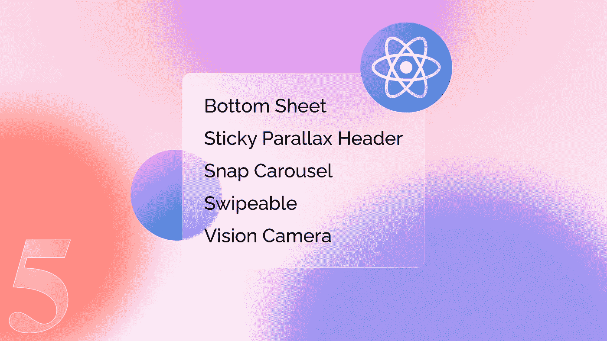
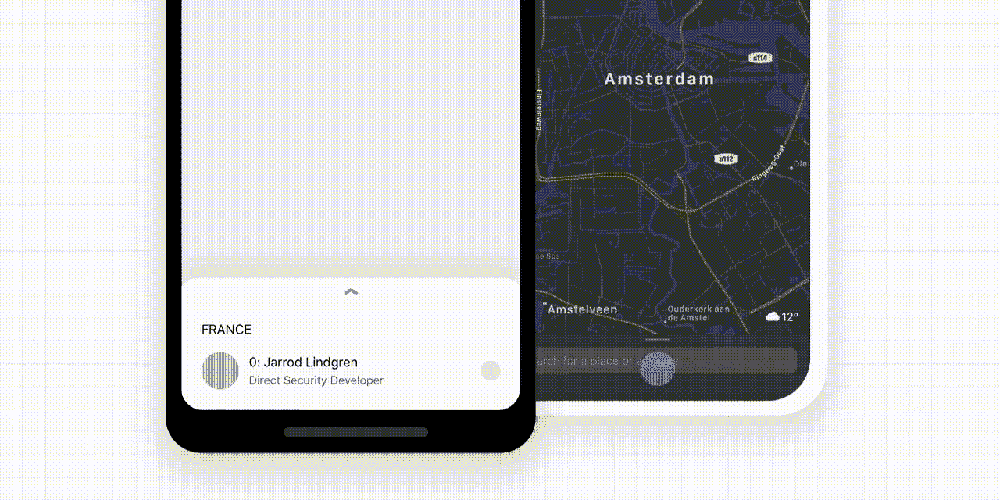
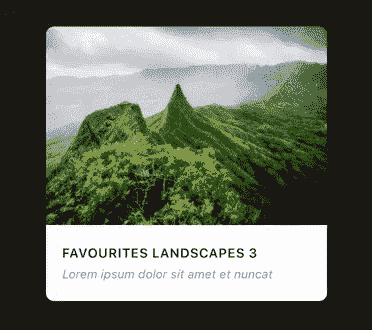
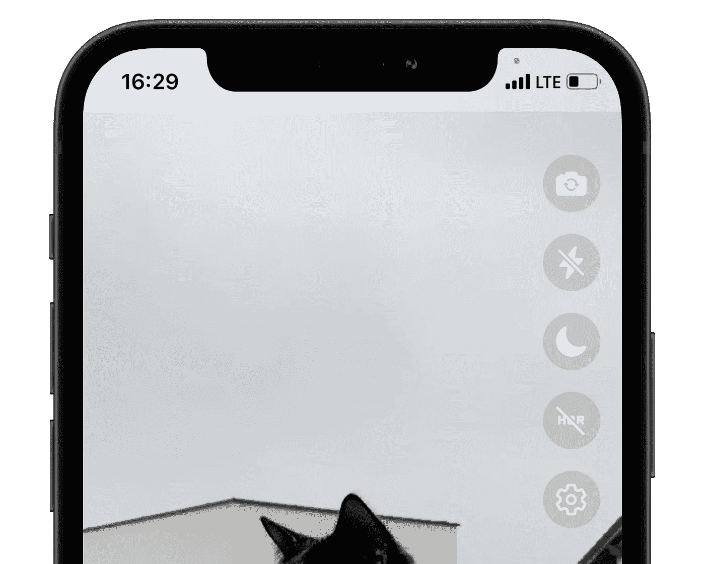

# 5 个对 React 本地开发人员有用的用户界面库

> 原文：<https://javascript.plainenglish.io/5-useful-user-interface-libraries-for-react-native-developers-d74e99f67da1?source=collection_archive---------1----------------------->

## 利用用户体验的独特用户界面库

Cover picture designed by the author

用户界面库是可重用的构建模块，经过良好的测试、维护，并由开发人员用来实现特定的功能需求。在这里，我们将深入研究五种不同类型的库，它们被 React 本地社区广泛用于开发优雅的用户界面。

提到的库目前支持 Android、iOS 和 Expo 平台。此外，我在这里建议了一些替代库。尽管替代库不如主要突出显示的库那样强大，但它们也是可用的替代库。

# 1.底部薄板

底部表单库提供了一个具有无缝键盘操作的高性能底部表单。它有一个复制的 FlatList、SectionList、ScrollView、View & Text 字段作为自己的组件，在与底部工作表一起使用时提供一个响应性的用户界面。挂钩可用于扩展、关闭和对板材进行其他配置。这个组件是高度可定制和易于使用的。

The GIF is taken from the React Native Bottom Sheet [documentation](https://gorhom.github.io/react-native-bottom-sheet)

**附加功能:** Slick Sheet 使用 Reanimated v2，支持 React 导航集成，存在*底部 Sheet 模态*，支持打字稿

**替代:** [反应原生的再生底片](https://github.com/osdnk/react-native-reanimated-bottom-sheet)

 [## GitHub-gor hom/react-native-bottom-sheet:一个高性能的交互式底层表单，具有完整的…

### 具有完全可配置选项的高性能交互式底板🚀模态展示视图，底部工作表模态…

github.com](https://github.com/gorhom/react-native-bottom-sheet)  [## 入门| React 本机底部表单

### React 本机手势处理程序需要额外的步骤来完成其安装，请按照他们的安装…

gorhom.github.io](https://gorhom.github.io/react-native-bottom-sheet) 

# 2.粘性视差标题

粘性视差标题库支持创建完全可定制的标题。它有三种不同的标题类型，如 TabbedHeader、DetailsHeader 和 AvatarHeader。但也可以根据我们的要求大量定制。

The PNG is taken from the Sticky Parallax Header [Github](https://github.com/netguru/sticky-parallax-header)

**附加功能:**动画标题，可滚动标题，可定制标题，支持打字

 [## GitHub-net guru/sticky-parallax-header:一个简单的 React 原生库，能够创建一个完整的

### 一个简单的 React 原生库，能够为您的 iOS 和 Android 应用程序创建完全自定义的标题。- GitHub …

github.com](https://github.com/netguru/sticky-parallax-header) 

# 3.快速旋转木马

Snap Carousel library 将开发一个刷卡器，它可以处理大量的项目，而不会降低性能。它有三种不同的布局，如 default、stack 和 tinder，以呈现优雅的转盘卡来满足一系列要求。

The GIF is taken from the Snap Carousel [Github](https://github.com/meliorence/react-native-snap-carousel)

**额外待遇:**动画转盘卡，垂直和水平转盘，视差转盘，分页转盘，支持打字稿

**替代:** [反应原生卡组刷机](https://github.com/alexbrillant/react-native-deck-swiper)

 [## GitHub-meliorence/React-Native-snap-carousel:React Native 的 Swiper/carousel 组件…

### React Native 的 Swiper/carousel 组件，具有预览、多种布局、视差图像、性能处理…

github.com](https://github.com/meliorence/react-native-snap-carousel) 

# 4.可从手势处理程序中切换

手势处理程序库提供本地驱动的手势管理来开发基于触摸的应用程序。手势处理器在所有的项目中使用最多。所以从已经安装的库中使用 swipeable 很容易。Swipeable 允许在可平移的容器中实现可平移的行，该容器允许左右水平滑动。动作容器将根据水平滑动方向显示。

The GIF is taken from [dribble](https://dribbble.com/shots/15471187-Animated-Swipe-Icons-in-Gmail)

**额外待遇:**动画可滑动，允许许多动作容器，支持打字稿

**备选:** [React 原生刷卡列表视图](https://github.com/jemise111/react-native-swipe-list-view)

 [## GitHub-software-mansion/react-native-gesture-handler:公开平台原生的声明式 API

### React 本机手势处理程序提供本机驱动的手势管理 API，用于构建最佳的基于触摸的…

github.com](https://github.com/software-mansion/react-native-gesture-handler)  [## Swipeable | React 本机手势处理程序

### 该组件允许实现可切换行或类似的交互。它把它的孩子放在一个盘子里…

docs.swmansion.com](https://docs.swmansion.com/react-native-gesture-handler/docs/api/components/swipeable) 

# 5.视觉照相机

视觉相机库能够捕捉照片、视频和快照。FPS 是可定制的。HDR 和夜间模式可用。能够使用帧处理器执行二维码扫描、面部识别、人工智能对象检测、实时视频聊天和许多其他任务。拥有比任何其他相机库更多的额外功能。

The PNG is taken from the React Native Vision Camera [documentation](https://mrousavy.github.io/react-native-vision-camera/docs/guides/lifecycle)

**附加功能:**使用 Reanimated v2 进行平滑缩放，使用鱼眼镜头进行平滑缩放，支持帧处理器和类型脚本

**替代:** [反应原生相机](https://github.com/react-native-camera/react-native-camera)

 [## GitHub-mrousavy/react-native-vision-camera:📸看到视觉的相机库。

### 照片、视频和快照捕捉可定制的设备和多摄像头(平滑缩小至“鱼眼”摄像头)…

github.com](https://github.com/mrousavy/react-native-vision-camera)  [## 来自 VisionCamera | VisionCamera 的问候

### 📸看到视觉的相机库。VisionCamera 的设计初衷是提供所有功能和…

mrousavy.github.io](https://mrousavy.github.io/react-native-vision-camera) 

# 结论

尝试这些非常有用的库来增强 React 本地应用程序的用户体验。我确信这些易于使用且记录良好的库不会让您失望。

感谢您阅读文章。

**看看这个**👇

 [## 如何为您 2021 年的下一个反应本地项目选择最佳库

### 您搜索最佳 React Native 库的指南。

javascript.plainenglish.io](/how-to-choose-the-best-library-for-your-next-react-native-project-in-2021-44a12ef4ca17) 

*多内容于* [***浅显易懂***](http://plainenglish.io)