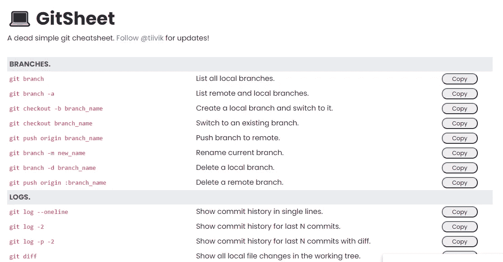
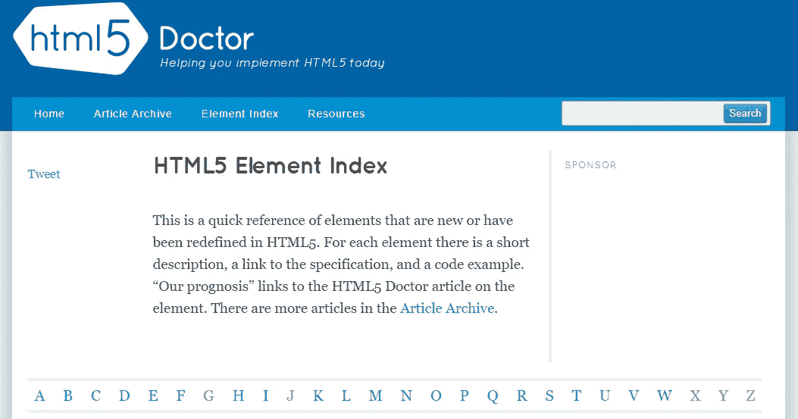
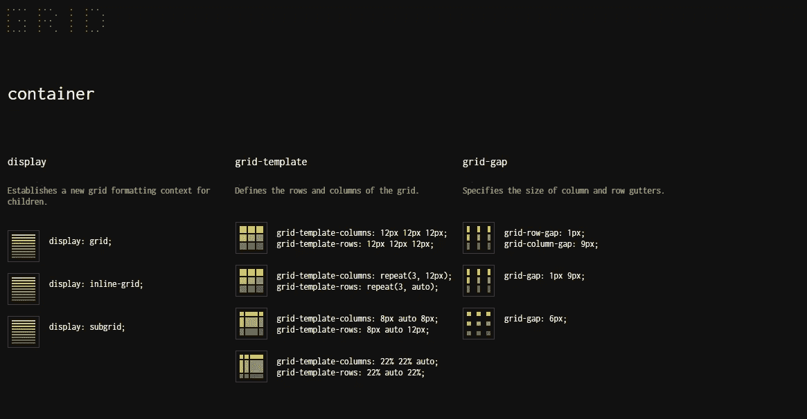
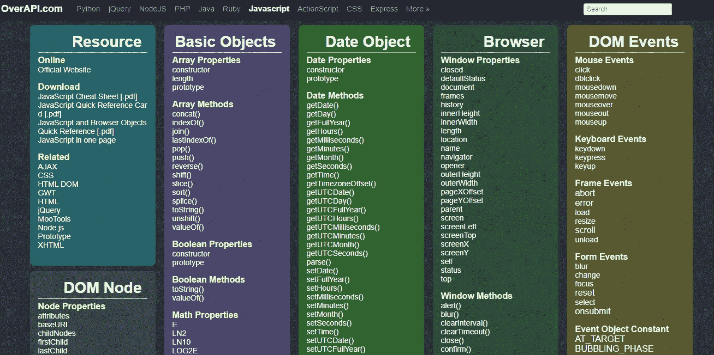
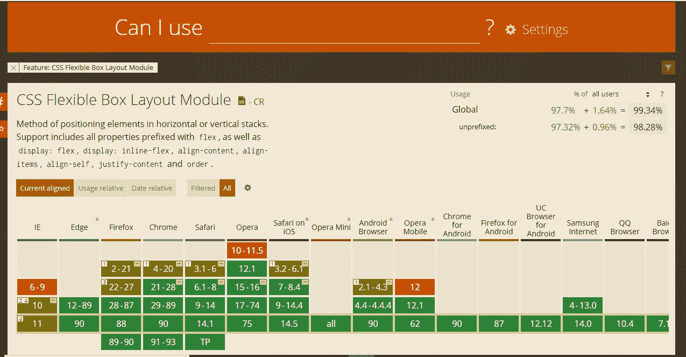

# 对所有网站开发者有用的 5 个网站备忘单

> 原文：<https://javascript.plainenglish.io/5-useful-website-cheatsheets-for-all-web-developers-70290340385?source=collection_archive---------10----------------------->

## 面向所有网站开发者的超赞网站备忘单。

Photo by [Kelly Sikkema](https://unsplash.com/@kellysikkema?utm_source=medium&utm_medium=referral) on [Unsplash](https://unsplash.com?utm_source=medium&utm_medium=referral)

众所周知，科技行业正在发生巨大的变化。似乎每个月我们都有新技术要学习。尤其是 web 开发，有很多技术和工具需要你去学习。很难跟上并记住所有的概念和基本原理。

幸运的是，我们有小抄网站，可以用来轻松更新我们的知识，快速了解我们需要的东西。因此，这些网站可以帮助你轻松找到你想在开发过程中使用的知识。

在这篇文章中，我会给你一些有用的网站清单，你可能需要使用。让我们开始吧。

# 1.GitSheet

GitSheet 是一个非常有用的备忘单网站，它收集了我们在开发中经常使用的重要 Git 命令。

它们描述了所有命令的用法。除此之外，您可以将 Git 命令复制到剪贴板，以便在您的项目中使用它们。

Capture by the author from [GitSheet](https://gitsheet.wtf/).

# 2.HTML5 元素索引

[HTML5 元素索引](http://html5doctor.com/element-index/)是一个引用 HTML5 版本中所有新元素的网站。所有的元素都是按字母顺序排列的，它们为您提供了每个元素的描述、链接和代码示例。

通过这个网站，你可以了解一些你以前可能从未听说过的 HTML5 标签。这是一个很好的资源。

Capture by the author from [HTML5 element index](http://html5doctor.com/element-index/).

# 3.格子

[Grid](https://grid.malven.co/) 是一个非常有用的备忘单网站，在那里你可以找到重要的 CSS 网格属性和例子，你可以用在你的项目中。

对于每个示例，您可以复制 CSS 网格代码并将其添加到项目中。

Capture by the author from [Grid](https://grid.malven.co/).

# 4.OverAPI

OverAPI 是一个流行的网站，包含许多编程语言和 web 开发技术的备忘单。对于 web 开发人员来说，这是一个非常棒的资源。

Capture by the author from [OverAPI](https://overapi.com/).

# 5.我能用吗？

[我可以使用](https://caniuse.com/)是一个非常受欢迎的网站，您可以在那里检查浏览器对前端技术的支持。你可以搜索任何功能，他们会告诉你不同的浏览器版本是否支持它。

Capture by the author from [Can I Use](https://caniuse.com/).

# 结论

这是 5 个非常棒的网站备忘单，作为一个网站开发者，你可以从中受益。他们给你一个简单的方法来找到你发展所需要的知识。

感谢您阅读这篇文章。希望你觉得有用。

**更多阅读**

 [## 你应该知道的最好的 JavaScript ES2019 方法

### 通过示例了解一些有用的 ES2019 方法。

javascript.plainenglish.io](/best-javascript-es2019-methods-that-you-should-know-380cf370c5) 

*更多内容看*[***plain English . io***](http://plainenglish.io)