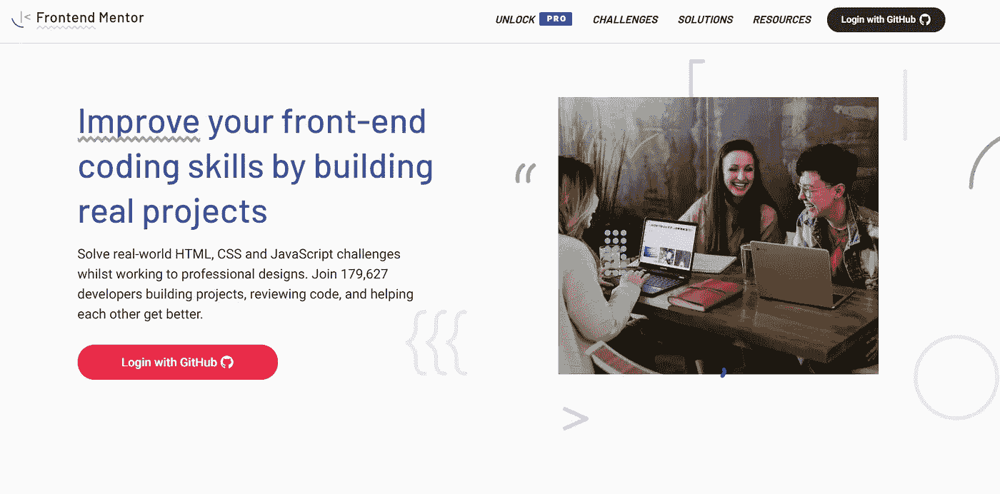
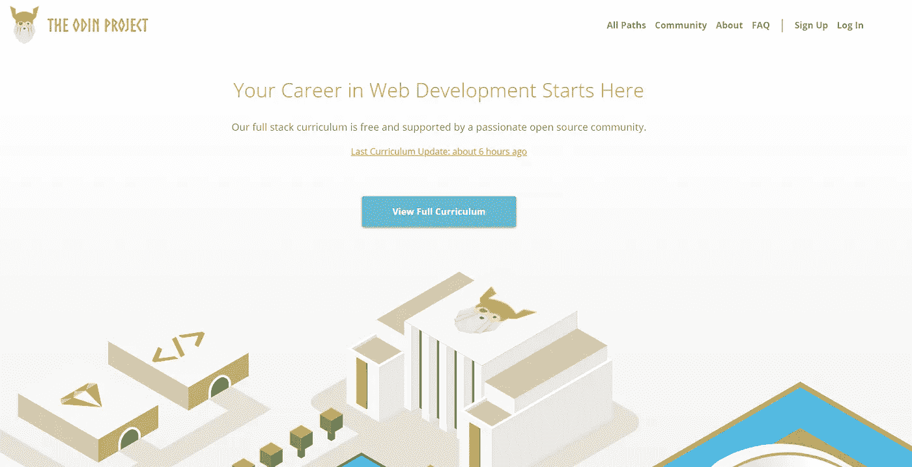
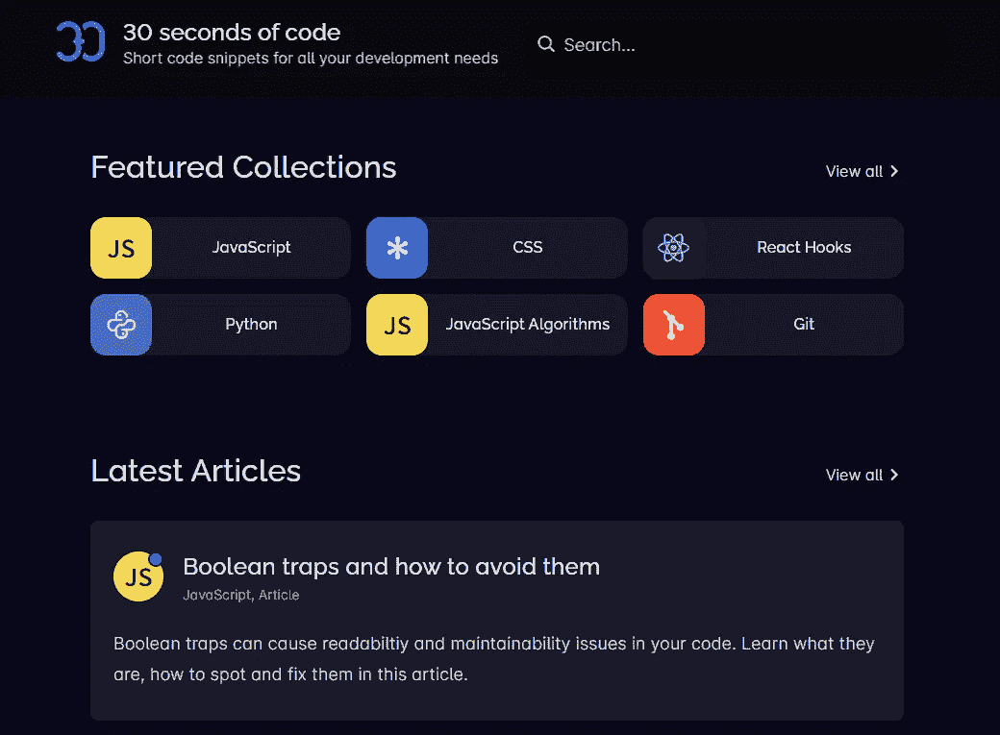
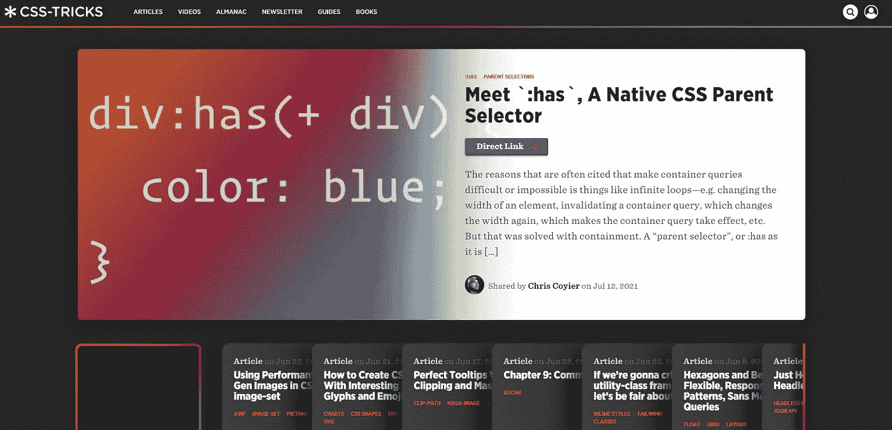
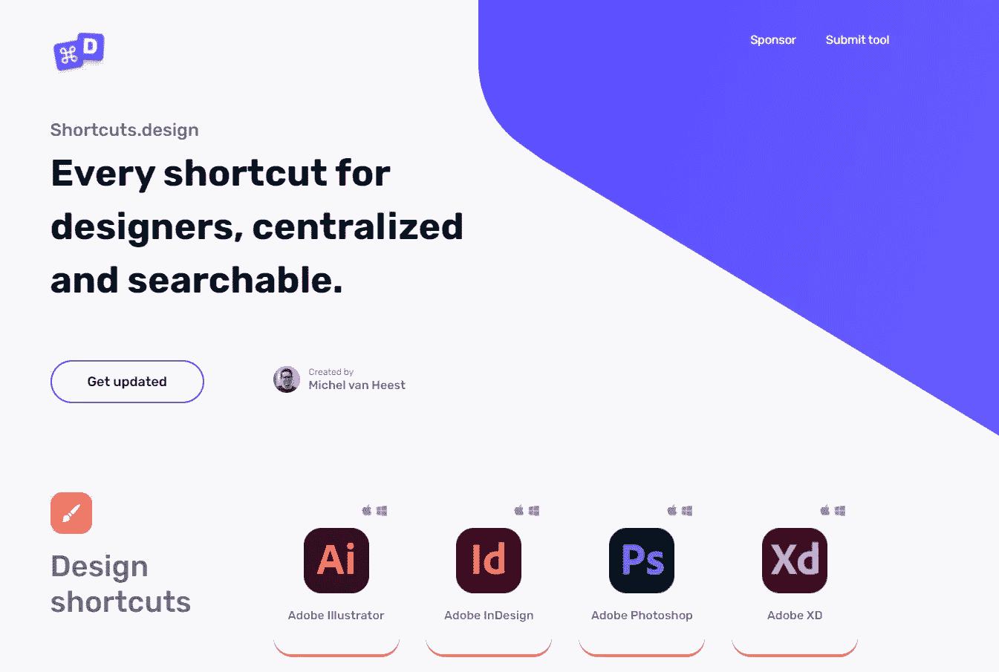

# 如果您是前端开发人员，您需要查看这些网站

> 原文：<https://javascript.plainenglish.io/5-useful-website-for-front-end-devs-a22f515694bc?source=collection_archive---------18----------------------->

## 书签，并使用这 5 个关键网站来调整您的前端技能。

By Canva

您想调整您的前端技能吗？您想成为前端开发人员吗？或者您已经是一名前端开发人员，希望在每天的工作中做得更好？

> 那么这些资源是给你的！

# 1.前端导师

> ⭐是获取反馈和调整前端技能的绝佳资源。

*   通过构建真正的项目来提高您的前端技能。
*   在进行专业设计的同时，解决现实世界中的 HTML、CSS 和 JavaScript 挑战。

 [## 前端导师|使用真实工作流程的前端编码挑战

### 在致力于专业设计的同时，解决现实世界中的 HTML、CSS 和 JavaScript 挑战。加入 179，586 名开发人员…

www.frontendmentor.io](https://www.frontendmentor.io/) 

Frontend Mentor

# 2.Theodinproject

> ⭐向有经验的网络开发者学习。

*   让有抱负的网络开发人员能够一起学习。
*   作为一名程序员，如何最好地寻求和接受帮助。
*   专为任何想从事网络开发、自由职业、创业或为自己设计主页的人设计。

 [## 您的网络开发生涯从这里开始

### 这是我们希望自己学习时拥有的网站。我们在互联网上搜寻最好的…

www.theodinproject.com](https://www.theodinproject.com/) 

The Odin project

# 3.30 秒的代码

> ⭐神奇的编码和练习资源。

*   为所有技能水平的开发人员提供高质量的学习资源
*   1034 个简短的代码片段，适用于 CSS、JavaScript、Python、JavaScript 算法和 reaction。
*   一套精选的常见面试问题，帮助您为下一次面试做准备。

 [## 30 秒的代码

### 30 秒的代码使用 cookies 来提供高质量的用户体验，并收集匿名数据用于统计…

www.30secondsofcode.org](https://www.30secondsofcode.org/) 

30 seconds of code

# 4.CSS 小技巧

> ⭐是 CSS 相关主题、小窍门和问题的绝佳资源。

*   关于 **CSS** 、HTML、JavaScript 以及所有与网页设计和开发相关的日常文章。
*   网格-功能区 CSS 网格初学者布局完整指南。
*   供网络开发人员使用的代码片段集合。
*   网格、书籍等的完整指南。

 [## CSS-小窍门

### 直接链接经常被引用的使容器查询变得困难或不可能的原因是…

css-tricks.com](https://css-tricks.com/) 

CSS-tricks

# 5.快捷方式设计

> ⭐是设计和设计师的绝佳资源。

*   面向设计师的资源。
*   设计师的终极快捷参考。
*   使用您最喜欢的工具(如 Figma 和 Windows 等)的所有快捷方式为您的工作流程充电。

 [## 设计师的每一个快捷方式，集中和可搜索

### 帮助:使用推特、电子邮件或 GitHub，随意请求缺失的工具或给出一些反馈！如果你能…

快捷方式.设计](https://shortcuts.design/) 

Shortcuts design

# 最后的想法…

在本文中，我没有提到其他令人惊奇的资源，因为它们已经为人所知并且很有名，比如 CodePen、StackOverflow、MDN web docs。

## 谢谢你宝贵的时间，希望这对你有用！

亲爱的读者，我希望这是明确和有用的。我希望你无论在哪里都很安全，你的家人也是！坚持住。明天会更好！

**让我们在** [**上取得联系**](https://medium.com/@famzil/)**[**Linkedin**](https://www.linkedin.com/in/fatima-amzil-9031ba95/)**[**脸书**](https://www.facebook.com/The-Front-End-World)**[**insta gram**](https://www.instagram.com/the_frontend_world/)**[**Youtube**](https://www.youtube.com/channel/UCaxr-f9r6P1u7Y7SKFHi12g)**或**********

******[www.fam-front.com](http://www.fam-front.com/)******

*******更多内容请看*[***plain English . io***](http://plainenglish.io/)******