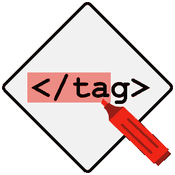
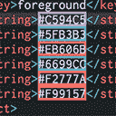

# 面向 React 本地开发人员的 5 个 Visual Studio 代码扩展

> 原文：<https://javascript.plainenglish.io/5-vs-code-extensions-for-react-native-developers-7659cffaca12?source=collection_archive---------4----------------------->

使用 React Native 提高您的工作效率

## 1.VS 代码反应折射

这个扩展对 **React** 和 **React Native** 都有效，特别是如果你用 React Native 写 *JSX* ，这个扩展通过它的重构特性帮了大忙。对于 ***打字稿*** 和 ***TSX*** 也是如此。很多时候，开发人员在 React Native 中面临着长组件的问题，使用这个扩展，您可以轻松地提取那些大组件并使用它们，而不会失去任何信心。

*   与 React Hooks API 兼容。
*   处理键属性和函数绑定。
*   使用类、函数和箭头函数。

## 2.突出显示匹配的标签

每当你想在 **React Native** 组件中查看结束和开始标签时(尤其是在更大的组件中)，找到正确的标签会花费很多时间。有时，我们也会因为这个问题而修改错误的标签。这个扩展在这些情况下是完美的，你只需要将鼠标悬停在一个组件上，然后**关闭/打开**标签就会自动高亮显示。

## 3.自动重命名标签

然而，我们在 VSCode 中有多光标编辑，但不是每次我们想向下滚动找到匹配的*标签*来重命名它。在这种情况下，这个扩展非常有效，你只需要重命名一个组件，它就会自动重命名另一个**关闭/打开**标签。

## 4.彩色高光

有时，React 应用程序的前端开始填充多种不同的颜色，此时颜色的实际外观变得非常混乱，尽管我们可以通过悬停在十六进制颜色代码上来查看这些颜色，但当我们有多种不同不透明度的颜色时，就会变得混乱。颜色高亮以一种很好的方式完成这项工作，因为您将能够看到十六进制值周围的所有颜色。

## 5.风筝

我们的最后一个是自动完成扩展，它为我个人节省了很多时间。因为它会跟踪您键入最多的代码，然后给出自动完成建议，这真的很有帮助，因为您不会得到任何无用和不相关的代码完成建议。

 [## 让你成为前端忍者的 6 个 UI 概念

### 构建具有出色 UI 的应用程序的基本概念

javascript.plainenglish.io](/6-ui-concepts-that-makes-you-a-frontend-ninja-c6c0a29fa954)  [## 作为前端开发人员，你应该知道的 3 个 CSS 特性

### 了解 CSS 鲜为人知的特性

javascript.plainenglish.io](/3-css-features-you-should-know-as-frontend-developer-f1b5536bf179)  [## 作为开发人员，您应该知道的 11 个 VS 代码特性和技巧

### 对 VS 代码更加自信

javascript.plainenglish.io](/11-vs-code-features-tricks-you-should-know-as-a-developer-47e5ec0c362b) 

*更多内容请看*[*plain English . io*](http://plainenglish.io/)