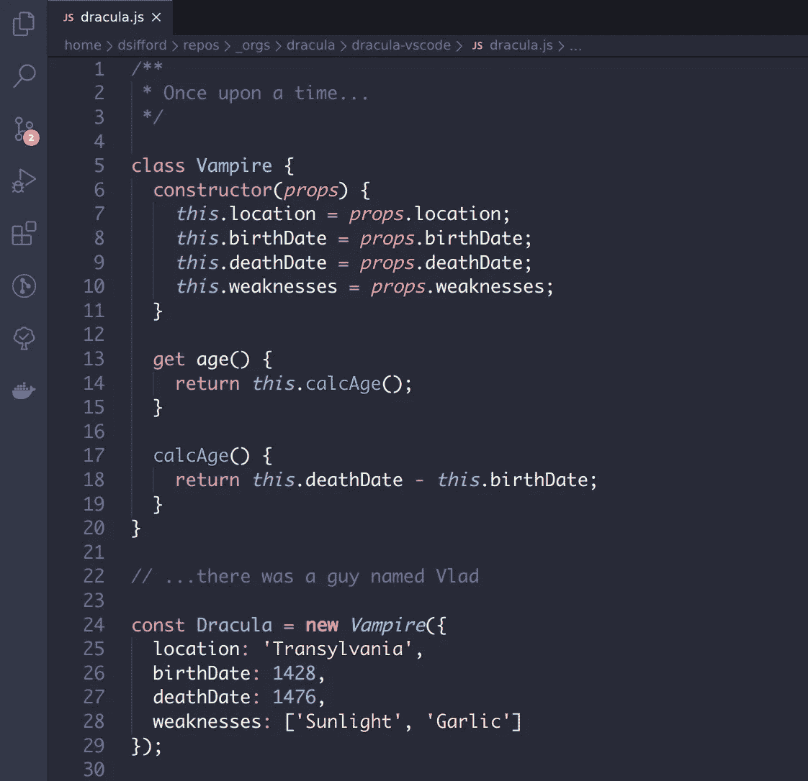
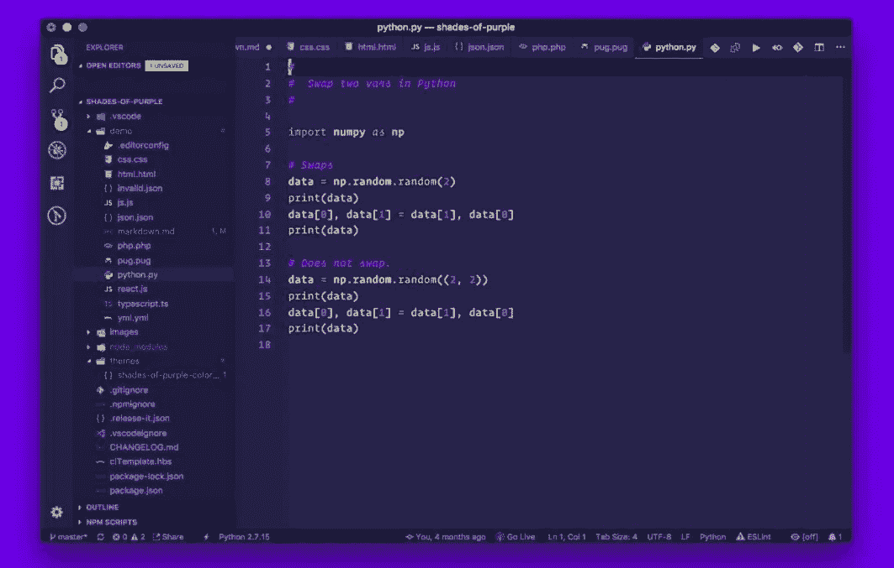
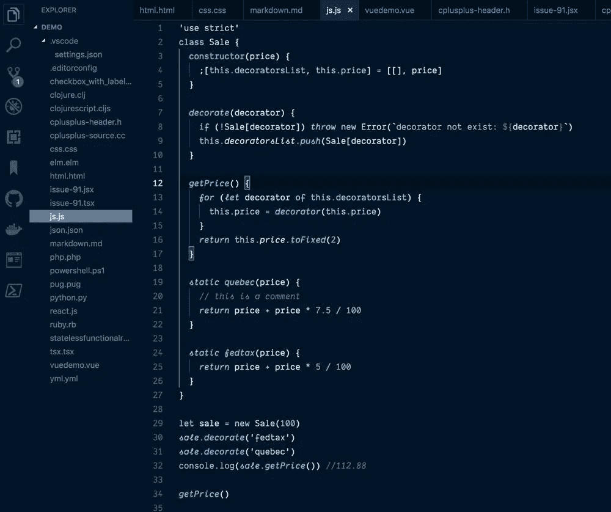
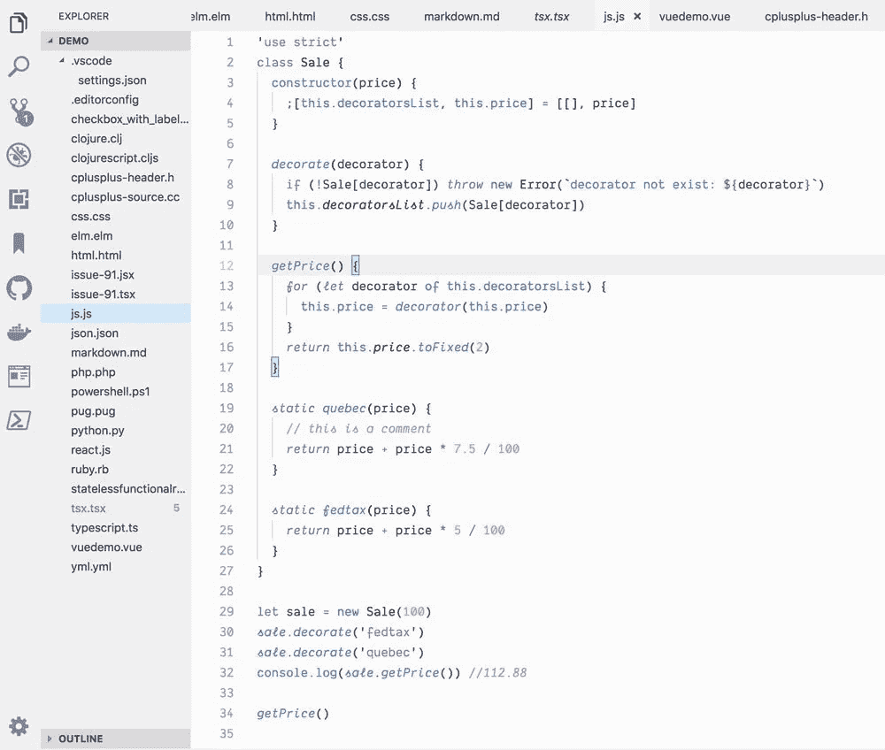
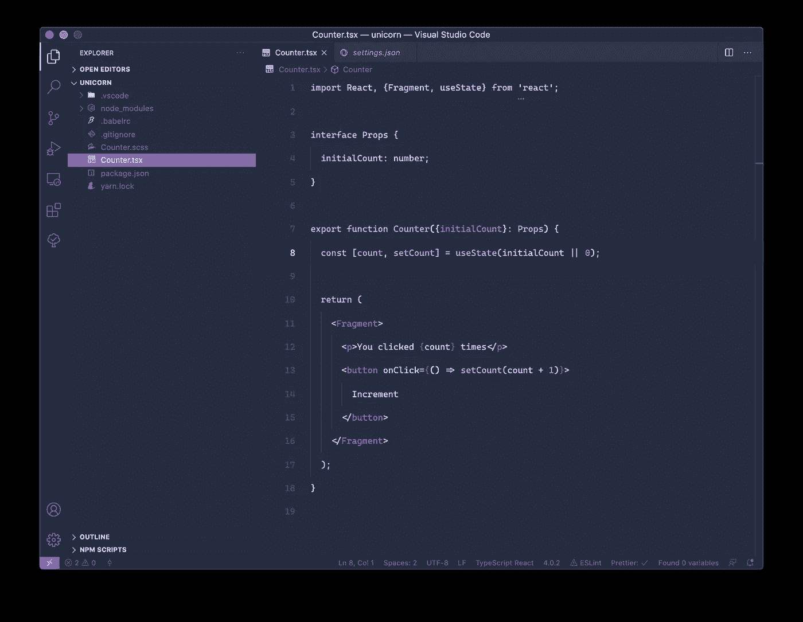

# 2021 年每个开发者必须尝试的 5 个 VSCode 主题

> 原文：<https://javascript.plainenglish.io/5-vscode-themes-every-developer-must-try-in-2021-b96c6c17b291?source=collection_archive---------7----------------------->

## 使您的编码环境现代化，使其更加优雅和美观。

Photo by [Mohammad Rahmani](https://unsplash.com/@afgprogrammer?utm_source=unsplash&utm_medium=referral&utm_content=creditCopyText) on [Unsplash](https://unsplash.com/s/photos/laptop-dark?utm_source=unsplash&utm_medium=referral&utm_content=creditCopyText)

Visual Studio Code 是微软开发的一个代码编辑器，是目前为止 web、app 和硬件开发人员最流行的代码编辑器。近年来，它赢得了许多开发人员的心，并在其背后创建了一个巨大的开发人员社区。

它提供了大量的功能和定制空间。你可以随心所欲地重新摆放和移动物品。您有扩展和主题来为您的开发环境带来耳目一新的不同味道。

作为开发人员，我们大多盯着屏幕，准确地说，是盯着代码编辑器。而且我相信，有时候定制编辑器的外观和感觉可以带来独特的、令人耳目一新的整体体验变化，并增强它。这相当于买了一台崭新的笔记本电脑。

在这篇文章中，我列出了一些我最喜欢的 VSCode 主题，我相信你会带着一个新的主题去尝试，让你的工作场所更加优雅。不要再拖延了，让我们开始吧。

# 1.一个黑暗职业

这是下载量最大的主题之一，下载量接近 400 万。它提供的外观是时髦的深色，带有极简主义的味道，这是我们所有开发人员都喜欢、渴望和幻想的。

熟悉 atom 编辑器的人可以在我们最喜欢的 vs 代码编辑器中体验它的外观和感觉。

# 2.德拉库拉

这是在黑暗主题基础上的又一个极其美好的主题。Dracula 的配色方案和 UI 主题非常适合编程，也非常美观。

# 3.紫色的阴影

这是每个人都必须至少尝试一次的主题之一，这是一个令人耳目一新的独特主题，由美丽而富有美感的紫色色调组成。这个主题会让你再次爱上你的编辑。

# 4.夜猫子

顾名思义，这个主题的设计考虑到了夜间活动的开发人员的猫头鹰般的天性。这是另一个美丽的黑暗主题。

此外，这个主题有一个较轻的版本，对于那些不喜欢黑暗主题的人来说。

# 5.黑夜

这是一个优雅的主题，使用了材料灵感的主题，看起来赏心悦目。每个人都应该尝试一下！你会喜欢的。

## 结论

我希望这个故事对你有所帮助，并找到一些你想尝试的主题。让你的编辑器变得性感漂亮，代码编辑器不一定要沉闷。

另外，请在下面的评论区告诉我你最喜欢的 VSCode 主题是什么，或者你现在正在使用哪个。这样，其他读者将能够了解你喜欢的主题。

谢谢大家，编码快乐！

*更多内容尽在*[*plain English . io*](http://plainenglish.io/)