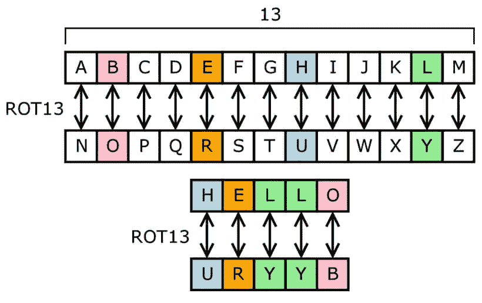

# 凯撒密码的 5 种编码方式

> 原文：<https://javascript.plainenglish.io/5-ways-to-code-a-caesar-cipher-adba3e736c86?source=collection_archive---------11----------------------->


Photo by [Ilona Frey](https://unsplash.com/@couleuroriginal?utm_source=medium&utm_medium=referral) on [Unsplash](https://unsplash.com?utm_source=medium&utm_medium=referral)

精灵们非常重视网络安全。像任何时尚一样，它也影响到了儿童。小精灵们最喜欢的游戏之一就是在上学时间写加密信息。他们中的一些人在维基百科上找到了关于凯撒密码的页面，现在他们不再阻止它了。

# 谜题:✉️的秘密信息


今天的问题是 [Dev 降临节日历的第 22 期🎅](https://github.com/devadvent/puzzle-22)又是关于密码、代码和破译密码的方法。我们来看看经典:凯撒密码:

> 在密码学中，凯撒密码，也称为凯撒密码，移位密码，凯撒码或凯撒移位，是最简单和最广为人知的加密技术之一。这是一种替代密码，明文中的每个字母都被替换为字母表中某个固定位置的字母。

简而言之，我们用在`x`位置上紧随其后的字母替换每个字母。例如，对于`shift = 1`，字母`A`变成了`B`。有了`shift = 2`，字母`A`就变成了`C`。有了`shift = 3`，字母`A`就变成了`D`。诸如此类。



互联网上有几种解决方案，但几乎所有的都涉及到字母表的显式书写，加上一些与`for`循环结合的`if`条件。我解决问题的方法不同，从公式开始

```
f(x) = x + k(mod. m)
```

带`m = number of letters of the alphabet`和`k = shift`。

从这个公式开始，我可以得到一个类似如下的 JavaScript 函数:

问题是如何传递信件。最常见的方法是将字符转换成相应的数字代码。然后我们添加移位并将其转换回字符。

我决定做些不同的事情。毕竟，凯撒密码只不过是一本每一个字母都对应一个字母的字典。然后我可以用不同的字母作为键创建一个 JavaScript 对象。

首先我创建两个数组，一个用于大写字母，另一个用于小写字母:

然后我需要一个函数来计算一个数的模数:

最后，在密钥和解决方案之间建立匹配的东西。

这个函数接受一个包含字母表的数组作为输入，并返回一个带有加密代码的对象。

对于数组中的每一项，对于字母表中的每个字母，它计算相应的加密字母。字母表的长度由数组中元素的数量给出。

为了简化解析，我创建了一个助手函数来处理大写和小写字母的字典。

这样我得到了这样一个物体:

得到密码后，我可以翻译每个字母:

我们还可以用一种非常简单的方法忽略所有非字母字符:如果密码中不存在匹配的密钥，则字符不会被转换:

创建了所有各种支持功能后，解决方案变得简单明了:

这个解决方案有一个有趣的方面:用于解密的相同函数也可以用于解密。只需使用负向移动:这样字母不是向前滚动，而是向后滚动，让你恢复原始信息。

这是完整的代码:

# 普拉尚·亚达夫溶液

就像我开头说的，网上有很多解决这个问题的方法。Prashant Yadav 提出了一些最常见的。

这种方法有什么问题？

*   该代码仅使用预定义的移位进行加密(在本例中为 13)
*   仅适用于小写字母
*   仅适用于不包含空格或其他不包含在`decoded`变量中的字符的字符串
*   不解密消息

他的第二个想法更有趣:

该函数将所有字母转换成大写，然后替换它们。仍然存在处理小写字母的问题。为此，您需要更改函数:

包括空格在内的非字母字符的管理仍然存在问题。

# 玛丽安·韦泰亚努溶液

Marian Veteanu 的博客有许多有趣的帖子。有一个如何创建凯撒密码的解决方案

这个解决方案是可行的，但是我不喜欢有这么多硬编码的值。但是它的优点是不使用数组或其他对象。比如下一个解决方案。

# 埃文·哈恩的解决方案

[Evan Hahn](https://gist.github.com/EvanHahn/2587465) 提出了一个可行的解决方案:

然而，这种解决方案存在一些问题。或者说，是一些我不喜欢的东西。首先是几个`if`条件和一个 `for`循环的存在。我越来越相信，它们使得代码难以阅读，难以维护。

其次，要处理的字母表通过硬编码值固定在代码中。尽可能避免输入硬编码的值。最后，如果我想转换这个函数来使用另一个字符集，我会遇到麻烦。

但是代码是有效的。

好了，今天就到这里。显然，我更喜欢我提出的解决方案。但是 JavaScript 和一般编程的伟大之处在于，有几种方法可以找到正确的解决方案。部分乐趣在于找出哪些路径是可能的。

感谢阅读！敬请关注更多内容。

***不要错过我的下一篇文章—报名参加我的*** [***中邮箱列表***](https://medium.com/subscribe/@el3um4s)

[](https://el3um4s.medium.com/membership) [## 通过我的推荐链接加入 Medium—Samuele

### 阅读萨缪尔的每一个故事(以及媒体上成千上万的其他作家)。不是中等会员？在这里加入一块…

el3um4s.medium.com](https://el3um4s.medium.com/membership) 

*原载于 2021 年 12 月 23 日 https://blog.stranianelli.com*[](https://blog.stranianelli.com/how-to-code-a-caesar-cipher-in-javascript/)**。**

**更多内容看* [***说白了就是***](http://plainenglish.io/) ***。*** *报名参加我们的* [***免费每周简讯这里***](http://newsletter.plainenglish.io/) ***。****