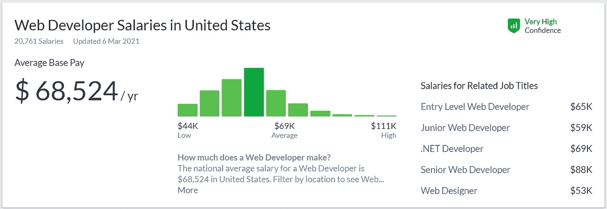
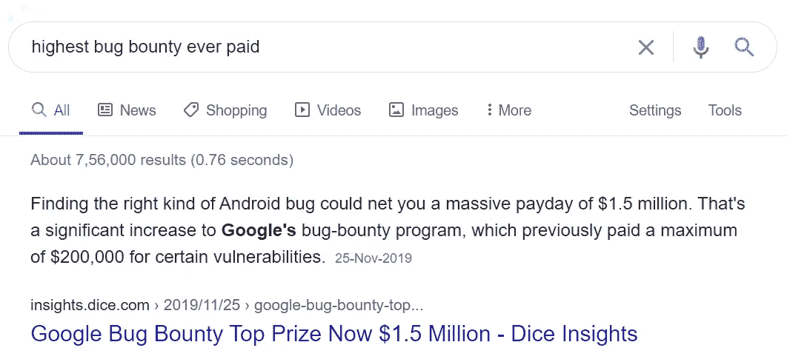

# 开发人员挣钱的 5 种方法

> 原文：<https://javascript.plainenglish.io/5-ways-to-earn-money-as-a-developer-1e42e694a078?source=collection_archive---------4----------------------->

## 从新手到专家:成功的深度指南

Photo by [Mateus Campos Felipe](https://unsplash.com/@matfelipe?utm_source=medium&utm_medium=referral) on [Unsplash](https://unsplash.com?utm_source=medium&utm_medium=referral)

编码是一项非常有益的技能。对于程序员来说，网络世界就像一台赚钱机器。

我想，大概互联网就是由编码者为了赚钱而为编码者做的吧。成为一名开发者的好处是你不需要一个没有年龄限制的学位。

还有什么是你不必把你的关键时间花在办公室、会议、旅行和所有那些乏味的事情上。是的，这意味着你可以在家工作并获得报酬。

如果你是家庭主妇、青少年、黑人、白人，甚至是在职员工、老年男女，你都可以得到报酬。

想要更多吗？想工作的时候拿工资。在海滩上消磨时间，也在那里工作。

做自己的老板。还有，睡觉的时候领工资。

是不是很酷？这是我们的梦想，网络世界使之成为可能。

尼廷，你有点夸张了吧？一点也不，我的朋友，我写的是事实。会给你看谷歌的证明。

在这里，我不打算谈论 YouTube，Adsense 广告，因为你们很多人都知道。

从投资自己开始你的旅程。

# 第一步。投资自己

在开始教别人之前，你必须知道技巧。可能是网络安全，Web 开发，机器学习，甚至是编码。

从某件事开始。争取至少学一个月再着手挣钱。

是的，你可以免费学习一切。比如这里有 [80+免费的网页开发资源。](/80-free-resources-for-web-designers-and-web-developers-in-2021-f400be2875ea)

尼廷，证据在哪里？

这是我的朋友。

对于一般的 Web 开发者来说。

Source: Glassdoor

为了虫子赏金。(Bug Bounty 是一个帮助发现 Bug 并获得报酬的简单程序)。

Source: Google

但是，尼廷，这需要时间和努力。

是的，我的朋友，我只是让你知道一些机会。你必须一步一步跟着我。

# 第二步。教导他人

在继续下一步之前，你必须掌握这个公式。

> 你不需要成为你技能的专家，你只需要愿意工作并有能力增加你的知识

现在你投资了自己。是时候帮助别人学习了。帮助别人是最好的赚钱方式之一。

但是怎么做呢？通过教别人，内容写作，创作视频，创作课程。

1.  **成为威赞特的导师**

[Wyzant](https://www.wyzant.com/) 是一个在线导师平台。他们创造了一个一对一学习的平台。对每个人来说，它也是容易获得的、负担得起的、更方便的。

成为家庭教师后，你可以选择各种科目——数学、科学、英语、计算机、西班牙语、微积分、写作等等。

申请家教，你应该是美国公民(目前只在美国可用)，创建一个每小时收费的免费档案，就这样。

**2。内容写作:**

Source: Google trends

再次查看上图。从 2004 年到现在。这是全世界都感兴趣的。

但是怎么做呢？只因为读者。

有人成功了吗？是的，我的朋友媒体，新闻，还有更多。

现在，我们怎么能？

这很简单。现在你已经学会了一项特定的技能。你可以通过创建一个博客向全世界教授它。

在这个科技时代，创建一个博客很简单。而且你不需要支付超过 50 美元/年的入门费。

WordPress.org 帮你免费创建一个博客。Hostinger 将帮助你[购买一个免费的域名与主机](https://medium.com/code-blog/how-to-get-a-free-domain-with-hosting-from-hostinger-70dde8f9bc18)。之后，你把你的故事导入到媒体中。

**3。** **创作视频:**上面我已经说过了，YouTube 大家都知道，就不多说了。简而言之，你可以用它来写内容和制作视频。我知道这需要时间，但成功是有代价的。

**4。创作课程:**写完内容，做好视频，你就成为某项特定技能的专家。现在你可以在 Udemy，Teachable，和类似的平台上教别人。

# 第三步。做自由职业者

我的职业是工程师，但我讨厌朝九晚五的工作。这是我的实习教给我的概念。我申请了，被选中了，然后离开了他们。

所以我带着我和我的技能离开了。我在[媒体](https://nitinfab.medium.com/)上分享内容。

基于你的经验和技能，你可以向网络世界展示你的作品。

你的工作、内容、视频和课程将会促进你的自由职业生涯。

你可以在 Upwork、Freelancer、Fiverr 等各种网站上工作。

你可以[读读贝内克·李塞夫斯基](https://medium.com/swlh/the-right-way-to-start-freelancing-5f95861dec0)[写的一个很棒的故事](https://medium.com/u/1933a0f84e4b?source=post_page-----1e42e694a078--------------------------------)。他从事自由设计已经超过 17 年了，所以请记下他的笔记。

# 第四步。在创业公司工作

创业帮助你改变个人和职业。帮助学习多种技能，最重要的是趋势技能。

创业公司招聘能够在不同部门工作、学习迅速、主动的员工。大多数以产品为基础的公司都招聘专门从事某一领域的员工。

先说在创业公司工作。

我实习的时候和不同的创业公司合作过，学过 Web 开发，Flutter，React Native，WordPress。从你开始吧。

现在你有了运用你的特殊技能的经验。你是否意识到我到目前为止还没有提到创建你的项目？因为当你教别人、写内容、上传视频和课程时，所有这些都将被添加到你的项目中。

创业的一些好处:

1.  你会变得多才多艺。
2.  你会得到更多的学习机会。
3.  在不同部门工作的自由。
4.  采取主动的自由。
5.  你将不是作为一名员工，而是作为一名领导者工作。
6.  你可以得到一些赌注。
7.  可以升职。

# 第五步:开始创业

如果你点击了这个故事并阅读，你可能是一个开发者或者想成为一个开发者。

而创业，不需要资金。

大多数科技巨头[都是从小公司](https://www.forbes.com/sites/jonathanponciano/2019/05/15/worlds-largest-tech-companies-2019/?sh=36baec19734f)起步，并通过他们的努力成长起来的。

所以，如果你现在没有资本，也不要感到羞愧。你并不孤单。大多数企业由于资本不足而离开他们的创业公司。

现在回顾一下我们到目前为止所做的事情——投资自己、教导他人、做自由职业者和创业。

当我们想创业时，为什么我们必须做这些？完成和学习里里外外。

但是怎么做呢，尼廷？

> 投资你自己会帮助你了解趋势技巧。
> 
> 教导他人将有助于你向他人解释，引导他人。当你开始创业时，你可能需要向你的员工、客户、公司解释概念。
> 
> 作为一名自由职业者，会帮助你与客户互动。
> 
> 最后，在创业公司工作会帮助你了解障碍。以及如何解决。

# 结论:

你可以通过多种方式赚钱，但只有创业才能获得终身成就。

那么就从今天开始吧。

***如果你喜欢我的工作，想要支持，可以*** [***请我喝杯咖啡！***](https://www.buymeacoffee.com/nitinfab)