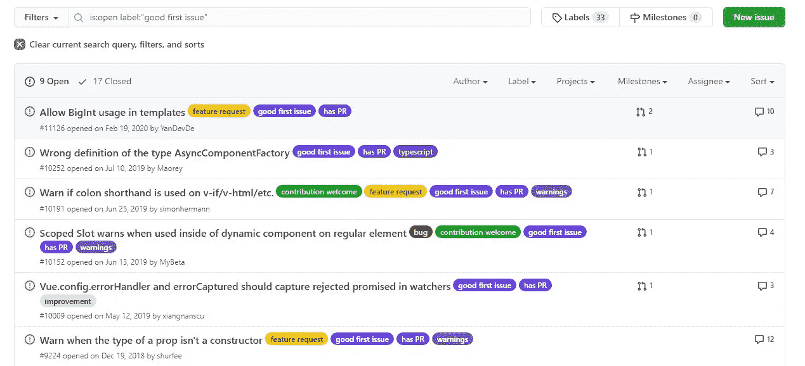

# 作为开发人员成长的 5 种方式

> 原文：<https://javascript.plainenglish.io/5-ways-to-grow-as-a-developer-b147336debb6?source=collection_archive---------13----------------------->

## 明确的方法来提高你的游戏和推进你的职业生涯

Photo by [Artem Beliaikin](https://unsplash.com/@belart84?utm_source=medium&utm_medium=referral) on [Unsplash](https://unsplash.com?utm_source=medium&utm_medium=referral)

我今年的新年决心之一是成为一名开发者，我知道你们中的许多人也想这样。

作为一名开发人员，成长并不仅仅意味着你知道如何实现比以前更多的特性，或者你学会了一门新的编程语言。

虽然这些事情很重要，但并不能保证你已经成为一名更好的开发人员。

相反，在我看来，像解决问题、遵循现代实践、知道如何利用互联网为你带来优势这样的技能，以及学习通常不会直接影响开发的技能(如 SEO 或营销)才是决定开发人员成长的因素。

幸运的是，有很多方法可以免费提高这些技能，但它们需要时间和努力。

以下是帮助你成为更好的开发人员的 5 种方法:

## 1.做大项目

创建需要几周或几个月才能完成的大项目是获得更多经验和提高技能的最可靠方式之一。

对于大项目，我指的是具有全面功能的项目，如成熟的社交媒体平台。

你甚至可以将你的简单项目转化成一个更大的项目。

例如，如果你有一个简单的待办事项应用程序，你可以修改设计并添加一些功能，如电子邮件登录、第三方认证(如谷歌登录)、存档文件夹、书签以及在列表中存储不同内容(如图片)的能力。

这些大项目让你理解编写可伸缩和可读代码的重要性。

开始时，我们大多数开发人员倾向于编写简短、复杂的代码片段，但在现实生活中，可读性和干净的代码更重要。

在小型项目中，编写简短复杂的代码片段是可以接受的，但是在大型项目中，您将会花数周的时间阅读和访问这些程序，因此编写清晰可读的代码是明智的。

此外，您还将学习如何将许多功能整合到一个项目中。

## 2.为开源项目做贡献

这是许多初级开发人员往往忽视的另一个步骤。

就个人而言，贡献使我成为一名更好的程序员。

你变得善于阅读他人的代码，这在同时改进开源项目时是至关重要的。

然而，许多人认为要为开源项目做贡献，你需要成为一名专家，这并不完全正确。

Vue.js issues. Source: Author.

在 Github 上，尝试为带有“好的第一期”标签的项目做贡献，因为它们不需要专家级的知识。

大多数开源软件都有对初学者非常友好的问题，而且大多数开发者都可以解决。这些问题是您开始开源贡献之旅的好地方。

你可以在网上找到大量的资源，教你如何为开源项目做贡献。

贡献不仅对你有好处，对开发者社区也有好处，因为他们可以享受更加完美的开源库和框架。

## 3.遵循现代惯例

尽管只要代码执行所需的工作，对于如何编码没有严格的规则，但是确实存在一组帮助提高软件质量的非正式规则和实践。

将现代和干净的实践应用到您的代码中会有很大的帮助。

大多数语言都有更新，增加了增强的功能来简化一些最重要的任务。

例如，JavaScript `map()`和`forEach()`函数使循环数组中的元素和执行特定任务变得容易，同时也使代码看起来更有吸引力。

遵循现代实践还表明，无论你使用哪种语言，你都是紧跟最新发展的。

我写过一篇文章，介绍了 JavaScript 的一些现代实践，如下所示:

 [## 每个开发人员都应该知道的 JavaScript 的 5 种现代实践

### 编写干净代码的 5 个最佳技巧和实践

medium.com](https://medium.com/javascript-in-plain-english/5-modern-practices-of-javascript-that-every-developer-should-know-1a61dc9a6ee0) 

## 4.编写单元测试

顾名思义，单元测试检查不同的“单元”，即代码的各个部分。

单元测试确保您的代码按照您的预期工作。

换句话说，单元测试帮助你发现错误。您可以在将本地代码推送到生产分支之前对其运行单元测试。

拥有编写单元测试和其他形式的测试的能力可以帮助你成为一名优秀的开发人员。

这些测试要求您编写干净的、模块化的代码，这些代码是独立的，可以帮助您实现 DRY(不要重复自己)原则，从而鼓励代码的可重用性。

此外，测试使您能够衡量应用程序的性能，这在构建数据集大小未知的项目时至关重要。

## 5.加入技术社区

成为各种社区的成员以及参加在线技术竞赛可以极大地帮助你树立自己的名声，并让你了解相关的更新和新闻。

加入这些社区有很多好处，比如共享支持、工具、指导和对等编程。

有许多社区和团体，你可以立即免费加入。

在我看来， [StackOverflow](https://stackoverflow.com/) 是一个很好的起点。

我建议一些社区加入 Reddit 上的[“r/cscareerquestions”子编辑，在 Twitter 上关注程序员，并定期阅读致力于编码的媒体出版物，如](https://www.reddit.com/r/cscareerquestions/)[简单英语的 JavaScript。](https://medium.com/javascript-in-plain-english)

你还可以加入 [Hashnode 社区](https://hashnode.com/community)、[自由代码营](https://www.freecodecamp.org/)以及[黑客月](https://hackernoon.com/)。

*请注意，还有更多这样的社区，这些只是我关注的一部分，没有一个链接是以任何方式关联的，尽管我确实积极地向一些媒体出版物投稿。*

## 最后的想法

这些只是我在过去一年中用来成为一名更好的程序员的一些方法，我计划今年继续这样做。

遵循这些方式和方法肯定会帮助你成为一个伟大的开发者，并建立一个在线的存在。

像建设大型项目这样的事情也是增加你简历的一种方式，而成为全球技术社区的一部分可以为你打开大门。

使用在线免费资源，我们可以轻松地学习和成长为开发人员，同时也避免了一些我们在开始时犯的常见错误。

感谢阅读！