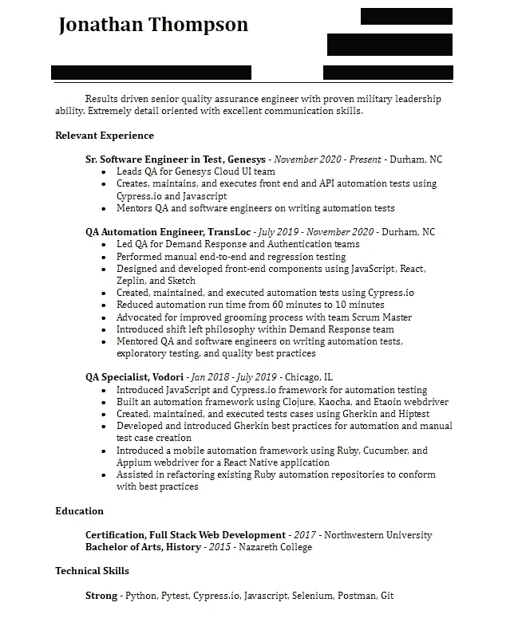
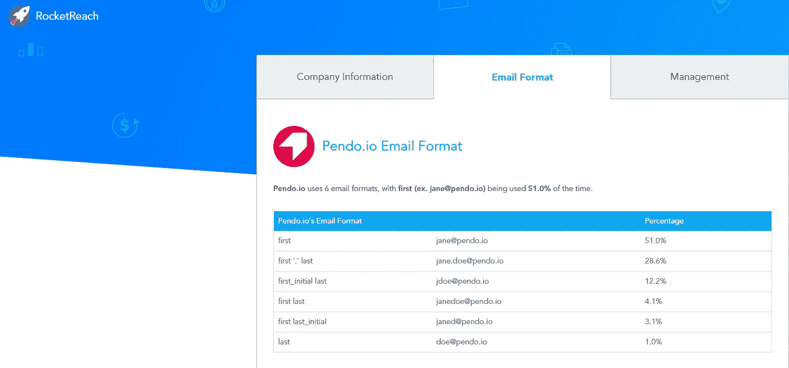
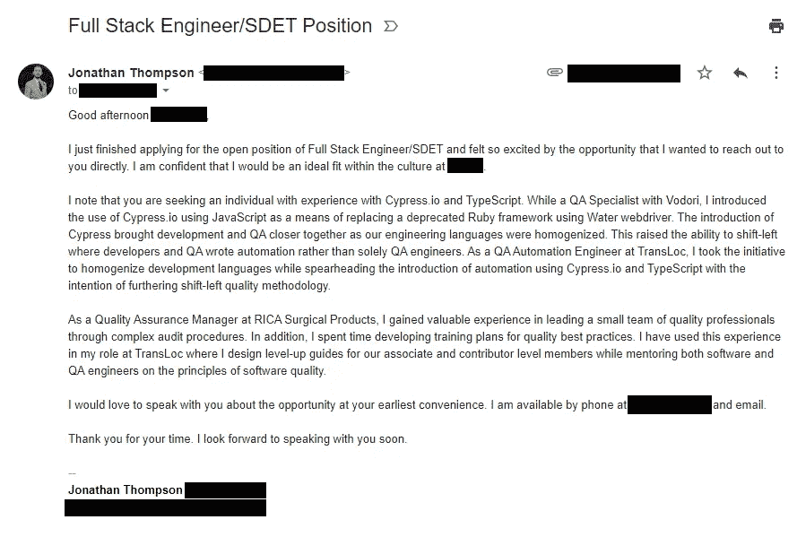
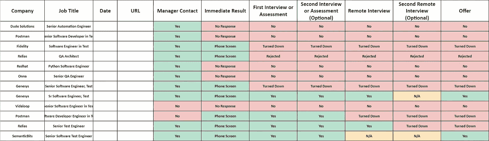

# 改善软件求职结果的 5 种方法

> 原文：<https://javascript.plainenglish.io/5-ways-to-improve-your-software-job-search-results-5e24fa3dceaa?source=collection_archive---------20----------------------->

## 遵循这些简单的建议，看看你的回复率飙升。

Searching for a job got me like… (Photo by [Magnet.me](https://unsplash.com/@magnetme?utm_source=medium&utm_medium=referral) on [Unsplash](https://unsplash.com?utm_source=medium&utm_medium=referral))

在找新工作时，你是否因为被人跟踪而感到沮丧？

相信我，我也经历过。被幽灵袭击对个人和情感都有伤害。知道未来的雇主没有花时间通知你你不适合某个职位，或者他们已经找到了另一个候选人，感觉很糟糕。

2017 年，我从西北大学的编码训练营毕业后，我提交了第一批申请。我想我会收到一堆拒绝，但我没有做好被未来雇主忽视的准备。在最初的几周之后，我有两个选择——继续做我正在做的事情，或者重新评估我的过程。

我选择了后者，并设计了一个申请系统，将我的雇主回复率从微薄的 0%提高到了 60%以上。请继续阅读，了解我如何申请软件行业的职位。

# 1.写一封求职信

许多工程师认为写求职信过于拘泥于形式。那些工程师误解了求职信的目的。简而言之，求职信应该是一份有说服力的材料，详细说明为什么你是这份工作的合适人选。

我会亲自给公司的招聘经理写每一封求职信。然后我详述了我过去在软件领域的经历，从我在西北大学的新兵训练营开始。我花时间详细描述了我在以前公司的一些个人成就，以及如何将它们扩展到新公司。

例如，我正在申请一个高级 QA 自动化工程师的职位，该职位要求应聘者熟悉构建基于 Python 的自动化框架。我可以写下我使用 Python、Pytest 和 Selenium 从头开始构建自动化框架，同时将测试执行时间缩短 600%的经历。通过这种方式，我向雇主证明我使用了他们要求的语言，并在我的工作经历中用这种语言取得了成果。

A copy of a cover letter I have used in past job searches. (Screenshot by Jonathan Thompson)

你的求职信表达了你为什么想要这个职位。把它变成你的优势，花点时间记下为什么你是合适的人选，只有你是合适的人选。

# 2.剪裁你的简历

这似乎相当中肯，但你会惊讶地发现，有多少申请人在申请软件职位时使用明显通用的简历。不要陷入这种模式，确保你的简历更新了雇主正在寻找的标准。

在我近五年的软件经验中，我用过 Ruby、Python、JavaScript 和 Go。如果一个职位需要 Ruby，我会在我的简历中特别强调我的 Ruby 经历。为此，我会在每个使用 Ruby 的雇主下面创建要点，注明我对该语言做了什么，更重要的是，它对业务有什么影响。

其他语言会在简历底部的技术技能部分注明，因为它们没有突出 Ruby 那么重要。

A resume I have submitted. (Screenshot by Jonathan Thompson)

以上是我提交的高级职位简历，要求有领导团队、指导工程师和维护自动化代码的经验。我突出地记录了我在哪里领导团队的 QA，我维护什么样的自动化，以及我何时指导工程师。所有其他要点都是为了给未来的雇主提供额外的经验和信息。

还要注意简历只有一页长。尽最大努力确保你的简历是一页纸，因为它不是简历。如果你已经在这个行业工作了十年，考虑突出你最近的三个职位。你其余的工作经历可以记录在你的 LinkedIn 个人资料中。

当你阅读简历时，你希望你的经历能立刻凸显出来。招聘经理不应该去挖掘它。

# 3.联系招聘经理

与招聘经理沟通是我申请新职位时最喜欢的部分，也很可能是我申请过程中最关键的部分。我会利用 LinkedIn 或其他社交媒体应用程序追踪招聘经理。常见标题包括:

*   技术招聘人员
*   招聘经理
*   人事经理
*   人力资源

一旦我确定了我要和谁交流，我就转向谷歌，输入搜索查询`{company_name} email format`。通常情况下，第一个链接会是 Rocket Reach，里面有公司的简介，包括公司使用的电子邮件格式。

Pendo.io’s email format entry on Rocket Reach. (Screenshot by Jonathan Thompson)

在这里，我会写一份电子邮件草稿，详细说明为什么我觉得自己非常适合这家公司和这个职位。我确保**而不是**重复求职信中的陈述。我的意图是抓住招聘经理的注意力，让他们记住我，而不是用多种方式表达相同的信息让他们感到厌烦。

重要的是要注意，在这个阶段你不能盲目地夸夸其谈。遵循职位的要求，记录下你过去直接满足这些要求的成就。

一旦草稿完成，我就带着简历和求职信申请这个职位。在我完成申请后，我会立即查看我的电子邮件，并把它发给招聘经理。

An email I have written in past searches. (Screenshot by Jonathan Thompson)

招聘经理每天都会收到数百份申请。对他们来说，筛选如此堆积如山的内容可能很困难，所以直接联系他们会让你排在队伍的最前面。如果他们喜欢他们看到的，他们几乎会立即联系你(我让经理在发邮件后几分钟就联系我)。

给招聘经理发邮件时要留下印象。给他们一些让他们记住你的东西。

# 4.记录你的求职过程

跟踪你申请的公司，你的申请状态，以及你是否在继续这个过程是相当重要的。为了做到这一点，我每次申请新职位时都会保留一份谷歌表单。我记下了我申请的公司、职位、日期，以及我是否联系了招聘经理。

保留这些信息的记录不仅能让我有条理，还能让我知道我的求职尝试是否成功。如果我收到的电话屏幕少于提交的申请，那么我可能需要重新考虑我申请的职位(或我的整个流程)。

A chart I used recently. (Screenshot by Jonathan Thompson)

在上面的图表中，我详细说明了公司是否给了我即时回复——通常是要求在电话中讨论这个职位。我会记录我的访谈结果，以及它们是否在继续(或者我们是否选择了结束这个过程)。最后，我会记录下哪些职位我主动拒绝了，哪些公司给了我工作机会。

记录你申请的职位和你的申请状态。如果有什么不同的话，这种做法会让你在继续寻找新职位的时候保持理智。

# 5.追踪

潜在雇主可能需要几天时间来回复你的求职申请。在这些情况下，重要的是要记住雇主会收到数百份申请。在等待回应时，尽量保持耐心。

如果招聘经理没有在适当的时间内(我建议一周)联系你，最好发一封跟进邮件。在写跟进邮件时，再次表达你的兴奋，并注明你觉得自己是这个职位的合适人选。如果有帮助的话，再读一遍职位描述，再一次把你的经历和要求匹配起来。在这种情况下，你可以重复自己的话，提醒招聘经理看一下你的申请。

简而言之，写一封跟进信可以让你回到招聘经理的脑海中，如果他们已经偏离了方向。

# 摘要

申请工作可能是一次充满压力和情绪负担的经历。给雇主写一封求职信，让他们明白你为什么想要这个职位。修改你的简历，让他们看到最好的你。联系招聘经理，表达对这个职位的兴奋。跟踪你的进展，当你没有收到回复时继续跟进。

遵循这个指南，你可以提高在软件领域寻找新职位时的回复率。

# 资源

1.  “为超过 4.5 亿名专业人士寻找电子邮件、电话和社交媒体。”*火箭到达*，【rocketreach.co/】T2。

*代表*[***plain English . io***](https://plainenglish.io/)*，感谢阅读！*