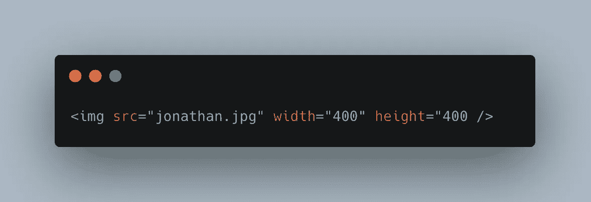
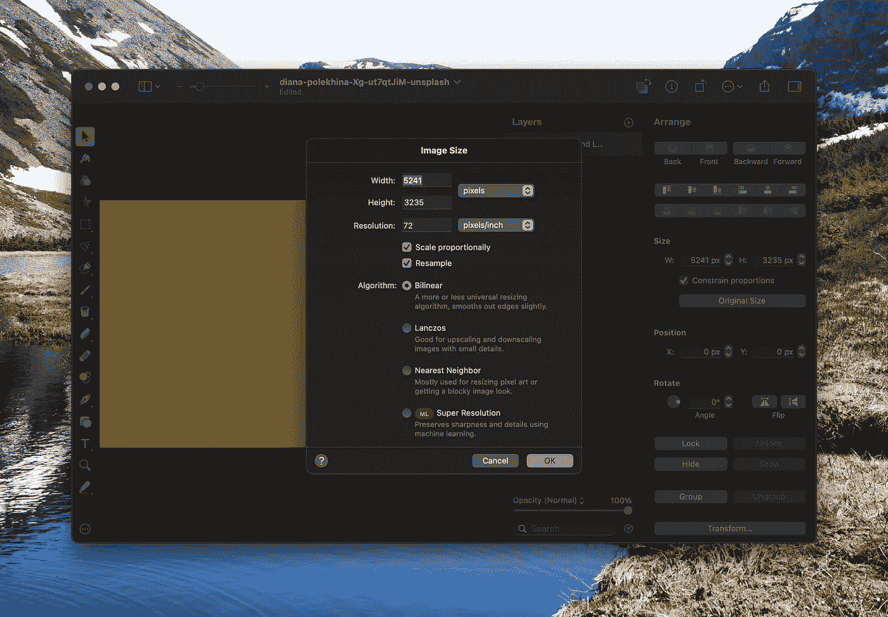
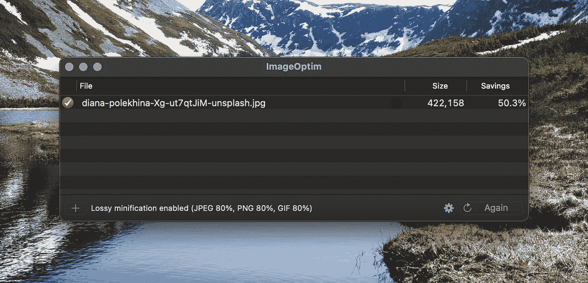
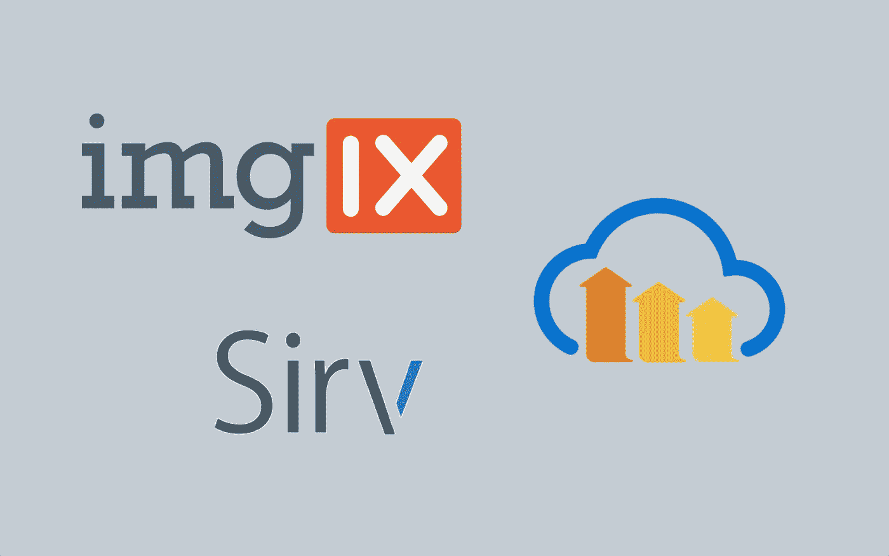

# 优化网站图像性能的 5 种方法

> 原文：<https://javascript.plainenglish.io/5-ways-to-optimize-the-performance-of-your-websites-images-10c417c34c30?source=collection_archive---------7----------------------->


Photo by [Charles Deluvio](https://unsplash.com/@charlesdeluvio?utm_source=unsplash&utm_medium=referral&utm_content=creditCopyText) on [Unsplash](https://unsplash.com/s/photos/size?utm_source=unsplash&utm_medium=referral&utm_content=creditCopyText)

您的图像可能是页面重量的最大贡献者之一，优化它们可以对您的网站性能产生积极影响。

在这篇文章中，我将谈论 5 种方法，你应该寻找优化你的网站形象，使你的网站更有性能。

# 在代码中指定尺寸



Example **img** tag with dimensions by author

向网站添加图像时，在 HTML 中指定图像的尺寸是非常重要的。

当浏览器开始布局页面时，它会找到图像并向服务器发出请求。当请求图像时，浏览器将继续在图像应该去的地方呈现页面。

如果未指定图像的尺寸，浏览器将无法为图像保留空间。这意味着一旦图像被下载，浏览器将需要围绕图像回流内容。

如果我们指定图像的尺寸，它会保留渲染图像所需的空间，就像渲染页面布局一样。然后，一旦图像被下载，它将被放置在浏览器预留的空间。

这种预留空间的行为改善了你的用户在你的网站上的加载体验，因为他们可以开始阅读内容而不会让内容跳跃。

作为附带利益，这将改善您的最大内容绘制(LCP)和累积布局偏移指标，这是谷歌在搜索排名中作为一个因素使用的核心网络重要指标。

# 图像尺寸



Example of resizing an image in Pixelmator Pro by Author

虽然指定图像尺寸有助于提高 LCP，但原始图像的尺寸也非常重要。

当浏览器下载图像时，其第一步是解压缩并将其转换为*位图*。随着图像尺寸的增加，其处理量呈指数级增加。

一个很好的例子是，如果我们考虑一个 400 像素×400 像素的图像需要渲染 160000 像素。如果我们将大小增加到 500 像素乘以 500 像素，渲染图像所需的像素总数将增加到 250000。

浏览器将此图像数据以未压缩状态存储在内存中，因此，如果您的图像很大，它们会降低页面的渲染速度，甚至导致浏览器崩溃。

此外，如果图像需要在您指定为 400x400 的位置渲染，那么它必须缩小像素，在这样做时应用抗锯齿，使用用户设备上的更多资源。

缩小图像的尺寸还有其他好处，比如减少浏览器需要下载的文件的大小。进一步提高页面的性能。

# 图像压缩



Author compressing an image using ImageOptim

除了影响文件大小的图像尺寸之外，考虑如何压缩图像也很重要。

首先要考虑的是文件格式:

*   **GIF:**GIF 格式是一种 8 位图像格式，支持 256 种颜色的调色板。当建立你的网站时，GIF 格式最适合于相对较少颜色的图像，如标志、简单的图形和图表。
*   **JPEG:**JPEG 格式是一种 24 位图像格式，是网络上最流行的图像文件格式。这种流行是由于 JPEG 的压缩效果非常好，并且这种格式允许您在文件大小和质量之间选择您想要的平衡。使用 JPEG 格式实现的压缩级别源于它丢弃被认为不必要的图像数据的方式。
*   **PNG:**PNG 格式是一种无损格式，有两种不同的风格:PNG-8 和 PNG-24。PNG-8 支持 256 种不同的颜色，而 PNG-24 格式支持 1600 万种颜色，并支持透明度。PNG-8 风格适用于颜色相对较少的图像，如徽标、简单图形和图表。在大多数情况下，PNG-8 文件比 GIF 文件小。然而，PNG-24 的味道非常不同，可以用于多种用途。它支持完整的 alpha 透明度，因此您可以将透明度作为详细图像的一部分。无损格式意味着 PNG-24 文件可能会非常大，所以不要过度使用这种格式很重要，因为它会对网站的文件大小产生负面影响。
*   SVG:可缩放矢量图形的缩写，是一种基于 XML 的矢量图像格式，可以在网站上使用。它最适合图标和徽标等颜色数量有限的图像。作为矢量格式，图像可以在不损失任何图像质量的情况下进行缩放。对于响应式设计，这是理想的，因为这意味着图像在各种不同的设备上看起来都很清晰，包括那些高像素密度的设备。
*   **WEBP** : WEBP 是一种结合了有损和无损压缩的图像格式。该格式由 Google 开发，旨在创建比 JPEG、PNG 和 GIF 图像格式更小但质量相同的文件。使用像 WEBP 这样的格式的局限性在于它并不被所有的浏览器所支持。

选择一种文件格式后，您需要选择一种工具来导出该格式的文件。在 Mac 上，我通常会使用 Pixelmator Pro，但也有很多工具可以使用，甚至包括 Windows 内置的 Microsoft Paint。

以您想要使用的格式导出后，您可以进一步压缩它。我通常使用 ImageOptim(T11 ),这是一个免费的应用程序，允许你定制图像的损失水平，并快速压缩图像。

当压缩你的图像时，我建议你尝试不同的损失水平，这样你就可以继续减小尺寸，直到图像质量变得太低。您需要的有损级别可能会有所不同，这取决于图像包含的内容，因此您可能会发现有些图像需要 80%，而有些图像您可以将压缩级别设置为 60%。

为了进一步了解图像压缩， [Matthew Croak](https://medium.com/u/4180c044f281?source=post_page-----10c417c34c30--------------------------------) 在他自己的博客上写了一篇关于“**网络图像压缩**的非常好的文章。

[](https://matt-croak.medium.com/image-compression-for-the-web-d577b4ec937e) [## 网络图像压缩

### 制作一个网站需要很多艰苦的工作。Web 开发人员需要集成多种编程语言，以便…

matt-croak.medium.com](https://matt-croak.medium.com/image-compression-for-the-web-d577b4ec937e) 

# 惰性装载


Photo by [Mike van den Bos](https://unsplash.com/@mike_van_den_bos?utm_source=unsplash&utm_medium=referral&utm_content=creditCopyText) on [Unsplash](https://unsplash.com/s/photos/loading?utm_source=unsplash&utm_medium=referral&utm_content=creditCopyText)

优化图片的下一个方法是延迟加载用户最初看不到的图片。这将推迟加载这些图像的影响，以便浏览器可以优先加载第一个内容丰富的绘画(FCP)所需的资产。

有两种方法可以延迟加载图像:

## 使用 JavaScript

使用 JavaScript 可以轻松实现延迟加载。虽然您可以自己编写代码来处理这个问题，但是您可以尝试许多经过测试的库。

[Echo.js](https://github.com/toddmotto/echo)

*   在您的页面上实现简单
*   只有 2KB

Yall.js (又一个懒惰的加载程序)

*   使用交叉点观察器，对于不受支持的浏览器，退回到基于事件的延迟加载

[懒人](https://github.com/aFarkas/lazysizes)

*   支持响应图像 srcset 和 sizes 属性的延迟加载。
*   即使没有交叉点观测器也能实现高性能。

## 使用本机浏览器延迟加载

Google Chrome 76 引入了原生浏览器延迟加载，允许开发人员在不使用 JavaScript 的情况下实现延迟加载。要启用延迟加载，您只需给图像添加一个`loading`属性。

```

```

`loading`属性可以有以下值:

*   **lazy:** 延迟图像的加载，直到它到达离视窗一定的距离。
*   **急切:**页面一加载，就加载图像，不管它放在页面的什么位置。
*   **自动:**正常加载图像。

使用原生浏览器延迟加载的主要好处是，它允许浏览器选择最佳时间来加载您的图像。这使得浏览器可以针对网络条件和用户行为等进行优化。

原生延迟加载的限制是它在浏览器中的支持有限，Safari 和 Internet Explorer 是不包含该特性的著名浏览器。在不受支持的浏览器中，它会像正常一样加载图像。

要跟踪浏览器支持，请查看[我能否使用](https://caniuse.com/loading-lazy-attr)的浏览器信息来获得该功能。

 [## 通过图像和 iframes 的属性延迟加载|我可以使用吗...HTML5、CSS3 等的支持表

### “我可以使用吗”提供了最新的浏览器支持表，以支持桌面和移动设备上的前端 web 技术…

caniuse.com](https://caniuse.com/loading-lazy-attr) 

# 使用图像 CDN



Composite Image of logos for **imgix**, **Sirv** and **Cloudinary** arranged by Author

正如其他四个建议所示，当涉及到为您的网站支持的每个设备提供完美的图像变化时，优化您的图像会变得复杂。正如我们提到的，你需要考虑图像格式，图像尺寸和图像压缩。

为了简化您的工作，您可以选择使用图像 CDN，如 Cloudinary、Imgix 或 Sirv。图像 CDN 是一个内容交付网络，专为在您的网站上提供图像而调整，具有自动将图像转换为最佳格式、自动调整大小和自动压缩的功能。他们既可以自己存储图片，也可以代理你已经存储图片的地方，比如 S3。

在你的网站上添加一个图片 CDN 会增加你的托管成本，所以这是值得考虑的，但是我提到的三个(Cloudinary，Imgix 或 Sirv)都有一个免费层，你可以用来做实验。

# 结论

优化你在网站上使用图片的方式只是提高网站性能的一种方法，然而这通常是最简单的方法之一。只需一点点努力，你就能改善网站上图片的加载方式，并改善用户体验。

如果你觉得这篇博文有帮助，我会非常感谢你对我接下来要写的内容的反馈和建议。

*更多内容尽在*[***plain English . io***](http://plainenglish.io)