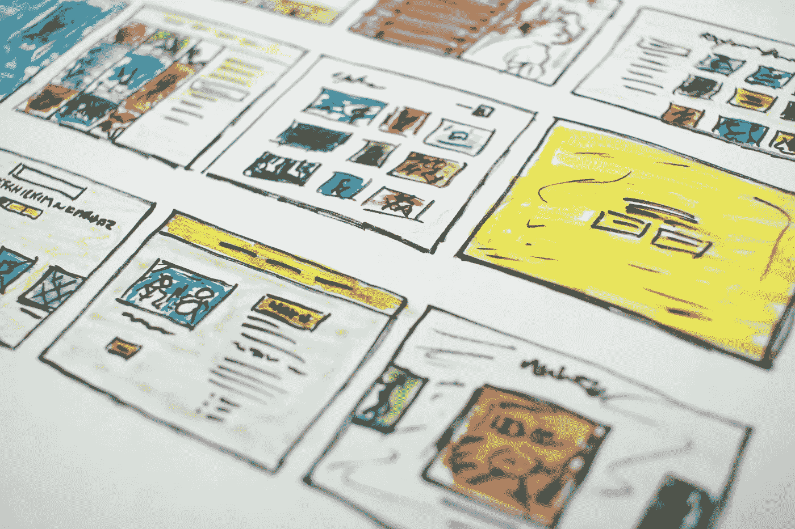
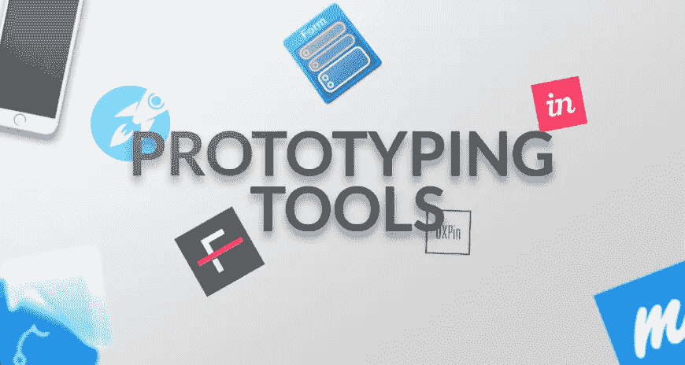

# 每个开发者都应该掌握的 5 个网页设计技巧

> 原文：<https://javascript.plainenglish.io/5-web-design-skills-every-developer-should-master-d4ecda8d095a?source=collection_archive---------11----------------------->

## 网站是一门艺术。

Photo by [Halacious](https://unsplash.com/@halacious?utm_source=unsplash&utm_medium=referral&utm_content=creditCopyText) on [Unsplash](https://unsplash.com/collections/9596951/doodles%3A-website-%2B-apps-%2B-layouts?utm_source=unsplash&utm_medium=referral&utm_content=creditCopyText)

一个伟大的网站有两个方面。设计和编码。许多开发人员(大部分是自由职业者)都处理这两个问题。他们自己设计网站，然后编写代码。

请注意，这篇博客文章是为同时做这两个部分的开发人员写的，或者如果你是一个只做设计的人。我已经概述了网站设计的重要原则，而不是网站开发。

在过去的一年里，人们坐在家里磨练了很多技能。对许多人来说，编程，尤其是 web 开发，是人们学到的最高技能之一。

每个人都想学习 JavaScript，以及 React、Angular 等最新的框架。但是，学习这些框架能让你成为伟大的开发人员吗？

我相信，要真正搞定一个网站，视觉效果和网站使用的技术是同等重要的。用户和网站之间的交流应该顺畅，你应该能够用你的设计把用户吸引到你的网站上。

这里有 5 个技巧，任何设计师或开发者都应该学会，让他们的网站脱颖而出。

# 1.学习视觉设计的基本规则

任何网站的基础是它的视觉效果。

它看起来有多干净，不同的元素如何相互作用，以及网站的整体主题都是让你的网站引人注目的重要因素。你只会停留在一个视觉上吸引人的网站上。

视觉设计处理视觉元素，比如网页的布局、你使用的插图、照片、你选择的字体和排版，甚至是空白。

人们通过视觉处理网站上的大部分信息，而不是阅读网站上写的内容。当你让他们对你的视觉效果着迷后，他们就开始注意了。

重要的是要了解—

1.  色彩原则
2.  线条、点和形状
3.  纹理、空白和布局
4.  排版和摄影

# 2.学习交互设计

> “设计不仅仅是它的外观和感觉。设计就是它的工作方式。”—史蒂夫·乔布斯

交互设计是交互产品和服务的设计。在交互设计中，主要的焦点是设计用户如何与网站或 web 应用程序交互。

当你把用户和你的视觉效果联系起来之后，你的用户应该能够轻松地和网站互动。该网站不应该感到复杂或挣扎导航和使用其功能。

交互设计对于让用户轻松浏览网站很重要，这样你就可以指引他们到想要的地方(产品)。

术语“交互设计”经常和“用户体验设计”混淆。用户体验设计(UX) 涉及更多方面。*交互设计*是 *UX 的子集。*

# 3.学习原型工具

有多少次你做了一个网站，客户不喜欢？我已经尴尬的面对过很多次了。我以为每个人都会喜欢我做的设计。我的设计对我来说就像糖果。

但是，事实并非如此。在你和你的客户在同一页的同一行之前会有一千个变化。

Photo by [Maruti Techlabs](https://medium.com/u/a1db29d4fcb?source=post_page-----d4ecda8d095a--------------------------------)

避免我所做的并节省几十个小时的最好方法是使用原型工具。原型工具允许你对你将要交付给客户的东西给出一个可视化的概述。

这些工具给我们提供的最大好处是——迭代。我们可以迭代、改进和验证，比我们编写整个网站的代码，然后进行更改要快得多。

一些免费的网络用户界面模型工具是—

1.  [Adobe XD](http://www.adobe.com/in/products/experience-design.html)
2.  [折纸工作室](http://origami.design/)
3.  [Webflow](http://www.webflow.com/)

# 4.熟悉产品和用户群

在任何产品设计中，最重要的一课就是了解你的市场。网站设计就像一个产品，只是。在这里，您正在创建一个与用户交互的应用程序。

熟悉产品的用途，了解用户的兴趣在设计中很重要。

例如，如果你正在做一个网站，你的主要流量是年龄在 40-60 岁之间的人，你可能想让网站更干净，更容易浏览。然而，如果你的目标受众比较年轻，你可能会选择一个更有活力和吸引力的网站。

对你的产品和你的用户统计数据有很好的了解将会帮助你创造一个符合你的用户兴趣的设计。

# 5.搜索引擎优化

你可以创建一个漂亮、干净、吸引人的网站。但是，如果没有人访问你的网站，这些都无关紧要。

SEO 是网页设计和开发过程的一部分。不要认为 SEO 是在你制作了整个网站之后才想到的。

作为一名 web 开发人员，你应该关注 Onpage SEO，它由 web 架构、语义、内容和网站编码方式组成。

Onpage SEO 占网站总得分的近 30%。

所以，下次当你设计一个网站时，考虑把 SEO 作为一个过程来做，帮助你的客户实现他们想要的。

最后，一个好的网站就像它所提供的价值一样好，用户可以很容易地浏览你的网站，并对它感到舒适。

如果你喜欢这篇文章，可以考虑订阅我的时事通讯，获取我最新博客的通知。我为你们所有人建造了一些很棒的东西，并将在那里分享。

*更多内容看*[***plain English . io***](http://plainenglish.io/)