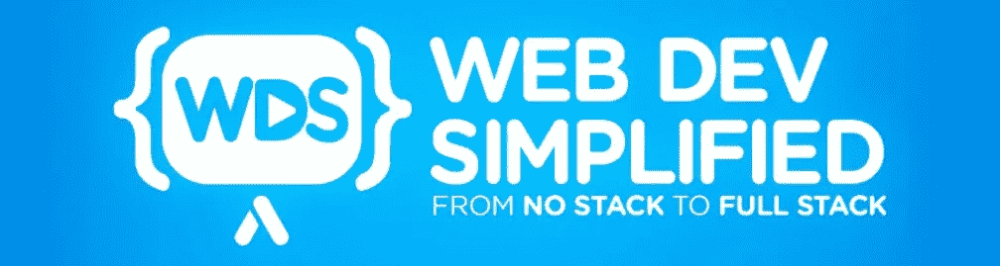

# 5 个 YouTube 频道让我在不到一年的时间里找到了一份网络开发工作

> 原文：<https://javascript.plainenglish.io/5-youtube-channels-that-got-me-a-web-developer-job-in-under-a-year-288e19d4ebb0?source=collection_archive---------9----------------------->

## 用这些 YouTube 频道自学如何编码

Photo by [Leon Bublitz](https://unsplash.com/@leon_bublitz?utm_source=medium&utm_medium=referral) on [Unsplash](https://unsplash.com?utm_source=medium&utm_medium=referral)

作为一个自学成才的开发者，我经常听到的一个常见问题是:

> "当你在大学没有学过计算机科学的时候，你是如何成为一名网络开发人员的？"

对此我会像回答问题一样回答:

> “你空闲时都做些什么？”

我看了很多 YouTube 视频。

在我看来，毫无疑问，YouTube 是我在自学如何编码的短短一年内成为专业开发人员的唯一最重要的资源。今天，我想和你分享 YouTube 上的 5 个频道，它们在我的自学之旅中给了我很大的帮助。我发现这 5 个渠道相互补充得很好，涵盖了我开始 web 开发生涯所需的一切。我希望这些渠道也将引导你成为一个网站开发人员有一天为那些有志成为一个。

# 1.网站开发简化

我想在这里提到的第一个 YouTube 频道是 Kyle 的 Web Dev Simplify。这个频道包含一个优秀的基于项目的视频库，主要是 React 和 vanilla JS。如果你曾经想知道如何建立一个通用的网络应用程序或组件或功能，如聊天应用程序或无限滚动，这个频道可能就是你正在寻找的。

我在以前的一篇关于为副业项目克隆流行的 web 应用程序的文章中提出的一个观点是，尝试实现已建立的 web 应用程序的特定需求是最好的学习方法之一。当你不知道如何实现一个功能时，这个频道是查找如何做事情的完美地方——例如，我将无限滚动教程合并到了我的 Spotify 克隆项目中。

还有很多很棒的深入讲解 JavaScript/React 基本概念的视频，比如数组方法、promises、React 钩子等。这个频道给了我作为一名网络开发人员一个很好的基础。

# 2.旅行媒体

接下来是 Brad 的 Traversy Media。如果你以前在网上搜索过 web 开发内容，你可能会看到他的一个视频。这个频道有大量的介绍视频，让你习惯许多许多技术:React、Angular、Vue、Mongo、Express、Django、Laravel 等。如果你能想到的话，布拉德很可能在这上面做过视频。

现在，由于他的频道上有如此多的品种，我发现布拉德实际上并没有深入到一个特定的技术。因此，当我想学习一项新技术时，我通常会去这个地方，只需在开始自己的项目使用该技术之前，按照入门教程熟悉该技术，以巩固对该技术的理解。

每年，Brad 还会发布一个关于 web 开发状态的视频，这是一个跟上行业不断变化的标准的绝佳方式。

# 3.火船

Fireship 有一个很棒的“100 秒”视频系列，它试图在不到两分钟的时间里解释一个特定的技术或 web 开发概念。我发现这是一个很好的方法，可以让你在深入研究之前鸟瞰一下这项技术。这也是刷新您对数组映射、闭包、正则表达式等基本概念的理解的好方法。下面是这些视频的播放列表。

该频道还有许多类似 web 技术的比较视频，对理解它们之间的区别非常有帮助，并让您更深入地了解每种技术的优缺点。其中一个例子是一个视频，他在 10 个不同的框架中构建了一个应用程序来比较它们。这绝对是一款迷人的腕表。

# 4.编码序列

这个频道是学习如何构建普通 JS 项目的金矿。我过去做过的一个项目是 Flappy Bird 克隆(点击此处查看教程系列)。嗯，这个项目很大程度上依赖于 Coding Train 自己的基本 flappy bird 版本——它教会了我很多关于 p5.js 和用 js 创建对象的知识。这个频道上还有更多 p5.js 教程

还有一个很棒的 Chrome 扩展教程系列，也是我开始学习如何构建 [chrome 扩展](https://jl978.medium.com/chrome-extensions-for-beginners-46019a826cd6)的地方——在我看来，这是最好的初学者项目之一(文章即将发布)。

# 5.科里·斯查费

最后，这个频道并不完全与网络相关，但是它有很多与 Python 相关的内容。Python 是我学习的第一门编程语言，所以当我开始学习它时，我想学习 Django。这正是我一开始花时间做的事情——在这个频道上有这个很棒的系列教程。

尽管我没有坚持使用 Django，但这个系列让我开始了我的旅程，并教会了我 HTML、JS 和 CSS 如何协同工作来服务网页的基本概念——这是每个 web 开发人员都应该知道的基本概念。

# 额外奖励:Wes Bos 的 Javacript30、什么 flexbox 和 Grid 视频系列

这与 YouTube 无关，但它们仍然是视频格式，所以我想把它们包括在本文中。老实说，这些视频课程绝对是你在学习了一些基本的 HTML、CSS 和 JS 之后应该做的事情。

 [## JavaScript 30

### 用香草 JS 在 30 天内用 30 个教程构建 30 个东西

javascript30.com](https://javascript30.com/) 

你经常听到人们说总是从普通的 JavaScript 开始，这正是你应该看的。本教程对我理解 javascript 至关重要——例如，关于数组方法的两个视频非常棒。本课程还向您展示了 HTML、CSS 和 JS 如何协同工作来制作您日常使用但可能从未想过它们是如何工作的常见事物。

 [## 什么是 Flexbox？！

### 我的帐户→一个简单的，免费的 20 视频课程，将帮助您掌握 CSS Flexbox！获得所有 20 个视频和…

flexbox.io](https://flexbox.io/)  [## CSS 网格

### 让我们用它来学习 CSS 网格与韦斯博斯在 25 个非常好的视频从基础到现实世界在大约…

cssgrid.io](https://cssgrid.io/) 

网格和 flexbox——在现代 web 开发中，对这两个概念的深刻理解是绝对必要的。我每天都在工作中使用它们，并且经常被称为团队中的 CSS 专家，因为我学习了这两门课程，对 grid 和 flexbox 有着深刻的理解。

# 结论

这些资源在我的初学者旅程中非常有帮助，我希望你会像我一样发现它们很有用。当然，观看这些频道并不能取代你建立自己的项目，但是它们可以作为你开始的很好的资源，帮助你度过困境。当然，如果你和我一样是 YouTube 迷，在空闲时间看这些视频也是潜移默化学习的好方法。；)

*更多内容看*[***plain English . io***](http://plainenglish.io/)