# 掌握 JavaScript 编码面试的 50 个问题

> 原文：<https://javascript.plainenglish.io/50-questions-to-master-the-javascript-coding-interview-639d2ac12630?source=collection_archive---------2----------------------->

## JavaScript 编码面试问题:第 1 部分

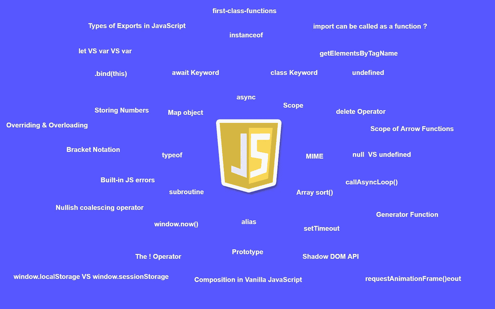

## **1。以下哪个先打印？**

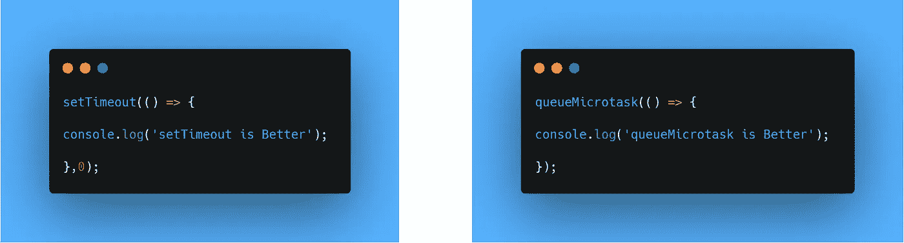

*   第二种情况是答案*(打印 queueMicroTask 更好)*，因为来自 *queueMicroTask* 的任务在**调用栈**为空之后，调用**事件循环**之前被调用，而在**设置超时**的情况下，任务是**事件队列**的一部分。

## **2。控制台输出会是什么？**

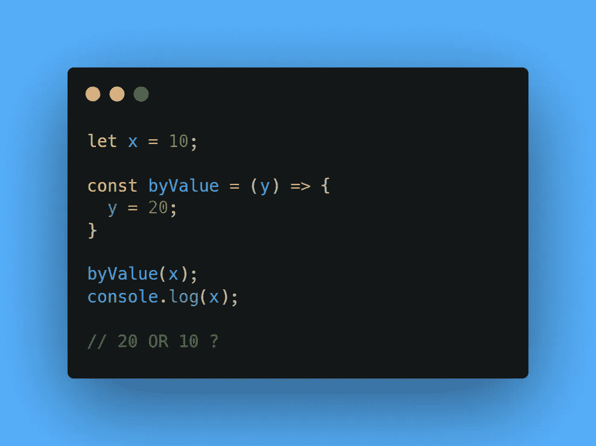

*   控制台输出将是 **10** ，因为类似于*对象*当原语被传递给一个函数时，只传递它们的值，而不是对内存位置的实际引用。这就是为什么更改只影响函数的**范围**内的参数。

## **3。控制台输出会是什么？**

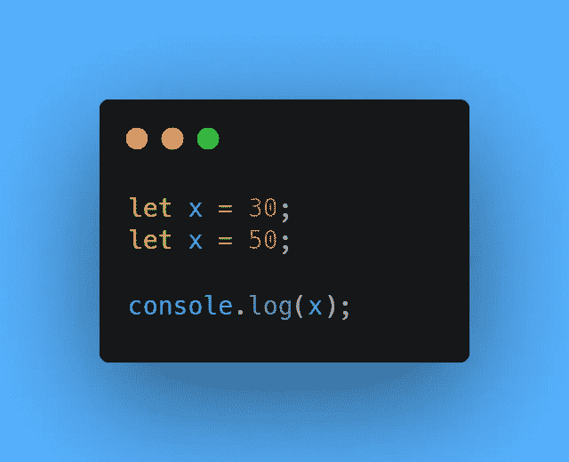

*   在这种情况下，控制台上会抛出一个**错误**，因为我们两次定义了同一个变量。然而，如果我们使用 **var、**定义相同的变量，控制台将返回 50 **。**同样，当用 **const 定义变量时，我们会得到同样的错误。**

## **4。*line 1*&*line 2*的控制台输出会是什么？**

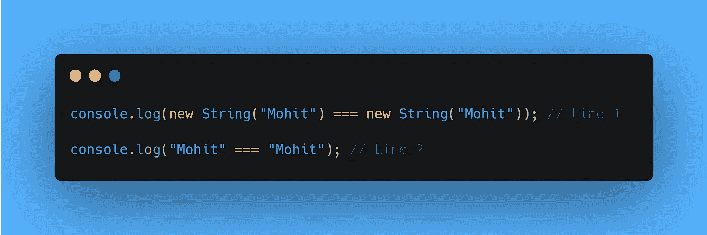

*   在第 1 行中，我们有两个相互比较的对象，它们都是唯一的，因此它会在控制台上记录 **False** 。
*   在 **Line2** 中，我们使用了 **===** 操作符来检查两个字符串原语，而不是字符串对象，因此我们得到了 **True** 。

## **5。控制台输出会是什么，为什么？**

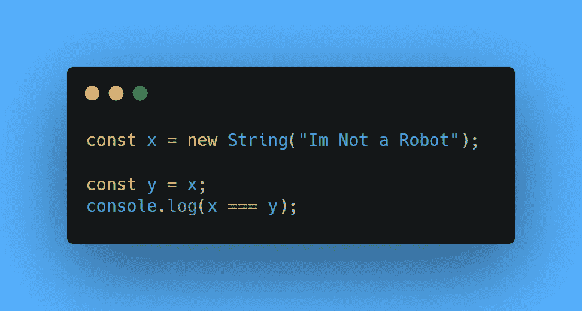

*   与前一个问题类似，我们比较了两个不同的对象。在这种情况下，只有一个唯一的**对象**，带有两个常量 **x** 和 **y** ，指向内存中唯一的**对象**，并在控制台上返回 **True** 。

## **6。JavaScript 中的*数组*是对象还是原语？**

*   在 JavaScript 中，我们处理的大多数东西都是对象，类似地，数组也是 JavaScript 中特殊类型的对象，它们拥有其他对象所没有的属性。

## **7。下面这个函数的返回类型是什么？**

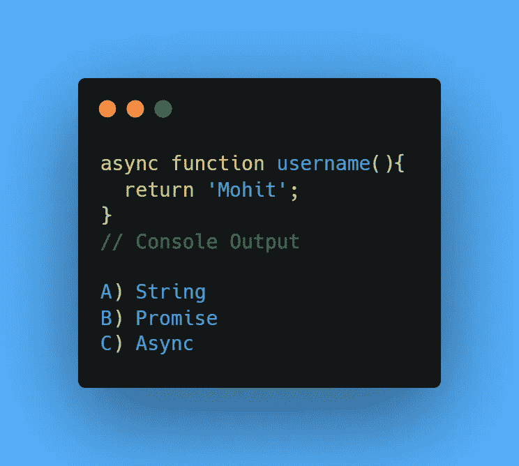

*   答案是 **B** ，因为异步函数在 JavaScript **中返回**承诺**。**

## 8.await 关键字阻塞应用程序中所有 JavaScript 代码的执行，直到等待的承诺被返回？

*   答案是**False**,**await**关键字只会阻止包含 *await* 关键字的特定函数内的代码执行。

## **9。下面打印的是什么？**

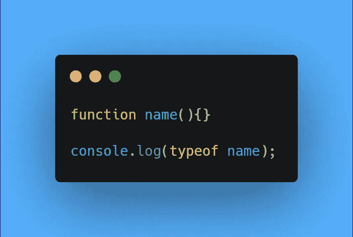

*   然而 JavaScript 中的函数是对象， **typeof** name 将打印**函数**。

## **10。以下是打印'*用户名*'的有效语法？**

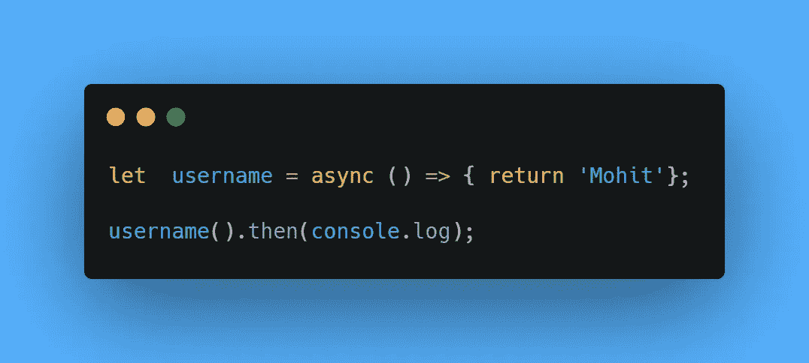

*   下面的语法是有效的，因为我们正在将一个 ***异步函数*** 的返回值传递给一个**回调**。

## 11。哪一个不是的*类型和*的*实例的区别？*

*   ***typeof*** 返回类型，而 ***instanceof*** 返回布尔值。
*   *的实例需要 TypeScript，*的类型不需要。**
*   *****typeof*** 取右边的变量名， ***instanceof*** 取左边和右边的值代替。**

**答案是 **B** ，因为它们都不需要 TypeScript，而且都是 JavaScript 自带的。**

## ****12。当所有的*承诺*都兑现时，下列哪一项解决？****

**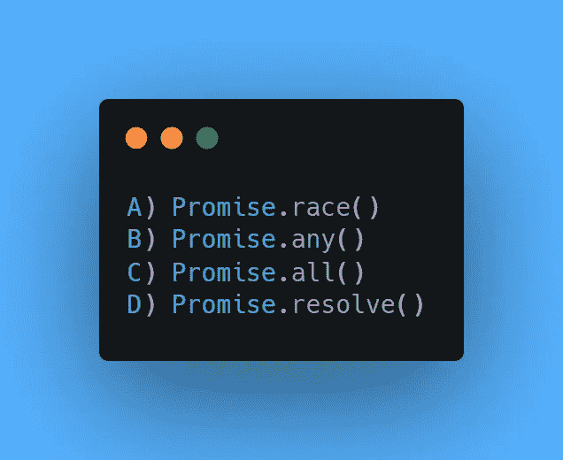**

*   **答案是 C， **Promise.all()** 在要求我们等待执行，直到所有的承诺都解决了的时候，还是相当有用的。**

## ****13。控制台输出会是什么，为什么？****

**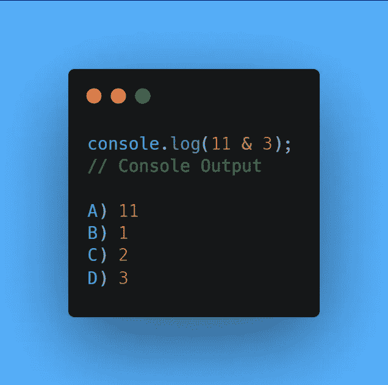**

*   **在这种情况下，我们有了与& **&** 运算符完全不同的 **&** 运算符。 **&** 是一个按位运算符，当我们比较 **11 和 3** 时，对于 **1011** 和 **0011** 在二进制中是一样的。因此，只有都为 1 的位保持为 1，返回的输出为 **0011** ，这是 **3、**的二进制表示，因此 3 记录在控制台上。**

## ****14。对象的价值是什么。[[原型]]？****

*   **目标**
*   **空**
*   **{}**

**答案是 **null** ，作为**对象的默认值。[[Prototype]]** 为 **null** ，在控制台上会返回 undefined。该对象位于原型链的顶端，当 browse 查找被访问属性的值时，它将遍历原型链，直到找到该值，或者直到不再有原型要遍历。**

## **15。无效合并运算符是做什么的？**

*   **当左边的操作数为空或未定义时，它返回右边的操作数。**

## ****16。getElementsByTagName 是 JavaScript 函数？****

*   **不， *getElementsByTagName* 是一个 **Web API** 函数，就像普通的 JS 函数一样可用。**

## ****17。当我们在 JavaScript 中使用事件委托时。****

*   **例如，当我们必须监听页面加载期间可能不存在的事件时，我们可以使用*事件委托*，并在父元素上提供一个事件处理程序并查看 **event.target.** 然而，如今现代前端框架和库使得这变得不那么必要了。**

## **18。以下哪一项不是内置的 JS 错误类型？**

**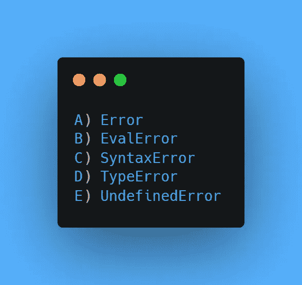**

*   **答案是 **E.****

## ****19。以下哪一项不是有效的承诺方法？****

**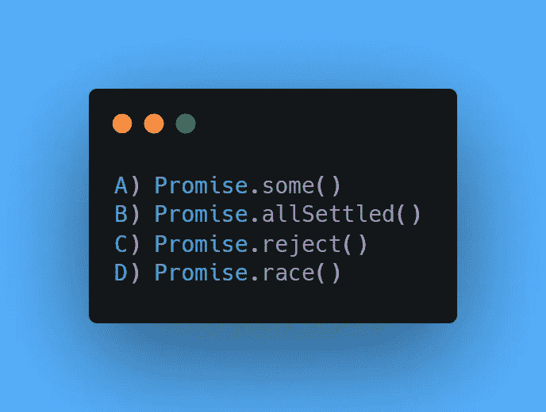**

*   **答案是 a。**

## **20。我们可以在字符串创建后修改它吗？**

*   **不会，因为**字符串**在 *JavaScript* 中是不可变的，指向一个字符串的变量可以赋给另一个字符串。**

## **21。promise 链中的嵌套 catch 可以捕获 promise 链中更高层的错误吗？**

*   **不，嵌套是一种控制结构，用于限制 catch 语句的范围。简而言之，嵌套的 catch 只捕捉其作用域及其以下的错误，而不捕捉嵌套作用域之外的更高层次的错误。**

## **22。控制台输出会是什么，为什么？**

**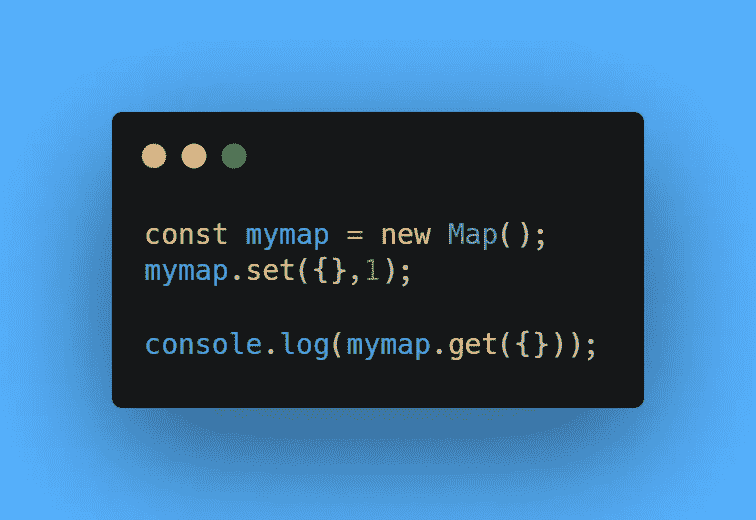**

*   **即使 **mymap.get({})** 是有效的语法，它也会在控制台上返回 undefined。因为 set 中的对象和 get 中的对象是内存中两个不同的空对象，因此 getter 不返回值。**

## ****23。控制台输出会是什么，为什么？****

**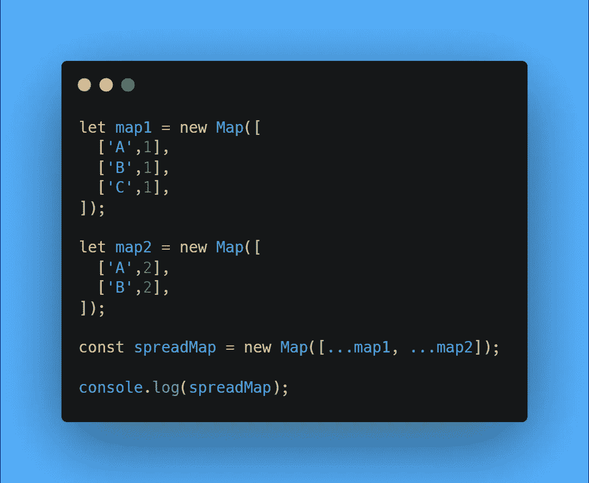**

*   **控制台输出将是 **map{'a' = > 2，' b' = > 2，' c' = > 1}，**，这意味着第二个 Map 中所有相同的键将覆盖第一个 Map 中的键。**

## ****二十四。括号符号可以像点符号一样链接吗？****

*   **是的， **obj.prop1.prop2** 和 **obj['prop1']['prop2']** 是等价的。**

## ****25。什么类型的属性出现在 for…in 循环中？****

**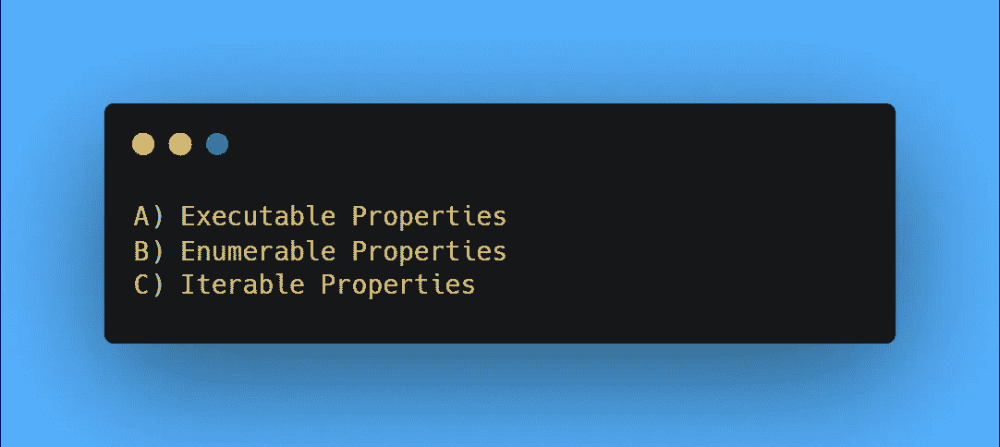**

*   **答案是 **B，可枚举属性。****

## ****26。下面打印的是什么？****

**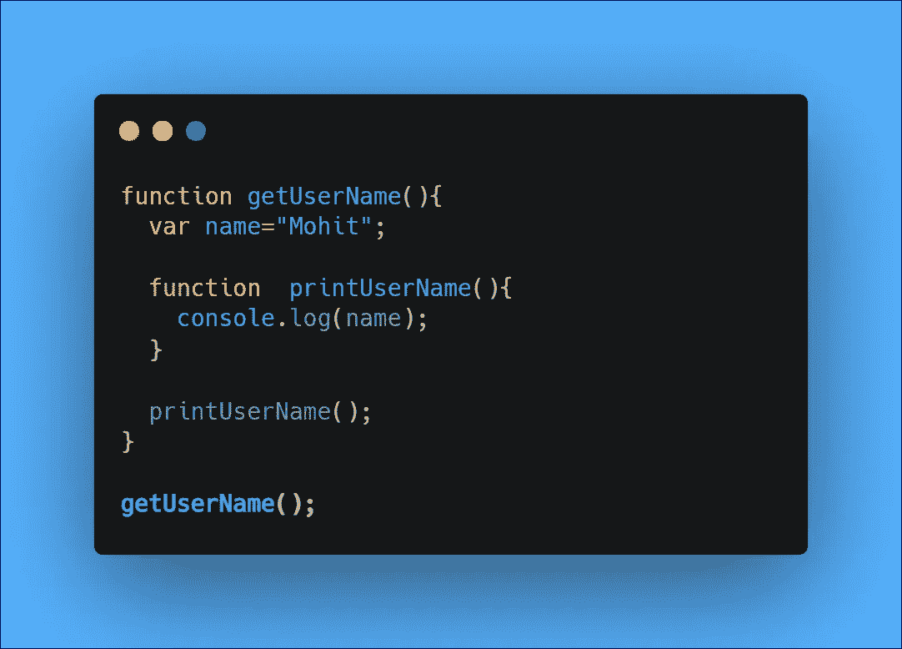**

*   **控制台输出将是***【Mohit】****，*因为内部函数可以访问外部作用域中声明的变量。**

## ****27。函数引用自身进行递归的三种方式是什么？****

*   ****函数名**，一个**作用域内**变量，使用 [**参数引用函数&。**](https://developer.mozilla.org/en-US/docs/Web/JavaScript/Reference/Functions/arguments/callee)**

## ****28。JavaScript 支持重载吗？****

*   **不， ***JavaScript*** 本身不支持重载，但是 ***TypeScript*** 支持。但是，在 JavaScript 中，当没有将所有可能的参数传递给函数时，可以通过让函数返回不同的输出来执行重载。**

## ****29。return 语句在数组的 forEach 循环中做什么？****

*   **它不返回任何东西，如果你需要从循环中返回值，千万不要使用 forEach 循环。**

## **三十岁。 *RegExp* 没有任何属性。对吗？**

*   **不， **RegExp** 有很多属性比如**。标志**和 **.global.****

## ****三十一。控制台输出会是什么？****

**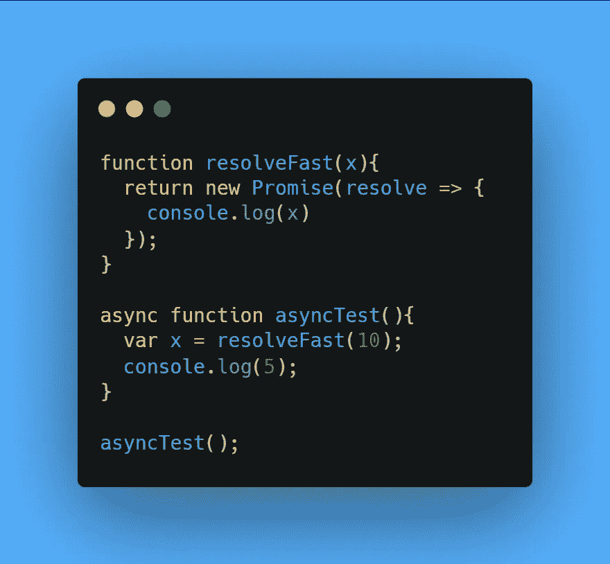**

*   **控制台输出将是 **10** 和 **5** ，因为该函数在承诺中没有*异步，承诺同步解析*。****

## ***32.哪个函数在浏览器下一次重画显示之前执行指定的代码块？***

***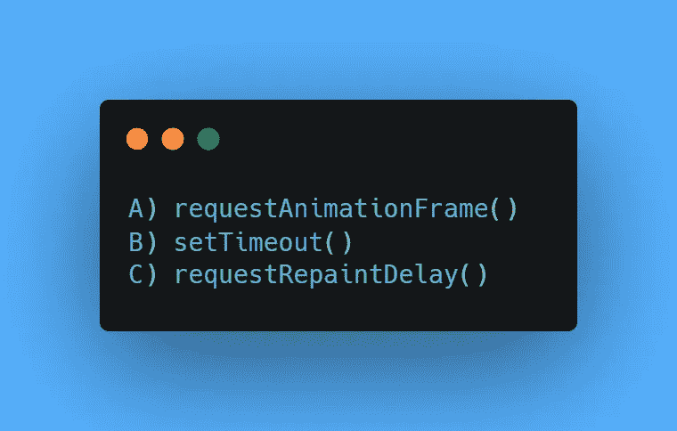***

*   ***requestAnimationFrame()。***

## ***33.为什么在导入模块时使用别名？***

*   ***大多数情况下，我们处理简单的导入，使用默认的命名约定，除此之外，有时我们不得不处理更长的导入，其名称不能正确表达代码的功能。在这种情况下，使用别名很有帮助。***

## ***34.使用 reducer 函数从一组数字中找出最小值。***

***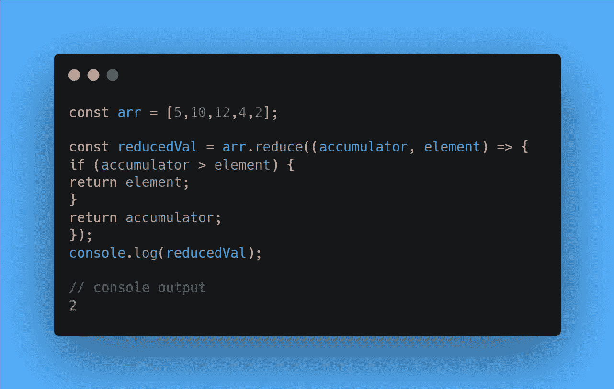***

## ***35.JavaScript 中的子程序是什么？***

*   ***子例程是在主例程中遇到的函数，然后保存到对象中，以备后用。 ***例如*** 执行范围(**变量、**等)与子程序一起存储。***

## **36.我们可以使用 eventHandlers 剪切和复制来阻止用户将内容从浏览器复制到剪贴板吗？**

*   **是的，这些事件处理程序是 ***Web API*** 的一部分。**

## **37.创建新对象的三种可能方式是什么？**

*   ****new Object()**&**Object . create()**和 **literal notation** ，这里我们这样定义对象——(**const obj = { a:2 }**)。**

## **38.控制台输出会是什么，为什么？**

**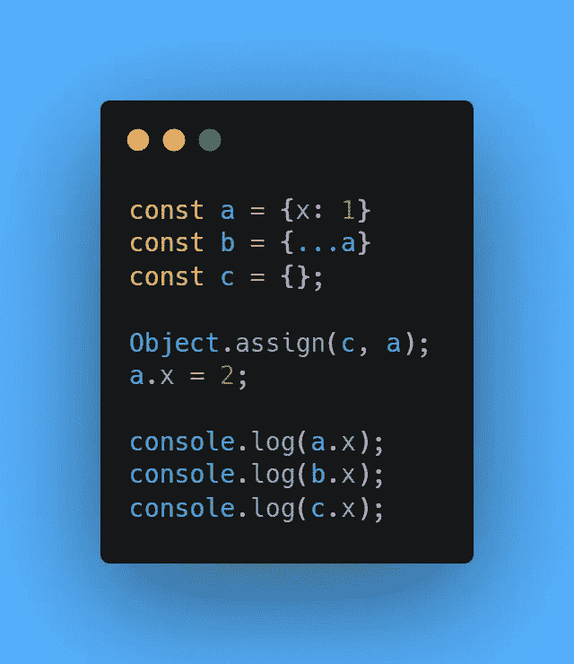**

*   ****a** 被分配给一个对象， **b** 使用 spread 运算符被分配给 **a** ，这意味着 **a** 和 **b** 在技术上是相同的。**
*   ****c** 只是一个空对象。**
*   **使用 **Object.assign()，c 现在被赋值**到 **a，**之后，我们将 **a** 中 **x** 的值改为 **2。****
*   **控制台输出将是 **2，1，1** 。**

## **39.Object.freeze()是做什么的？**

*   **它阻止添加新属性。**
*   **它防止改变对象的原型。**
*   **它防止更改属性值。**
*   **它防止更改属性的可写性。**

## **40.event.target 与 event.currentTarget 有何不同？**

*   ***event.currentTarget* 随着事件冒泡而变化，而 *event.target* 保持不变。**

## **41.数组 sort()方法的默认排序是什么？**

*   **按字符值从最小到最大。**

## **42.什么是竞争条件？**

*   **当两个线程或者 ***异步*** 进程为了更新某个共享状态，必须完成自身，否则就会出现 bug 或者不想要的结果。**

## **43.JavaScript 中的 class 关键字是做什么的？**

*   **只是语法糖让 JavaScript 更加*面向对象，即使使用了 ***class*** 关键字，JavaScript 依然使用原型继承。***

## **44.queueMicrotask 队列中的任务以后进先出的方式执行。这是真的吗？**

*   **不，任务按先进先出的顺序执行。**

## **45.什么是影子 DOM API？**

*   ***Shadow DOM API* 提供了一种将隐藏的独立 DOM 附加到一个元素上的方法，该元素不能通过通常的 **JS DOM** 操作 API 来访问。它提供了 **Web 组件**的封装。**

## **46.哪种方法用于将阴影 DOM 树附加到指定元素并返回对其阴影根的引用？**

*   **Element.attachShadow()。**

## **47.控制台输出会是什么，为什么？**

**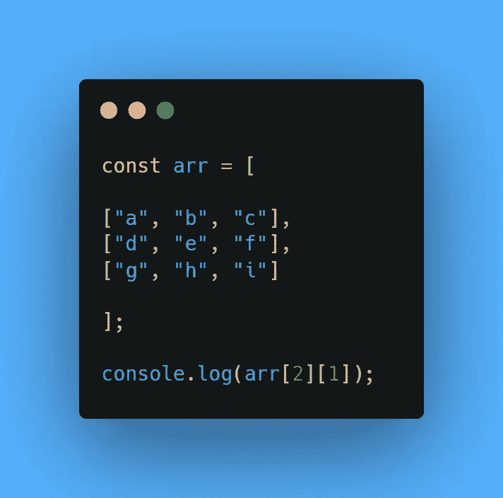**

*   **它返回 **h，**，因为在 JavaScript 中数组是从零开始的，因此 **arr[2][1]** 将访问外部数组的第 3 个元素和内部数组的第 2 个元素，这给出了值 **"h"** 。**

## **48.window.localStorage 和 window.sessionStorage 有什么区别？**

*   **它们都将**键/值**对存储在 web 浏览器中，但是**会话存储**会在浏览器关闭后删除。**

## **49.的！运算符返回一个布尔值。这是真的吗？**

*   **是的，例如在一个 ***if 语句中*** 需要在求值中返回一个布尔值，比如 **if(a！== b)** 。**

## **50.JavaScript 中哪个 ES6 函数返回新数组？**

*   **map() & filter()。**

** [## 掌握 JavaScript 编码面试的 55 个问题

### JavaScript 编码面试问题:第 2 部分

mohit19.medium.com](https://mohit19.medium.com/55-questions-to-master-the-javascript-coding-interview-ba49f7b2065a)  [## Web 应用程序的 6 种前端优化技术

### 构建极快的 Web 应用程序

javascript.plainenglish.io](/6-front-end-optimization-techniques-for-web-applications-6bcde2c42905)  [## 你需要知道的面向对象 JavaScript 的 7 个概念

### 像专业人士一样使用 JavaScript

javascript.plainenglish.io](/7-concepts-of-object-oriented-javascript-you-need-to-know-5634363f6fdc)  [## 学习 JavaScript 时不应错过的 4 个概念

### 刷新基本的 ES6 JavaScript 概念

javascript.plainenglish.io](/4-concepts-you-shouldnt-miss-while-learning-javascript-2906d2571f1e)  [## 每个软件开发人员都应该知道的 9 条编程原则

### 很好地了解干净代码的编程原则

javascript.plainenglish.io](/9-programming-principles-every-software-developer-should-know-9fffe3c5258)**