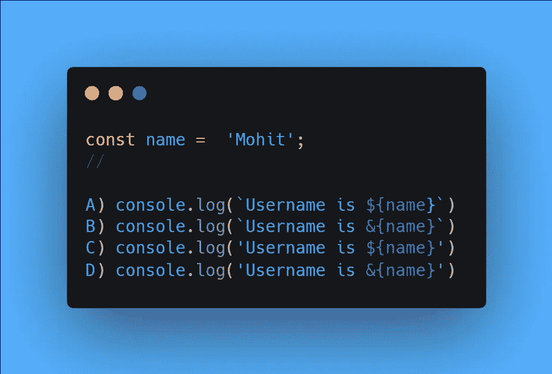
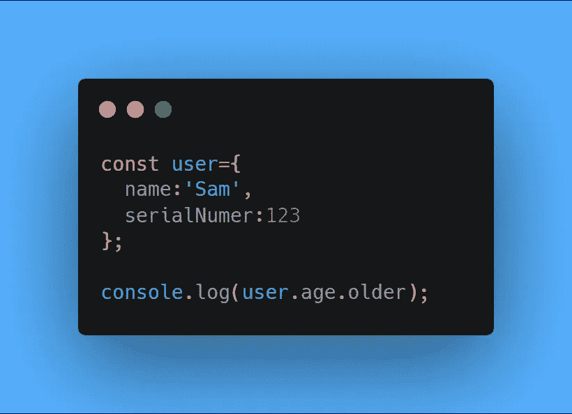

# 掌握 JavaScript 编码面试的问题(第 2 部分)

> 原文：<https://javascript.plainenglish.io/55-questions-to-master-the-javascript-coding-interview-ba49f7b2065a?source=collection_archive---------8----------------------->

55 个 JavaScript 编码面试问题。

## 1.是什么使这两个给定的函数不同？

*   在**名**的情况下，我们有 **void** 关键字，该关键字简单地允许执行可能不执行的功能，并在控制台上打印出“ **Andrew** ”。
*   但是在**姓**的情况下，没有 ***void*** 关键字，很可能会在控制台上产生错误。

## 2.NodeList 与 Array 有何不同？

*   NodeList 是 **Web API** ，Array 是 **JavaScript API** 。
*   如果 **DOM** 被更新，节点列表属性可以是更新的实时属性。
*   许多数组函数在 NodeList 上不可用。

## 3.JavaScript 能用 Number 原语可靠表示的最大整数是多少？

*   2⁵³-1.

## 4.哪个函数将字符串修改为符合 URI 标准？

*   encodeURI()。

## 5.在 JavaScript 中如何将 64 位分配给一个用来存储数字的数字？

*   **52 位**专用于数值， **11 位**专用于指数， **1 位**专用于符号。

## 6.null 和 undefined 有什么区别？

*   ***未定义*** 表示变量没有值，因为开发者还没有给它赋值。
*   而 ***null*** 表示该变量被有意设置为没有值。

## 7.super 关键字不能在构造函数之外使用。

*   不，我们可以用它。例如，**super . functiononparent([arguments])**可用于调用**对象**的父对象上的函数，如果该函数已被子对象覆盖。

## 8 获取主题对象颜色值的两种方法是什么？

*   在 *JavaScript* 中，我们有两种方法来访问对象中的值。使用**点**和**方括号**符号，我们可以很容易地访问对象内部的值。
*   然而，这两种方法都有自己的用例，它们的工作方式几乎相同。
*   在这种情况下，**theme . color**&**theme【颜色】**将是解决方案。

## 9.JavaScript 运行时中的栈是什么？

*   堆栈就是函数调用如何存储在 *JavaScript* 中，堆栈是**后进先出**，这意味着最近添加的函数必须首先执行。
*   最近的函数调用位于堆栈顶部，必须在下一个函数调用完成之前执行并弹出*堆栈*。当一个函数调用另一个函数时，新调用的函数被放在栈顶。

## 10.控制台输出会是什么？

*   控制台输出将是 **Map{} a:1，**作为**路线图。b** 在**路线图对象**上设置 **b** 的值，但是 **b** 没有以与地图结构交互的方式设置。

## 11.面向对象编程的主要好处是什么？

*   代码是模块化的，这使得能够独立于应用程序的其余代码来维护类的源代码。例如，如果应用程序的产品类需要伸缩，那么应用程序的其余代码就不会有任何问题。
*   一个对象的代码是私有的，这意味着其他对象只与一个对象的方法交互来隐藏内部代码。
*   对象很容易重用，可以插入代码的多个部分。

## 12.JavaScript 中只能扩展自定义类和对象？这是真的吗？

*   不可以。例如，自定义 ***类、*** 和 ***对象扩展*** 对象或任何内置对象都可以被扩展。

## 13.只要创建了实例，就可以在类中的任何地方访问实例级变量。

*   不，不能在静态方法中访问实例级变量。

## 14.长度是字符串的方法和数组的属性。这是真的吗？

*   不， ***length*** 是字符串上的属性，数组上的方法。

## 15.function.call 的第一个参数是什么？

*   调用函数的是实例*对象*。例如，**user . full name . call(user 1)**其中 **user1** 具有调用 **user.fullName** 函数所必需的属性。

## 16.authUser 是什么类型的函数？

*   闭包&一个内部函数。

## 17.如果有多个参数，箭头函数只需要括号？

*   不，如果没有参数，箭头函数也需要括号。如果只有一个参数，那么括号是可选的。

## 18.类级变量可以在类中的任何地方访问。

*   是的，类级变量可以在任何方法中访问，包括静态方法和构造函数。

## 19.重写和重载是哪个 OOP 原则的例子？

*   多态性。

## 20.静态变量不能在非静态方法中修改。这是真的吗？

*   不，非静态方法可以用**类引用和修改静态变量。静态**语法。

## 21.JavaScript 中“一级函数”是什么意思？

*   这允许函数作为**参数**传递，从函数返回，等等。

## 22.异步函数放在什么样的队列中？

*   事件队列。

## 23.JavaScript 为时间流逝后的代码执行提供了哪三个函数？

*   setTimeout()、setInterval()& requestAnimationFrame。

## 24.如果我们必须测量代码块的执行时间，可以使用什么 Web API？

*   performance.now()。

***例如:***

## 25.什么是哑剧类型？

*   MIME 类型是与指示文件类型的文件一起发送的字符串。
*   例如，用 JSON 文件发送的 MIME 类型是**‘应用程序/JSON’**。

## 26.哪个函数属性返回函数期望的参数个数？

*   功能.长度

## 27.如何在普通 JavaScript 中使用复合(没有类型脚本)？

*   创建不是任何对象上的方法的函数，并使用 **Object.assign(obj)** 将所需的函数分配给 **obj** 作为 **obj** 上的方法。

## 28.控制台输出会是什么？

*   它进入了一个无限循环。

## 29.JavaScript 中数组的最大大小是多少？

*   2³²-1.

## 30.如果我们调用的函数的参数少于声明的参数数量，那么会给缺少的参数赋什么值呢？

*   未定义。

## 31.什么是事件捕获阶段？

*   事件触发其祖先**(窗口、分区等)**到最细粒度元素的阶段。

## 32.下面给出的代码片段有什么区别？

*   **Line1** 使用隐式强制， **Line2** 使用显式强制。

## 33.网页浏览器中布局时间和绘画时间有什么区别？

*   布局时间是计算将被绘制的每个对象的位置所花费的时间，它是一个 **3D** 构造。
*   绘制时间是在屏幕上绘制点所花费的时间，它是一个 **2D** 构造。

## 34.控制台输出会是什么，为什么？

*   控制台输出将是 **3，4，，5** 。注意数组可以有空点，上面数组的值是**【3，4，*空【T26，5】***。

## 35.我们如何避免网络调用中的竞态条件？

*   一种可能的解决方案是在网络调用中创建令牌或使用 cancel API，当发出新请求时，它会取消以前的请求。

## 36.什么是纯函数？

*   如果给定相同的输出而没有任何副作用，则该函数总是返回相同的输出。

## 37.什么是 currying？

*   将具有多个参数的单个函数转换为使用单个参数多次调用的函数。

## 38.控制台输出是什么，为什么？

*   输出将是 **30** ，因为内存中对用户对象的引用被传递给 **byRef** 函数。这意味着在 **byRef** 函数中对对象所做的所有更改都会影响底层对象。

## 39.控制台输出会是什么？

*   控制台输出将是**而不是 X** ，在这种情况下，变量在一个**if语句的求值中被赋值。**

## 40.从 JS 角度看 DOM 的技术定义是什么？

*   根据 ***MDN Web Docs*** :“连接节点的树状结构，表示出现在标记文档中的文本的不同元素和字符串”。

## 41.以下哪一项是正确的字符串插值语法？

*   正确的解决方案是 **A** ，使用*反勾*字符**(`)**和*美元符号* **($)** 我们可以在条件用例中呈现字符串。
*   控制台输出将是**用户名是 Mohit。**

## 42.在哪个模式中，一个对象的实例总数被限制为一个？

*   单身。

## 43.什么窗口方法允许你在浏览器内存中存储持久键/值对？

*   窗口/本地存储。

## 44.什么时候删除操作符不从对象中删除属性？

*   当对象被创建为不可配置时，删除运算符不能从对象中删除属性。

***例如:***

## 45.使用哪些方法来调用以获取对象的属性？

*   object . getownpropertymanames & object . getprototypeof。

***例如:***

## 46.使用一个字符来防止错误。

*   在这个问题中，我们可以使用可选的链接来防止错误。

***例如:***

## 47.哪些数组函数在 NodeList 上不可用？

*   forEach()。

## 48.WeakSet 对象是弱的’是什么意思？

*   根据 ***MDN Docs*** :“如果不存在对 WeakSet 中存储的对象的其他引用，则这些对象可以被垃圾收集”。

## 49.控制台输出会是什么？

*   **-无穷大**，因为 0 和-0 在内存中有两个不同的值，这是由于数字的存储方式。

## 50.JavaScript 运行时堆是什么？

*   堆是存储对象的内存区域。

## 51.在字符串文字值上调用字符串对象方法时，JavaScript 如何处理？

*   根据***MDN Docs***:“JavaScript 自动将字符串文字转换为临时字符串对象，调用方法，然后丢弃临时字符串对象”。

## 52.控制台输出会是什么？

*   控制台输出将是 **{tag1:1，tag2:2}** 。

## 53.Map.delete(key)返回什么？

*   如果*键*被删除，则返回**真**，如果*项*不存在且未被删除，则返回**假**。

## 54.在 JavaScript 中，对象只能有一个子类，但可以有无限个父类。这是真的吗？

*   不，对象只能有一个父类，但有无限个子类。

## 55.控制台输出会是什么？

*   在这个例子中， **nameMethod** 中的 *this* 关键字没有限定在实例级别。

 [## 掌握 JavaScript 编码面试的问题(第 3 部分)

### 11 个 JavaScript 编码面试问题。

mohit19.medium.com](https://mohit19.medium.com/questions-to-master-the-javascript-coding-interview-part-3-7f26339f9caf)  [## 掌握 JavaScript 编码面试的 50 个问题

### JavaScript 编码面试问题:第 1 部分

javascript.plainenglish.io](/50-questions-to-master-the-javascript-coding-interview-639d2ac12630) 

*更多内容尽在*[*plain English . io*](http://plainenglish.io/)