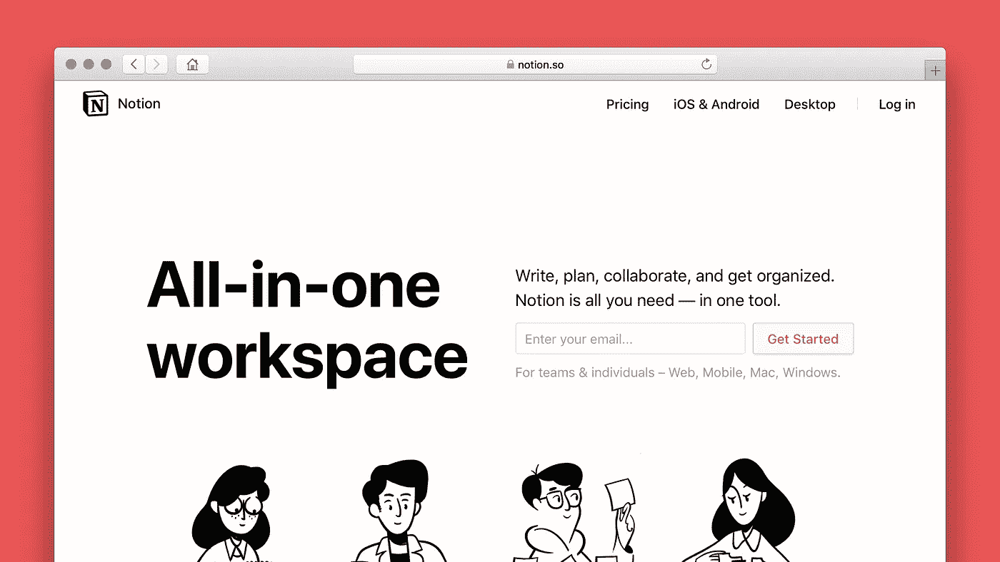

# 6 款应用程序可大幅提升您的工作效率，帮助您实现更多目标

> 原文：<https://javascript.plainenglish.io/6-apps-to-supercharge-your-productivity-help-you-achieve-more-4b00a0fbc912?source=collection_archive---------21----------------------->


Photo by [bruce mars](https://unsplash.com/@brucemars?utm_source=medium&utm_medium=referral) on [Unsplash](https://unsplash.com?utm_source=medium&utm_medium=referral)

上周，我分享了如何在这个远程工作的新时代保持工作效率。本周，我将更进一步，分享一些能帮助你最大限度提高生产力的工具。

## **1。** [**Pomofocus.io**](https://pomofocus.io)

Pomofocus 是一个基于我上周提到的 Pomodoro 技术的计时器应用程序。这太棒了，因为即使番茄工作法推荐 4 次 25 分钟的工作和 5 分钟的休息周期，你也可以设定一个定制的工作/休息时间来迎合你自己的喜好和要求。


我真正喜欢的直播功能的一个很大的特点是，当计时器停止时，一个听得见的不显眼的警报会响几秒钟&它会自动停止。以防万一，你仍然在工作，你不必停下来让计时器静音。

Pomofocus 也很好地利用了 web 浏览器标题标签。你不需要点击进入应用程序来查看你还剩多少时间。一眼就能看出你还剩多少时间。简单而有效，引人注目但不格格不入。


## 总体评分:8.5/10 ⭐️

## 2. [MTMR](https://github.com/Toxblh/MTMR)


当 MacBook Pro 推出 TouchBar 时，他们受到了铺天盖地的批评。如果你浏览论坛，你会发现大多数人要么讨厌要么不喜欢 MacBook Pro 上的 touch bar。这个原因源于人们认为在 13-16 英寸的设备上浪费宝贵的空间。

另一方面，我曾经是他们中的一员，直到我发现了 MTMR。MTMR 代表我的 TouchBar 我的规则，我绝对喜欢它&摆弄设置后的 TouchBar。

MTMR 为我们许多人(过去)讨厌的又旧又无聊的 TouchBar 提供了一个世界水平的定制。


vanilla TouchBar


MTMR TouchBar

上面显示了实现自定义预设(也可以在 GitHub 中获得)之前和之后的情况，这大大增加了 TouchBar 的味道。


My Current TouchBar

> 在最左边，我们有两个亮度按钮，类似于旧的 Macbook Pros。
> 
> 中间是 Spotify HUD 上的当前播放和一些媒体控件
> 
> 最后，在右边我们实际上有一个番茄定时器，在工作时拥有它绝对令人愉快(参考第 1 点)

MTMR 使用一个简单的 [*JSON*](https://en.wikipedia.org/wiki/JSON) 文件来排列、调整和显示你 TouchBar 上的项目。你可以在他们的[网站](https://github.com/Toxblh/MTMR-presets/blob/master/README.md)上找到许多预置，或者如果你喜欢我的，你可以通过下面的链接使用它。

```
🔗 [https://gist.github.com/T31K/b101827b105d781a4a97aaa264ced891](https://gist.github.com/T31K/b101827b105d781a4a97aaa264ced891)
```

作为一个*强迫性歌曲的主唱*，拥有一个带有媒体控件的永久显示的触摸栏，并且不用与 Spotify 交换窗口，这是非凡的。

## 总体评级:8/10 ⭐️

## 3.[理念](https://www.notion.so/)



这应该在许多其他人的名单中，但我似乎不能排除它，主要是因为我的生活有多少是围绕着它，在把它都设置好之后。

如果这是一个商业或合作的作品，你必须为概念支付费用，但是对于个人使用，它是完全免费的，并且在它提供的特性方面没有很大的限制。🤑

ideas 对开发人员非常友好，所以如果你熟悉[降价](https://guides.github.com/features/mastering-markdown/)的方式，你会玩得很开心。然而，即使你没有，概念对你来说也不够友好。使用了几个小时后，我发现自己很快就学会了，不用去上任何无聊的 tutoria l 课程。

有了概念，您可以相对容易地构建页面，就像创建一个新的 Word 文档一样。在这几页里。您可以通过输入以下命令来创建块

```
/to-do
/callout
/h1
/h2
/code
```

说真的，我从未见过如此流畅和直观的 ToDo/项目管理应用程序，以至于我现在无法想象没有它的生活，我甚至一直把它显示在第二个显示器上。

idea 还提供了大量设计精美的页面，您可以通过[免费下载](https://notionpages.com/)。我根据它的模板定制了我的每周计划，这样它在视觉上很有吸引力，并且能够一目了然地提供一个清晰简洁的概述。


## 总体评级:9.5/10 ⭐️

## 4.[平衡](https://www.balanceapp.com/)


随着人们意识到自己的精神健康比检查工作中的待办事项清单更重要，冥想变得越来越普遍。

我曾亲自尝试过市场上为数不多的几个顶级冥想应用程序，发现 Balance 与其同类产品相比简直是独一无二的。

Balance 采用智能算法，让您的冥想之旅个性化。尽管您可能正在复习相同的练习，但随着您的进步，您的*冥想教练*知道您已经进步，并将调整后续课程以适应您提高的水平。


how Balance’s personalization works

Balance 也有一个非常令人满意的 UI/UX，它带来了一种平静和宁静的感觉，我认为这适合于冥想应用。这个应用程序非常混乱，而且非常容易使用。

您通过回答几个问题开始您的平衡之旅，有了这些答案，平衡会推荐一个计划供您遵循。我发现它们质量一流，结构非常好，由冥想专家针对您的水平进行了全面规划。

今年(2021)也是免费的，现在就去看看吧！

## 总体评分:9/10 ⭐️

## 5.[磁贴](https://freemacsoft.net/tiles/) (macOS)

瓷砖是另一个很棒的工具，你将学会爱它，并且离不开它。


只需将你的窗口拖到应用程序称之为“热点”的地方，你当前的应用程序窗口就会贴紧边缘并自行调整大小。与它在 Windows 操作系统上的工作方式完全相似。

除此之外，它还在菜单栏上有一个易于访问的按钮，可以轻松选择您想要的尺寸。另一个很好的特性是当你使用两台或多台显示器时，它允许你通过点击或热键将一个窗口直接发送到另一台显示器。


这个概念很简单，但我发现它有助于更愉快、更有效地重组空间。

## 总体评分:8/10 ⭐️

## 6. [MacMouseFix](https://mousefix.org/)

如果你像我和 ***一样喜欢*** 苹果产品，你可能也会喜欢你在使用 Mac 电脑时最先进的手势控制。搭配魔法轨迹板或魔法鼠标，可能性是无限的，体验是其他设备无法比拟的。

然而，苹果 Magic Mouse 鼠标的人体工程学在长期使用后很差，使用触控板进行照片编辑也不太合适。


Mac 鼠标修复确实如其名所示。它可以修复你的鼠标。不是说它有什么问题，但基本上市场上的大多数鼠标都已经实现了侧按钮，这非常方便，尤其是如果你喜欢使用 Mission Control 和 Spaces 在 macOS 上的桌面之间切换。


用户界面非常简单*，它从简单的拖放安装和一些配置开始，用神奇鼠标/触控板的超能力为你舒适的&人体工程学鼠标增压。*

## *总体评分:8/10 ⭐️*

## *结束语*

*希望你阅读愉快，并发现这些提示很有帮助。感谢迄今为止所有的支持，我希望继续提供好的内容。*

*一定要看看我更新的作品集网站，上面有我的故事@[*https://t31k.dev/blog*](https://t31k.dev/blog)的列表*

**注意安全，直到下一次，**

*蒂姆。*

**更多内容请看*[*plain English . io*](http://plainenglish.io/)*