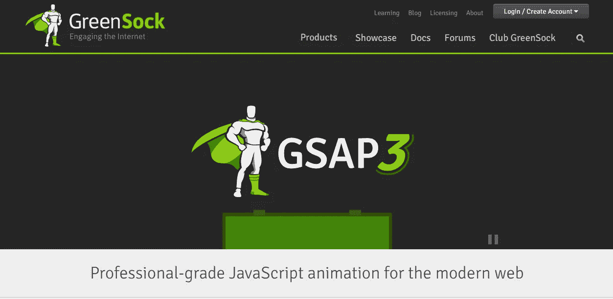
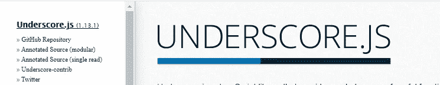
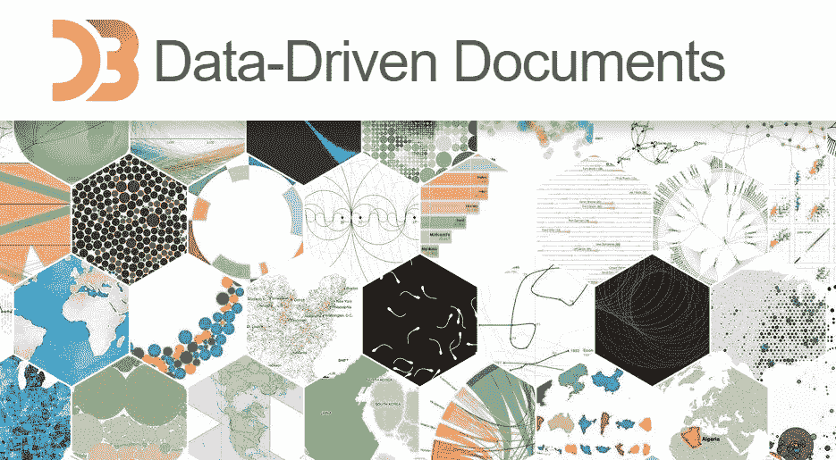
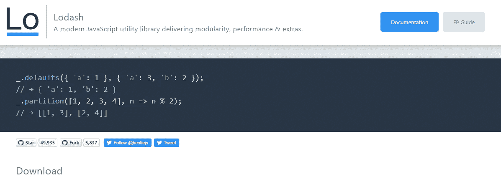
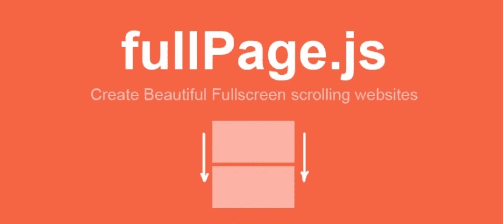

# 6 个超棒的 JavaScript 库加速编码过程

> 原文：<https://javascript.plainenglish.io/6-awesome-javascript-libraries-to-speed-up-the-coding-process-d75acf4dfd5f?source=collection_archive---------9----------------------->

## 开发人员可以使用的有用 JavaScript 库列表。

Photo by [Árpád Czapp](https://unsplash.com/@czapp_arpad?utm_source=medium&utm_medium=referral) on [Unsplash](https://unsplash.com?utm_source=medium&utm_medium=referral)

JavaScript 在过去几年中有了很大的改进。现在我们有了许多可以在代码中使用的出色特性。除此之外，如果你看一看 JavaScript 生态系统，你会发现有很多有用的库和框架。

使用框架和库将使您能够加快 JavaScript 的开发过程。这就是为什么在这篇文章中，我会给你一个 2021 年可以使用的一些很棒的 JavaScript 库的列表。所以让我们开始吧。

# 1.GSAP

GSAP 是动画领域最受欢迎的 JavaScript 库之一。GSAP 是最好的动画库，它可以让你创建超级棒的动画，让你的用户惊叹不已。

只是在你的网站上添加动画时不要太疯狂。这是你需要记住的规则。

Capture by the author from [GreenSock(GSAP)](https://greensock.com/gsap/)(link goes outside Medium).

# 2.强调

[underscript . js](https://underscorejs.org/)是一个很棒的 JavaScript 库，它允许你使用许多不同的函数来执行 JavaScript 中的各种编程任务。

这个工具库创建于 2009 年，几乎兼容所有的浏览器。很老了，但是很多开发者还在用。

Capture by the author from [Underscore.js](https://underscorejs.org/)(link goes outside Medium).

# 3.Chart.js

[Chart.js](https://www.chartjs.org/) 是统计方面最好的开源 JavaScript 库。这个库是为那些想在项目中添加好看的图表和图形的开发人员准备的。

这是完成这类任务的最佳库，而且也很容易学习和实现。

Capture by the author from [Chart.js](https://www.chartjs.org/)(link goes outside Medium).

# 4.D3.js

D3.js 是另一个著名的库，它允许你使用数据操作文档。当谈到网页上的数据可视化时，它是头号库。它支持 HTML、CSS 和 SVG。

D3.js 有很多功能，你可以查看他们的文档。

Capture by the author from [D3.js](https://d3js.org/)(link goes outside Medium).

# 5.洛达什

Lodash 是一个流行的实用程序库，允许开发人员在 JavaScript 中轻松处理数字、字符串、对象和数组。它于 2013 年发布，作为帮助开发人员节省时间的工具。

Capture by the author from [Lodash](https://lodash.com/)(link goes outside Medium).

# 6.全页. js

[fullPage.js](https://github.com/alvarotrigo/fullPage.js/) 是一个开源库，可以帮助你轻松创建只有一页的全屏滚动网站。这个库有很多有用的特性，比如自动滚动、添加滑块、延迟加载、框架支持等等。

Capture by the author from [fullPage.js](https://github.com/alvarotrigo/fullPage.js/)(link goes outside Medium).

# 结论

如您所见，这些是您可以使用的非常有用的 JavaScript 库。它们帮助你创造出令人惊叹的东西，而不需要从头开始编码。因此，您将节省时间并快速构建项目。

感谢您阅读这篇文章。希望你觉得有用。

**延伸阅读:**

 [## 你可能不知道的 6 个惊人的前端编码技巧

### 前端开发人员有用的编码技巧。

blog.devgenius.io](https://blog.devgenius.io/6-amazing-frontend-coding-tips-that-you-probably-dont-know-6fdfa2e2b264)  [## JavaScript 中 var、let 和 const 的区别

### 用例子解释 JavaScript 中的变量声明关键字。

javascript.plainenglish.io](/the-difference-between-var-let-and-const-in-javascript-630b5a8bb1c5) 

*更多内容尽在*[***plain English . io***](http://plainenglish.io/)