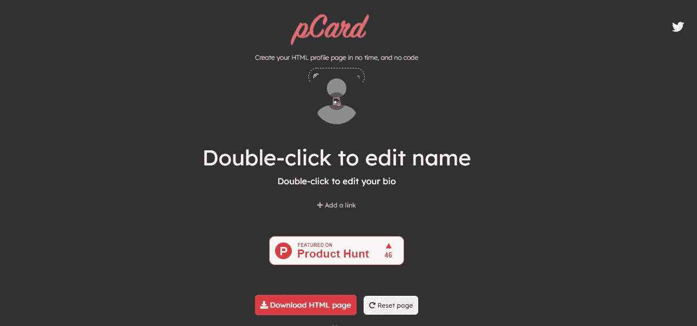
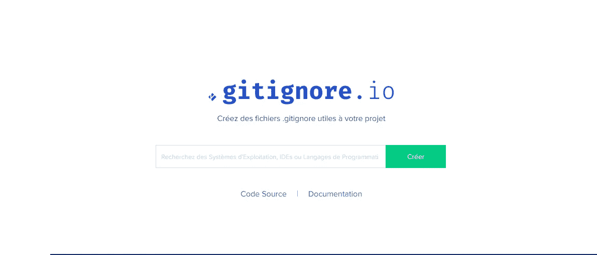
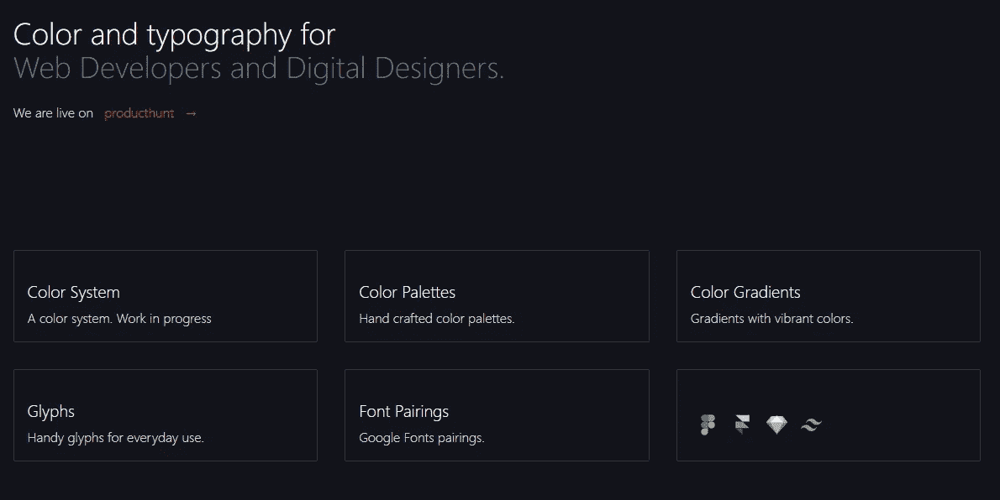
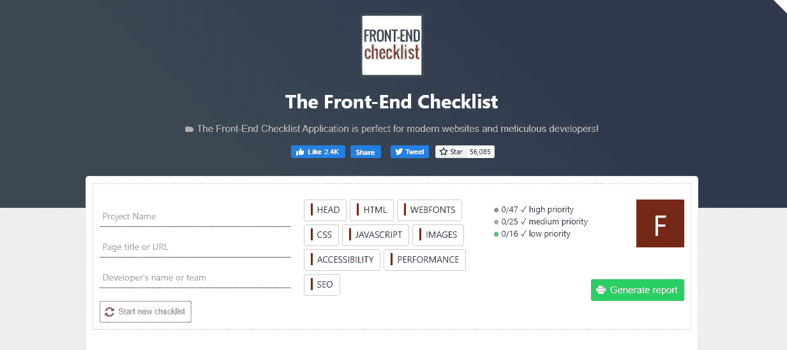
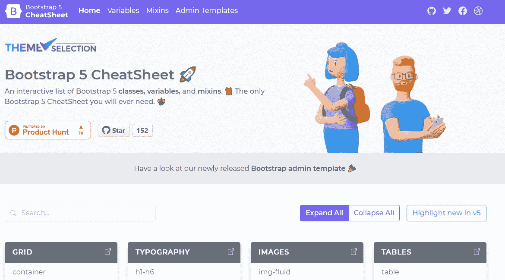
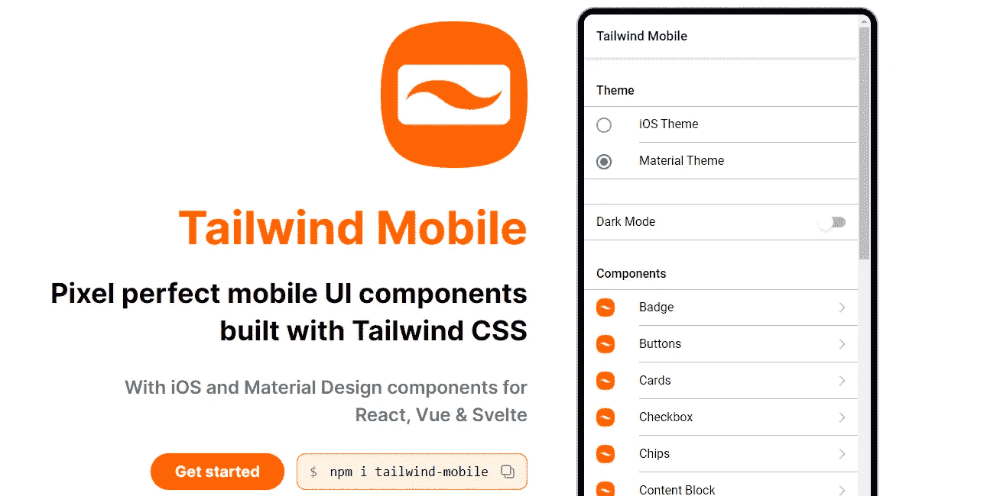

# 面向所有前端开发人员的 6 个优秀网站

> 原文：<https://javascript.plainenglish.io/6-awesome-sites-for-all-front-end-developers-d15835790796?source=collection_archive---------0----------------------->

## 你可能不知道的有用网站列表。

Photo by [Mohammad Rahmani](https://unsplash.com/@afgprogrammer?utm_source=medium&utm_medium=referral) on [Unsplash](https://unsplash.com?utm_source=medium&utm_medium=referral)

作为一名前端开发人员或一般的软件开发人员，您每天总是有许多任务要做。在大多数情况下，你会发现自己在简单的任务上花费了太多的时间。你不想这么做，因为在做项目时，你必须遵守时间表和截止日期。

幸运的是，网上有很多资源、工具和网站可以帮助你更快更有效地完成工作。所以，如果你想在工作中更有成效，你需要利用这一点。

在这篇文章中，我会给你一个很棒很有用的网站列表，你可以作为一个前端开发人员使用。让我们开始吧。

# 1.pCard

[pCard](https://xscoder.com/pcard/) 让你不用写任何代码就能轻松创建 HTML 个人资料页面。它就像一个拖放工具，让你能够下载 HTML 页面。

Capture by the author from [XScoder](https://xscoder.com/pcard/)(external link).

# 2.Gitignore

Gitignore 是一个很棒的工具，可以让你轻松地为你的项目创建`.gitignore`文件。

Capture by the author from [Toptal](https://www.toptal.com/developers/gitignore)(external link).

# 3.颜色和字体

[颜色&字体](https://www.colorsandfonts.com/)是一个很棒的网站，它列出了你可以在你的项目中使用的很棒的颜色和字体。颜色系统、调色板、颜色渐变、字体配对等等。

Capture by the author from [Colors & Fonts](https://www.colorsandfonts.com/)(external link).

# 4.前端清单

[前端清单](https://frontendchecklist.io/)对所有网页开发者来说都是非常有用的网站。当涉及到前端 web 开发时，它允许您学习并遵循规则。它告诉您在生成的报告中遵循所有前端 web 开发规则。

Capture by the author from the [Font-end checklist](https://frontendchecklist.io/)(external link).

# 5.自举 5 备忘单

这个[网站](https://bootstrap-cheatsheet.themeselection.com/)整理了一个有用的 Bootstrap 5 类、mixins 和变量的列表，你可以在你的下一个项目中使用它们。

Capture by the author from [Bootstrap 5 cheatsheet](https://bootstrap-cheatsheet.themeselection.com/)(external link).

# 6.顺风移动

[Tailwind Mobile](https://tailwind-mobile.com/) 是一个很棒的资源，附带了使用 Tailwind CSS 构建的有用的移动 UI 组件。

Capture by the author from [Tailwind Mobile](https://tailwind-mobile.com/)(external link).

# 结论

所以正如你在列表上看到的，这些都是一些很棒很有用的网站，大部分前端开发者可能都不知道。这就是为什么我想在媒体上与你分享它们。

*感谢您阅读本文。此外，如果你发现我的内容有用，而你不是一个媒体成员，你可以抓住你的媒体成员* [*这里*](https://mehdiouss.medium.com/membership) *(媒体推荐链接)获得所有内容的无限访问和支持我们作为作家。*

**延伸阅读:**

 [## 解决编码问题的 7 个有用的 JavaScript 代码片段

### 您经常需要使用的 JavaScript 代码片段。

javascript.plainenglish.io](/7-useful-javascript-code-snippets-for-solving-coding-problems-c146e768bb41)  [## 每个全栈开发人员都应该构建的 5 个令人敬畏的项目

### 激动人心的全栈项目，提高您的编码技能。

javascript.plainenglish.io](/5-awesome-projects-every-full-stack-developer-should-build-d50ff91d1654) 

*更多内容请看*[***plain English . io***](http://plainenglish.io)