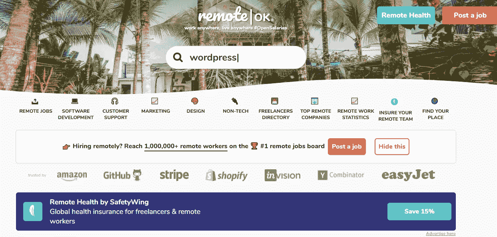
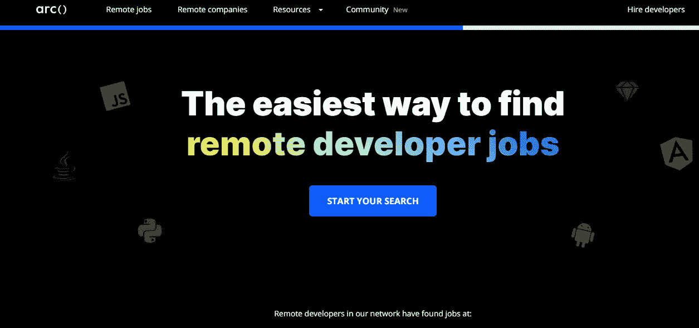

# 寻找远程开发人员工作的 6 个最佳地点

> 原文：<https://javascript.plainenglish.io/6-best-places-to-find-remote-developer-jobs-e1d4f58e4756?source=collection_archive---------10----------------------->

## 在这里您可以找到最新的远程开发人员工作。

Photo by [Nicole Wolf](https://unsplash.com/@joeel56?utm_source=medium&utm_medium=referral) on [Unsplash](https://unsplash.com?utm_source=medium&utm_medium=referral)

如今，很多公司都远程雇佣开发人员。远程工作变得越来越受欢迎，尤其是在这种很多人在家工作的情况下。你来自哪里并不重要。如果你作为一名开发人员拥有交付高质量工作的技能和经验，你很有可能可以在世界各地的公司远程工作。

然而，在我看来，获得一份远程开发人员的工作并不容易。你必须证明你非常适合你申请的任何公司。这就是为什么你需要专注于你的技能，通过建立令人敬畏的项目，你可以向世界展示。试着在网上有一个好的形象，这样当人们搜索你的时候，他们会知道你对你的工作有热情，你知道你在做什么。

在这篇文章中，我决定给你一个可以找到远程开发者工作的地方的列表。所以让我们开始吧。

# 1.RemoteOk

RemoteOk 是远程工作的绝佳平台。几乎每天都有新工作发布。该平台易于使用，您不必创建个人资料。您可以在那里搜索您想要的任何类型的开发人员工作。

Capture by the author from [RemoteOk](https://remoteok.io/).

# 2.弧

[Arc](https://arc.dev/) 是一个非常简单的平台，在这里你可以找到高质量的远程开发者工作。在你搜索工作之前，你必须使用谷歌或 GitHub 登录。

Arc 的好处是你可以根据你的水平和技能来筛选工作。您还可以在永久职务和合同职务之间进行筛选。

Capture by the author from [Arc](https://arc.dev/).

# 3.弹性工作

[Flexjobs](https://www.flexjobs.com/) 也是一个寻找远程机会的好网站。有各种类型的远程作业，不仅仅是开发人员作业。如果您想浏览所有工作详细信息，您需要创建一个帐户。

您可以根据所需的作业类型来搜索和筛选作业。世界各地都有远程工作。

Capture by the author from [Flexjobs](https://www.flexjobs.com/).

# 4.Stackoverflow

Stackoverflow 还为开发人员和软件工程师策划高质量的远程工作。您可以在一个简单的表单中搜索工作，并能够根据类型、工资、地点等过滤工作。

Stackoverflow 的好处在于，你可以使用 Stackoverflow 账户轻松申请工作。

Capture by the author from [Stackoverflow](https://stackoverflow.com/jobs/remote-developer-jobs).

# 5.远程销售线索

RemoteLeads 是一个为远程自由网络开发者工作提供的平台。RemoteLeads 的不同之处在于，它们不是在平台上列出职位，而是通过电子邮件发送到你的收件箱。你不必自己去找工作。

您还可以选择语言、技术和您想要的工作类型，以确保您只接收您想要申请的工作。

Capture by the author from [RemoteLeads](https://remoteleads.io/).

# 6.Linkedin 工作

是的， [Linkedin](https://www.linkedin.com/jobs/) 也是寻找远程工作的最佳地点之一。大多数招聘人员使用 Linkedin 寻找优秀人才。如果你有一份令人印象深刻的简历，你很有可能会被一些招聘人员告知你的工作机会。

所以，只要在 Linkedin 上保持活跃，努力让你的个人资料给人留下深刻印象，如果可以的话，上传一张专业的个人资料图片。

Capture by the author from [Linkedin](https://www.linkedin.com/jobs/).

# 结论

如你所见，无论你来自哪个国家，你都可以在很多地方找到远程工作。你只需要拥有所需的技能和经验来证明你的能力，并说服招聘人员。

感谢您阅读这篇文章。希望你觉得有用。

**更多阅读**

 [## 学习 React 之前应该了解的 JavaScript 特性

### 在做出反应之前，先学习这些 JavaScript 特性

javascript.plainenglish.io](/8-javascript-features-to-know-before-learning-reactjs-aac8b7748b30)  [## 你应该知道的 10 个有用的网络开发工具

### 你可能不知道的了不起的网络开发工具。

javascript.plainenglish.io](/10-useful-web-development-tools-that-you-should-know-a1a0277b91f3) 

## 进一步阅读

 [## 使用更少的工具、单一上下文改进远程开发工作流程

### 公平地说，远程工作不再是“工作的未来”。这是许多技术的当前标准…

简明英语. io](https://plainenglish.io/blog/improve-remote-development-workflow-with-fewer-tools-single-context) 

*更多内容请看*[***plain English . io***](https://plainenglish.io/)*。报名参加我们的* [***免费周报***](http://newsletter.plainenglish.io/) *。关注我们关于*[***Twitter***](https://twitter.com/inPlainEngHQ)[***LinkedIn***](https://www.linkedin.com/company/inplainenglish/)*[***YouTube***](https://www.youtube.com/channel/UCtipWUghju290NWcn8jhyAw)*[***不和***](https://discord.gg/GtDtUAvyhW) *。对增长黑客感兴趣？检查* [***电路***](https://circuit.ooo/) *。***