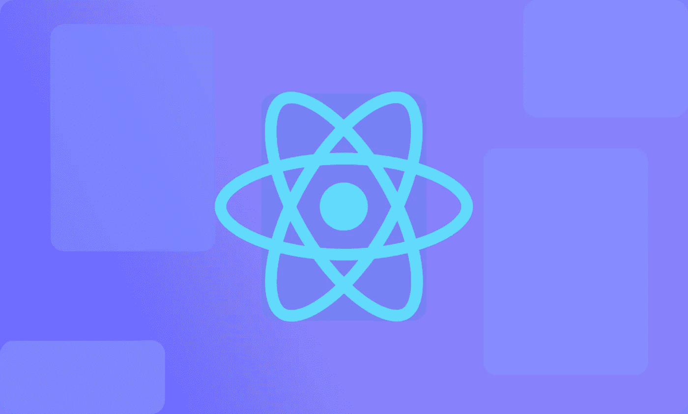
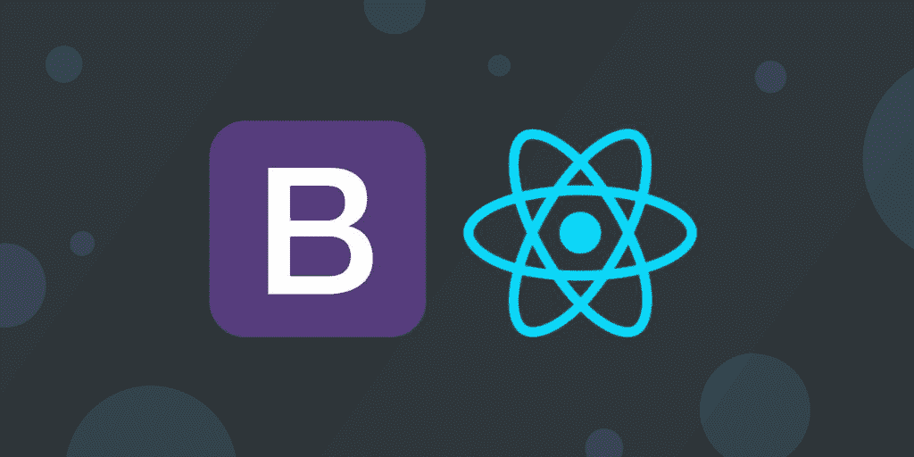
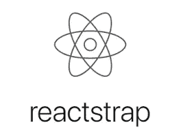
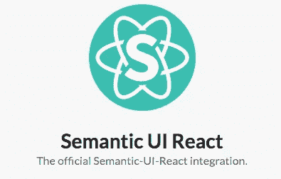
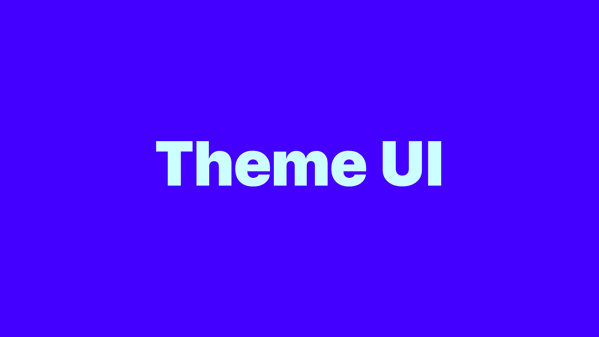
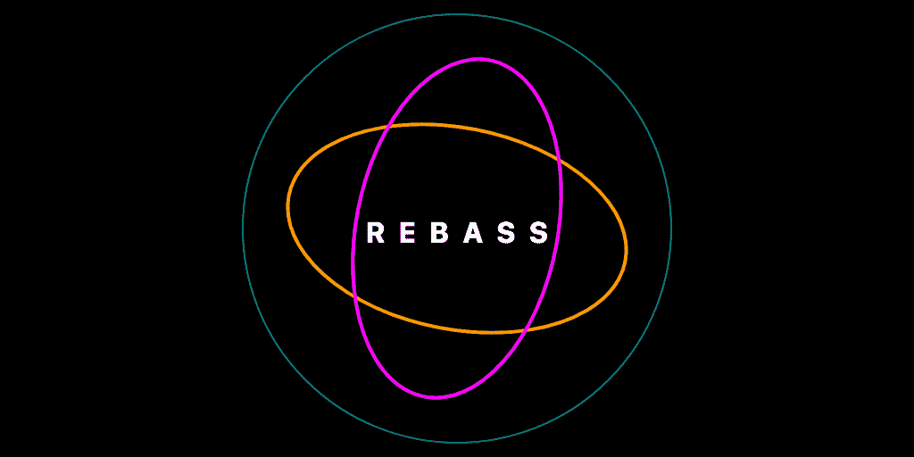
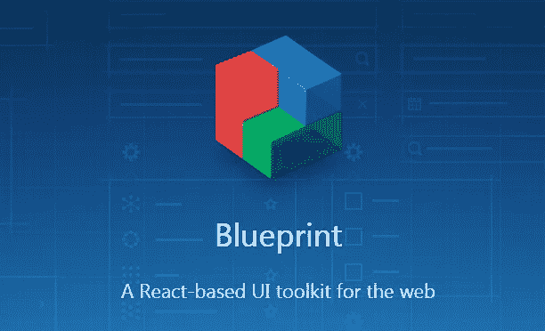

# 2022 年 6 个最佳用户界面库

> 原文：<https://javascript.plainenglish.io/6-best-react-ui-libraries-in-2022-767989d2ee9e?source=collection_archive---------6----------------------->

提升你的反应前端技能



## 1.[反应-引导](https://react-bootstrap.github.io/)



一个流行的完全内置的前端框架 *React* ，它由预构建的组件组成，这些组件完全响应&可访问，同时高度可定制。

*   关于 **React-Bootstrap** 最好的事情是它可以兼容成千上万的 Bootstrap 主题。
*   您还可以导入想要使用的单个组件，这有助于最小化代码量。
*   然而，唯一的缺点是，如果你熟悉 Bootstrap 并想转向 ***React-Bootstrap*** ，那么你必须学习一个新的 ***API*** 来适应环境。

***安装:***

```
npm install react-bootstrap
```

## 2.[反应陷阱](https://reactstrap.github.io/?path=/story/home-installation--page)



一个很棒的库如果你想在更短的时间内构建前端项目，Reactstrap 为 ***Bootstrap 5.1*** 提供了大量简单且自包含的组件。

*   您可以使用这个库来构建完整的前端，甚至是单个组件。Reactstrap 最棒的一点是，它提供了灵活的 ***预构建验证*** ，这对于构建具有良好用户体验的 ***表单*** 非常有用。
*   如果你正在寻找一些简单的组件，或者如果你只是从前端库开始，那么推荐使用 ***Reactstrap*** 。

***安装:***

```
npm install reactstrap
```

> ***注意:*** *为了使用 Reactstrap 你必须先安装* **引导程序** *。*

## 3.[语义 UI 反应](https://github.com/Semantic-Org/Semantic-UI-React)



这是对语义 UI 开发框架的正式整合，该框架因其响应性 HTML 代码库而广为人知。这个库由每个组件的多个变体组成，这有助于开发人员在更短的时间内找到最合适的组件。

*   此外，如果组件不符合您的风格，您可以修改 **SCSS** 样式表。
*   请注意，原来的语义 UI 框架不再保留，由于某些组件不完全可访问，您可能需要做一些额外的工作。

***安装:***

```
npm install semantic-ui-react semantic-ui-css
```

## 4.[主题 UI](https://github.com/system-ui/theme-ui)



如果你正在寻找一些小而方便的东西来定制基本组件，创建你的主题和开发你的设计系统，那么推荐使用这个库。

*   它提供了很好的功能，如内置的 ***黑暗模式*** 和移动优先的响应风格，如果你擅长静态站点生成器，那么它是你的一个很好的选择。
*   由于 Gatsby 插件，你可以将这个库用于 Gatsby 站点和主题。
*   建议使用主题 UI 来构建个人项目，因为这个库非常新，缺少基本组件，社区成员也很少。

***安装:***

```
npm install theme-ui
```

## 5. [Rebass](https://github.com/rebassjs/rebass)



一个非常轻量级的库，只有 **43kb** 的包大小，用 100% **JavaScript** 构建。Rebass 非常适合创建需要定制基本组件的最小风格的 web 应用程序。此外， **Styled System** 减少了在应用程序中编写任何自定义 CSS 的需要，从而加快了应用程序的开发。

*   然而，它没有任何预建的主题，因为它提供了足够的定制选项来创建你自己的主题。
*   如果您想在更短的时间内用可定制的组件构建 web 应用程序，Rebass 是一个很好的选择。
*   然而，唯一的缺点是这个库作为一个小社区的主题用户界面仍然是新的

***安装:***

```
npm install rebass
```

## 6.[蓝图](https://github.com/palantir/blueprint)



开发人员最喜欢的 React 组件库之一，包含所有的基本包，你也可以根据需要添加任何附加的组件包。还有**日期时间**、**图标** & **表格**不同的包，里面有高级组件。

*   然而，它不提供任何预置主题，但有**暗**和**亮**主题可用。
*   Blueprint 是最好的 React 组件库之一的原因是，您可以用漂亮的预构建组件构建高质量的应用程序。此外，它还附带了很棒的文档。
*   唯一的缺点是这个库不适合构建移动响应应用。

# 进一步阅读

[](/6-ui-ux-design-principles-for-self-taught-developers-c6326f6d9c0d) [## 6 自学成才的开发人员的 UI/UX 设计原则

### 提升你的自学程序员之旅。

javascript.plainenglish.io](/6-ui-ux-design-principles-for-self-taught-developers-c6326f6d9c0d) [](/4-best-practices-for-docker-cf52573dafb8) [## Docker 的 4 个最佳实践

### 利用 Docker 在生产中更好地构建

javascript.plainenglish.io](/4-best-practices-for-docker-cf52573dafb8) [](/best-react-ui-frameworks-and-component-libraries-408df66a1f31) [## 2023 年最佳的 5 个 React UI 框架和组件库——开发者指南

### MUI，Saas UI，Mantine，Tailwind。基于组件多样性、性能和效率的 React UI 库综合指南

javascript.plainenglish.io](/best-react-ui-frameworks-and-component-libraries-408df66a1f31) [](/object-freeze-vs-object-seal-in-javascript-4f66f7d24754) [## JavaScript 中的 Object.freeze()与 Object.seal()

### 理解 JavaScript 中的不变性

javascript.plainenglish.io](/object-freeze-vs-object-seal-in-javascript-4f66f7d24754) 

*更多内容看* [***说白了. io***](http://plainenglish.io/) ***。*** *报名参加我们的* [***免费每周简讯点击这里***](http://newsletter.plainenglish.io/) ***。***