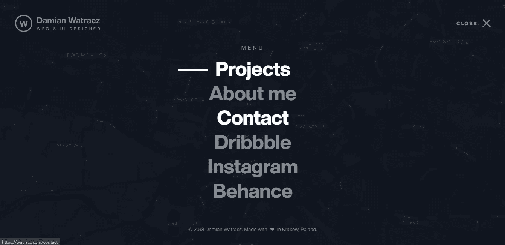

# 你应该看看 6 个疯狂的前端投资组合

> 原文：<https://javascript.plainenglish.io/6-crazy-front-end-portfolios-you-should-check-out-d6ca63da64c8?source=collection_archive---------5----------------------->

## 展示你的投资组合技能的独特方式


Photo by [Matthieu Comoy](https://unsplash.com/@alienwannabe?utm_source=medium&utm_medium=referral) on [Unsplash](https://unsplash.com?utm_source=medium&utm_medium=referral)

web 开发人员能做的最难的网站之一是展示所有项目、经验和技能的组合网站。

这并不是说建立一个作品集网站在程序上具有挑战性，而是因为这是一个潜在雇主用来评估你工作的地方。

像“先展示什么项目？”以及“我应该加一张我自己的照片吗？”只是建立个人投资组合时想到的许多问题中的一部分。

大多数 web 开发人员构建的项目并不独特，比如电影评级或计算器应用程序。

因此，对你来说最与众不同的因素之一是建立一个非常独特的组合网站来展示所有这些项目以及任何其他过去的工作。

然而，如果您正在寻找为您的投资组合创建一个新项目，您可以查看我最近关于一些最独特的 API 的文章。

[](https://medium.com/javascript-in-plain-english/7-free-apis-that-nobody-is-talking-about-cf974e15917) [## 7 个没人谈论的免费 API

### 使用这些 API 创建独特而有趣的应用程序

medium.com](https://medium.com/javascript-in-plain-english/7-free-apis-that-nobody-is-talking-about-cf974e15917) 

以下是 6 个非常独特的投资组合网站，你一定要去看看:

## 1.布鲁诺·西蒙


Bruno Simon’s website. [Source](http://Bruno Simon).

Bruno Simon 是一名创意开发人员，他的作品集并不是你所期待的那种典型网站。

这是这个名单上迄今为止最独特和最具互动性的投资组合。

布鲁诺创建了一个独特的身临其境的网站，你可以使用汽车导航。

该网站非常详细，对象也是可移动的。

正如[所说](https://medium.com/@bruno_simon/bruno-simon-portfolio-case-study-960402cc259b)，他已经使用 [Three.js](https://threejs.org/) 进行 WebGL 渲染。

事实上，[布鲁诺](https://medium.com/u/25690940fb96?source=post_page-----d6ca63da64c8--------------------------------)在 Medium 上，你可以在作品集网站上查看他的描述性博客。

## 2.伊利亚·库尔巴赫尼


Ilya’s portfolio site. [Source](https://kulbachny.com/).

Ilya Kulbachnny 的网站是最干净而独特的网站之一。

尽管他主要使用黑白配色方案，但他一直致力于将文本放大，同时添加平滑的滚动动画。

此外，您可以看到在页面的顶部，文本“创意总监”也是动画，他使用了自己的个人照片作为背景。

如果你想和你的观众联系或者你是一个自由职业者，使用你自己的个人照片是很重要的。

尽管如此，添加一张个人图片不会有什么坏处，伊利亚的网站展示了他是如何使用他的个人图片的，这些图片也具有滚动动画的特性。

## 3. [Abhishek Jha](https://abhishekjha.me/)


Abhishek Jha’s portfolio. [Source](https://abhishekjha.me/).

Abhishek 的作品集采用了与上图相同的调色板，但他对文字的使用，以及卷轴上相同的动画，给了它一种独特的感觉。

另一个立竿见影的效果是，他用自己的滚动条替换了默认滚动条，当你滚动图像时，光标图标也会改变。

通过将不同风格的相同文本一个放在另一个下面，并使图像与这些文本重叠，这是一种有趣的方法，如果使用得当，可以用来强调特定的文本。

知道的人不多，但是你可以直接从 CSS 文件中定制滚动条。

```
/* width */
::-webkit-scrollbar {
  width: 10px;
}

/* Track */
::-webkit-scrollbar-track {
  background: #f1f1f1;
}

/* Handle */
::-webkit-scrollbar-thumb {
  background: #000;
}

/* Handle on hover */
::-webkit-scrollbar-thumb:hover {
  background: #355;
}
```

你可以在这里找到更多关于这个[的信息。](https://css-tricks.com/almanac/properties/s/scrollbar/)

## 4.[罗比·莱昂纳迪](http://www.rleonardi.com/)


Interact resume. Source: [Robby Leonardi’s site.](http://www.rleonardi.com/)

很像[布鲁诺·西蒙的作品集](https://bruno-simon.com/#cybertruck)，这也是一款互动游戏。然而，布鲁诺的网站包括 3D 图形和一辆汽车来导航，而这是一个 2D 游戏。

罗比的作品集让我想起了心爱的马里奥游戏。

罗比·莱昂纳迪也有一个插图组合网站[,同样的图形和主题也进入了这个网站。](http://www.rleonardi.com/illustration-portfolio/)

他在制作这些网站方面做得非常出色，这是一种相当创新的思维。

他的插图组合的背景以及所有使用的图像完美地融合在一起，同时也展示了他最优秀的作品。

## 5.[亚采克·杰兹纳赫](https://jacekjeznach.com/)


Jacek’s portfolio. [Source](https://jacekjeznach.com/).

另一个你应该看看的优秀作品集是亚采克·杰兹纳赫的。

通过使用非常抖音式的调色板和简单的动画，他制作了一个迷人的网站。

该主题甚至延伸到了[联系人](https://jacekjeznach.com/contact/)页面上的地图。

他甚至添加了背景声音，你可以很容易地切换打开和关闭。

如果你仔细看，你甚至可以看到关键的 HTML 标签出现在网页的开头和结尾，这对这个网站是一个很好的补充。

这个网站是一个很好的例子，展示了如何将鲜艳的颜色与深色背景相结合，以及如何带来统一性。

## 6.达米安·瓦特拉齐



Damian’s site. [Source](https://watracz.com/).

达米安的网站是一个很好的例子，关注细节可以彻底改变网站。

这个网站主要利用简单的黑白调色板。

通过结合简单的动画，自定义加载圆以及贴切的个人照片，达米安已经设法把一个非常抛光和专业的网站。

我非常喜欢他的网站的一点是，当你将鼠标悬停在菜单中的项目上时，背景会发生变化，以反映链接地址页面，这是一个经过深思熟虑的添加。

此外，[页面上的分页](https://watracz.com/about)并不常见，确实与网站融为一体。

该网站的另一个有用之处是页面左下方的小而显著的联系按钮。这是一条有用的捷径，不会碍事。

## 最后的想法

建立个人投资组合可能相当具有挑战性。

我把这个列表放在一起的主要原因是为了表明每个投资组合网站都是独一无二的，都有自己的方式。

没有明确的方法可以让你在建造这样的网站时四处走动。

> 唯一要记住的是尽你所能，给网站添加你自己的个人风格。

如果你喜欢或者在读完这篇文章后感到有灵感，请看看我的[关于设计灵感的文章](https://medium.com/javascript-in-plain-english/8-amazing-places-to-find-design-inspirations-for-free-dd2e64abc1b0)。

感谢阅读！