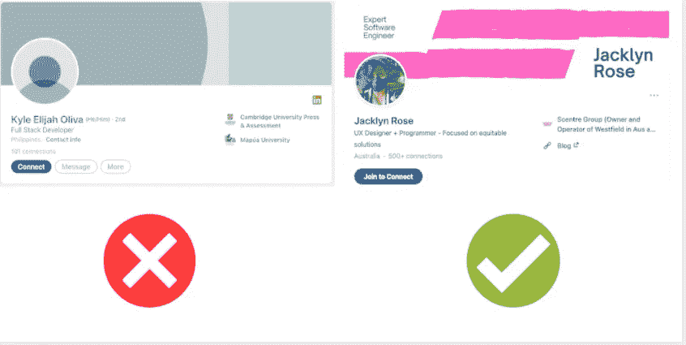

# 程序员在优化他们的 LinkedIn 档案时应该使用的 6 个关键点

> 原文：<https://javascript.plainenglish.io/6-critical-points-programmers-should-use-when-optimizing-their-linkedin-profile-d739d53d6abe?source=collection_archive---------5----------------------->

## 雇主或招聘人员最看重的几点。

Image Source: Created by the author

你是否一直认为 LinkedIn 是一个不适合找开发人员工作的工具？

嗯，你得再想想。

LinkedIn 是寻找专业人士最常用的平台之一，尤其是非技术招聘人员。但 LinkedIn 对开发者无效的一个不可否认的原因与专业人士的档案有关，而不是针对搜索进行优化。

因此，这里有五个小贴士让你的 LinkedIn 档案不受招聘人员的影响！

# **1。LinkedIn 个人资料横幅**

LinkedIn 横幅是放置在您个人资料照片上方的图形元素。它是可自由编辑的，因此您可以用自定义图形替换它。

LinkedIn 的横幅是最引人注目的部分之一，可以给查看你个人资料的招聘人员留下深刻印象。但是，其实简单看一眼，一定是能传达你的专业的。

但是是什么让 LinkedIn 的横幅真正吸引人呢？

许多人利用这个空间来放置图像、风景或壁纸。当然，它们是非常漂亮的图片，但是它们给个人形象带来了更多的力量吗？

肯定是的，对于设计师和所有在图形技能方面有实力的人来说。横幅是必不可少的，以显示这些个人资料的情况下，展示他们的一些工作技能。

但是如果你是一个开发者，你需要以不同的方式利用这个空间。

你是开发商吗？然后你可以使用你所知道的语言的标志。

另一方面，如果你是一名数据库管理员，为什么不把 MySQL 标志叠加在数据中心的图像上呢？

# 2.职称(摘要)

LinkedIn 上的摘要是包含你职位的字符串，显示在你名字的正下方。你越具体越好:

避免使用通用的术语，半个 IT 世界都可以涵盖。

尽量使用能准确描述你的专业背景和技能的名字。这将有助于招聘人员寻找你的专业形象，也有助于 LinkedIn 算法索引你的个人资料。

**这里有一个简单的策略，可以用最好的方式写下你的职位名称:**

*   从你的职称开始(全栈，UX 工程师，DevOps)
*   添加你的经验程度(初级、高级、X 年)
*   添加您的专长(编程语言、框架)

**这里有几个书面职称的例子:**

*   初级 JavaScript 开发人员
*   全栈 JavaScript Web 开发人员

# 3.个人描述(摘要)

摘要是自由文本的一部分，允许你用几句话描述自己，介绍你的 LinkedIn 个人资料。大多数简介都有很长很详细的个人描述，或者没有独特的描述。

这是你需要避免的两个严重错误。

*   如果你什么都不写，你就浪费了一个展示你是谁和你的价值的好机会。
*   另一方面，如果你写了一些不相关的东西，招聘人员可能永远不会通读，因此结果是一样的。

那么你要写多少呢？

越少越好。如果你写了几行以上，LinkedIn 会自动剪切视图并插入一个“…查看更多”按钮。

确保真正重要的信息是立即可见的，所以把重点放在最开始的几行。

# 4.对经历的描述

程序员 LinkedIn 个人资料的另一个关键点是对经历的描述。总是尽量简洁、清晰、完整，给出所有有价值的信息，而不要不必要地拉长篇幅。

对你职业经历的描述不能类似于一篇批评性的文学论文，也不能类似于一张无止境的购物清单。

从可消耗的信息中选择有用信息的一个很好的方法是问你自己这个特定的信息能给你的档案带来什么价值。每个句子每个单词都必须提供附加值。如果不是，那么它就是可牺牲的。

# 5.具体说明你的技术技能

在 LinkedIn 上，你可以输入所有你想要的技能。但是，只有前三个会立即被查看您个人资料的人看到。虽然，他们不是。这三个也是最容易被你的人脉确认的技能。

因此，前三种技能的选择必须经过仔细的计算:

在专业技术档案的情况下，前三个技能应该致力于编程语言、框架、数据库和已知技术。

# 6.LinkedIn 个人资料摄影

个人资料照片是让你的个人资料更专业的元素。看简历的招聘人员必须把他读到的信息和一张面孔联系起来，才能记住你。

所以要用一张清晰显示自己脸部的彩色照片。避免有令人分心的元素的照片，所以没有毕业冠，太阳镜，帽子，或其他笨重的配件。

## 并且要小心:

招聘人员必须能够在看到那张单人照片后认出你，所以记得定期更新！

*更多内容看*[***plain English . io***](http://plainenglish.io)