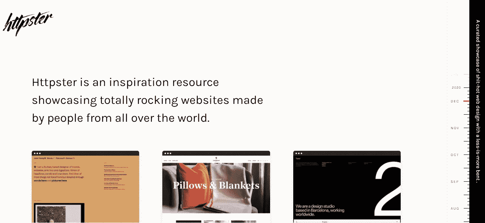
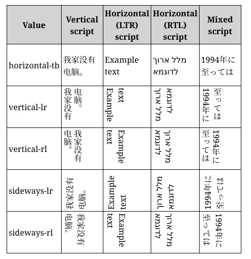
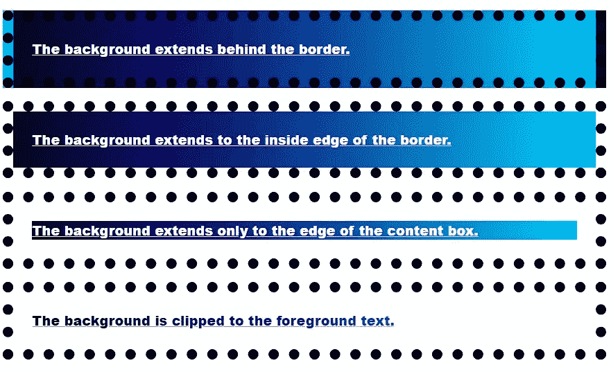
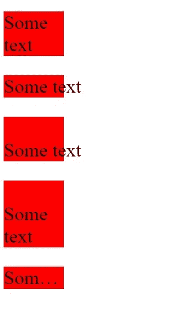
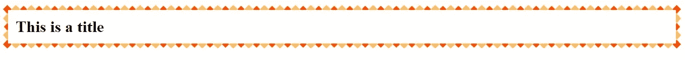

# 6 种没人谈论的 CSS 属性

> 原文：<https://javascript.plainenglish.io/6-css-properties-nobody-is-talking-about-e6cab5138d02?source=collection_archive---------0----------------------->

## 许多人以前从未听说过的有趣的房产。


Photo by [Jason Rosewell](https://unsplash.com/@jasonrosewell?utm_source=medium&utm_medium=referral) on [Unsplash](https://unsplash.com?utm_source=medium&utm_medium=referral)

几十年来，CSS 和 HTML 一直是互联网的基石。

虽然 HTML 负责创建网站结构和安排文本和图形，但在设计网站时却无能为力。

自 1994 年以来，设计网站一直是 CSS 的唯一目的。它成为了描述网站外观和感觉的语言。

多年来，CSS 已经看到了一些新的属性添加到它，如 Flexbox 和 Grid。

尽管创建网络应用程序非常受欢迎，复杂性也越来越高，但仍有许多 CSS 属性和技巧是大多数开发人员不知道的。

以下是 6 个您可能从未听说过的 CSS 属性:

## 1.`all`

你曾经使用过 CSS 框架吗？如果是的话，我很确定有时候你会想根据自己的喜好覆盖一些元素。

而最常见的方法是使用 CSS 中的`!important`属性来强调当前属性，忽略所有其他设置和规则。

```
.header{
    color: blue !important;
    font-size: 14px !important; 
}
```

然而，一次又一次地写相同的关键字会让 CSS 文件看起来很混乱。

更简单的方法是使用`all`属性。

`all`有 3 个属性值——初始、继承和取消设置。

```
.header{
  all:initial;
  color: blue;
  font-size: 14px; 
}
```

`all:initial`将元素的所有属性设置为其回退或初始值。

Chrome 和 Firefox 分别从版本 37 和版本 27 开始支持这个属性。边缘浏览器也支持此属性，但 Internet Explorer 不支持。

## 2.`writing-mode`

我最近写了一篇关于[的文章，在一些令人惊奇的地方寻找设计灵感](https://medium.com/javascript-in-plain-english/8-amazing-places-to-find-design-inspirations-for-free-dd2e64abc1b0)，我偶然发现了许多文本垂直和横向排列的网站。



Source: [httpster](https://httpster.net/2020/dec/).

在上面图像的右侧(靠近滚动条)，你可以看到文本横放，这是显示额外信息的一种整洁的方式。

`writing-mode`属性允许您完全实现这一点。

此属性支持以下值:

*   `sideways-rl`:文本和其他内容从上到下垂直排列，并向右侧倾斜。
*   `sideways-lr`:和`sideways-rl`一样，文本和其他内容从上到下垂直排列，但向左侧倾斜。
*   `vertical-rl`:文字等内容从上到下垂直布局，从右到左水平布局。如果有两行或更多行，这些行被*放置在前一行的左侧*。
*   `vertical-lr`:与`vertical-rl`不同，水平方向上文本从左到右排列，如果有两行或多行，则这些行被*放置在前一行的右侧*。

还有代表文本显示标准方式的`horizontal-tb`。



Source: [MDN Web Docs](https://developer.mozilla.org/en-US/docs/Web/CSS/writing-mode)

你可以在这里找到实现和代码片段。

## 3.`background-clip`

这是一个有趣的属性，允许我们为元素的背景设置一个自定义图形。

我们的自定义图形可以扩展到元素的边框、填充框或内容框。

下面是该属性的一个简短实现:

HTML:-

```
<p class="border-box">The background extends behind the border.</p>
<p class="padding-box">The background extends to the inside edge of the border.</p>
<p class="content-box">The background extends only to the edge of the content box.</p>
<p class="text">The background is clipped to the foreground text.</p>
```

CSS:-

```
p {
  border: .8em darkviolet;
  border-style: dotted double;
  margin: 1em 0;
  padding: 1.4em;
  background: linear-gradient(60deg, red, yellow, red, yellow, red);
  font: 900 1.2em sans-serif;
  text-decoration: underline;
}

.border-box { background-clip: border-box; }
.padding-box { background-clip: padding-box; }
.content-box { background-clip: content-box; }

.text {
  background-clip: text;
  -webkit-background-clip: text;
  color: rgba(0,0,0,.2);
}
```

输出:



Source: Author

您可以使用自定义图像，并将其设置为文本的背景，如下所示:


Source: Author

值得注意的是，您需要使用 Chrome 的`-webkit-background-clip`属性，并确保文本颜色设置为透明。

## 4.`user-select`

如果你的网站上有任何你不希望你的用户能够复制的文本，这个属性将使你能够这样做。

属性指定一个元素的文本是否可以被选择。

除文本框外，这对加载的内容没有任何影响。

```
.row-of-icons {   
-webkit-user-select: none;  /* Chrome & Safari all */   
-moz-user-select: none;     /* Firefox all */   
-ms-user-select: none;      /* IE 10+ */   
user-select: none;          
}
```

该属性可用于确保整个元素也被选中。

```
.force-select {
   user-select: all;  
  -webkit-user-select: all;  /* Chrome 49+ */
  -moz-user-select: all;     /* Firefox 43+ */

}
```

你可以在这里找到完整的指南。

## 5.`white-space`

这个属性在应用`text-overflow`属性时很有用，因为这个属性允许你控制一个元素的文本流。

它接受`nowrap`、`pre`、`pre-wrap`、`pre-line`和`normal`作为属性值。

`nowrap`防止文本在元素宽度和高度内换行，并允许其溢出。

`pre`值强制浏览器呈现代码中出现的换行符和空白，但默认情况下会被删除。`The pre-wrap` value 的作用与此相同，只是它还会将该元素中的文本换行。

属性会在代码中换行的地方换行，但是多余的空白不会被渲染。

这在下面的例子中变得很明显:

HTML:

```
<div>
<p class='zero'>Some text
</p><p class='first'>Some text 
</p>
<p class='second'>
Some text 
</p>
<p class='third'>
Some text 
</p>
<p class='fourth'>
Some text 
</p>
</div>
```

CSS:

```
div{
  width:100px;   
}
p{
  background:red;
  font-size:2rem;
}
.first{
  white-space:nowrap;
}
.second{
  white-space:pre;
}
.third{
  white-space:pre-line;
}
.fourth{
  white-space:nowrap;
  text-overflow:ellipsis;
  overflow:hidden;
}
```

输出:



Source: Author

6.`border-image`属性

这个属性非常适合设计你的网站。

您可以使用该属性在元素周围创建漂亮的边框。

`border-image`允许你设置自定义图片为边框。

我将用这张图片来展示这个属性。


Source: [MDN site.](https://developer.mozilla.org/en-US/docs/Web/CSS/border-image)

HTML 和 CSS 如下所示:

```
<body>
   <h1>This is a title</h1>
</body><!-- CSS below -->h1{
  border: 10px solid transparent;
  padding: 15px;
  border-image: url(border.png) 20% round;
}
```

输出:



Source: Author

该属性可用于创建精美的卡片或强调文本的某些部分。

## 最后的想法

除了 JavaScript 之外，前端开发人员一直在使用 CSS 和 HTML，了解这些可以帮助人们更快、更快、更好地构建更好的应用程序。

虽然我已经分享了一些很少讨论的 CSS 属性，但是还有更多这样的属性。

尽管 CSS 已经存在了 20 多年，但它仍然有很多特性和技巧。

了解这些可以促进迷人的 CSS 艺术和网站的发展。

[许多平台允许你免费部署和托管你的项目](https://medium.com/javascript-in-plain-english/6-free-platforms-to-host-your-apps-b29372b530be)，让你可以专注于网站设计而不用担心托管。

感谢阅读！