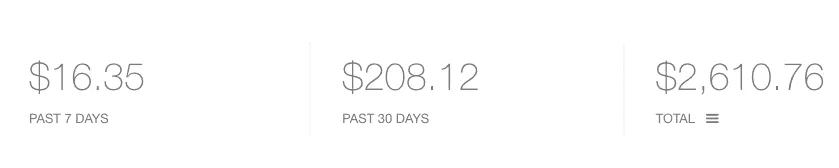
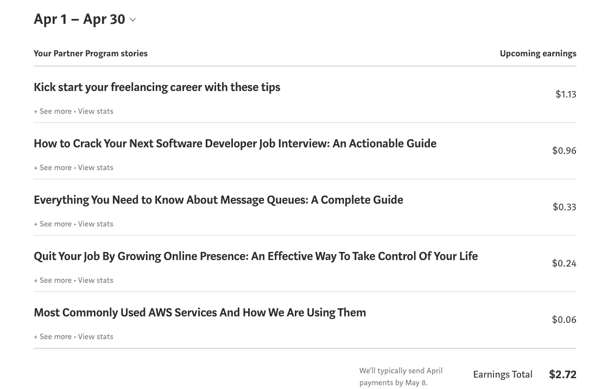
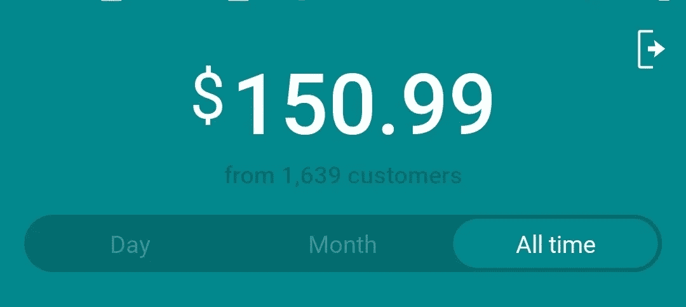

# 作为软件开发人员，我有 6 种不同的赚钱方法——你也可以

> 原文：<https://javascript.plainenglish.io/6-different-ways-i-make-money-as-a-software-developer-you-can-too-d88aa31dd537?source=collection_archive---------6----------------------->

Photo by [Alexander Mils](https://unsplash.com/@alexandermils?utm_source=medium&utm_medium=referral) on [Unsplash](https://unsplash.com?utm_source=medium&utm_medium=referral)

## 在互联网上赚钱很容易，让我们开始吧

多年来我一直想在互联网上赚钱，但我不知道如何开始。

成为一名软件开发人员就像一种超能力。这项技能提供了大量在互联网上赚钱的机会。你可以用这一项技能改变你的生活。虽然我们大多数人在学术界学习如何编码和构建软件，然后在大型跨国公司工作，但我们仍然不知道这项技能提供的无限可能性。

在这篇文章中，我将分享我赚钱的 6 种不同的方法，以及如何做到这一点。

*   专业开发人员
*   当自由职业者
*   联盟营销
*   博客
*   信息产品
*   自举 SaaS 产品

# 1.专业开发人员

这是众所周知的显而易见的选择。软件开发员是一份利润丰厚的工作，如果你长期从事这项工作，你会赚很多钱。软件行业正在蓬勃发展，现在对优秀的软件开发人员有着巨大的需求。所以，如果你是一个优秀的开发人员，你肯定可以被像谷歌、脸书、Atlassian 等薪酬最高的公司雇佣。

但是如果你可以在职业生涯中一直为别人工作，过着舒适的生活，那么这绝对是你应该考虑的一个选择。

如今随着创作者经济的繁荣，这条路越来越不流行了。越来越多的人希望远离 9-5 的税率竞争&希望有自由，并开始自己的事业，即使他们最初赚的钱少。

我目前在印度的一家初创公司担任团队领导，薪水不错。但是我不想永远为别人工作。我想建立自己的事业，早点退休。为了长期实现这一目标，我正致力于以下想法来赚钱。让我们分别讨论一下。

# 2.当自由职业者

开始从事自由职业并不容易。每个人都知道。你知道有些人通过自由职业赚了很多钱，每个月向多个建立网站的客户收取几千美元。但是大多数人不知道如何开始自由职业。

有很多平台可以让你开始自由职业之旅:

*   托普塔尔
*   自由职业者。com
*   向上工作
*   共同导师
*   Hubstaff 人才
*   五等

从小任务开始。比如:`Write a Python script to scrape top 10 results from google dot com`。以上所有平台都可以找到这样的任务。

记住，找到你的第一个任务并不容易。在申请了无数份工作却没有得到任何转变之后，我曾经无数次放弃自由职业。终于在 2019 年 9 月，Codementor 帮我通过互联网自由职业赚到了第一笔钱。如果你想开始使用 Codementor，[这里](https://sunilc.medium.com/kick-start-your-freelancing-career-with-these-tips-747cc27a150f)有一篇文章给你。

慢慢开始。一旦你获得了与人交谈的信心，说服他们给你任务，试着扩大你的自由职业生涯。尝试寻找可以跨越几个月的更大的项目。我知道这不容易。但是如果你能做到这一点，它能给你带来你一直想要的朝九晚五工作的灵活性和自由。

我兼职做自由职业赚了不少钱。我现在主要活跃在 Codementor &试图进入[to tal](https://www.toptal.com/)。

# 3.联盟营销

联盟营销是互联网上最容易赚钱的方式之一。但如果没有观众或社交媒体的关注，这可能会很困难。

在这里你基本上是通过你独特的链接把别人的产品卖给别人来赚取佣金。我喜欢联盟营销的一点是，你不需要有自己的产品。你可以出售已经被证明和喜爱的产品&赚取佣金。

像 Gumroad 这样的公司真的在革新创造者经济，每天都有越来越多的人创造信息产品。你可以在 Twitter、Instagram 等社交媒体渠道找到这些创作者。你可以给他们发短信，问他们是否愿意把你加入他们的产品联盟。一旦他们添加了你，你会得到一个独特的链接，然后你可以与你的观众分享，并进行销售。

但这并不像听起来那么简单。和其他行业一样，这个行业也面临着挑战。为了向更多的人销售产品，你需要有一个良好的在线形象，基本上是一个关注你、信任你并想从你这里购买产品的人的名单。

建立网上形象是一个缓慢的过程，需要时间。你需要在很长一段时间内持续提供免费的价值，以建立一个重要的追随者基础。在过去的 10 个月里，我一直在增加我在 Twitter 上的存在。当我开始的时候，我有大约 150 个追随者。在写这篇文章的时候，我的推特[账户](https://twitter.com/sunilc_)上有 17100 名粉丝。

在过去的 8 个月里，我在 [Gumroad](https://gumroad.com/sunilkumarc) 上赚了大约 26000 美元，主要是在 Twitter 上推广产品。

现在，我正试图通过运用新的策略来增加收入。让我们看看在接下来的几个月里它会把我带到哪里。

# 4.博客

博客是另一个在互联网上赚钱的好方法。许多人认为博客已经死了，在 YouTube 如此出名的世界里，没有人再阅读文章了。但事实完全不是这样。

人们确实会阅读文章，如果你不喜欢在镜头前说话，你也可以尝试写博客。

有很多方法可以通过博客赚钱。

*   中型合作伙伴计划
*   自由作家
*   联盟营销
*   付费文章等

Medium partner program 是新手开始赚钱的热门平台之一。当然一开始你会赚得少。但是如果你坚持不懈，从长远来看，你可以赚很多钱。Medium 上的一些顶级作家在 Medium partner 计划中每月收入超过 25，000 美元。事实上，你每次观看赚的钱比你在 YouTube 上赚的还多！

在这些视频中，您可以看到 Shelby 是如何在没有任何经验的情况下从中型合作伙伴计划中赚钱的:

*   为媒体在线写作赚钱……值得你花时间吗？
*   [我从我的 Medium.com 文章中赚了 6000 美元……更新](https://www.youtube.com/watch?v=EGQn7xg2kSs)

我开始在 Medium 上写文章，至今赚的钱很少。但这仍是开始&我对事情的进展感到满意。这是我到目前为止 2021 年 4 月份的收入。

# 5.信息产品

如前所述，创造者经济正在蓬勃发展，越来越多的人每天都在创造信息产品并以此为生。

基本上，你可以创建像电子书这样的信息产品，可以小到 10 页，大到几百页，或者一个视频课程等等。

选择你知道的任何一个领域，并在其中创建一个信息产品。你不需要成为这方面的专家。你可以研究你不清楚的东西。基本上，人们愿意为任何他们可以从中学习或解决他们问题的东西付费。

例如，很多人想通过自由职业赚钱，但他们中的大多数人很难找到他们的第一份工作。我有自由职业的经验，我可以写一本小电子书，介绍如何完成第一个任务并开始赚钱。这些信息对许多人来说是有价值的，他们会为这样的产品付费。

信息产品的好处是，它是一次性的努力来创造产品，你可以用最少的努力偶尔营销来赚钱。

例如[丹尼尔·瓦萨洛](https://twitter.com/dvassallo)从亚马逊辞职后，在大约两年的时间里，他的两个产品已经赚了大约 35 万美元。

Twitter 上有如此多的成功人士，他们在 Twitter 上用他们的信息产品杀死它。在受到丹尼尔旅程的启发后，我甚至开始培养读者，并在 2020 年 12 月免费发布了我的电子书。这些是撰写本文时的统计数据:

下载量:1639 份
收入:150.99 美元

尽管电子书是免费的，但许多人仍然决定付费，因为他们想支持我的工作，欣赏我每天在 Twitter 上发布的所有有价值的免费内容。

# 6.自举 SaaS 产品

自举 SaaS 产品是另一种在互联网上赚钱的流行方式。基本上，这里的想法是建立一个小的产品，解决一个利基问题，并出售给用户。这不符合典型的创业路径，即计划筹集资金，建立团队，并将其规模扩大到 10 亿美元的公司。

在这里，你主要关注保持团队的小规模。通常由 1-5 人负责整个产品。

bootstrapping 背后的主要思想是从为别人工作和做你喜欢的事情中获得自由。

创业通常不容易(至少对我来说不容易！).你需要找到一个利基问题，验证这个想法，看看人们是否愿意为这样的产品付费，建立一个 MVP，最后营销并赚钱。

大多数人都犯了这样的错误:没有首先验证想法就开始构建产品。我犯了这个错误，制造了一个我认为很酷的产品，后来意识到没有人需要它。不要犯这个错误。

如果你想走这条路，你应该关注这些人，看看他们是如何在网上建立独立企业的:

*   [皮特等级](https://twitter.com/levelsio)
*   [阿尔维德·卡尔](https://twitter.com/arvidkahl)

阿维德在他的[网站](https://thebootstrappedfounder.com/)上有很多关于建立自举业务的资源。

我也从 Peiter 的演讲[中受到了很大的启发，这让我构建了我的第一个引导产品](https://www.youtube.com/watch?v=6reLWfFNer0) [Landr](https://landr.page/) 。

# 结论

*   互联网是一个用软件开发技能建立业务的好地方。
*   首先建立网上形象。在线展示将帮助你看到显著的效果。
*   不要一次关注太多想法。坚持一对夫妇和规模。
*   一开始你会做花生。长期坚持才能多赚钱。复利是最好的东西。
*   要知道建立一个网上企业并不容易。每个人都在挣扎。只有当你坚持不懈的时候，你才会成功。

这篇文章最初发表在我的博客上。这里可以找到[。](https://sunilkumarc.in/6-different-ways-i-make-money-as-a-software-developer-you-can-too)

*更多内容请看*[***plain English . io***](https://plainenglish.io/)