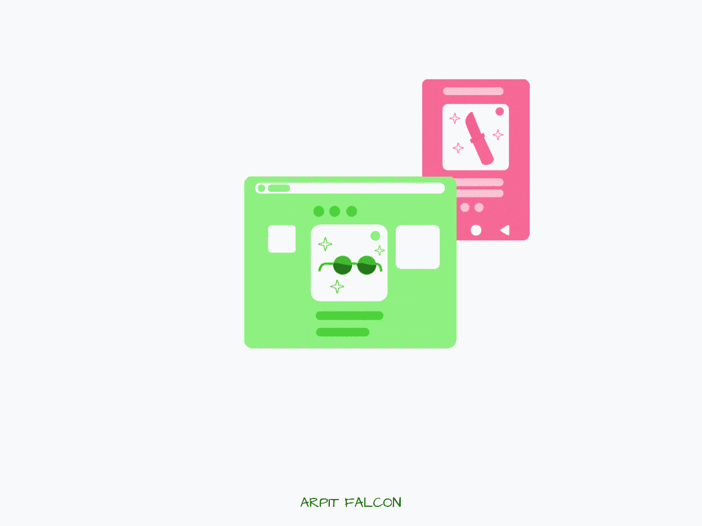
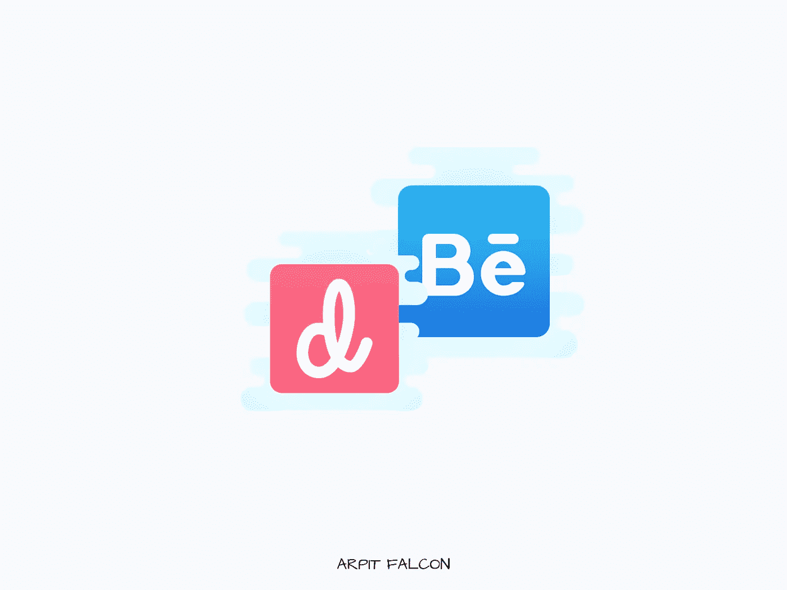
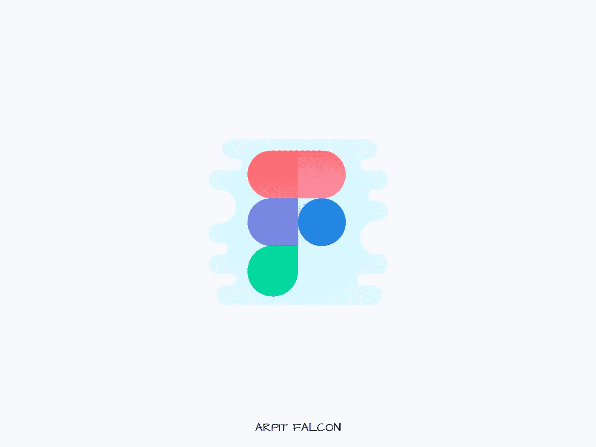

# 开发人员开始 UI/UX 设计的 6 种简单方法

> 原文：<https://javascript.plainenglish.io/6-easy-ways-to-get-started-with-ui-ux-design-for-developers-718853eb0322?source=collection_archive---------11----------------------->

## 每个开发人员都应该知道设计的基本知识。

Photo by Author

> 每个开发人员都应该知道设计的基础，每个设计师都应该知道编码的基础。

在过去的几周里，我一直在努力学习前端开发，我不想撒谎，这很难。所以，我和一些已经进入角色的朋友聊了聊，他们对我试图在没有任何模型的情况下制作网站感到惊讶。

UI/UX 设计是前端开发的核心部分，但最初，我像许多开发人员一样忽略了它。当我发现整个管道时，我对前端的事情有了很大的了解。

网站的模型在整个开发过程中帮助很大。这使得它没有麻烦。一切都是已经决定的，有研究做后盾，遵循一些原则。

所以，我决定学习 UI/UX 设计，下面是我的大多数朋友推荐我遵循的流程。

# 1.获取灵感

Photo by Author

人类通过模仿学习大部分技能。你通过模仿周围的人开始说话。同样的道理也适用于日常生活中很多我们甚至没有意识到的事情。

作家研究他们理想中的作品，以获得风格、文字和结构方面的灵感。

我们可以通过查看现有的最佳设计来应用相同的过程。在一些网站上，人们上传他们为许多网站和移动应用程序设计的模拟项目和原型。

我喜欢从中汲取灵感的三个最受欢迎的网站是—

*   [滴水不漏](https://dribbble.com/)
*   [行为](https://www.behance.net/)
*   [莫宾](https://mobbin.design/)

这些网站上的设计优雅、醒目、吸引人。只分析其中一个就能学到很多。想想如果你每天花些时间，你会获得多少知识。

# 2.油管（国外视频网站）

Photo By Author

YouTube 是一个你可以学到任何东西的平台。我在 YouTube 上学会了开车，经过一个月的练习拿到了驾照。

我是学习 YouTube 的粉丝。看到我的搜索历史中“如何做”的数量，你会感到惊讶。

我可以不停地说 YouTube 有多棒。你更想知道应该遵循哪些渠道？这是你应该看看的频道列表—

*   [设计课程](https://www.youtube.com/c/DesignCourse/videos)
*   [fluxwithransegal](https://www.youtube.com/c/FluxWithRanSegall)
*   [阿德里安·特瓦罗格](https://www.youtube.com/c/AdrianTwarog)

# 3.创建模拟项目和投资组合

Photo by Author

在现实生活中，你不是因为你知道什么而得到报酬，而是因为你创造了什么，产生了什么结果。那么，为什么学了理论却从不实践呢？

不要等到什么都学会了。通过实施、构建和实践来加速您的学习过程。

有很多网站提供免费的 UI/UX 挑战，让你体验一下在现实世界中你需要关注的东西。

我要关注的两个网站是—

*   [UX 工具](https://uxtools.co/challenges/)
*   [UX 挑战赛](https://www.uxchallenge.co/)

对于 UI/UX 设计师来说，一个重要的建议就是拥有一个他们所有设计的作品集来展示给任何招聘人员。如果你正在寻找一份 UI/UX 设计师的工作，你应该开始建立一个作品集。

最简单的开始方式是—

*   [观念](http://notion.so)

不需要做什么网站。这是一个笔记应用程序，你可以存储你的设计模型，并在一个干净的布局显示它们。您可以轻松共享笔记本的链接，没有任何麻烦。

# 4.检查工作公告板

Photo by Author

这是很多人用来查看哪些技能与行业相关的终极技巧。如果你打算学习任何技术，去求职网站看看有多少公司想要那种特定的技术。

了解哪种技术在哪种公司更受欢迎是一个很好的衡量标准。我发现在前端 JavaScript 框架中，Angular 在巨大的 fin-tech 公司中更有名，而 React 在创业公司中更受青睐。

我建议你对将要学习的任何东西都应用同样的方法。做一些研究，如果它是别人想要的，你可以如何赚钱，它在市场上有什么价值。

# 5.找一个导师

学习。建造。接受反馈。迭代。

我遵循这个框架来学习任何东西。你越快开始构建，你就能越快得到反馈。越快得到反馈，就能越快提升自己。

所以，不要拖延建造，建造一些东西，然后从导师那里得到反馈。

导师可以让你的学习速度提高 100 倍以上。一个好的导师可以带你去你永远想象不到的地方。

# 6.投资合适的设计软件

Photo by Author

现在你可能想把你的设计变成现实，并实现你所学到的一切。你需要一个设计工具。

有很多设计工具可以让你创建模型和原型。但我会推荐你拿起行业内积极使用的设计工具。

最终，你会在行业中或现实世界中使用设计。那么，为什么要练习任何不模拟相同体验的东西呢？

这里有一个我见过的 UI/UX 设计师经常使用的软件列表—

*   [图玛](https://www.figma.com/)
*   [Adobe XD](https://www.adobe.com/in/products/xd.html)

如果你觉得其他人有趣，你也应该去试试，选一个你觉得最舒服的。

## 最终说明——

如果您是一名前端开发人员，学习设计将会给您带来巨大的好处。这是每个开发人员都应该知道的一项技能。

这里有一个小的**总结**供您强调或者如果您没有阅读整篇文章——

1.  **汲取灵感**——分析专业人士已经完成的设计。您可以查找类似[dribble](http://dribbble.com)、 [Behance](http://behance.net) 或 [Mobbin](http://mobbin.design) 的网站。
2.  **YouTube**——YouTube 是我们最大的知识库。利用它免费学习。我建议您参加的考试有-[设计课程](https://www.youtube.com/c/DesignCourse/videos)、[fluvwith trans legal](https://www.youtube.com/c/FluxWithRanSegall)、 [Adrian Twarog](https://www.youtube.com/c/AdrianTwarog) 。
3.  **创造模拟项目**——光靠阅读理论是学不到的。你必须弄脏你的手来创造美丽而干净的设计。这里有一些 UI/UX 挑战赛网站— [UX 工具](https://uxtools.co/challenges/)、 [UX 挑战赛](https://www.uxchallenge.co/)。
4.  **查看招聘启事**——开始研究你所在地区和行业中流行的技能，决定你下一步想学什么。
5.  **找个导师**——反馈对我们的成长至关重要。每个人都会犯错，但是伟大的人会从中吸取教训。找个导师给你提供有价值的反馈。
6.  **投资设计工具**——你需要一个工具来进行设计。仔细研究，选择一个你觉得最舒服的。这些是广泛使用的工具-[Figma](https://www.figma.com/)、 [Adobe XD](https://www.adobe.com/in/products/xd.html) 。

如果你喜欢这篇文章，在 Medium 上还有很多类似的文章。您可以注册阅读，每月仅需 5 美元。

[**这里是无限制访问媒体上所有内容的链接。**](https://arpitfalcon.medium.com/membership) 如果您使用此链接注册，我将免费为您赚取一小笔费用。

我写关于软件工程和开发的文章。在此订阅以接收我最新文章的通知。

*更多内容请看*[***plain English . io***](http://plainenglish.io/)