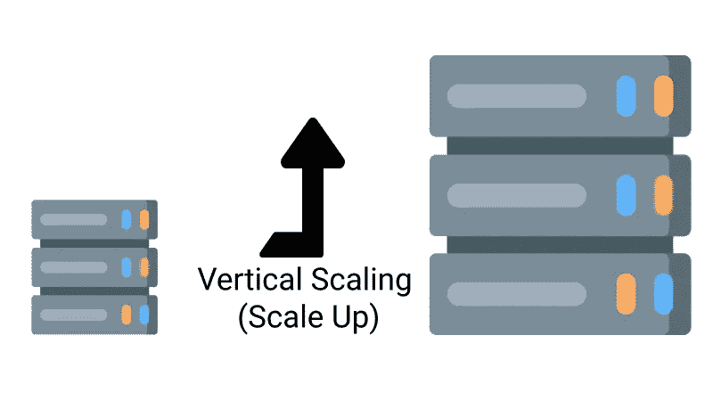
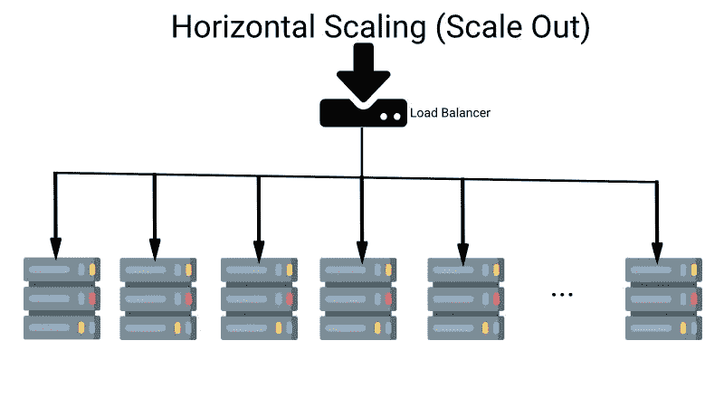

# 构建满足高需求的可扩展软件时需要考虑的 6 个因素

> 原文：<https://javascript.plainenglish.io/6-factors-to-consider-when-building-scalable-software-that-meets-high-demands-8c7cc4ed7dab?source=collection_archive---------14----------------------->

Network Image by [Bethany Drouin](https://pixabay.com/users/bsdrouin-5016447/?utm_source=link-attribution&utm_medium=referral&utm_campaign=image&utm_content=2402637) from [Pixabay](https://pixabay.com/?utm_source=link-attribution&utm_medium=referral&utm_campaign=image&utm_content=2402637)

软件可伸缩性是一个有趣的问题。使软件可伸缩包括多个因素，我们在这篇博文中讨论了一些与开发(代码)相关的方面和一些与操作(平台)相关的方面。

我们将更多地讨论如何编写软件(软件开发)以及如何运行软件(运营)以使软件具有可扩展性。对于新手来说，[成本和可扩展性](https://medium.com/@i.gorton/six-rules-of-thumb-for-scaling-software-architectures-a831960414f9)一般是成正比的，我们开始破解吧。

# 目录

[什么是软件可扩展性？](#f283)
[软件可扩展性 dev 观点](#3c03)
∘ [1 .具有高效代码的可扩展软件](#15f1)
∘ [2。异步处理](#f568)
∘ [3。为可伸缩软件编写无状态应用程序](#b96a)
[从运营的角度看软件的可伸缩性](#2629)
∘ [4 .垂直缩放 vs 水平缩放](#d172)
∘ [5。使用 NoSQL 实现高软件可伸缩性](#0ff5)
∘ [6。缓存启用软件可扩展性](#a050)
[结论](#2465)

# 什么是软件可伸缩性？

[全面博客](https://fullscale.io/blog/what-is-software-scalability)将软件可伸缩性定义为:

> *软件可扩展性是工具或系统根据用户需求增加其容量和功能的属性。可伸缩的软件可以保持稳定，同时适应变化、升级、检修和资源减少。*

因此，如果当请求量增加时，软件可以灵活地处理负载，分配更多的资源(主要是动态的)，我们就可以说软件是可伸缩的。即使要做到这一点，我们也需要关注代码部分。

# 软件可伸缩性开发的观点

软件工程师应该知道如何编写可伸缩的软件。您应该专注于编写使软件可伸缩性变得容易的代码，并将其作为优先事项。编写几乎不起作用的软件很容易，但编写经过测试、可维护且伸缩性良好的代码却很难。下面是一些可以帮助你编写更多可伸缩软件的东西。

## 1.具有高效代码的可扩展软件

软件应用程序可以用一种它能正常工作的方式来编写。另一方面，它可以用一种考虑到软件可伸缩性、维护性和弹性的方式来编写。

**1.1。选择 apt 算法**

根据时间和空间复杂性选择适合用例的正确算法可以产生很好的结果。

> *了解一下* [*大 O 符号*](https://github.com/pavankat/big-o-in-plain-english#what-is-big-o) *以及诸如 streams 之类的处理空间复杂性的东西，对于编写可伸缩的软件会有很大的帮助。*

例如，你可以选择使用[二分搜索法而不是线性搜索](https://www.baeldung.com/cs/linear-search-vs-binary-search)算法，这样它会执行得更快。在空间复杂的情况下，你可以选择一个低内存消耗的流来用更少的内存拷贝一个大文件。一定要看看这个视频[它在 6 分钟内直观地展示了排序算法。](https://www.youtube.com/watch?v=kPRA0W1kECg)

**1.2。更好的内存管理**

作为一名软件工程师，你应该小心诸如内存管理、垃圾收集之类的事情，这样它们才不会成为大规模的问题。对于可扩展的软件来说，预测和编写竞争条件的代码也是至关重要的。

**1.3。选择性能库**

其他有助于软件可伸缩性的事情包括比较和使用更高性能的解决方案。例如，你可以只使用 javascript 来代替 [lodash](https://lodash.com/) ，这样会更快并且性能更好。

> 另外，不要因为某个库或包流行就使用它，要检查性能和软件可伸缩性的含义。

例如，您可以使用 [Day.js](https://github.com/iamkun/dayjs) 代替 [Moment.js](https://momentjs.com/) 来进行简单的日期操作。如果需要，使用本地方法使软件更具可扩展性。

## 2.异步处理

想象一下，一位客户成功下了订单，您需要发送一封订单确认电子邮件。你想怎么做？由于这是流程中的一个非关键部分，我总是投票支持异步完成。

**2.1。使用队列和消费者实现软件可扩展性**

> *您可以轻松设置队列和消费者，以便在下单后顺利完成邮件发送任务。如果电子邮件晚发送 1 分钟，也不会造成问题。*

如果您希望在订单较多时减少延迟，您可以随时增加消费者的数量。任何非关键或非阻塞任务都可以推到后台异步完成。它有助于毫无问题地以最佳水平使用可用资源。

**2.2。在适用的地方使用异步代码**

异步处理的另一个例子是使用异步代码。根据语言的不同，您应该可以将一些任务推到后台。当任务正在执行时，可以发送一个响应，表明它已被调度。您可以查看异步响应的 Node.js [示例](https://gist.github.com/blog/2020/11/nodejs-for-php-developers/#node.js-code-execution-is-async-and-non-sequential)。当然，这取决于您选择的语言，有些语言如 PHP 可能不支持现成的异步代码。

## 3.为可伸缩软件编写无状态应用程序

无状态是高可伸缩性软件的先决条件。Redhat 的[无状态与有状态](https://www.redhat.com/en/topics/cloud-native-apps/stateful-vs-stateless)比较提到“把无状态事务想象成一台自动售货机:一个请求和一个响应。”它将有状态应用程序描述为“您可以将有状态事务看作是与同一个人正在进行的定期对话。”

无状态软件不会在请求之间共享任何东西。它也不依赖于本地文件系统之类的东西。

**3.1。不使用本地文件系统**

> *如果需要保存文件，应该在远程可靠的地方完成，比如访问控制存储，比如亚马逊 S3 存储桶。*

这使得保存文件变得容易，并且通过使用内容交付网络(CDN ),提供文件服务也变得容易。通过分离静态和动态内容，它还有助于软件的可伸缩性。

像图像这样的静态内容和 PDF 这样的其他文件可以通过 CDN 比 web 服务器更有效地提供。利用你的 web 服务器来提供动态内容，因为像 Apache 或 Nginx 这样的 web 服务器比只提供静态文件做得更好。

**3.2。用客户端的东西替换服务器端的会话**

另一个经典的例子是 web 应用程序不使用[服务器端会话](https://www.tutorialspoint.com/What-is-the-difference-between-session-and-cookies),而是使用客户端 cookies。

> *您可以轻松地用类似于*[*JSON Web Token(JWT)*](https://jwt.io/)*的东西来替换服务器端会话，以进行认证和授权。*

jwt 可以很容易地在来自客户端的每个请求中作为头部的一部分或作为 cookie 传递给服务器。这使得软件升级变得容易得多，因为服务器可以充当牛而不是宠物。如果你绝对需要会话，不要把它保存在服务器文件系统中，把它移到 Redis 这样的数据存储中，这样服务器可以很容易地替换。这里的要点是，你不应该喜欢你的服务器，它们应该是一次性的，根据负载有弹性的。这是通过编写易于扩展且高度可用的无状态软件实现的。

# 从操作的角度看软件可伸缩性

对于操作/平台，我指的是软件在哪里以及如何部署和运行。我还将介绍系统的架构以及它们如何相互通信。

软件部署的位置至关重要。

> *如果您的用户在悉尼，而软件部署在欧洲，它将会有网络延迟。*

同样，如果组件布局不合理或选择不当，也会产生负面影响。让我们看看对软件可伸缩性至关重要的一些操作层面的因素。

## 4.垂直缩放与水平缩放

这是服务器的[牛 vs 宠物](https://www.hava.io/blog/cattle-vs-pets-devops-explained)类比的延续。是时候进一步分析它了。想象一下，你正在管理一个相当受欢迎的电子商务网站，每天有大约 500 个订单和大约 5 万用户访问该网站。你有一个大的网络服务器，接近亚马逊 ec2m5.4 倍大的规格。它有 16 个虚拟 CPU 和 64GB 的内存。让我们假设您的 [WooCommerce](https://woocommerce.com/) 商店运行在它上面，其中 web 服务器和 MySQL 数据库也在同一台机器上。

现在，离黑色星期五只有 3 个月了，该公司想推出一个大规模的电视宣传活动，预计黑色星期五的流量会增加 5-7 倍。管理层在广告上投入了大量资金，网站在这 4 到 5 天内不能关闭。

> *预计该网站将有 30 多万用户，在这 3-4 天内将有 300000 多个订单。*

您现在有两个选项来扩展应用程序:向上扩展(垂直扩展)或向外扩展(水平扩展)。

**4.1。垂直缩放(放大)**

如果您选择放大路径，也称为垂直缩放。通过垂直扩展，您可以添加更多硬件来解决扩展问题。

> *您可以买到 EC2 m 5.24 x 大型机器。它有 96 个 vCPUS 和 384 兆内存。*

CPU 和 RAM 是旧机器的 6 倍，所以从理论上讲，它应该能支持。

但是有 3 个主要问题，您需要一点停机时间来升级硬件。第二个也是最主要的一个问题是，机器是唯一的故障点。如果数据库因负载而出现问题，网站仍然会崩溃。您以后将需要缩减规模，如果流量没有预期的那么多，就会因过度调配而浪费资源。

**4.2。水平缩放(横向扩展)**

另一种选择是横向扩展，也称为水平扩展。通过这条路径，您将尝试获得许多较小的 EC2 实例，如 T3 . media 的 8–50。

> *每台有 2 个 vCPUs 和 4gb RAM。因此，一支由 50 台 T3 . media 组成的车队总共可以为您提供 100 台 vCPUs 和 200 GBs RAM。为了在这些新 EC2 实例的车队之间正确分配负载，您可以使用* [*Amazon 应用负载平衡器*](https://aws.amazon.com/elasticloadbalancing/application-load-balancer/) *。*

为了使应用程序更具可扩展性，您可以使用带有 32 个 vCPUs 和 128 GB RAM 的 Amazon RDS db . m 5.8 XL 大型实例。根据需要，您也可以配置备份。在这一点上，你的 50 台服务器是你的牛，如果 3 台死亡，你旋转 3 台以上。

> *如果负载少得多，那么只有 3 个实例在运行，当流量激增时，几分钟内会有 20 多个实例出现。*

销售期结束后，您将数据库规模缩小到 5 . 5 . 5 DB，每天 500 个订单的情况良好。

因为这很重要，让我们在下面直观地解释一下:PS:请原谅我糟糕的设计技巧:)

Simple vertical scaling illustration

Horizontal scaling illustrated

这是[码头工人](https://www.docker.com/)和[库本内斯](https://kubernetes.io/)闪耀的地方。您可以将工作负载打包到轻量级容器中，Kubernetes 可以管理这些容器的水平扩展、滚动部署等。在过去的几年里，码头工人已经改变了我们软件工程师的工作方式。

这里的一个要点是扩展 RDBMS 很难。有了像分片这样的东西，如果你不知道自己在做什么，纵向扩展关系数据库可能比尝试横向扩展更容易。亚马逊就是一个例子，同样的概念可以应用于任何主要的云供应商，如 Google Cloud 或 Azure。这就引出了我的下一点，NoSQL 数据库的使用。

## 5.使用 NoSQL 实现高软件可扩展性

在上面的例子中，如果你的网络商店有 20 个人在网站上，他们可以从一个关系数据库得到服务。对于来自每个用户的每个请求，应用程序此时都要处理一个关系数据库，这虽然很慢，但并不严重。

现在想象一下 120 个用户同时在网站上。很可能性能已经显著下降，我们可以看到一些与数据库的[连接问题突然出现，这取决于所提供的数据库。](https://sysadminxpert.com/aws-rds-max-connections-limit/)

**5.1。可扩展软件的 NoSQL 数据库**

这就是 NoSQL 数据存储非常方便的地方。我们可以使用像 [Redis](https://redis.io/) 这样的 NoSQL 内存键值存储。

> *使用像 Redis 这样的内存数据存储来提供所有产品细节将大大减少响应时间。*

另一个用途是搜索，而不是运行复杂的 SQL 查询来查找中等尺寸阿迪达斯的红色 t 恤，我们可以使用 [Solr](https://lucene.apache.org/solr/) 或 [Elastic Search](https://www.elastic.co/) 进行超快的分面搜索。Solr 是一个支持事务的 NoSQL 数据库。这有助于软件的可伸缩性和弹性。

Redis 和 Solr/Elastic search 都需要预先填充一些数据才能运行，但它们肯定比不在每个客户端请求上命中关系数据库的好处更重要。

> 对于每个写请求，它需要到达关系数据库。

例如，客户的每一次购买都必须存储在关系数据库中。在所有浏览的情况下，应该有 80–90%或更多的流量，我们可以使用 NoSQL 数据库来实现更大的软件可扩展性。

**5.2。最终一致性和上限定理**

NoSQL 数据库很快，因为它们采取了最终一致性的折衷。我真的建议你更新一下关于[上限定理](https://www.ibm.com/cloud/learn/cap-theorem#toc-what-is-th-DXABpEgu)的知识——一致性、可用性和分区容忍度，以便更好地理解数据存储。

在这篇关于高可伸缩性的文章中，你可以阅读更多关于如何从[100 万用户扩展到](http://highscalability.com/blog/2016/1/11/a-beginners-guide-to-scaling-to-11-million-users-on-amazons.html)1100 万用户的内容。因此，NoSQL 数据库可以作为有效的缓存工作，这将我们带到软件可伸缩性的有效缓存的下一点。

## 6.缓存支持软件可扩展性

正如 T2 的菲尔·卡尔顿所说

> *计算机科学中只有两件难事:缓存失效和事物命名。*

缓存失效也是一个有趣的问题。您将需要大规模的缓存，因为没有缓存的正常方式不再具有可扩展性。为了实现软件的可伸缩性，不同级别的缓存起着至关重要的作用。以下是您可以利用缓存来实现更具可伸缩性的软件的一些方法/级别。

**6.1。记忆**

第一级缓存可以在代码级完成。缓存的基本方式之一是[记忆化](https://lispcast.com/what-is-memoization/)。

> *记忆化是缓存另一个函数的高阶函数。它能把一些慢功能变成快功能。它会在第一次调用函数后将结果保存到缓存中，因此如果您使用相同的参数再次调用该函数，它会在缓存中找到它。*

你可以看看一个 [Node.js 内存化](https://geshan.com.np/blog/2020/11/nodejs-for-php-developers/#memoization-example)的例子，其中服务器缓存响应 1 分钟。因此，在 1 分钟内，即使数据发生变化，客户端也会获得相同的旧数据。

**6.2。可扩展软件的 HTTP 缓存**

另一个级别的缓存可以在 HTTP 层完成。通过很好地使用 [HTTP 头](https://web.dev/http-cache/)，响应可以被缓存一段期望的时间。HTTP 缓存也可以通过像 [Cloudflare](https://support.cloudflare.com/hc/en-us/articles/202775670-Customizing-Cloudflare-s-cache) 这样的应用程序来实现，以设置规则来缓存几分钟或几小时的响应，从而减少服务器上的负载。这种类型的缓存机制有助于我们实现高级别的软件可伸缩性。

如果你有能力管理一个完整的 HTTP 缓存和 HTTP 加速器， [Varnish](https://varnish-cache.org/index.html) 是一个很好的选择。清漆声明:

> 根据您的架构，它通常会将交付速度提高 300 到 1000 倍。

随着 [Varnish Docker image](https://hub.docker.com/_/varnish) 超过 100 万次的下载，我认为人们可能已经在 [Kubernetes](https://dealancer.medium.com/creating-a-scalable-and-resilient-varnish-cluster-using-kubernetes-853f03ec9731) 上很好地配置了它，以获得无与伦比的软件可扩展性和强大的 HTTP 缓存。

我不确定一个[读取副本](https://cloud.google.com/sql/docs/mysql/replication/create-replica#:~:text=A%20read%20replica%20is%20a,analytics%20traffic%20from%20the%20primary)是否是一个纯粹的[数据库缓存](https://aws.amazon.com/caching/database-caching/)机制。但是我确信，通过在读取副本上运行读取查询，它有助于软件的可伸缩性，从而减轻主数据库的压力。在 N 层应用程序上实现缓存还有其他方法。根据您的架构，您可能希望添加一个缓存来加快速度，并提高软件的可伸缩性。

# 结论

软件可伸缩性是一个困难的问题，使它更加复杂的是上下文。

> *对于一家中型公司来说，什么是非常高的规模，对于其中一家*[*FAANG*](https://en.wikipedia.org/wiki/Big_Tech)*公司来说，可能并不关心。这是你的软件系统每天处理的 RPM/RPS。*

我没有使用过每秒 100K 或数百万次请求的系统，我只了解过这个规模。我见过并使用过每秒有 100 到 1000 个请求的系统。即使在这种规模下，软件可伸缩性也是一个有趣且具有挑战性的问题，以满足高需求。

*原载于***。**