# 6 个免费网站来测试你的网络应用的性能

> 原文：<https://javascript.plainenglish.io/6-free-websites-to-test-the-performance-of-your-web-application-e649f92cf978?source=collection_archive---------9----------------------->

## 发现问题并免费学习最佳实践！

Photo by [Sourav Mishra](https://www.pexels.com/@photosbymishra?utm_content=attributionCopyText&utm_medium=referral&utm_source=pexels) from [Pexels](https://www.pexels.com/photo/grey-coupe-on-road-3136673/?utm_content=attributionCopyText&utm_medium=referral&utm_source=pexels)

所以你已经建立了一个很棒的网站，并准备与全世界分享你的产品。

但是等等！你的网站快吗？是 SEO 优化吗？它有什么安全漏洞吗？这些都是要记住的非常重要的事情。

在网站速度测试结束时，沃尔玛报告了以下结果:

> 网站速度每提高一秒，他们的转化率就会增加 2%。

让我们来看看你可以(也应该)用来衡量你的网站性能的一些最好的工具。并了解哪种工具更适合哪种用途。

# 网络开发

这是衡量网站性能的最重要的工具之一。该工具分别评估每项指标，并根据评估结果给出分数。

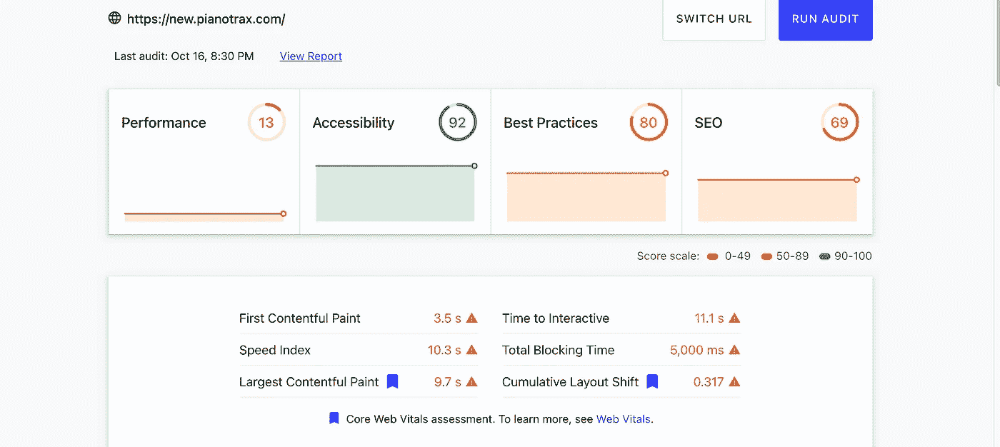

Web.dev Results

如果您向下滚动到结果，您将看到每个审核的结果及其影响。

每个问题都有一个链接，您可以从中了解详细信息以及如何解决问题。

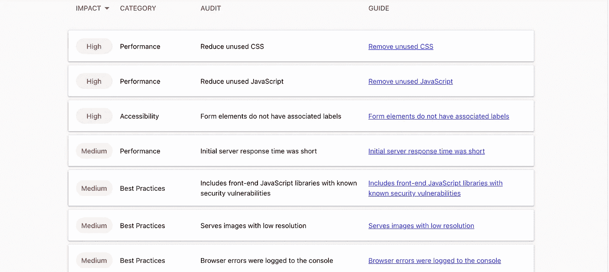

Resut details

这个工具非常神奇，你一定要好好利用这里的学习机会。

## 工具的链接

 [## 措施

### 当你测量你的站点时，web.dev 使用 Lighthouse，一个开源的自动化工具来提高 web 质量…

网络开发](https://web.dev/measure/) 

# 网页测试

这个工具给出了网站的总体评分。这个网站的特点是它还可以测量你的网站的安全性。这在其他工具中是不存在的。

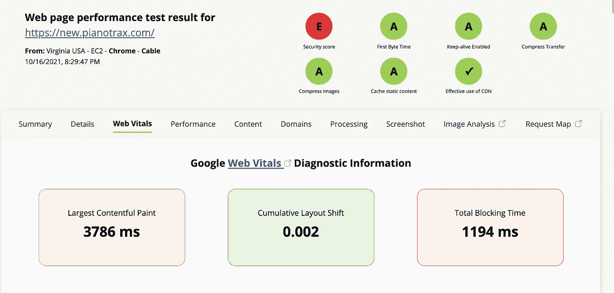

WebPage Test Result

如果您查看选项卡，您可以看到每个测试的详细分类。这是高度技术性的，所以我不建议浏览每个细节。

但是如果你想深入，这是你的工具

## 工具的链接

 [## 网页测试-网站性能和优化测试

### 在全球范围内使用真实浏览器以消费者连接速度运行免费网站速度测试，并提供详细的…

www.webpagetest.org](https://www.webpagetest.org/) 

# PageSpeed 洞察

这是谷歌推出的一款非常简约但功能强大的工具。

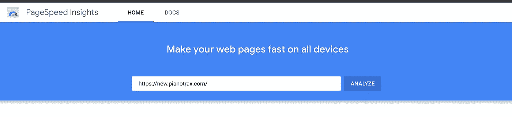

PageSpeed Home Page

现在好的事情是它产生 2 组结果。一个是移动版本，另一个是桌面版本。

它给出一个总体分数，并指出页面上的问题。

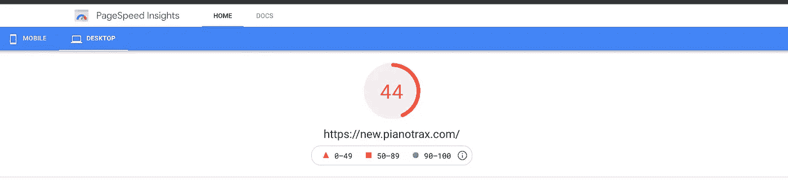

Overall score

重要的是，它还指出了具体的问题以及解决问题的方法，并提供了准确的细分。这个挺有用的！

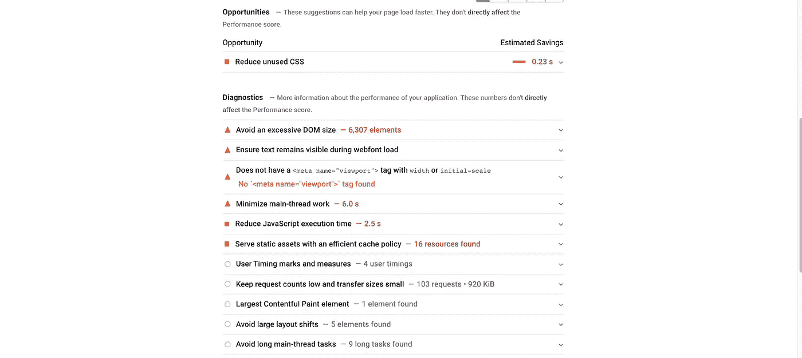

PageSpeed Result

由于谷歌是搜索引擎市场的领导者，他们工具的结果对优化你的网站有很大的影响。

## 工具的链接

 [## PageSpeed 洞察

### 有关于使用 PageSpeed Insights 的具体、可回答的问题吗？问你关于栈溢出的问题。对于一般情况…

developers.google.com](https://developers.google.com/speed/pagespeed/insights/) 

# Pingdom 工具

这是另一个很好的工具，可以生成非常详细的报告。它有付费版本和一些其他服务，但免费工具也很棒！

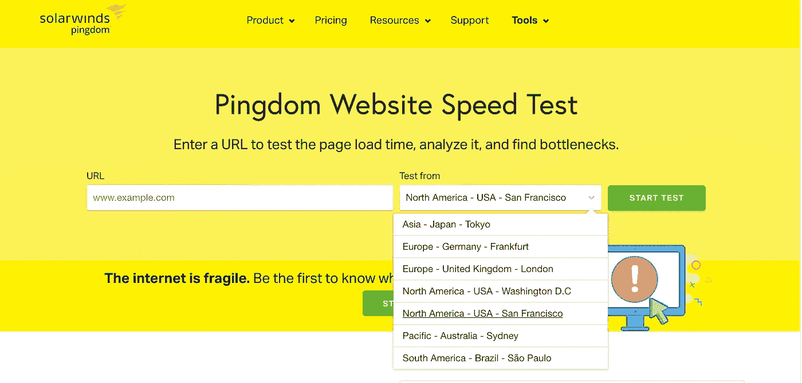

Pingdom

这个网站会给你一个整体的性能等级和一些重要的指标，如页面大小和请求数量。并给出了改进结果的建议。

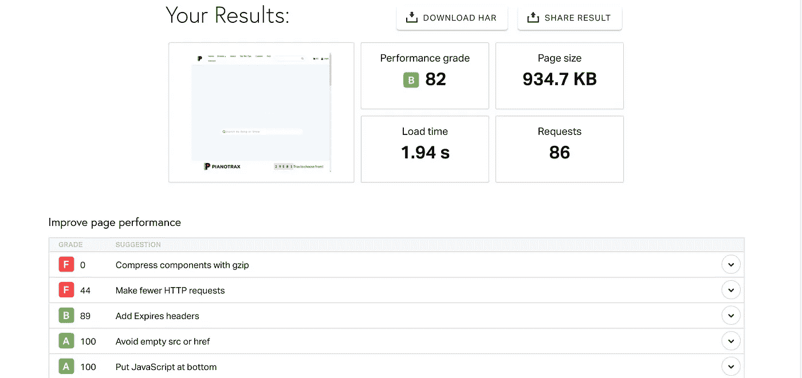

Pingdom results

但是它不允许您单独测试桌面或移动版本。

## 工具的链接

 [## Pingdom 工具

### 使用这个免费的网站速度测试来分析你的网站的加载速度，并学习如何使它们更快。

tools.pingdom.com](https://tools.pingdom.com/) 

# GTMetrix

这是你需要掌握的另一个工具。这个工具也做与其他工具类似的测试。但它的特点是它能让你一次比较多个页面。

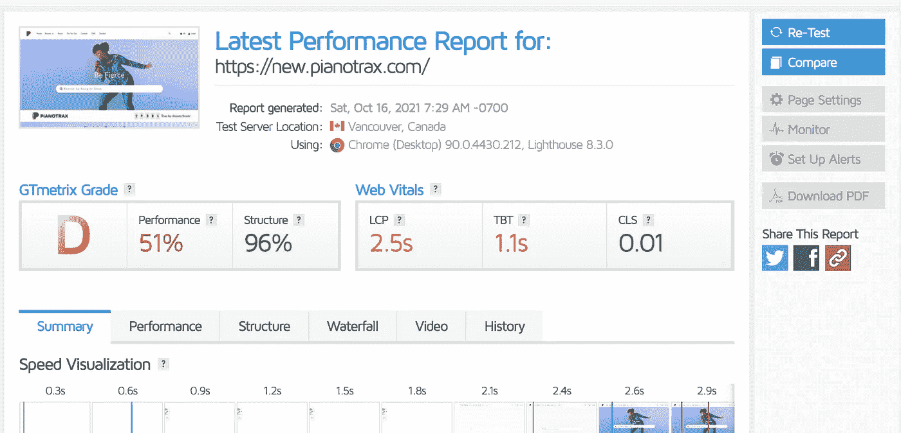

它给出了一个总体分数，并提供了一个很好的测试视频！

## 工具的链接

 [## GTmetrix |网站性能测试和监控

### 请记住，位置会影响测试结果。1️⃣检查你的分析 2️⃣找出你的观众来了…

gtmetrix.com](https://gtmetrix.com/) 

# 网络工具

这是另一个很棒的网站，让你能够在不同的浏览器中测试你的网站。你可以选择你想测试你的网站的浏览器和位置，它将会产生一个基于此的结果。

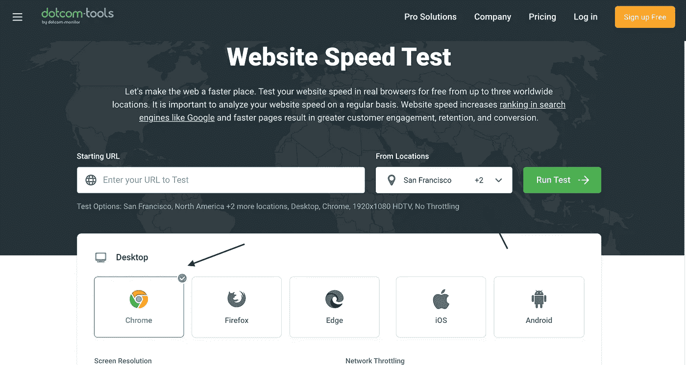

这也从多个位置生成结果。从下面的图片你可以看到蒙特利尔的表现比迈阿密慢一点。

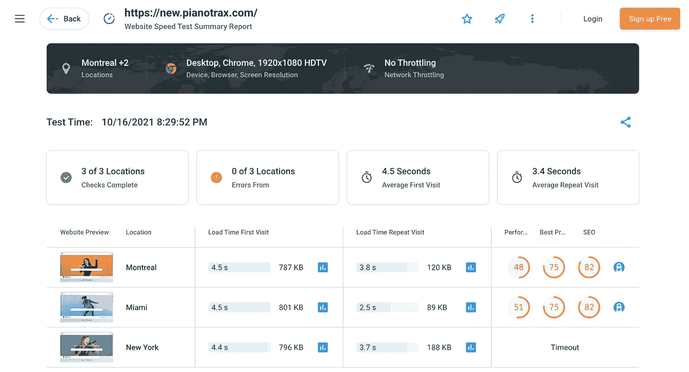

**链接:**【https://www.dotcom-tools.com/website-speed-test】T2

# 最后的话

这些是一些很棒的网站，你可以用它们来找出你网站的问题。试着用它们来为你服务。

**通过** [**LinkedIn**](https://www.linkedin.com/in/56faisal/) 联系我

*更多内容请看*[***plain English . io***](http://plainenglish.io/)