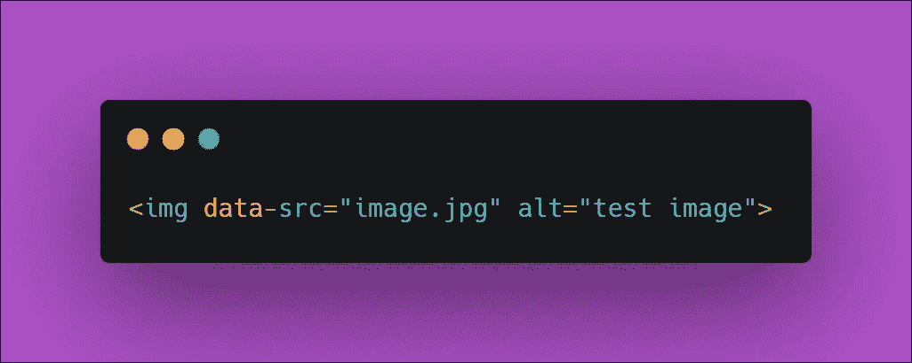
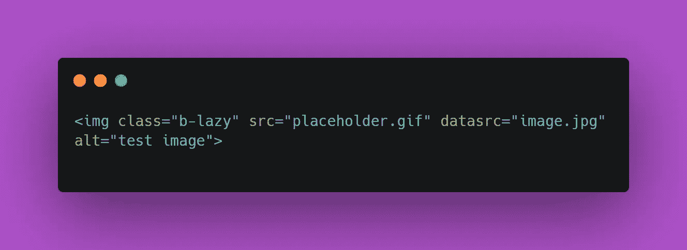
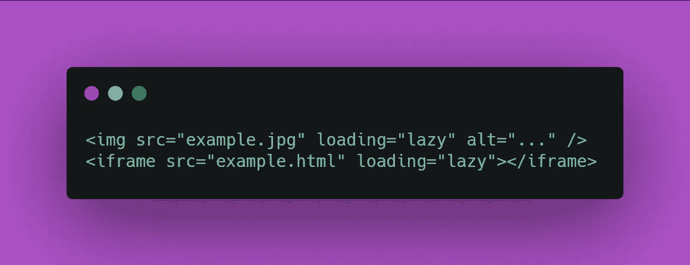
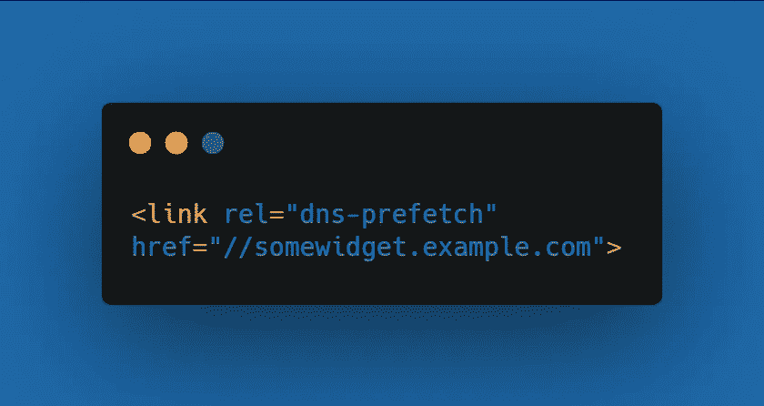
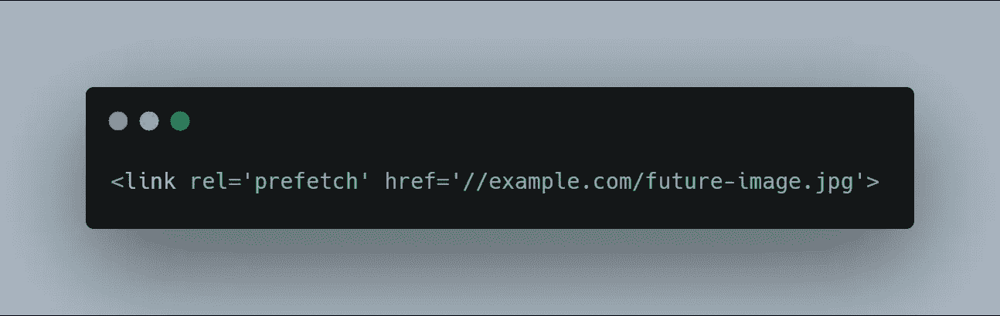

# Web 应用程序的 6 种前端优化技术

> 原文：<https://javascript.plainenglish.io/6-front-end-optimization-techniques-for-web-applications-6bcde2c42905?source=collection_archive---------3----------------------->

## 构建极快的 Web 应用程序

大量的网站使用惰性加载技术来构建用户友好的界面，但是最大的问题是为什么我们要在应用程序中关心惰性加载。 ***这两个显著的原因是:***

*   在 web 应用程序的大多数情况下，当 **JavaScript** 显示内容以提供功能时，快速加载 **DOM** 变得非常困难。在 JavaScript 中，脚本在开始运行之前等待 DOM 完成加载是很常见的。特别是在这种情况下，具有大量图像的 web 应用程序将会遭受糟糕的用户体验。
*   web 应用中的资产优化可以为您节省大量带宽。**例如**，在大多数情况下，如果用户已经滚动到图像被设置为加载的位置，则可以看到延迟加载图像，使用这种技术，您可以在 web 应用程序中节省大量带宽。

# 1.简单图像延迟加载和渐变

*   **img** 标签中的 **src** 属性被替换为 **data-src** 属性。
*   **img** 元素被隐藏在一个 **data-src** 属性中，一旦它们被加载，它们将使用 CSS 过渡以一个漂亮的**淡入**效果出现。
*   之后，JavaScript 将 src 属性添加到每个 **img** 元素中，并为其赋予各自的 **data-src** 属性的值，一旦加载完成，脚本将从 **img** 元素中删除 **data-src** 属性。

如果您只是在寻找一种快速的替代方法来优化图像资产，这种方法实现起来非常简单快捷。

唯一的缺点是这种方法不包括滚动加载功能。更简单地说，所有图像都将由浏览器加载，无论用户是否将它们滚动到**视图**中。

# 2.优化自定义字体文件

## 提供 Web 字体格式

所有现代浏览器基本上都支持四种字体格式。

*   **True Type 字体(TTF):** 一种非常常见的字体格式，自 80 年代末就已经出现。
*   **Web 开放字体格式(WOFF&woff 2):**2009 年开发，是开放类型或真类型，只有压缩和进一步的元数据。
*   **嵌入式开放字体(EOT):** 微软设计的一种格式，用于网络上的嵌入式字体。

但是，您可以在 **@font-face** 声明中指定字体格式，推荐的格式是 WOFF & WOFF2，因为它对所有现代浏览器都有最好的支持。

## 仅使用您指定的样式

字体有不同的变体，如**斜体**、**粗体**等。每一个都增加了文件大小的权重，所以如果你不需要它们，尽量避免增加字体变化。

# 3.bLazy.js

*   **加一个班。B-懒惰**
*   使用占位符图像作为 **src** 属性的值，为了保存 **HTTP** 请求，您还可以使用内嵌的 **base64 编码的透明 gif** 。
*   **data-src** 属性指向您想要惰性加载的图像。

一个**普通的 JavaScript** 插件，带有轻量级的惰性加载图像脚本(小于 1.2 千字节缩小和压缩)，允许你惰性加载和多服务图像，这样你可以节省带宽和服务请求。

# 4.本机惰性加载

谷歌的**Chrome(76 版)**和所有基于 Chrome 的浏览器(即**、Edge、Safari** & **Firefox)的最新更新版本，您可以通过几个简单的步骤来本地加载图像资产。**在嵌入图像时，只需要添加一个 **loading** 属性，即可实现惰性加载。

**加载**属性支持以下 3 个值:

*   **lazy:** 延迟加载资产，直到它到达离视口一定距离的位置。
*   **急切:**页面一加载，就加载资产，不管它们放在页面的什么位置。
*   **自动:**触发默认惰性加载，不包括加载属性。

# 预取

虽然我们有许多优化技术为交互式网站服务，但有时这可能还不够。

在这种情况下，一种被称为*预取*的技术可以让你的网站比你想象的快得多。在预取过程中，浏览器能够操纵用户将要点击的链接以及他们最有可能停止的链接，以便内容能够以优化的方式自动出现在他们的屏幕上。

> 我将只讨论下面的 **2** 预取技术:

# 5.域名系统-预取

*   每当浏览器对不同域上的资源发出 HTTP 请求时，它都会花费至少几**毫秒**将域名解析为相关的 IP 地址。
*   **例如,**假设您的网络应用程序有来自推特和脸书的小部件，那么它必须访问其他域，这使得域名系统查找在现代网络应用程序中不可避免。
*   使用 *DNS 预取*，开发者可以向**sample.website.com**发出请求，他们可以向浏览器添加一个源，该源建议浏览器通过将 **rel** 属性添加到值为 **dns 预取的链接来获取主机名的 DNS。**
*   现在，无论何时发出请求，浏览器都会提前执行 DNS 查找，以便更快地获得结果。

# 6.链接/资源预取

这种技术类似于准备好用户将来可能需要的资源，以提供快速的性能。简而言之，开发者必须假设用户可能会访问网页上的特定位置。

> *注意，资源预取只适用于可缓存的资源，如* ***JavaScript、*** *图片等。*

 [## 学习 JavaScript 时不应错过的 4 个概念

### 刷新基本的 ES6 JavaScript 概念

javascript.plainenglish.io](/4-concepts-you-shouldnt-miss-while-learning-javascript-2906d2571f1e)  [## 每个软件开发人员都应该知道的 9 条编程原则

### 很好地了解干净代码的编程原则

javascript.plainenglish.io](/9-programming-principles-every-software-developer-should-know-9fffe3c5258) 

*更多内容请看*[***plain English . io***](https://plainenglish.io/)