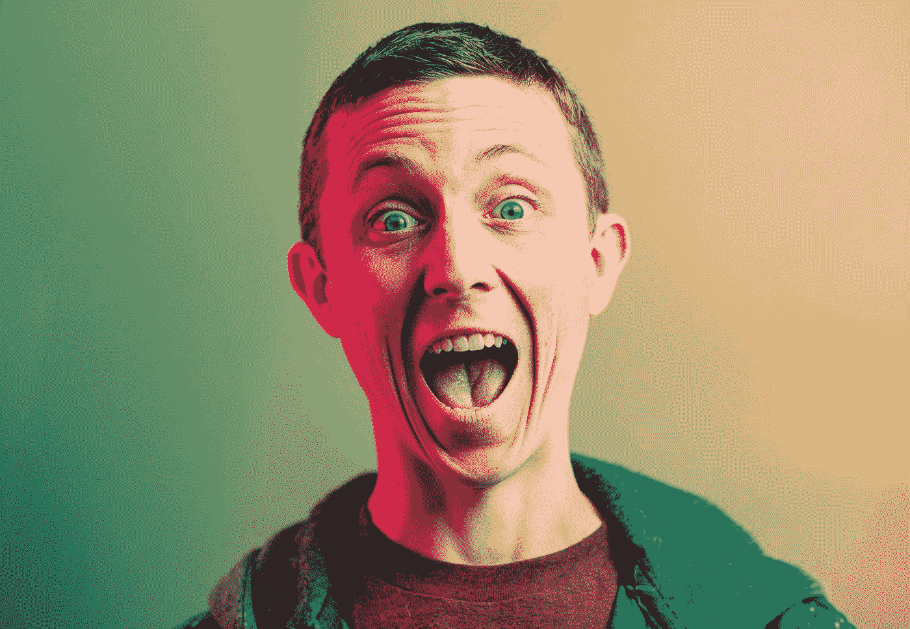
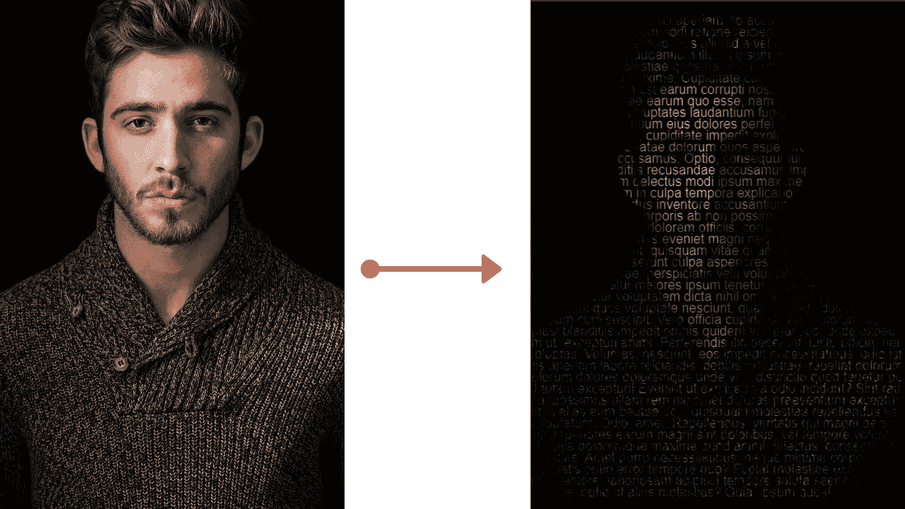
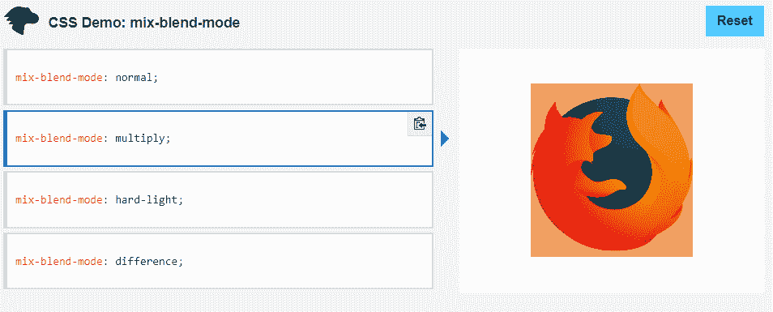
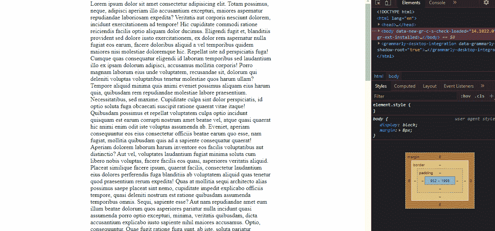
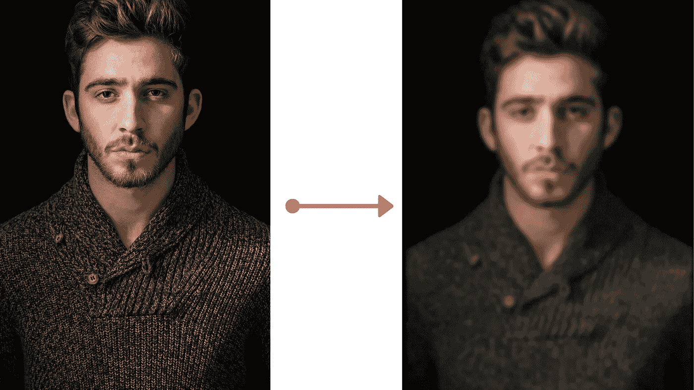
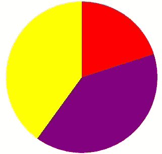
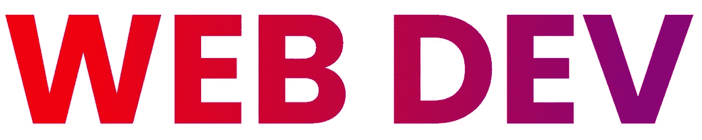

# 仅用 CSS 就可以做的 6 件有趣的事情

> 原文：<https://javascript.plainenglish.io/6-fun-things-you-can-do-with-css-1acabc8bf072?source=collection_archive---------0----------------------->

## 用几行 CSS 建立一个简单的 photoshop &饼状图。



Photo by [Timothy Dykes](https://unsplash.com/@timothycdykes?utm_source=medium&utm_medium=referral) on [Unsplash](https://unsplash.com?utm_source=medium&utm_medium=referral)

不管你喜不喜欢，CSS(层叠样式表)是我们用来设计 HTML 元素的语言。

虽然有一些神奇的预处理程序，如 SCSS(最终被编译成 CSS ),并提供比普通 CSS 更多的功能，但这并不意味着你不能通过使用普通的标准 CSS 来做惊人的事情。

CSS 有 520 个不同的属性，虽然你可能不需要知道超过 30 或 50 个属性，但是探索这些不常见的 CSS 属性肯定可以帮助你只用样式表实现更多。

以下是你只用 CSS 就能做的 6 件惊人的事情:

## 1.创建肖像和添加效果

CSS 可以让你轻松地给照片添加一些引人注目的滤镜和效果，甚至不用接触 JavaScript。



Source: Author. Photo by [Albert Dera](https://unsplash.com/@albertdera?utm_source=unsplash&utm_medium=referral&utm_content=creditCopyText) on [Unsplash](https://unsplash.com/s/photos/portrait?utm_source=unsplash&utm_medium=referral&utm_content=creditCopyText)

上面的效果仅仅是用 CSS 的`background-clip property`创造出来的。

```
p{
  background-size: 70vh;
  background-position: center;
  line-height: 16px;
  background: url("photo.png");
  -webkit-background-clip: text;
  background-attachment: fixed;
  background-clip:text;
  background-repeat: no-repeat;
  -webkit-text-fill-color: rgba(255, 255, 255, 0);
}
body {
  background: black;
  overflow: hidden;
}
```

而我的`p`标签包含一些文本。

你也可以使用`mix-blend-mode`，它决定了内容应该如何与元素的父元素和元素的背景相融合。



Source: [MDN Web Docs](https://developer.mozilla.org/en-US/docs/Web/CSS/mix-blend-mode)

## 2.根据视口线性缩放文本

让你的网站响应视窗中的变化可能是一个繁琐的过程，通常涉及重写部分 CSS，并测试多个断点。

但它不必总是如此复杂和令人厌倦。

仅使用一行 CSS，您就可以随着视口的增大或减小在最小和最大尺寸之间缩放文本。



Source: Author

这是通过`clamp`属性完成的。

```
clamp(minimum, preferred, maximum);
```

这些值是不言自明的。`clamp`属性返回一个介于最小值和最大值之间的值。中间的参数，即“首选”是视口的百分比。

让我们在实践中看到这一点。

```
width: clamp(500px, 50%, 1500px);
```

当视窗宽度为 1600 像素时，首选值为 1600 像素的 50%，即 800 像素。当视口为 700 像素时，首选应为 700 的 50%，即 350 像素。

但是由于最小是 500px，所以会返回 500px。同样的逻辑也适用于最大值 1500px。

你也可以从上面提供的媒体中看到。最小值是 450 像素，因此当视口小于 900 像素时，您看不到任何变化。

## 3.简单的 Photoshop

CSS 提供了各种属性来编辑图像并对图像应用效果。这些属性中的一些已经在上面讨论过了，比如`mix-blend-mode`。

CSS 提供了各种属性来操作图像。其中一些是:

1.  亮度:`filter: brightness(90%)`
2.  模糊:`filter: blur(9px)`
3.  饱和度:`filter: saturate(4)`
4.  不透明度:`filter: oapcity(0.3)`
5.  色相:`filter: hue-rotate(45deg)`
6.  阴影:`filter: drop-shadow(30px 10px 4px #4444dd)`

下图应用了模糊滤镜。

```
img{
   filter: blur(2px);
}
```



Source: Author. Photo by [Albert Dera](https://unsplash.com/@albertdera?utm_source=unsplash&utm_medium=referral&utm_content=creditCopyText) on [Unsplash](https://unsplash.com/s/photos/portrait?utm_source=unsplash&utm_medium=referral&utm_content=creditCopyText)

还有更多过滤器，你可以在这里阅读它们[。](https://developer.mozilla.org/en-US/docs/Web/CSS/filter-function)

## 4.全屏

如果您曾经创建过博客网站或任何涉及显示图像的网站，您必须提供一些功能来使图像全屏显示。

即使是 Medium 也能做到，当你点击一张图片时，它会放大。

虽然您需要 JavaScript 来使元素全屏显示，但是通过使用`requestFullscreen()`方法，有一个 CSS 伪类`:fullscreen`允许您在元素处于全屏模式时对其进行样式化。

```
:fullscreen {
  background-color: yellow;
}
```

您可以轻松地应用滤镜或更改背景(因为全屏显示的元素会保留其纵横比，留下白色背景)。

## 5.饼图

只用两行 CSS 就可以轻松地创建饼状图。

使用`conic-gradient()` CSS 功能，您可以创建由围绕中心点旋转的渐变和颜色过渡组成的图像。

在我看来，这个函数最实际的用例是创建饼图。

```
background: conic-gradient(red 20%, purple 0 60%, yellow 0);
border-radius: 50%
```

上述代码将呈现以下内容:



Source: Author

`conic-gradient()`函数的结果是一个`[<gradient>](https://developer.mozilla.org/en-US/docs/Web/CSS/gradient)`数据类型的对象。

你可以在这里找到浏览器兼容性。

## 6.渐变文本

正确使用渐变可以给你的网站带来新鲜空气。

你可能已经知道如何处理渐变了。如果没有，你可以使用像 [Grabient](https://www.grabient.com/) 这样的网站，它可以让你定制渐变并为其提供 CSS。

但是你知道你也可以很容易地将渐变应用到文本中吗？

```
.text {
 background: linear-gradient(to right, red 0%, purple 100%);
 -webkit-background-clip: text;
 -webkit-text-fill-color: transparent;
 font: {
  size: 10vw;
 };
}
```

这样你就可以得到很棒的渐变文本。



Source: Author

## 结论

HTML 和 CSS 是 web 开发的基本构件，只使用这两种技术无法构建一些伟大的网站，这是一个神话。

虽然您需要 JavaScript 来实现功能，但 HTML 和 CSS 本身就可以帮助您用最少的 JavaScript(用于转换销售线索)构建漂亮的营销和登陆网站。

我见过许多自由职业者仅仅凭借 CSS 和 HTML 技能就成功了。

如果你对 HTML 技巧感兴趣，你可以看看我最近的博客，里面有 5 个 HTML 技巧和窍门。

[](/5-html-tricks-nobody-is-talking-about-a0480104fe19) [## 没有人谈论的 5 个 HTML 技巧

### 2021 年你应该知道的 HTML 标签和属性

javascript.plainenglish.io](/5-html-tricks-nobody-is-talking-about-a0480104fe19) 

我希望你喜欢这篇文章！

*更多内容看*[***plain English . io***](http://plainenglish.io)