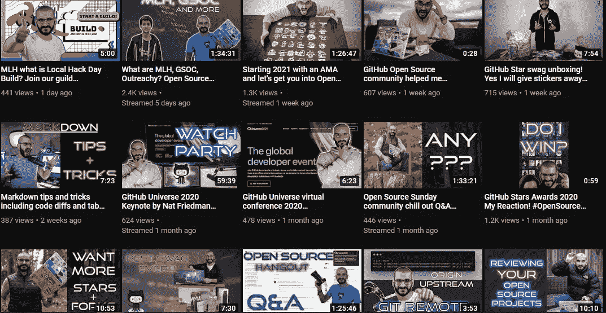
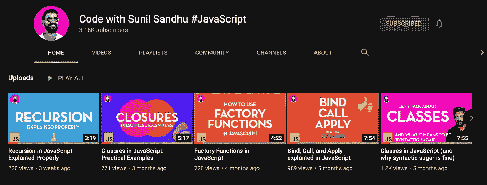
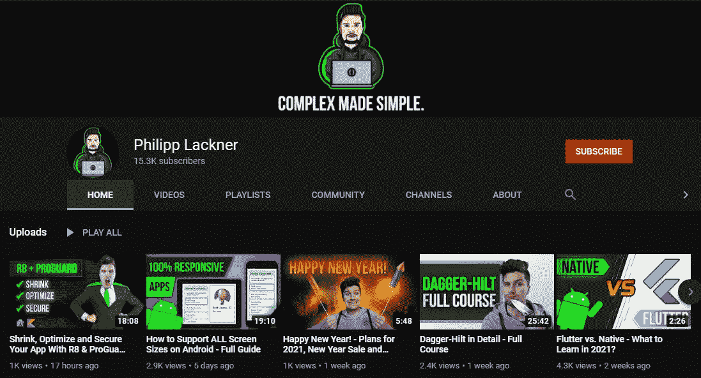
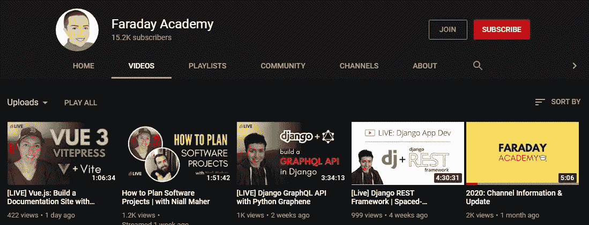
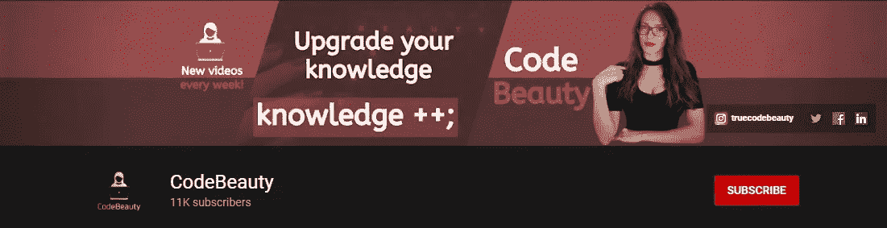
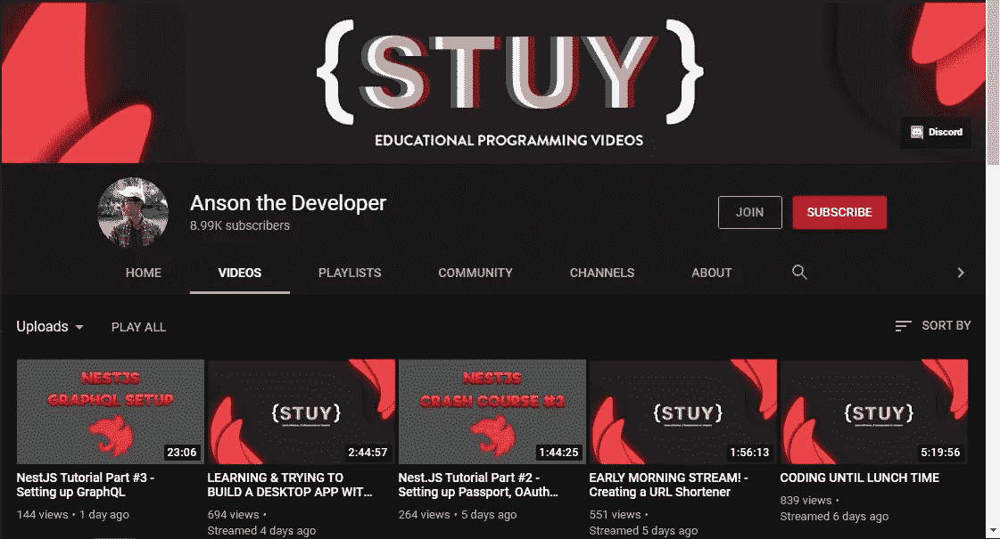

# 你可能不知道的 6 个伟大的编码 YouTube 频道

> 原文：<https://javascript.plainenglish.io/6-great-coding-youtube-channels-you-probably-dont-know-f0c15288bd0c?source=collection_archive---------4----------------------->

## 提供优秀内容的鲜为人知的 YouTubers

Photo by [Rachit Tank](https://unsplash.com/@rachitank?utm_source=medium&utm_medium=referral) on [Unsplash](https://unsplash.com?utm_source=medium&utm_medium=referral)

web 开发和编程领域总是有新的东西，不管是框架还是新语言。

即使你是一个有经验的开发人员，偶尔提高你的编程技能也是必要的。

然而，每当市场上出现新的东西时，支付课程费用会很昂贵，而且会妨碍学习。

因此，我们大多数人更喜欢先去 YouTube 看教程和比较。

我们都知道像 freeCodeCamp.org 这样的知名频道，但是还有很多冷门和被低估的频道值得一试。

这些频道提供了新的视角、教程和观点。

以下是你需要知道的 6 个不受欢迎的 YouTube 频道:

## 1.[埃迪·贾乌德](https://www.youtube.com/channel/UC5mnBodB73bR88fLXHSfzYA)

Source: [Eddie Jaoude YouTube Channel](https://www.youtube.com/channel/UC5mnBodB73bR88fLXHSfzYA)

如果你是一个热爱开源项目并希望为之做出贡献的前端开发者，这个频道是不可思议的。

该通道由具有 15 年以上经验的全栈工程师维护。

他主要涉及围绕开源项目和指南的主题，偶尔也会深入到 Vue.js 等框架中。

## 2.[苏尼尔·桑德胡](https://www.youtube.com/sunilsandhu)

Sunil 的频道对于前端开发人员和自学的程序员来说是一个极好的内容来源。

我喜欢他的频道是因为他提供了关于一些更令人困惑的编程概念的综合指南和视频，比如闭包和递归。

除此之外，他还涉及与软件开发相关的非技术技能和趋势。

## 3.菲利普·莱克纳

Source: [Philipp Lackner Channel](https://www.youtube.com/c/PhilippLackner/featured)

寻找 Android 应用开发的最新教程不像寻找 web 开发的教程那么容易。

Philip Lackner 的 YouTube 频道涵盖了 Android 应用程序开发，并提供了关于如何从头开始构建流行应用程序克隆的完整教程。

他广泛涉及了 Android 应用程序的各种主题，如 Firebase、导航部件(如滑动菜单)、RecyclerView 以及 MVVM 和权限。

这个频道绝对值得一查，即使你是一个应用程序开发世界的初学者。

## 4.[法拉第学院](https://www.youtube.com/c/FaradayAcademy/featured)

Source: [Faraday Academy Channel](https://www.youtube.com/c/FaradayAcademy/videos)

法拉第学院由资深软件开发人员格温负责维护。

她的频道是 web 开发领域教程和视频的绝佳来源。

她涵盖了 Vue、敏捷、Django、REST API 和其他类似的主题。

这个频道每周提供与节目相关的材料。

您可以找到许多现场直播和访谈，不仅讨论技术方面，还讨论成为优秀开发人员所需的非技术方面。

## 5. [CodeBeauty](https://www.youtube.com/c/CodeBeauty/featured)

Source: [CodeBeauty YouTube Channel](https://www.youtube.com/c/CodeBeauty/featured)

这个频道是最近在新冠肺炎疫情开始时建立的，由软件工程师 Saldina Nurak 维护。

这个频道是绝对初学者程序员的理想去处。

虽然她已经介绍了 HTML 和 CSS，但是她的频道主要是关于 C++语言的。

她讲述了一些广泛使用的概念，如函数重载、密文、指针、继承等。

## 6.[安森开发商](https://www.youtube.com/c/AnsontheDeveloper/videos)

Source: [Anson The Developer Channel](https://www.youtube.com/c/AnsontheDeveloper/videos)

他的渠道主要面向前端开发者。

您可以找到与 web 开发领域相关的各种框架和库的指南和教程。

除此之外，还可以看到诸如 Discord.js 等 API 和库的实现。

此外，您还可以在 Deno、Express 和 JavaScript 上找到初学者友好的教程。

他的频道还提供了使用 MERN、GraphQL 等从头开始构建应用程序的综合教程。

## 最后的想法

Web 开发是一个涵盖许多不同主题的专业领域，并且该领域随着新框架和语言的频繁出现而不断发展。

因此，每隔一段时间就必须提升和更新我们的编程知识，以跟上发展的步伐。

YouTube 是一个开始学习和寻找相关内容的好地方，即使有很多成熟的频道，YouTube 也有很多不受欢迎和被低估的频道。

我曾试图报道一些被低估的 YouTube 频道，这些频道对我帮助很大，应该得到更多的认可。

感谢阅读！