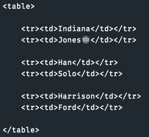
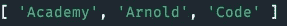
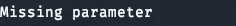
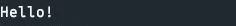
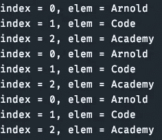

# 6 个隐藏的 JavaScript 宝石，你可能错过了，但会让你在工作中成为一颗闪亮的星星

> 原文：<https://javascript.plainenglish.io/6-hidden-javascript-gems-you-probably-missed-but-will-make-you-a-shining-star-at-work-b57a3bcf8015?source=collection_archive---------0----------------------->

## 从 ES6 开始，这些技巧在 JavaScript 中就已经过时了


Image Made By The [Author](http://arnoldcode.com) via [Canva.com](http://canva.com)

你对一门语言了解多少？

这是一个合理的问题，因为我总能在一门语言中发现新的东西，即使是在工作多年之后。今天是你的幸运日。这些宝石可以让你在公司的日常工作中变得有价值，成为你团队中的佼佼者。

成为一名导师，成为一名继承者，或者深入 JavaScript 的好奇世界，最好的情况是，你可以保留你所发现的东西。

# 1.通过子类工厂混合

出于三个原因，您希望在您的 JavaScript 工具箱中包含子类:

1.  **接口继承:**所有作为子类实例的对象也是其超类的实例。子类实例的行为应该像超类实例一样，但通常可以做得更多。
2.  **实现继承:**超类把功能交给它们的子类。
3.  **继承限制:**类对于实现继承的用处是有限的，因为 JavaScript 支持单源继承。(无效:`class A extends B, C`)

实现 mixins 的一种方法是将其视为一个函数，其输入是一个超类，其输出是扩展该超类的子类。

首先创建一个名为`IdleGuy`的类:

然后创建一个 const，它接受一个`SuperClass`作为输入参数，并在那个`SuperClass`上扩展。*在你的情况下，* `IdleGuy` *前来救援！*

现在是时候将这两个类融合在一起了，就像你马上要品尝的鸡尾酒一样。

您可以从`IdleGuy`和`Cocktails`工厂中创建一个`Bartender`对象。新款`Bartender`会让你喝一杯然后无所事事。


Console Printout For fullyMixed.js

快乐的小公鸡。

# 2.通过模板文字进行模板化

模板文字比传统的文本模板更像字符串文字。

这里有一个转折:当从函数中返回它们时，你可以用它们来做模板。

函数`template`(一个箭头函数)将数组`names`映射到一个字符串。在第 15 行，我在数组`data`上使用`template()`来获得这个漂亮的模板:



Console Printout For functionTemplateReturn.js

# 3.通过析构交换变量值

当你交换变量时，*你通常使用一个辅助变量*，**但你不需要。**

例如，如果将两个变量放入一个数组，然后将该数组析构为相同的变量，则可以交换它们的值，而不需要中间变量:



Console Printout For swapMcFly.js

# 4.强制函数的强制参数

JavaScript 允许您调用需要参数的函数，而不提供任何参数。

对于没有经验的开发人员来说，这可能会成为一个陷阱，或者导致运行时错误，最糟糕的是。

ES6 参数默认值在实际使用时进行评估。知道这一点可以让您强制提供给定的参数:



Console Printout For enforceParameter.js

仅当参数`mustBeProvided`缺失时，才进行函数调用`detectMissingParameter()`。



Console Printout For mayTheParameterBeWithYou.js

# 5.For-Of 循环支持索引访问

迭代一个数组，但需要验证索引？— **不需要**使用*辅助变量。*

`forEach()`替你做工作。您需要设置第二个输入变量，即索引。就这样，任务完成。

**但是(t)** 你也可以用`for-of`循环做同样的事情:

检查例子并发现传递给`forEach()`循环的`index`变量。`for-of`循环也支持迭代(通过 iterables 和 iterators)和析构。

在最后一个例子(第 12-15 行)中，我在 for-of 循环中结合了析构(`[index, elem]`)和数组方法`entries()`来获得相同的访问。

这是控制台的打印输出:



Console Printout For forOfIndicesIterating.js

# 6.对 Unicode 进行迭代

Unicode 可以包含两个 JavaScript 字符。比如表情符号😐

这意味着它们的长度为 2，如果对它们进行迭代，就会得到编码的代码点(一个或两个 JavaScript 字符)。


Console Printout For unicideIteration.js

***恭喜恭喜！*** 你给了自己一种计算字符串中代码点数量的方法:

```
***console****.*log([...'x\uD83D\uDE80y🎁']*.*length) --> 4
```

获取 26 份备忘单，只研究你真正需要的东西，以获得你的第一份网络开发工作！


[Arnold Code Academy 26 Web Developer Cheatsheets](https://arnoldcodeacademy.ck.page/26-web-dev-cheat-sheets)

*更多内容请看*[***plain English . io***](http://plainenglish.io/)***。*** *报名参加我们的* [***免费每周简讯这里***](http://newsletter.plainenglish.io/) ***。***