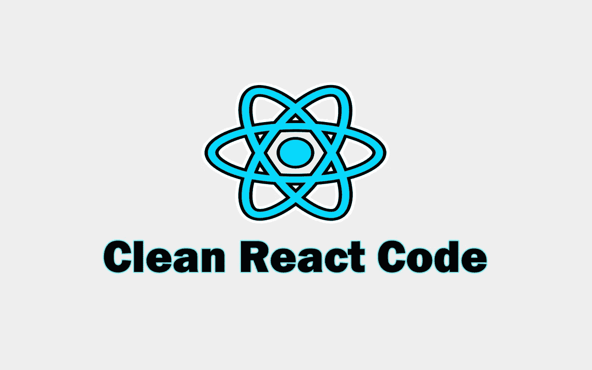

# 编写干净的 React 代码的 6 个重要技巧

> 原文：<https://javascript.plainenglish.io/6-important-tips-to-write-clean-react-code-5ef29d6a73a6?source=collection_archive---------1----------------------->

## 作为 React 开发人员，编写干净代码的技巧。



Image created with ❤️️ By author.

一般来说，编写干净的代码是软件开发中最重要的事情之一。大多数大公司总是试图确保为他们的软件编写的代码更干净，性能更好，这样他们以后就可以很容易地管理它。即使你是独立开发人员，干净的代码也是非常重要的，因为大多数时候你需要重构代码或者添加新的特性。

如果您使用 React 作为 JavaScript 库来构建用户界面，您应该知道它有一些规则，您可以遵循这些规则来使您的代码更加整洁和易读。编写干净的代码总是会让你成为一名有价值的 React 开发人员。

这就是为什么在这篇文章中，我想与您分享一些有用的技巧，以在 React 中编写干净的代码。所以让我们开始吧。

# 1.为每个组件创建单独的文件

举个例子，我见过很多开发者仅仅在 App 组件里就写了几个组件。这是一种不好的做法，因为每个组件都有自己的 UI 和功能。在一个文件中处理每个组件的所有内容会使代码难以阅读。

这就是为什么您需要为应用程序中的每个组件创建单独的文件，并在应用程序组件中呈现它们。例如，如果您想使用 React 创建一个简单的登录页面，请确保为登录页面中的每个组件创建一个单独的文件。一个用于 navbar 组件的文件，一个用于“关于”部分组件的文件，一个用于页脚组件的文件，等等。

因此，这将使您的应用程序代码更具可读性，更易于管理。除此之外，这还将帮助您在整个应用程序中重用组件。

这里有一个例子:

```
*//src/App.js*import Navbar from './components/Navbar.js';
import About from './components/About.js';
import Footer from './components/Footer.js';export default function App() {
  return (
    <>
      **<Navbar />
      <About />
      <Footer />** </>
  );
}
```

如您所见，您可以在应用程序中的任何地方呈现组件。你只需要为它们创建单独的文件。

*导航栏组件的单独文件:*

```
*//src/components/Navbar.js*

export default function Navbar() {
  return (
    <nav>
      <h1>Example</h1>
    </nav>
  );
}
```

*关于组件的单独文件:*

```
*//src/components/About.js*

export default function About() {
  return (
    <div>
      <h2>About Me.</h2>
    </div>
  );
}
```

*页脚组件的单独文件:*

```
*//src/components/Footer.js*

export default function Footer() {
  return (
    <footer>
      <h3>This is a footer.</h3>
    </footer>
  );
}
```

正如你在上面看到的，你可以创建一个名为`components`的文件夹，把所有独立组件的文件放在那里，使你的代码易于管理。

# 2.在 JSX 减少 JavaScript

如你所知，在 React 中，我们可以在 JSX 代码中编写任意多的 JavaScript。但是这种行为会使我们的代码难以阅读，因为会混合使用 JavaScript 和 JSX。这就是为什么我建议你总是减少 JSX 内部的 JavaScript 代码量。

这里有一个例子:

*不好的做法:*

```
import React,{ useState } from 'react';export default function Form() {
  const [firstName, setFirstName] = useState('');return (
    <form>
      <input value={firstName} **onChange={event => {** **setFirstName(****event.target.value);
          console.log(event.target.value, 'changed!');
        }}**/>
    </form>
  );
}
```

*良好做法:*

```
import React,{ useState } from 'react';export default function Form() {
  const [firstName, setFirstName] = useState(''); const handleSubmit = (e) => {
   setFirstName(e.target.value);
   console.log(e.target.value, 'changed!');
  }return (
    <form>
      <input value={firstName} **onChange={handleSubmit}**/>
    </form>
  );
}
```

正如你所看到的，第二个例子看起来比第一个更清晰易读。因此，在 JSX 总是通过创建单独的 JavaScript 函数来减少 JavaScript，尤其是在涉及 DOM 事件处理程序时。

# 3.总是使用析构

析构是 JavaScript ES6 的重要特性之一。它允许我们析构对象和数组，以减少代码语法。因此，这个特性使得代码更加清晰易读。

有时你甚至可以把物品当作道具来传递。该对象也可能难以访问，尤其是当它包含许多嵌套属性时。

以下是一些例子:

*不好的做法:*

```
const Person = props => { return (
    <>
      <h2>Name: **{props.person.name}**</h2>
      <p>Age: **{props.person.age}**</p>
      <p>Profession: **{props.person.profession}** </p>
      <p>Hobby: **{props.person.hobby}**</p>
    </>
  );
};
```

*好做法:*

```
const Person = props => {
  const { name, age, profession, hobby } = props.person; return (
    <>
      <h2>Name: **{name}**</h2>
      <p>Age: **{age}**</p>
      <p>Profession: **{profession}** </p>
      <p>Hobby: **{hobby}**</p>
    </>
  );
};
```

为了使它更好，你甚至可以在参数中析构对象，如下所示:

```
const Person = ({person: { name, age, profession, hobby} })=> {return (
    <>
      <h2>Name: **{name}**</h2>
      <p>Age: **{age}**</p>
      <p>Profession: **{profession}** </p>
      <p>Hobby: **{hobby}**</p>
    </>
  );
};
```

正如你所看到的，最后两个例子在我看来更具可读性。因此，析构是减少 JSX 代码并使其更简洁的好方法。尽可能多地使用它。

# 4.条件渲染

当谈到 React 中的条件渲染时，有不同的选项。您可以使用三元运算符、IF 语句和短路。但是你应该知道什么时候使用它们。

例如，当涉及到一个条件时，使用短路总是更好。另一方面，如果要根据不同的条件(两个条件)渲染事物，使用三元运算符要干净得多。

*   有一个条件:

*不好的做法:*

```
//ternary operator{showModal ? <h1>Modal was opened</h1> : null}
```

*良好实践:*

```
//short-circuiting**{showModal && <h1>Modal was opened</h1>}**
```

*   对于两种情况:

*不良做法:*

```
//short-circuiting{showModal && <h1>Modal was opened</h1>}
{!showModal && <h1>Modal was closed</h1>}
```

*良好实践:*

```
//ternary operator**{showModal ? <h1>Modal was opened</h1> : <h1>Modal was closed</h1>}**
```

# 5.书写道具

说到写道具，我也看到一些开发者写道具的方式不对。

例如，有时，您必须编写值为`true`的 truthy props。您可以通过以下两种方式做到这一点:

*不良做法:*

```
export default function App() {
  return (
    <>
      <Navbar **text={true}** /> </>
  );
}
```

*良好实践:*

```
export default function App() {
  return (
    <>
      <Navbar **text** />
   </>
  );
}
```

如你所见，如果你传递了一个没有值的属性，默认情况下它会变成`true`。所以你不必像这样把它设置成`true`:`text={true}`。

另一种情况是当你有字符串道具的时候，你可以把道具当做一个没有花括号的字符串来传递。

下面是一个例子:

*不好的做法:*

```
export default function App() {
  return (
    <>
      <Navbar **text={"hello"}** /></>
  );
}
```

*良好做法:*

```
export default function App() {
  return (
    <>
      <Navbar **text="hello"** />
   </>
  );
}
```

# 6.使用更漂亮和 ESLint

编写干净代码的另一个技巧是在开发中同时使用 vs code extensions appellister 和 ESLint。

漂亮是一个非常有用的扩展，它以一种更好的方式格式化你的代码，并使它看起来清晰。它改变了代码的结构视图，使其看起来更清晰。

ESLint 也是一个很好的扩展，它可以帮助你发现代码中的错误，并告诉你如何遵循风格指南。所以我建议您总是在文本编辑器中启用这两个扩展。

# 结论

如您所见，这些是我在 React 中编写干净代码的小技巧。通过遵循这些简单的提示，你的代码将变得更加易读和整洁。

感谢您阅读这篇文章。希望你觉得有用。

## 进一步阅读

[](/5-dev-tools-for-documenting-react-code-like-a-pro-b9bb70420a9d) [## 像专家一样记录 React 代码的 5 个开发工具

### 游泳，合流，咕噜，组队堆栈溢出，平板。这些是你应该在 2023 年尝试的顶级 React doc 工具

javascript.plainenglish.io](/5-dev-tools-for-documenting-react-code-like-a-pro-b9bb70420a9d) [](/5-powerful-react-libraries-that-you-can-use-in-2021-496b975c7bef) [## 您可以在 2021 年使用的 5 个强大的 React 库

### React 库使开发应用程序变得更加容易

javascript.plainenglish.io](/5-powerful-react-libraries-that-you-can-use-in-2021-496b975c7bef) [](/5-useful-javascript-features-that-nobody-is-talking-about-b630838dedba) [## 没有人谈论的 5 个有用的 JavaScript 特性

### 你应该知道的冷门 JavaScript 特性。

javascript.plainenglish.io](/5-useful-javascript-features-that-nobody-is-talking-about-b630838dedba) 

*更多内容请看*[***plain English . io***](https://plainenglish.io/)*。报名参加我们的* [***免费周报***](http://newsletter.plainenglish.io/) *。关注我们关于*[***Twitter***](https://twitter.com/inPlainEngHQ)[***LinkedIn***](https://www.linkedin.com/company/inplainenglish/)*[***YouTube***](https://www.youtube.com/channel/UCtipWUghju290NWcn8jhyAw)*[***不和***](https://discord.gg/GtDtUAvyhW) ***。*****

*****对缩放您的软件启动感兴趣*** *？检查* [***电路***](https://circuit.ooo?utm=publication-post-cta) *。***