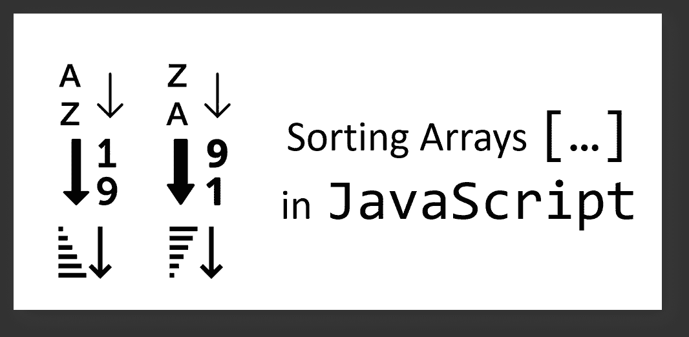

# 6 个用于排序数组的 JavaScript 代码片段

> 原文：<https://javascript.plainenglish.io/6-javascript-code-snippets-for-sorting-arrays-56a7049f831?source=collection_archive---------2----------------------->

## 按照字母数字字符和日期的升序/降序对 JavaScript 数组进行排序。



Illustration by Author

> **排序**和 m **戈尔**算法是软件编程的常规核心课程。

有趣的是，我还没有在互联网上找到 JavaScript 排序行为的完整列表。经过一些考虑，我最终决定创建一个相关的帖子，作为其他 web 开发人员的潜在参考。😃

# 演示用例:查找“arr”的结果

## (1)数值排序|升序[⇣⁰₉]

```
const arr = [40, 100, 1, 5, 25, 10];
arr.sort(function(a, b){
 return a-b;
});
```

**之前:**【40，100，1，5，25，10】

**之后:**【1，5，10，25，40，100】

**解释:**对于数值排序，必须创建一个比较器实体或比较函数。在上面的代码片段中，这等同于

```
const compare = function(a, b){
 return a-b;
};
```

排序结果是

```
arr.sort(compare);
```

## (2)数值排序|降序[⇣⁹₀]

```
const arr = [40, 100, 1, 5, 25, 10];
arr.sort(function(a, b){
 return b-a; // swap the positions of a and b
});
```

**之前:**【40，100，1，5，25，10】

**之后:**【100，40，25，10，5，1】

## (3)字母排序| Ascending✷ [⇣ᴬᴢ]

```
const arr = ["Blue", "Orange", "Aqua", "Marine"];
arr.sort();
```

**之前:** [“蓝色”、“橙色”、“浅绿色”、“海洋色”]

**之后:**【“水绿色”、“蓝色”、“海洋色”、“橙色”】

JavaScript 中的✷Alphabetical 排序行为不太直观。只有当数组中的所有元素都被读取为**(类型)字符串**时，内置的默认`sort()`函数才适用于 JavaScript 数组。

## (4)字母排序| Descending✷ [⇣ᶻᴀ]

```
const arr = ["Blue", "Orange", "Aqua", "Marine"];
arr.sort().reverse();
```

**之前:**【“蓝色”、“橙色”、“浅绿色”、“海洋色”】

**之后:**【“橙色”、“海洋色”、“蓝色”、“水绿色”】

✷unlike`sort()`函数仅适用于字符串实体，JavaScript 中的函数`reverse()`适用于整个数组，并交换元素的位置，而与 **(type)** 无关，例如，第一个元素成为最后一个元素，反之亦然。

## (5)日期排序|升序[▲]

```
const arr = ["2015-03-25", "2015-02-01", "2015-01-03", "2015-02-02"];
arr.sort(function(a, b){
        return new Date(a)-new Date(b);
});
```

**之前:**[" 2015–03–25 "，" 2015–02–01 "，" 2015–01–03 "，" 2015–02–02 "]

**之后:**[" 2015–01–03 "，" 2015–02–01 "，" 2015–02–02 "，" 2015–03–25 "]

**解释:**日期的排序行为与数值排序非常相似。然而，JavaScript 数组中的字符串实体必须被解析为日期对象，因为它们可以基于相对日期的出现进行排序。

## (6)日期排序|降序[▼]

类似于数字排序…

```
const arr = ["2015-03-25", "2015-02-01", "2015-01-03", "2015-02-02"];
arr.sort(function(a, b){
        return new Date(b)-new Date(a); // swap the positions of a and b
});
```

**之前:**[" 2015–03–25 "，" 2015–02–01 "，" 2015–01–03 "，" 2015–02–02 "]

**之后:**[" 2015–03–25 "，" 2015–02–02 "，" 2015–02–01 "，" 2015–01–03 "]

这就是我整理 JavaScript 数组的 6 个代码片段的清单！非常感谢你坚持到这篇文章的最后，❤希望你已经发现这是有用的，并考虑做书签以供参考。它可能会派上用场🤔

***如果你恰好对数据分析或者 Web 开发内容感兴趣，欢迎随时*** [***关注我上媒***](https://medium.com/@geek-cc) ***！会非常感激的！🙃***

[](https://geek-cc.medium.com/membership) [## 通过我的推荐链接加入灵媒——李思欣·崔

### 获得李思欣·崔和其他作家在媒体上的所有帖子！😃您的会员费直接…

geek-cc.medium.com](https://geek-cc.medium.com/membership) 

*更多内容请看*[***plain English . io***](http://plainenglish.io/)