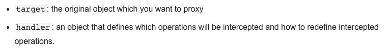
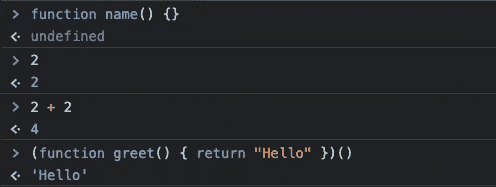

# 编程中的 6 个术语我希望我能早点理解

> 原文：<https://javascript.plainenglish.io/6-more-terms-in-programming-i-wish-i-understood-earlier-443b60bcb8bc?source=collection_archive---------4----------------------->

## 以低代码、元编程等为特色。


Photo by [Oladimeji Ajegbile](https://www.pexels.com/@diimejii?utm_content=attributionCopyText&utm_medium=referral&utm_source=pexels) from [Pexels](https://www.pexels.com/photo/man-working-using-a-laptop-2696299/?utm_content=attributionCopyText&utm_medium=referral&utm_source=pexels)

由于这个系列的[第一部](/6-terms-in-programming-i-wish-i-understood-earlier-156ad77c998)反响不错，我又开始挖掘了。我寻找了所有这些我很久都不知道的难词，甚至是我在研究这篇文章时发现的那些词。

这里还有六个编程术语，我希望我能早点理解！

# 1.低位代码

我发现这个术语有误导性。我认为“低级代码”是一种编写代码的风格——就像一种范例。令我惊讶的是，这不是写代码。它是关于取代写代码的需要。

您可能知道所有这些模型，就像实体关系模型一样。虽然代码中的数据库或类可以设计得很好，但低级代码试图更进一步。

概括起来很简单:所谓的低代码平台试图将开发人员必须编写的代码减到最少。低代码平台提供可视化界面来构建应用程序，而不是手动编写。

虽然总结低代码的思想很容易，但是总结用例很难——领域很大，而且没有标准。
一个典型的例子是设计手机或网络应用的用户界面。通过拖放，可以放置 UI 组件并调整其大小。颜色、字体、边框半径的选项也是可见的——无需编写代码。

但是除了 UI 设计之外，低级代码还可以通过提供一个无代码接口做更多的事情:

*   例如，数据库中的数据关系
*   API 的设计
*   可视化数据
*   甚至是使用 obi violent . ai 等工具进行机器学习的数据集整形

正如你所看到的，low code 试图让构建应用程序变得更加简单和直观。通过减少编写代码的需求，生产时间和成本应该会减少——至少，这是目标。然而，批评家们看到的不仅仅是创建应用程序复杂性的降低，还有选择的减少。他们认为，在低代码平台上，定制应用几乎是不可能的。

# 2.虚拟机与容器

你可能以前都用过。然而，在过去的几年里，容器变得流行起来。当想到微服务和 Docker 时，您可能会想到容器，但虚拟机通常与操作系统联系在一起。

然而，虚拟机和容器都旨在虚拟化某些东西。

顾名思义，虚拟机和“机器”有关系。他们在硬件层面虚拟化一些东西。因此，虚拟机运行在我们的硬件之上。通过所谓的虚拟机管理程序，硬件被虚拟化并提供 CPU、RAM、存储等。

术语虚拟机管理程序通常指两种类型的虚拟机管理程序:类型 1 和类型 2。虽然类型 1 虚拟机管理程序不依赖于要安装的操作系统，但它们通常被称为裸机虚拟机管理程序。第二类依赖于托管它们的操作系统。Oracle 的 VirtualBox 是类型 2 的一个很好的例子，因为它运行在您安装的操作系统上。

因此，虚拟机就是创建独立的机器，即一台物理机上的多台机器。

另一方面，容器运行在操作系统级别上——它们的级别稍微低一些。容器不是独立的机器，相反，容器化就是创建独立的过程。Docker 是创建和运行容器的典型工具。

# 3.元编程

实际上，这个词一点也不令人困惑——“meta”这个词立刻让我想到了它可能是什么。

元编程就是编写将其他程序视为其数据的程序。这包括生成、分析、读取和转换其他独立的代码。

元编程的主题有几个副主题:例如，*调解*，你可能在实践中知道。当谷歌搜索代祷的定义时，我们发现:

> 代表另一个人介入的行为。

但是这和代码有什么关系呢？也许你知道 JavaScript 中的`Proxy`对象。顾名思义，这个对象充当另一个对象的代理——可以说，它包装了我们的原始对象。这可以归类为一个调解的概念，因为我们的代理是代表我们的原始对象。

当您在 JavaScript 中查找`Proxy`对象的通用文档时，您会重新发现我们新的、受人喜爱的术语“调解”:



Source: [developer.mozilla.org](https://developer.mozilla.org/en-US/docs/Web/JavaScript/Reference/Global_Objects/Proxy)

对象的`Proxy`是元编程中一个强大的工具。它允许我们包装我们的对象，跟踪，发生在它们身上的事情，并操纵它们。由于通过代理，程序能够获得关于自身的信息，这是一个元特性。

例如，JavaScript 内置的另一个元特性是`eval()`。这个来自全局对象的函数允许我们在其中执行 JS 代码。例如，我们可以在其中创建函数并运行它们 eval 函数返回，其中代码的执行返回什么:

```
eval(`
  function greet() { 
    return “Hello”
  }
  greet()
`)'Hello'
```

正如许多其他元编程技术一样，eval 函数通常只在测试中使用。在生产中使用它可能会有危险。

虽然元编程抽象得多，但它也有它的好处。一个是编写更通用代码的能力——至少，许多开发人员都这么认为。

除了 JavaScript，元编程还有另一个用例，尤其是在编译编程语言中。通过使用元编程，编译器还可以充当解释器。

# 4.表达和陈述

根据我的经验，术语“表达”被广泛使用，“陈述”却没有。

表达式是代码中可以计算的一切。理解这意味着什么的最简单的方法是使用 chrome 开发工具(至少在 JavaScript 中)。

也许您已经注意到了:无论您在控制台中输入什么，都会为您提供两种类型的响应:未定义的或对您输入的内容的评估(就像函数中的 return 语句)。

我们可以通过输入一些内容来看到这一点:



如您所见，定义函数“name”不会返回任何内容，因为它是一个语句。在控制台中输入 2 将再次打印 us 2。因为 2 是一个数字，所以它可以在不同的上下文中用 JavaScript 计算。就像 2 加 2 一样，是一个表达式。

调用一个返回东西的函数也是一个表达式。

但这有那么重要吗？

确实是。

知道什么是表达式，什么是语句有助于你写代码。虽然大多数开发人员直觉上知道什么行为像表达式或语句，但这两个术语都允许您理解编程范例。

因此，在你的代码中培养对它们的关注有助于符合你所希望的范例。

例如，虽然语句在命令式编程中占主导地位，但表达式是函数式的。

# 5.SDK 和 API

API 是标准化的，全方位的交流，抽象的东西。抽象？是的，例如，API 帮助我们与后端服务器通信。这个服务器提供了一种用数千行代码编写的服务。

因此，当向服务器发送东西时，我们不想关心实际调用哪个函数 API 为我们抽象了这一点，所以我们不必处理服务器的代码。通常，在编写 API 时，我们使用 REST 标准。

回到我们服务器上的代码:虽然像 REST 这样的 API 标准有一些不同的功能，但是编写代码是由我们自己决定的。想想像 POST、GET 或 DELETE 这样的 HTTP 方法——对于所有这些方法，我们在后端编写不同的处理程序。因此，API 以一种标准化的方式作为一种抽象的交流工具。它不一定要发布代码来处理某些事情。

这是转换术语的绝佳时机。

SDK 代表软件开发工具包。通常，它提供了大量代码，你可以用它们来构建你的应用。重要的是要理解 SDK 和 API 并不是对立的——相反，它们相互补充。

在盒子下面，SDK 可能会为你调用一个 API。此外，可以为不同的编程语言提供 SDK。它可以标准化用于不同的编程语言。Firebase 就是一个很好的例子。

# 6.声明与初始化

这两个词经常被混淆。有些人甚至没有意识到有什么不同——然而这是必要的。

当我第一次尝试第二或第三种编程语言时，我意识到了这一点。即使对于这样的基本概念，编程语言之间也存在差异，理解这些差异是非常重要的。那么，让我们开始吧。

声明是在创建变量时进行的。这并不一定意味着您已经为它分配了数据。

```
let name
```

以上案例是一个宣言。
下面的例子也是一个声明:

```
let name = "Max"
```

但是所示的例子也是初始化——因为初始化是第一次将数据赋给变量。不是在声明的同时进行初始化，它也可以是这样的:

```
let name 
name = "Max" // initialization
```

感谢您的阅读！

你可以在这里找到第一部分:

[](/6-terms-in-programming-i-wish-i-understood-earlier-156ad77c998) [## 编程中的 6 个术语，我希望我能早点理解

### 并发和并行不是一回事

javascript.plainenglish.io](/6-terms-in-programming-i-wish-i-understood-earlier-156ad77c998) 

*更多内容看*[***plain English . io***](http://plainenglish.io/)