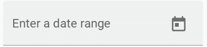
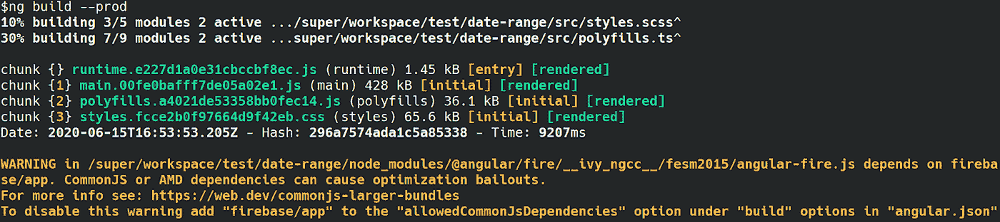

# Angular 10 带来的 6 项新功能

> 原文：<https://javascript.plainenglish.io/6-new-things-that-come-with-angular-10-e1e835f36775?source=collection_archive---------15----------------------->

## 发现 Angular 10 的新功能！


Discover 6 new things that come with Angular 10

# #1-新的日期范围选择器

如果您正在为您的 UI 系统使用角度材料，您现在可以包括新的日期范围选择器。



Angular team

要使用它，请确保您安装了 Angular Material 并导入了`mat-date-range-input`和`mat-date-range-picker`组件。

# #2- Angular 团队更新

> “我们大幅增加了与社区合作的投资。在过去的三周里，我们在[框架](https://github.com/angular/angular/issues)、[工具](https://github.com/angular/angular-cli/issues)和[组件](https://github.com/angular/components/issues)中的未决问题数量已经减少了 700 多个。我们已经触及了 2000 多个问题，我们计划在接下来的几个月里进行大量投资，与社区合作做更多的事情。”— Angular 团队

我们可以期待未来的巨大进步。那就好，Angular 没死也不会死，背后有 Google 的支持。

# #3-默认浏览器配置

浏览器配置中的巨大更新，以排除旧的或较少使用的浏览器。

听到这个我很高兴。我就是受不了 IE！它可能会丢失。

如果你客户的用户使用 IE，那么你必须自己启用 ES5(我的很多项目也是这样)。

**如何？**

在`.browserslistrc`文件( [doc](https://github.com/browserslist/browserslist#browserslist-) )中添加你需要支持的浏览器。

# #4-实施更严格设置的选项

当您使用`ng new`创建一个新的工作空间时，版本 10 提供了一个更加严格的项目设置。

```
ng new --strict
```

启用后，您可以看到可维护性的改进、提前捕获错误、Angular CLI 执行的高级优化等等。

一个例子是不允许在你的项目中使用`any`来提高编译器的工作速度。

# #5-关于 CommonJS 导入的警告

用 CommonJS 打包的依赖项会降低应用程序的速度，而且大小通常会更大。因此添加了警告以确保您避免这种情况。

这个想法是让开发者意识到这个问题的影响是不可忽略的。因此开发人员将转向使用 ECMAScript 模块(ESM)包的最佳选择。

警告如下所示:



Angular team

# #6-生态系统更新:Typescript、TSLib 和 TSLint

*   打字稿撞向[打字稿 3.9](https://www.typescriptlang.org/docs/handbook/release-notes/typescript-3-9.html)
*   TSLib 已经更新到 v [2.0](https://github.com/microsoft/tslib/releases/tag/2.0.0)
*   TSLint 已更新至版本 6

Angular 10 中的这 6 个新东西你更心动的是什么？对我来说，这是浏览器配置。我讨厌 IE！你呢？

## 最后一件事…

照例用`update`更新。

```
ng update @angular/cli @angular/core
```

**尽情享受！**

亲爱的读者，我希望这是明确和有用的。我希望你和你的家人平安，无论你在哪里！坚持住。明天会更好！

**让我们接触一下** [**中**](https://medium.com/@famzil/)**[**Linkedin**](https://www.linkedin.com/in/fatima-amzil-9031ba95/)**[**【脸书】**](https://www.facebook.com/The-Front-End-World)**[**insta gram**](https://www.instagram.com/the_frontend_world/)**，或者**[**Twitter**](https://twitter.com/FatimaAMZIL9)**。********

****[www.fam-front.com](http://www.fam-front.com/)****

*****更多内容请看*[*plain English . io*](http://plainenglish.io/)****