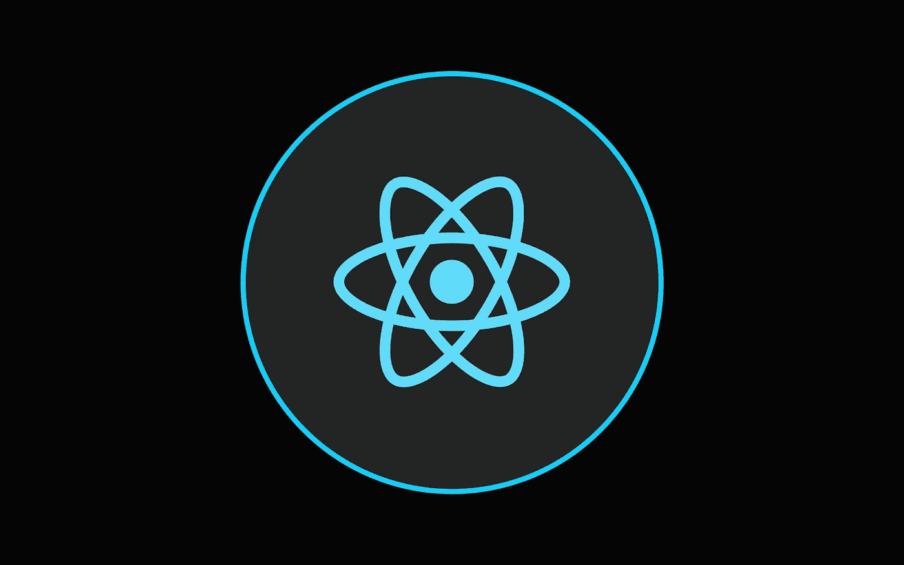
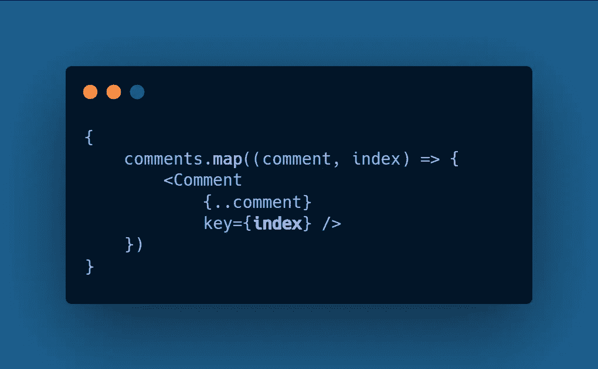

# React 应用的 6 种优化技术

> 原文：<https://javascript.plainenglish.io/6-optimization-techniques-for-react-applications-9585073bc3b7?source=collection_archive---------8----------------------->

## 构建快速反应应用程序的有用技术

## 1.区块文件

在构建您的 React 应用程序时，新特性的添加总是会以一个巨大的生产文件结束。在这种情况下，您应该考虑通过使用 webpack 的 **CommonChunkPlugin** 来分离文件 ***(您的应用程序代码&第三方库代码)*** 。它为您提供了两个文件，分别是 **vendor.bundle.js** 和 **app.bundle.js.**

以正确的方式分割代码总是会影响浏览器存储缓存的方式，这种方式通过并行下载资源直接影响应用程序的加载时间

*   对于 *webpack* 的最新版本，请考虑 **SplitChunksPlugin。**

## 2.依赖性优化

并非每次您都 100%地利用依赖项，由于未使用的本地化文件，您的应用程序在网络连接较低的情况下会执行得很快。因此，请经常检查您从依赖项中利用了多少，例如:如果您使用的是包含多语言支持的本地化文件的**moment . js**&如果您不需要多语言支持，那么您将在最终版本中毫无理由地使用所有这些块。

*   您可以考虑使用**moment-locales-web pack-plugin**从最终的包中删除这些未使用的语言环境。
*   如果你使用 loadash，我们有 100 多种方法。您可以使用 **loadash-webpack-plugin** 移除未使用的函数来移除所有未使用的或多余的方法。

## 3.节流和去抖动

在 JavaScript 中，事件触发器是事件处理程序在给定时间内调用的次数。**例如**，与滚动和鼠标悬停相比，鼠标点击的事件触发级别较低&较高的事件触发级别很容易导致 React 应用崩溃。

为了控制它，我们有以下两种方法

*   **节流:**这仅仅意味着我们正在延迟函数的执行，以避免事件处理程序的立即执行。当事件被触发时，您可以添加毫秒延迟。这在实现无限滚动特性时非常有用，您可以延迟 XHR***(XMLHttpRequest)***调用，而不是在用户滚动时获取下一个结果集。
*   **去抖动:**类似于节流，在这种技术中，我们可以防止事件触发过于频繁。如果你用的是 **loadash** ，那么把你要调用的函数封装在**loadash 的*的去抖函数*** 中。如果你没有使用 loadash，那么用 JavaScript 实现缩小的去抖功能也是一个不错的选择。

## 4.避免将索引作为键

当在 React 应用程序中呈现**列表**时，您一定已经看到索引被用作键，但是这种方法可能成为不正确的数据消耗的原因，而且当您提供索引作为键时，为 ***DOM*** &识别它变得更加困难当您*添加*或*删除*列表中的一个项目时，React 假定 DOM 元素表示相同的组件。

*   在构建需要多次刷新的应用程序时，请始终使用唯一键。如果您的数据没有任何用于分配键的唯一属性，那么您可以使用 **shortid** 模块来生成唯一键。

## 5.CSS 动画与 JavaScript 动画

*   **何时考虑基于 CSS 的动画:**

1.  一次性过渡。
2.  更小的独立 UI 元素，比如菜单栏上的悬停效果。

*   **何时考虑基于 JavaScript 的动画:**

1.  高级效果，如弹跳、慢速暂停、反转等。
2.  当需要对动画进行有效控制时。
3.  而使用***requestAnimaitonFrame***进行视觉变化。

## 6.Web 服务器上的 Gzip 压缩

**CSS** 、**HTML**&**JavaScript**文件包含大量重复的*文本、空格* & Gzip 压缩允许 web 服务器提供小尺寸的文件，并使您的网站足够快以获得流畅的用户体验。由于 Gzip 压缩了普通字符串，它将页面和样式表的大小减少了 70%,从而缩短了首次渲染时间。

*   如果你的后端栈是 **Node/Express** ，那么你可以使用 *Gzipping* 通过压缩模块压缩你的包的大小。

 [## 2021 年终极网络开发者路线图

### 从基础到部署可伸缩的 Web 应用程序

javascript.plainenglish.io](/ultimate-web-developer-roadmap-for-2021-6758edd0bd3f)  [## 作为开发人员，你应该知道的 9 种数据结构和算法

### 让你成为更好的开发者的数据结构和算法

javascript.plainenglish.io](/9-data-structures-algorithms-you-should-know-as-a-developer-5e10946c95a0)  [## JavaScript 开发人员应该知道的 7 个概念

### 在下一个 JavaScript 项目中使用的基本概念

javascript.plainenglish.io](/7-concepts-you-should-know-as-a-javascript-developer-f406597319ab)  [## Node.js 应用程序的 10 个最佳实践

### 你需要知道的 Node.js 实践

javascript.plainenglish.io](/10-best-practices-for-node-js-applications-2093b3c50799)  [## Node.js 年开发者路线图

### 成为 Node.js 开发人员的路线图

javascript.plainenglish.io](/node-js-developer-roadmap-for-2021-2ae9c057bff4)