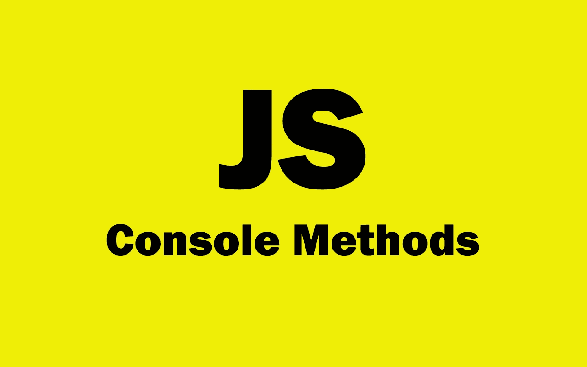
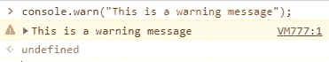
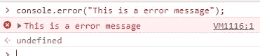
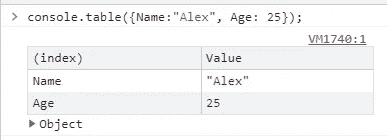
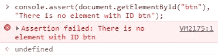
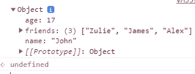
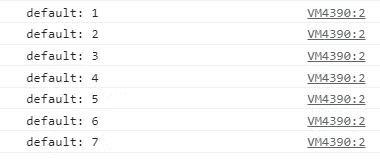

# 你可能不知道的 6 个强大的 JavaScript 控制台方法

> 原文：<https://javascript.plainenglish.io/6-powerful-javascript-console-methods-that-you-probably-dont-know-a20952bac33c?source=collection_archive---------5----------------------->

## JavaScript 中你应该知道的有用的控制台方法。



Image created with ❤️️ By author.

JavaScript 是目前流行的编程和脚本语言，尤其是在 web 开发领域。您可以在浏览器中轻松运行 JavaScript 代码。除此之外，您还可以在代码中使用许多方法和函数。

控制台方法是其中的一部分，它们允许您在浏览器中轻松调试代码。控制台对象有很多你可以使用的方法，不仅仅是很多开发者使用的`console.log()`。

因此在本文中，我们将了解一些您可能不知道的 JavaScript 控制台方法。让我们开始吧。

# 1.warn 方法

方法`console.warn()`用于在浏览器控制台显示警告。它只有一个参数(警告文本)。

这里有一个例子:

```
console.**warn**("This is a warning message");
```

*输出:*



Capture by the author.

# 2.误差方法

方法`console.error()`允许我们在控制台中打印错误信息。它将错误消息作为一个参数。这种方法通常用于测试目的。

这里有一个例子:

```
console.**error**("This is a error message");
```

*输出:*



Capture by the author.

# 3.表格法

方法`console.table()`允许我们在控制台中以表格的形式轻松打印对象和数组。

看看下面的例子:

```
console.**table**({Name:"Alex", Age: 25});
```

*输出:*



Capture by the author.

# 4.该方法断言

方法`console.assert()`允许我们根据条件将消息打印到控制台。它有两个参数:如果第一个参数的值为 false，它将打印第二个参数。

下面是一个例子:

```
console.**assert**(document.getElementById("btn"), "There is no element with ID btn");
```

*输出:*



Capture by the author.

如您所见，该方法返回了第二个参数的消息，因为第一个参数的计算结果为 false。在我们的代码中没有 ID 为`btn`的元素。

# 5.方法目录

方法`console.dir()`用于对象。它识别对象，并在控制台中将它们打印为可扩展列表。

这里有一个例子:

```
const person = {name: 'John', age: 17, friends: ['Zulie', 'James', 'Alex']};console.**dir**(person);
```

*输出:*



Capture by the author.

# 6.方法 count 和 countReset

方法`console.count()`允许计算`count()`被调用的次数。该方法正在计算自身。

这里有一个例子:

```
for (let i = 0; i <= 6; i++){
 console.**count()**;
}
```

*输出:*



Capture by the author.

如果我再次调用`console.count()`，它将返回`default: 8`，以此类推。

另一方面，我们有将计数器重置为 0 的方法`console.countReset()`。在我们的例子中，计数器现在是在数字 8 上，如果我们调用`console.countReset()`方法，它会再次将计数器设置为 0。

# 结论

正如您在上面的列表中看到的，这些是作为 JavaScript 编码人员应该知道的一些控制台方法。它们在一些调试情况下非常有用。所以永远记住不仅仅是`console.log()`。

感谢您阅读这篇文章。希望你觉得有用。

**更多阅读:**

[](/5-common-html-mistakes-that-you-should-avoid-bdbc28fe39d7) [## 你应该避免的 5 个常见 HTML 错误

### 如果您想编写高质量的代码，请避免这些 HTML 错误。

javascript.plainenglish.io](/5-common-html-mistakes-that-you-should-avoid-bdbc28fe39d7) [](/10-awesome-front-end-development-tools-to-boost-your-productivity-b1d2efc4c4ba) [## 10 个令人敬畏的前端开发工具来提高您的生产力

### 你可能需要用到的有用的前端开发工具。

javascript.plainenglish.io](/10-awesome-front-end-development-tools-to-boost-your-productivity-b1d2efc4c4ba) 

*更多内容尽在*[***plain English . io***](http://plainenglish.io/)