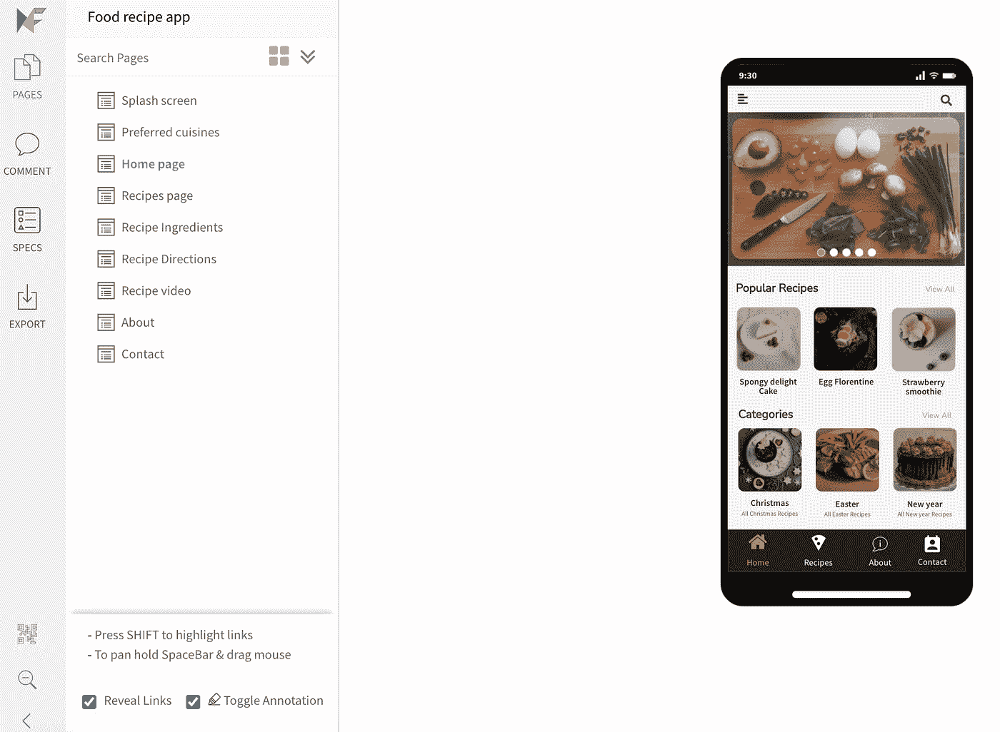
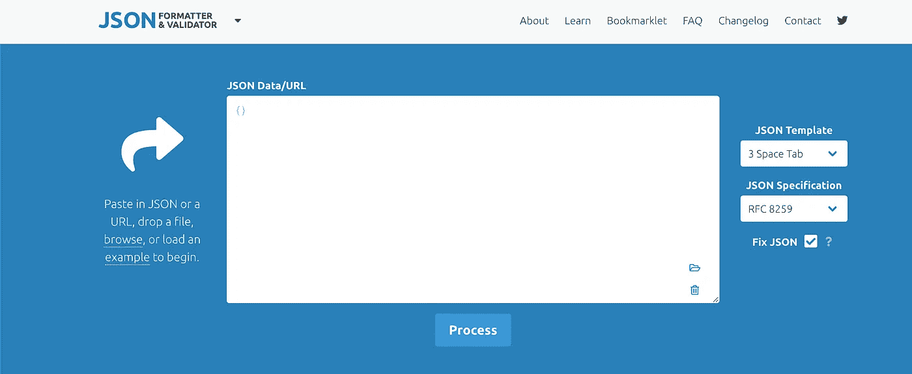
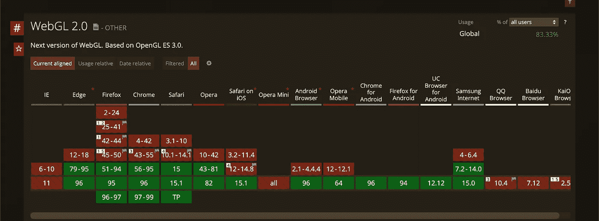
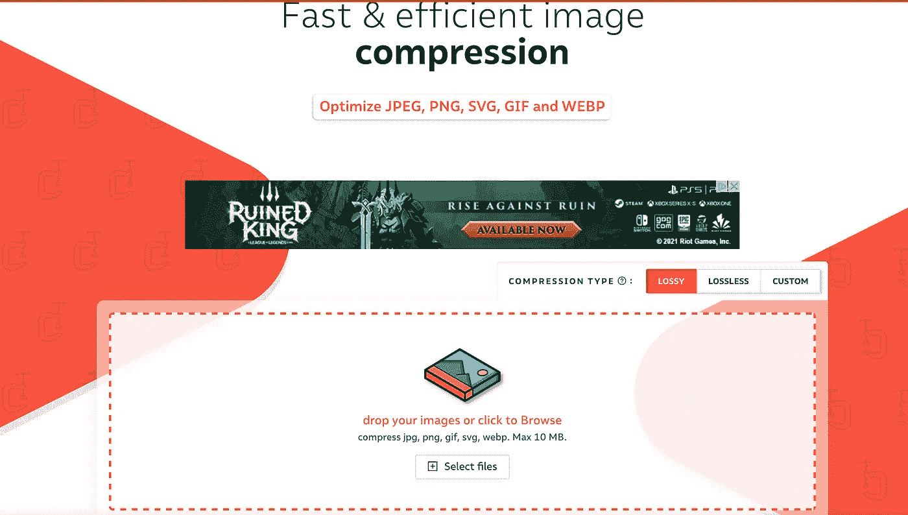
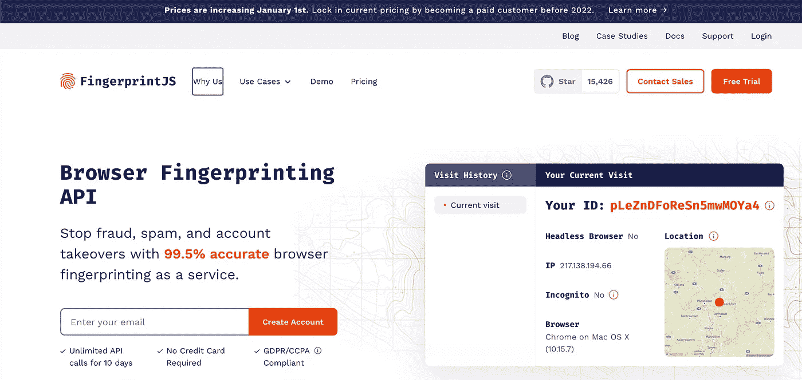
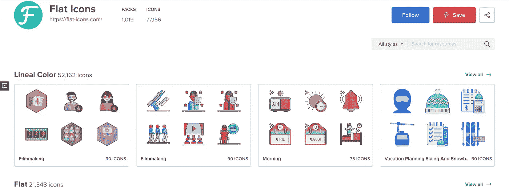

# 6 个节省开发时间的高效网站

> 原文：<https://javascript.plainenglish.io/6-productive-websites-that-save-development-time-596dd60cdf4b?source=collection_archive---------5----------------------->

## 使用智能工具提升您的创造力

Photo by [Igor Miske](https://unsplash.com/@igormiske?utm_source=medium&utm_medium=referral) on [Unsplash](https://unsplash.com?utm_source=medium&utm_medium=referral)

许多网站已经创建了一些常见问题的解决方案。所以我们不必重新创建它们；我们只需要找到并使用它们，让我们的生活变得更轻松。在这里，我将分享一些对我来说卓有成效的工具。

# 1.模拟流

[image source](https://mockflow.com/)

[**Mockflow**](https://mockflow.com/pricing/) 是一款网页设计工具，你可以在这里进行设计，在实现之前对网站有个大概的了解。

在这里你会发现一些简单的元素来创建一个模型。你可以画任何东西，而且不需要太多时间。这是一个惊人的省时工具。

# 2.JSON 格式器和验证器

[image source](https://jsonformatter.curiousconcept.com/#)

无论你是前端还是后端开发人员，你都可能使用过 JSON。 [**JSONFormatter 和**](https://jsonformatter.curiousconcept.com/#) 是一款超级好用的工具。

你只需要复制 JSON 并粘贴到工具上，他们会检查并通知你是否有效。如果你的数据无效，它会给你一个错误信息。你不需要做太多的事情。

# 3.我能用吗

[image source](https://caniuse.com/)

[**我能用**](https://caniuse.com/) 是一个开源项目，提供了一个易读的图表。这可以帮助您确定网站上的特定技术是否与某些浏览器兼容。

# 4.压缩机

创建网站需要图片。但是图片大小对网站加载很重要。这就是为什么我们需要缩小图像的尺寸以及能够压缩图像尺寸并且不影响任何图像质量的[**compressor . io**](https://compressor.io/)**工具。**

# **5.指纹**

****

**[image source](https://fingerprintjs.com/)**

**[**FingerprintJS**](https://fingerprintjs.com/)是一种使用浏览器指纹识别和其他技术来准确识别您网站访问者的服务，它并不真正容易。**

**但是这个库可以很容易地通过防止多次注册来保护你的网站免受欺诈。**

# **6.扁平图标**

****

**[image source](https://www.flaticon.com/)**

**开发人员经常在搜索图标时遇到麻烦。有时他们会选择与网站大小或布局不匹配的图标。
[**平面图标**](https://www.flaticon.com/) 是一个网站选择图标的最佳平台之一。他们有很多不同大小和格式的图标，而且是免费的。**

***“更努力地工作是好的，但是，更聪明地工作是更好的”***

**在互联网上，你会发现许多工具。然而，我在这篇文章中提到了一些我个人使用的工具。我不是说它们是你唯一可以追随的工具。**

**谢谢你的时间。**

***更多内容看* [*说白了. io*](http://plainenglish.io/) *。在这里注册我们的* [*免费周报*](http://newsletter.plainenglish.io/) *。***